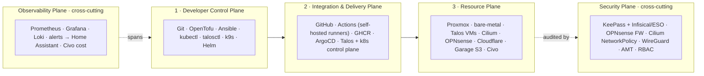
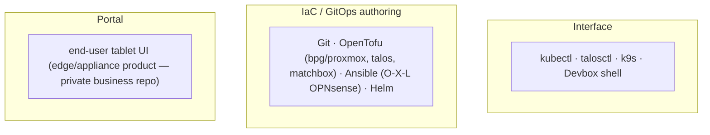
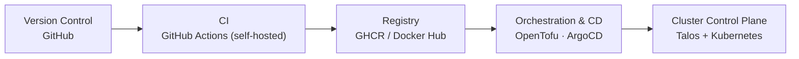
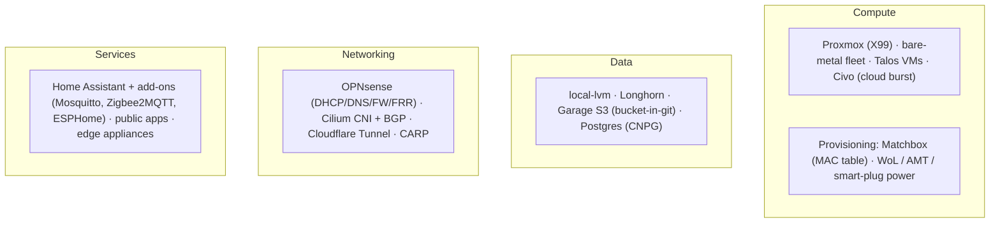
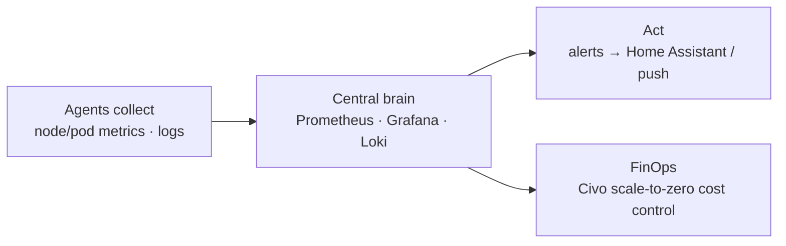
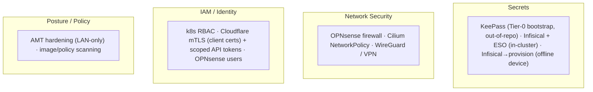

# Architecture — the homelab in planes

How this homelab is *shaped*, documented the way the
[Platform Engineering Org platform-tooling landscape](https://platformengineering.org/platform-tooling)
does it: not as a vertical stack (hardware → OS → k8s → apps) but as **horizontal planes** —
domains that scale sideways and talk to each other through APIs.

Companion docs: **`ROADMAP.md`** = what/when, **`CONTEXT.md`** = why/how-I-think,
**`docs/adr.md`** = the decisions (what was considered + chosen), this file = *how it's shaped*.

**How to read it.** Three planes flow left→right (the path from me to a running workload);
two planes are cross-cutting bands over all of them:

_Fig. 0: Five planes — three in a left-to-right delivery flow, two spanning everything._

Status key: ✅ running · 🔜 planned (see `ROADMAP.md`) · ⬜ gap / not yet.

---

## 1 · Developer Control Plane

_Fig. 1: Developer Control Plane — where I author the platform from git, never by clicking._

- ✅ Git/GitHub, OpenTofu, kubectl/talosctl/k9s/Devbox/Helm (daily tools).
- ✅ ArgoCD as the GitOps front (lives mostly in plane 2; ADR-005).
- ⬜ No internal developer portal (Backstage) — out of scope for a solo lab; the only
  "portal" that matters is the **end-user tablet UI** for the edge/appliance product.

## 2 · Integration & Delivery Plane

_Fig. 2: Integration & Delivery Plane — the path from a commit to a reconciled cluster._

- ✅ GitHub (`teststuffstash`), GHCR/Docker Hub as image sources; releases publish images + OCI
  charts to ghcr.
- ✅ OpenTofu provisioning (cluster live), Talos + Kubernetes control plane (v1.13.2 / v1.36.1).
- ✅ ArgoCD GitOps front (app-of-apps in `argocd/`, sourced from GitHub; Forgejo cutover = FU-007).
  Reconciles CloudNativePG → Postgres → Infisical → External Secrets Operator and the app layer.
- ✅ CI: self-hosted two-tier (`docs/ci.md`) — in-cluster **ARC** (`runs-on: homelab-ephemeral`) +
  the **Proxmox VM runner** (ADR-082) for Docker/binfmt builds; Forgejo `act_runner` for Tier-B.
- ⬜ No internal image registry / pull-through mirror yet (ADR-070; use upstream for now).

## 3 · Resource Plane

_Fig. 3: Resource Plane — where YAMLs finally meet hardware (and there's no IPMI)._

- ✅ Proxmox host, OPNsense (DHCP/DNS/FW/FRR as code), ESPHome + the `droplet` node.
- ✅ Talos VMs **and** bare-metal nodes, Matchbox PXE provisioning, Cilium + BGP LoadBalancer,
  Longhorn storage, Home Assistant + UniFi controller in-cluster.
- ✅ Cloudflare Tunnel (Home Assistant remote access via `ha.teststuff.net` + mTLS, `docs/cloudflare.md`);
  `teststuff.net` DNS now on Cloudflare.
- ✅ Garage S3 (LAN-only, ADR-031/073) + Postgres via CloudNativePG (ADR-046).
- 🔜 Off-cluster backups to S3 (FU-013), Civo burst.
- ⬜ CARP HA pair (needs ≥2 hosts), network Zigbee coordinator (to buy — FU-034).

## 4 · Observability Plane _(cross-cutting)_

_Fig. 4: Observability Plane — small agents collect, one central brain visualizes and alerts._

- ✅ Prometheus + Grafana + Alertmanager in-cluster (`tofu/monitoring.tf`), exposed at
  `grafana`/`prometheus`/`alertmanager.teststuff.net`; Alertmanager notifies via the Home
  Assistant webhook (ADR-042).
- ✅ Log aggregation: Loki + Alloy, 7-day retention, queried in Grafana (ADR-083).
- 🔜 Civo cost/FinOps (no Civo footprint yet).

## 5 · Security Plane _(cross-cutting)_

_Fig. 5: Security Plane — secrets live in git but encrypted; the edge stays locked, the BMC patched._

- ✅ Cloudflare edge security at the public edge: client-certificate **mTLS** (WAF-enforced, not
  Enterprise Access) on `ha.teststuff.net`, plus **scoped per-job Cloudflare API tokens** as code
  (`tofu/cloudflare-token/`). AWS access is IAM Identity Center SSO (no static admin keys).
- ✅ Secrets platform (ADR-062, `docs/secrets.md`): **KeePass** Tier-0 bootstrap →
  **Infisical** (self-hosted, on CloudNativePG) → **External Secrets Operator** delivers to workloads.
  The offline `snore-recorder` device reads its secrets from Infisical at provision time (plaintext
  on-device). **SOPS+age is not used.**
- 🔜 Cilium NetworkPolicy, AMT hardening, OPNsense firewall as code.
- ⬜ Policy engine (Kyverno/Gatekeeper) and a real identity layer — deferred.

---

> The end-state "boot from git" goal means every box in these planes is recreatable from this
> repo; the only thing that isn't code is data, which backs up to S3 with the bucket ID in git.
> See `CONTEXT.md` principle #1.
