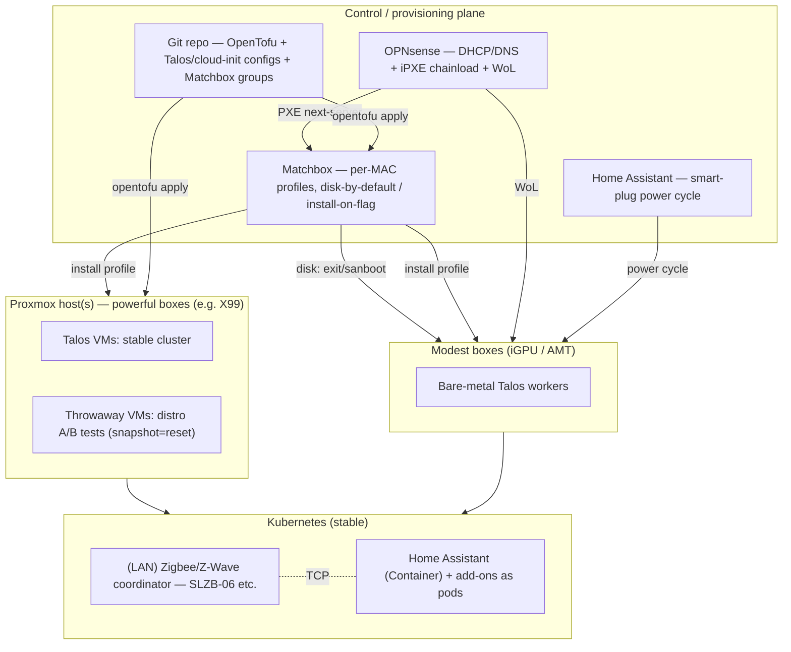

# Homelab roadmap — bare-metal k8s, the hybrid way

_Planning record, written 2026-05-24. The plan below largely **happened**: as of 2026-06 the Talos
cluster (VMs + bare-metal), Cilium+BGP, Longhorn, Home Assistant, monitoring, UniFi-in-cluster and
Cloudflare remote access are all live. For the **current** state see [`CLAUDE.md`](CLAUDE.md) and
[`README.md`](README.md); for **why each choice was made** see [`docs/adr.md`](docs/adr.md). This
file is kept as the original phased plan + the research that shaped it._

## The goal (in one sentence)

Plug a headless machine into the LAN and have it **netboot into a working k8s node**
— bare-metal Talos for modest boxes, Proxmox (then Talos VMs) for powerful ones,
decided by a **central per-MAC table** — running a **stable cluster for real services
(incl. Home Assistant) plus a snapshot-reset sandbox**, all from one IaC repo, with
the ability to **centrally force any machine to wipe and reinstall**.

## Decisions made (2026-05-24)

| Decision | Choice | Why |
|---|---|---|
| Optimize for | **Stable base + sandbox** | Dependable platform *and* room to experiment |
| Topology | **Hybrid** — Talos VMs on Proxmox **and** bare-metal Talos on cheap boxes | VMs = instant-reset experiments; metal = the real target |
| Provisioning | **Lightweight DIY**, **per-MAC table** | Central inventory keyed by MAC picks each box's role |
| Boot policy | **Boot local disk by default; PXE-install only when flagged** | Avoids reinstall loops; central reinstall = flip a flag + power-cycle |
| Home Assistant | **Greenfield on k8s** (not deployed yet — starting clean) | No migration baggage; design for k8s from the start |
| HA radio | **Network-attached Zigbee/Z-Wave coordinator** | Frees the HA pod from being pinned to the node with the USB stick |
| Service tiers | **Public (Cloudflare + Civo failover) vs internal (LAN-only)** | Different exposure, redundancy, and uptime needs |
| HA target | **3-node Proxmox HA + OPNsense CARP pair** (future) | Compute + router failover; rolling updates without downtime |
| Service exposure | **Cilium BGP ↔ OPNsense FRR** (replaces MetalLB) | LAN/VPN-native service IPs, declarative both ends |

### Key facts that shaped this (research, May 2026)

- **Harvester ruled out** — single-node = no HA/live-migration, wants ~32GB/8-core + high-IOPS SSD just to test. Built for 3-node HCI.
- **Proxmox = "IPMI for VMs"** (console + power for anything virtual). Mainstream 2026 pattern: **Proxmox + Talos VMs via OpenTofu**.
- **Talos ≠ cloud-init** — uses its own *machine config* (kernel arg / HTTP / Omni). So cloud-init/kickstart is the **full-OS** path; Talos is **netboot + machine-config**.
- **Matchbox** matches machines by MAC/UUID to profiles, assumes **disk-first boot / PXE-install only on match**, and has an **OpenTofu provider** — exactly our model.
- **No-IPMI control** = **Wake-on-LAN** (power-on; OPNsense has WoL) + **Home Assistant smart plugs** (hard cycle). For *new* fleet boxes, prefer **Intel vPro/AMT** business mini-PCs → real remote KVM + power without IPMI.
- **Sidero Metal is deprecated**; Omni is the managed escape hatch ($10/mo hobby or self-host BUSL) if DIY gets painful.

## Design invariants (from `CONTEXT.md` — "boot from git")

Non-negotiables that constrain every choice below:

- **No click-ops.** All state lives in git → OpenTofu / Talos machine-config / Matchbox
  (all natively config-driven). Web UIs (Proxmox, OPNsense, HA) are for *viewing*; changes
  come from git. If something can only be clicked, wrap it (API/IaC) or log it as a
  temporary exception to be redone properly.
- **Hardware/cloud-agnostic recovery.** The cluster definition must be able to `apply` onto
  something other than this hardware — Talos runs on **AWS EC2** too, so the DR plan is
  `tofu apply` against a cloud node module while hardware is replaced. Keep Proxmox/bare-metal
  assumptions out of the cluster layer; isolate them in swappable node modules.
- **Data → object storage, referenced from git.** Stateful workloads (HA config/DB, etc.)
  back up to **S3** (real S3 / Backblaze B2 / self-hosted MinIO); the **bucket ID + restore
  wiring live in git** so a fresh cluster restores itself ("boot from git"). S3 creds via SOPS.

## Target architecture

## Service tiers

Two classes of service with different exposure, redundancy, and uptime needs:

**Public (internet-facing) — fronted by Cloudflare**
- Exposed via **Cloudflare Tunnel** (`cloudflared`): no port-forwarding, home WAN IP stays
  private, works behind a dynamic IP / CGNAT.
- **Primary origin = home k8s cluster.** **Cloud redundancy = Civo k8s**, normally **scaled
  to zero** (≈no cost) as a failover/overflow origin.
- Failover via **Cloudflare Load Balancing** origin pools (home primary → Civo secondary,
  health-checked). Trade-off: scale-to-zero ⇒ a cold-start delay when Civo takes over —
  accept it, or keep a tiny warm footprint.
- **Same workloads deployed to both** via GitOps (one source of truth → home + Civo).
  Stateful services are the hard part: share/replicate via object storage (S3, bucket-in-git)
  and design for it explicitly.
- _Principle note:_ Cloudflare + Civo are SaaS dependencies — the conscious exception to
  "self-host everything", acceptable at the public edge and replaceable (any CDN/tunnel +
  any conformant k8s).

**Internal (LAN-only) — homelab, OctoPi, robot vacuum, irrigation, Home Assistant**
- **Not** exposed publicly. **MUST keep working when the WAN is down** (the "offline"
  principle): I can still control the vacuum and irrigation locally during an ISP outage.
- The local-control path must have **no cloud dependency**: local DNS (OPNsense Unbound),
  on-prem Home Assistant + local MQTT/ESPHome, local-API integrations over cloud ones.
- Survives an ISP outage as long as the LAN + home cluster are up (which CARP / Proxmox-HA protect).

## Service exposure / load balancing (internal)

How cluster services become reachable from the LAN — **BGP peering, replacing MetalLB**:

- **Cilium's BGP Control Plane peers with OPNsense (`os-frr`/FRR).** Cilium advertises
  LoadBalancer IPs (optionally pod/service CIDRs); the router learns the routes, so service
  IPs are natively routable from the LAN and over VPN — no ARP tricks, no speaker pods, and
  the router actually knows the routes.
- **LB IPs come from a dedicated *advertised* CIDR**, not carved from `192.168.2.0/24` — BGP
  makes them reachable, so no LAN IP-scarcity. Talos defaults (pod `10.244.0.0/16`, service
  `10.96.0.0/12`) already avoid the LAN; allocate a separate block for `CiliumLoadBalancerIPPool`.
- **Both ends as code:** Cilium = `CiliumBGPClusterConfig` / `CiliumBGPPeerConfig` /
  `CiliumBGPAdvertisement` + `CiliumLoadBalancerIPPool` (GitOps). OPNsense = O-X-L
  `frr_bgp_*` Ansible modules — not the GUI.
- **Dynamic BGP neighbors** on FRR (`bgp listen range <node-subnet>` + peer-group) so new
  Talos nodes peer automatically as the fleet grows (the per-node-neighbor approach in most
  guides doesn't scale with plug-and-join). Enable **BFD** for fast failover (HA model).
- Private ASNs (e.g. router `64512`, cluster `64513`).
- Complementary to the public tier: this is **LAN/VPN** reach; internet exposure stays on
  the **Cloudflare Tunnel** path.
- Reference writeup (Calico+OPNsense — translate Calico→Cilium): see Sources.

## HA model (target end-state)

Three independent failure layers — keep them distinct:

1. **Compute HA — 3-node Proxmox cluster** (Proxmox HA + replicated storage, e.g. Ceph).
   A node dies → its VMs restart/migrate to a survivor.
2. **Router HA — OPNsense CARP pair** across two nodes (anti-affinity, never co-located).
   `pfsync` = stateful failover (existing connections survive); `hasync` = config sync;
   bonus = rolling firewall updates with zero downtime (maintenance-mode one node at a time).
3. **Public-service HA — Cloudflare LB** → home primary, Civo (scale-to-zero) failover.

**What it covers / doesn't:**
- ✅ A box dying — or a host reboot for maintenance — no longer takes the network or services down.
- ⚠️ **Single ISP uplink is still a SPOF** for inbound-public + internet egress; neither CARP
  nor Proxmox-HA fixes that (multi-WAN is a separate add-on). But **LAN keeps routing**, so
  local control stays up.
- ⚠️ WAN-side CARP is limited by having one public IP → LAN-side CARP is the main win.

## Provisioning model (the heart of it)

Per-MAC state machine, served by Matchbox, triggered over the network:

1. **Boot order on every box:** network (PXE) first, then disk.
2. **Every boot** the box PXEs → OPNsense hands it iPXE → iPXE chainloads Matchbox
   with `?mac=${net0/mac}`. Matchbox looks up the MAC:
   - **Not in an install group → `exit`/`sanboot`** → boots the OS already on disk. Normal operation; fast.
   - **In an install group → serve the matched profile** → installs, then a post-install
     step removes it from the install group so it won't loop.
3. **Profiles (the per-MAC "role" table):**
   - `talos-worker` — bare-metal Talos node (the zero-touch default for a fresh box).
   - `proxmox` — automated Proxmox install (answer file) for powerful boxes; OpenTofu then spins Talos VMs that join the cluster.
   - `ubuntu` / `rocky` — full-OS via cloud-init/kickstart (the sandbox / non-k8s needs).
4. **Force a wipe/reinstall centrally:** set the MAC's group to an install profile in the
   IaC repo → `opentofu apply` → **WoL** (or HA smart-plug cycle) the box → it PXEs and reinstalls.
   For Talos specifically, `talosctl reset` is the in-band wipe.
5. **DHCP wiring** lives in **OPNsense**: two-stage chainload (hand `snponly`/`undionly`
   iPXE first, then iPXE re-requests the HTTP Matchbox script — gated by user-class to avoid a loop).

> Matchbox owns the *automated fleet* path; DHCP defaults to the Matchbox chain. For
> ad-hoc/manual installs (live distros, utilities) use a USB/ISO — the old **netboot.xyz**
> is gone.

## Home Assistant on k8s (greenfield)

- Run the **HA Container** image as a Deployment/StatefulSet with a real PV. (No HA OS /
  Supervisor in k8s → **add-ons become their own workloads**: Mosquitto, Zigbee2MQTT,
  zwave-js-server, ESPHome, Node-RED, etc.)
- **Radio off the node:** use a **network-attached coordinator** (e.g. SLZB-06 over
  Ethernet/PoE for Zigbee; a networked zwave-js setup for Z-Wave). HA/Z2M then talk to it
  over TCP, so the HA pod can be scheduled anywhere — no USB pinning, no `hostNetwork`
  needed (you have no discovery-only integrations).
- **Storage:** HA config + recorder DB need persistence. Don't run the SQLite recorder on
  NFS — use **Longhorn** (replicated) or a node-local PV, or point recorder at an external
  **Postgres/MariaDB** pod.
- **Networking:** plain ClusterIP + ingress is fine given network-only + MQTT/ESPHome.
  Revisit `hostNetwork`/macvlan only if you later add mDNS-discovery integrations.

## Hardware strategy

- **X99 Xeon E5-2680 v4 (14C/28T, ECC) → Proxmox host.** Great core count for many VMs.
  ⚠️ **No integrated graphics + AliExpress X99 = needs a GPU just to POST** — so it can't be
  a "GPU-less plug-in," and it's a 2016 120W chip (higher idle for 24/7). Keep it as a
  dedicated hypervisor, not part of the zero-touch fleet.
- **Zero-touch fleet = business mini/SFF PCs with Intel vPro/AMT** (Dell OptiPlex Micro,
  HP EliteDesk Mini, Lenovo ThinkCentre Tiny). **AMT = remote KVM + power without IPMI**
  (solves your core pain), plus iGPU (POSTs headless), reliable Intel NICs for WoL/PXE, low idle.
- Standardize the fleet where you can — identical boxes make MAC-table profiles and Talos
  schematics trivial to reason about.

## Tooling baseline

- **IaC:** OpenTofu. **Providers:** `bpg/proxmox`, `siderolabs/talos`, `poseidon/matchbox`.
- **Talos images:** Talos **Image Factory** schematics (e.g. `qemu-guest-agent` for VMs).
- **CNI:** Cilium. **GitOps (later):** ArgoCD or Flux.
- **Secrets:** SOPS + age (or sealed-secrets). **No plaintext secrets in git** — the repo is
  public. Talos machine configs, `talosconfig`,
  `kubeconfig`, Proxmox/Matchbox/AMT creds must stay out; serve configs over the LAN-only
  provisioning host, never commit them.

## Phased plan

### Phase 0 — Foundations
- [ ] Document the X99 host (Proxmox version, CPU, RAM, disks, NIC) in `README.md`.
- [ ] Proxmox storage decision (ZFS gives cheap snapshots/clones → great for the sandbox).
- [ ] Least-privilege Proxmox API token for OpenTofu.
- [ ] Scaffold `tofu/` (providers: proxmox, talos, matchbox); gitignore state/secrets/kubeconfig.
- [ ] Set up SOPS+age + `.sops.yaml`.

### Phase 1 — Stable base cluster (Talos VMs on Proxmox) ✅ done
- [ ] Talos Image Factory schematic (qemu-guest-agent) → upload to Proxmox.
- [ ] OpenTofu: 1 control-plane + 2 worker Talos VMs; generate machine config, bootstrap, fetch kubeconfig.
- [ ] Install Cilium (BGP Control Plane + LB IPAM); peer with OPNsense FRR; smoke-test a
      LoadBalancer service reachable from the LAN; snapshot as known-good baseline.

### Phase 2 — Home Assistant on the cluster ✅ done (Zigbee coordinator still TODO; recorder = SQLite-on-Longhorn)
- [ ] Order/flash a **network Zigbee coordinator** (SLZB-06 or similar); plan Z-Wave-over-network if used.
- [ ] Deploy HA Container + PV (Longhorn or local), Mosquitto, Zigbee2MQTT (→ network coordinator), ESPHome.
- [ ] Re-onboard devices (greenfield); validate the existing ESPHome `droplet` against the new HA.
- [ ] Decide recorder backend (SQLite-on-PV vs external Postgres).

### Phase 3 — MAC-table provisioning pipeline (no IPMI) ✅ done (Matchbox on a Proxmox LXC)
- [ ] Stand up **Matchbox** (on an LXC/VM); define groups/profiles: `talos-worker`, `proxmox`, `ubuntu`/`rocky`.
- [ ] Default behavior = **boot local disk**; install only when a MAC is in an install group.
- [ ] Wire **OPNsense DHCP** two-stage iPXE chainload to Matchbox.
- [ ] Enable **WoL** per box (BIOS + NIC + record MAC); add **HA smart-plug** power control; (AMT where available).
- [ ] End-to-end test on **one** box: flag for install → WoL → PXE → Talos installs → joins cluster → then flip to disk-boot and confirm normal reboot; finally test a **central forced wipe/reinstall**.

### Phase 4 — Promote to a real bare-metal cluster 🟡 in progress (4 metal nodes joined: thinkcentre, hp-01, wk-metal-01/02)
- [ ] PXE-provision the remaining boxes via their MAC profiles (Talos workers; Proxmox for the beefy ones).
- [ ] Bring everything under the same OpenTofu repo (workspaces/modules for VMs vs metal).
- [ ] Decide which services live on the VM cluster vs bare-metal cluster.

### Phase 5 — Day-2 operations
- [ ] GitOps (ArgoCD/Flux). Backups: Talos/etcd + Longhorn/PV snapshots + Proxmox (PBS/vzdump), stored off-box.
- [x] Monitoring: Prometheus + Grafana; alert to HA/push. Upgrade strategy: bump in sandbox first.
  - kube-prometheus-stack in `tofu/monitoring.tf` (**applied 2026-06-02**); Prometheus scrapes
    **only** HA `/api/prometheus` (single source — no per-device scraping, no added WiFi load).
    Grafana VIP `192.168.40.11` (BGP), Prometheus on hostPath PV (wk-02, 90d), Alertmanager → HA
    webhook. First service monitored: office-plants. Notes: needed a no-provisioner `manual`
    StorageClass (operator validates SC existence) and the `monitoring` ns labelled
    PodSecurity=privileged (Talos enforces `baseline`; node-exporter needs host access).

## Edge tier (future — out of current scope)

A *separate* deployment target from the homelab cluster, tied to the assistive-tech
business (see `CONTEXT.md` purpose #2): **Home Assistant + large-button tablet appliances
in customers' homes**, supported remotely as a fleet. Not part of Phases 0–5; captured here
so it doesn't bleed into them.

- **MVP may need no k8s at all** — HAOS or a Podman/Compose stack is far less to support for
  a single-home box. Add orchestration only when the *fleet* justifies it.
- **When a fleet justifies it:** likely **k3s + Rancher Fleet** (light, ARM-friendly, edge
  GitOps; echoes the Rocky+Rancher direction work first scoped) — or **Talos + Omni** if
  immutability / zero-drift / zero-touch in non-technical homes wins over footprint/cost.
- **Synergy with the homelab:** the Talos homelab cluster is the **dev/test ground** for the
  appliance workload — same k8s manifests, GitOps-deployed, then shipped to the edge distro.
- Decision deferred until there's a real MVP + first customers.

## Caching tier (under consideration — not decided)

Motivation: repeated downloads hurt (Talos image, Cilium/HA container pulls incl. the
operator `ImagePullBackOff`, devbox/nix on every jail rebuild, apt). Want a local cache to
speed rebuilds + survive upstream rate-limits/outages.

**Placement (leaning):** a stable always-on box **near OPNsense / on the LAN — NOT in the
cluster.** Rationale: a cluster-resident cache is wiped on `tofu destroy` and creates a
chicken-and-egg (the cluster needs the cache to pull the images that run the cache).
- ⚠️ Note: OPNsense is **FreeBSD** — can't host Docker/OCI tooling directly. "Near OPNsense"
  in practice = a small dedicated **Linux box / Proxmox LXC**, not literally on the router.
- **Explicitly NOT Squid** (per decision) — and a forward proxy can't cache HTTPS without
  MITM CA distribution anyway.

**Container images (biggest win) — options & tradeoffs (pick later):**

| Option | Weight | Notes |
|---|---|---|
| **Harbor** | Heavy | Full registry + proxy-cache projects (dockerhub/ghcr/quay), web UI, RBAC, retention. Persistent. Powerful but Nexus-like config surface — maybe more than needed. |
| **Zot** | Light | OCI-native registry with pull-through/sync. Far simpler than Harbor; good middle ground. |
| **distribution/registry** (CNCF) | Trivial | Pull-through cache, but ~one upstream (Docker Hub) per instance. |
| **Spegel** (in-cluster P2P) | Zero-infra | Stateless, no separate box — but in-cluster (user prefers out-of-cluster persistent). Survives wipes only in that it auto-repopulates; nothing cached on a fresh cluster until first pull. |

Consumed declaratively via **Talos `machine.registries.mirrors`** (in git) → minimal/zero
per-consumer config. Leaning **Zot or Harbor on the LAN box**; Spegel stays a fallback.

**Nix / devbox:** nginx caching reverse-proxy in front of `cache.nixos.org` (or `attic`),
on the same LAN box; consumed as an http **substituter** (nars are signed → safe over HTTP,
~1 line config). Biggest ROI for the devbox-everywhere setup.

**apt (Debian jail):** apt-cacher-ng on the same box (signed packages → HTTP-safe).

**Still to decide:** Harbor vs Zot vs registry; which host (new mini-PC vs LXC);
whether to bother with the nix/apt caches or just the image mirror first. Revisit with fresh eyes.

Sources: [Spegel](https://spegel.dev/) · [Talos pull-through cache](https://oneuptime.com/blog/post/2026-03-03-set-up-a-pull-through-cache-registry-mirror-in-talos/view) · [nh2/nix-binary-cache-proxy](https://github.com/nh2/nix-binary-cache-proxy)

## Risks & gotchas

- ⚠️ **Reinstall-loop danger:** if PXE serves an installer unconditionally, a box reinstalls
  every boot. The disk-by-default Matchbox model + post-install group removal prevents this — get it right early.
- **No-iGPU POST:** the X99 (and many desktops) won't boot headless without a GPU. Fleet boxes must have iGPU or BMC video.
- **Proxmox single box = SPOF** for the stable cluster. Fine for a lab; keep backups off-box.
- **HA radio = single point of failure** even on the network; the coordinator going down takes Zigbee with it (same as any HA setup).
- **Talos has no SSH/shell** — all via `talosctl`. Mindset shift from Rocky/Ubuntu.
- **AMT security:** vPro/AMT is a powerful remote-management plane — set a strong password, keep it LAN-only, patch it. A neglected AMT is a backdoor.
- **Secrets discipline** — doubly important now the repo is public: no plaintext secrets in git.
- **Current state (2026-06):** the UniFi controller runs **in-cluster** (`tofu/unifi.tf`, VIP
  `192.168.40.12`) and Matchbox runs on a **Proxmox LXC** — see `docs/provisioning.md`.

## Immediate next actions (smallest useful steps)

1. Give me (or let me probe) the X99 Proxmox version + disk layout → I scaffold `tofu/` with the proxmox/talos/matchbox providers.
2. I generate the Phase 1 OpenTofu module (3-node Talos VM cluster) you can `apply`.
3. I draft the Matchbox group/profile layout + the OPNsense iPXE/DHCP chainload snippet (Phase 3) so the bare-metal path is ready.

## Backlog / parked features

### Bare-metal node suspend/resume — an "autoscaler" without IPMI (parked 2026-06-11)
Power idle ephemeral nodes off and wake them on demand to cut idle draw. **Parked** until there's
enough to scale — more services + the home↔Civo multi-cloud (see *Service tiers*) — so the burst
tier actually flexes. Feature-request synthesis (so it isn't re-researched):

- **No off-the-shelf option.** cluster-autoscaler / metal3-Ironic / CAPI all assume a cloud that
  *creates & destroys* instances gated by a **BMC (IPMI/Redfish)** our consumer gear lacks;
  [siderolabs/kube-scheduler](https://github.com/siderolabs/kube-scheduler) is an IPMI talk-demo.
  Reframe: our node set is **fixed**, so this is **node suspend/resume**, not autoscaling — which
  is why CA's "terminate the instance" model doesn't fit.
- **Targets = the tainted ephemeral laptops** (wk-metal-01/02; ADR-044). NOT the storage desktops
  (hp-01/thinkcentre hold Longhorn).
- **Power model** (extends ADR-013): sleep = `talosctl shutdown` (graceful S5); wake = **WoL**.
  ⚠️ Laptops have **batteries**, so smart-plug power-off doesn't work (they keep running on
  battery) — WoL is the *only* wake path. **Feasibility gate:** verify ThinkPad X240/X250
  WoL-from-AC (drain → `talosctl shutdown` → magic packet → does it boot?). If WoL fails, laptop
  scaling isn't viable as-is.
- **Build:** prefer a small **purpose-built controller** (watch Pending pods → wake a slept node;
  sustained idle → drain + sleep) over cluster-autoscaler's `externalgrpc` provider — CA wants to
  delete/create nodes, ours persist and only change power state (impedance mismatch).
- **Pieces already in place:** HA REST API (plugs), WoL via a hostNetwork pod, `talosctl shutdown`,
  Prometheus power metrics, the `homelab.io/ephemeral` taint. Write an ADR when picked up.

## Sources

- [Talos on Proxmox + Terraform (May 2026)](https://www.jonashietala.se/blog/2026/05/22/talos_linux_on_proxmox_with_terraform/) · [Talos+Proxmox+OpenTofu turnkey](https://github.com/max-pfeiffer/proxmox-talos-opentofu) · [erwinkersten/homelab](https://github.com/erwinkersten/homelab)
- [Matchbox getting started](https://matchbox.psdn.io/getting-started/) · [Matchbox concepts (MAC/group matching, disk-first boot)](https://matchbox.psdn.io/matchbox/) · [poseidon/matchbox](https://github.com/poseidon/matchbox)
- [SMLIGHT SLZB-06 network Zigbee coordinator](https://smlight.tech/product/slzb-06) · [HA ZHA integration](https://www.home-assistant.io/integrations/zha/)
- [Harvester requirements](https://docs.harvesterhci.io/v1.7/install/requirements/) · [Harvester vs Proxmox](https://www.xda-developers.com/proxmox-vs-harvester/)
- [Sidero Omni pricing/hobby tier](https://www.siderolabs.com/pricing) · [Sidero Metal deprecation](https://www.sidero.dev/) · [Omni bare-metal PXE](https://docs.siderolabs.com/omni/omni-cluster-setup/registering-machines/register-a-bare-metal-machine-pxe-ipxe)
- [MAAS + Wake-on-LAN](https://stgraber.org/2017/04/02/using-wake-on-lan-with-maas-2-x/) · [OPNsense WoL](https://forum.opnsense.org/index.php?topic=15667.0) · [awesome-baremetal](https://github.com/alexellis/awesome-baremetal)
- Service exposure / BGP: [Calico + OPNsense BGP (tyzbit)](https://tyzbit.blog/configuring-bgp-with-calico-on-k8s-and-opnsense) · [kubernetes-pfsense-controller](https://github.com/travisghansen/kubernetes-pfsense-controller)
