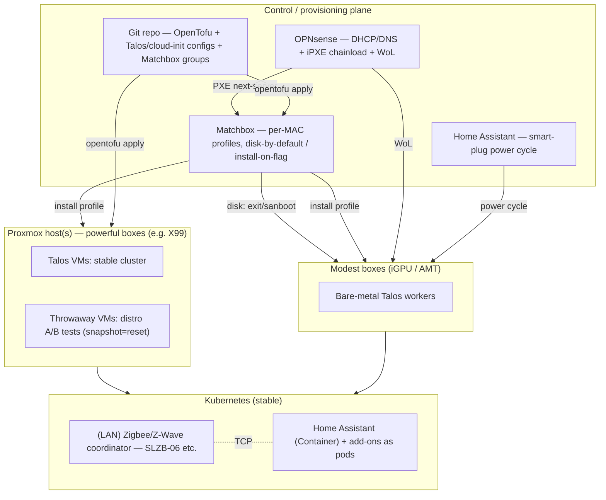

# Homelab roadmap — bare-metal k8s, the hybrid way

_Planning record, first written 2026-05-24 — and the plan **happened**: as of 2026-07 the Talos
cluster (VMs + bare-metal), Cilium+BGP, Longhorn, Home Assistant, monitoring + logging, UniFi,
Garage S3, the GitOps/secrets stack (ArgoCD/CNPG/Infisical/ESO/Crossplane), self-hosted CI and
Cloudflare remote access are all live. **Current state:** [`SERVICES.md`](SERVICES.md) +
[`README.md`](README.md). **Why each choice was made:** [`docs/adr.md`](docs/adr.md) (the research
that used to live here is condensed into the ADRs). **Operational loose ends:** `FU-NNN` items in
[`docs/follow-ups.md`](docs/follow-ups.md). What remains below: the original goal + decisions (kept
for history), the phase ledger, and the still-live forward plans._

## The goal (in one sentence)

Plug a headless machine into the LAN and have it **netboot into a working k8s node**
— bare-metal Talos for modest boxes, Proxmox (then Talos VMs) for powerful ones,
decided by a **central per-MAC table** — running a **stable cluster for real services
(incl. Home Assistant) plus a snapshot-reset sandbox**, all from one IaC repo, with
the ability to **centrally force any machine to wipe and reinstall**.

## Decisions made (2026-05-24)

| Decision | Choice | Why |
|---|---|---|
| Optimize for | **Stable base + sandbox** | Dependable platform *and* room to experiment |
| Topology | **Hybrid** — Talos VMs on Proxmox **and** bare-metal Talos on cheap boxes | VMs = instant-reset experiments; metal = the real target |
| Provisioning | **Lightweight DIY**, **per-MAC table** | Central inventory keyed by MAC picks each box's role |
| Boot policy | **Boot local disk by default; PXE-install only when flagged** | Avoids reinstall loops; central reinstall = flip a flag + power-cycle |
| Home Assistant | **Greenfield on k8s** | No migration baggage; design for k8s from the start |
| HA radio | **Network-attached Zigbee/Z-Wave coordinator** | Frees the HA pod from being pinned to the node with the USB stick |
| Service tiers | **Public (Cloudflare + Civo failover) vs internal (LAN-only)** | Different exposure, redundancy, and uptime needs |
| HA target | **3-node Proxmox HA + OPNsense CARP pair** (future) | Compute + router failover; rolling updates without downtime |
| Service exposure | **Cilium BGP ↔ OPNsense FRR** (replaces MetalLB) | LAN/VPN-native service IPs, declarative both ends |

The per-decision rationale + alternatives considered live in [`docs/adr.md`](docs/adr.md)
(ADR-010/011/012/020/021/040/041 and onward).

## Target architecture (as planned — since built)

## Phase ledger

| Phase | Status |
|---|---|
| 0 — Foundations (tofu scaffold, Proxmox token, storage decision) | ✅ done |
| 1 — Stable base cluster (Talos VMs on Proxmox, Cilium + BGP) | ✅ done (`tofu/README.md`) |
| 2 — Home Assistant on the cluster | ✅ done — recorder = SQLite-on-Longhorn; network Zigbee coordinator still to buy (FU-034) |
| 3 — MAC-table provisioning pipeline (Matchbox, no IPMI) | ✅ done (`docs/provisioning.md`) |
| 4 — Promote to a real bare-metal cluster | ✅ 4 metal nodes joined (thinkcentre, hp-01, wk-metal-01/02) |
| 5 — Day-2 operations | 🟡 monitoring ✅ (ADR-042) · GitOps ✅ (ADR-005) · logs ✅ (ADR-083) · CI ✅ (`docs/ci.md`) · **backups/off-cluster DR ⬜ (FU-013)** |

## Service tiers (standing design)

**Public (internet-facing) — fronted by Cloudflare.** Live for Home Assistant (Tunnel + mTLS,
ADR-050/051). The planned **cloud-redundancy half** — a Civo k8s failover origin, normally scaled
to zero, behind Cloudflare Load Balancing origin pools, same workloads deployed to both via GitOps —
is **not built**; revisit when a public service beyond Home Assistant exists. _Principle note:_
Cloudflare + Civo are SaaS dependencies — the conscious exception to "self-host everything",
acceptable at the public edge and replaceable.

**Internal (LAN-only) — everything else.** **MUST keep working when the WAN is down** (the
"offline" principle): local DNS (Unbound), on-prem Home Assistant + local MQTT/ESPHome, local-API
integrations over cloud ones. Live today; the remaining WAN-down gap is ArgoCD's git source
(GitHub → Forgejo cutover, FU-007).

## HA model (target end-state — not built)

Three independent failure layers — keep them distinct:

1. **Compute HA — 3-node Proxmox cluster** (Proxmox HA + replicated storage, e.g. Ceph).
   A node dies → its VMs restart/migrate to a survivor.
2. **Router HA — OPNsense CARP pair** across two nodes (anti-affinity, never co-located).
   `pfsync` = stateful failover; `hasync` = config sync; bonus = rolling firewall updates.
3. **Public-service HA — Cloudflare LB** → home primary, Civo (scale-to-zero) failover.

Covers a box dying / host reboots. ⚠️ Single ISP uplink stays a SPOF for inbound-public + egress
(multi-WAN is a separate add-on), but LAN keeps routing so local control stays up. WAN-side CARP is
limited by having one public IP → LAN-side CARP is the main win.

## Hardware strategy

- **X99 Xeon E5-2680 v4 → Proxmox host.** Great core count; ⚠️ no iGPU (needs a GPU to POST) and a
  2016 120W chip — keep it a dedicated hypervisor, not part of the zero-touch fleet.
- **Zero-touch fleet = business mini/SFF PCs with Intel vPro/AMT** (OptiPlex Micro, EliteDesk Mini,
  ThinkCentre Tiny): remote KVM + power without IPMI, iGPU, reliable Intel NICs, low idle.
- Standardize where possible — identical boxes make MAC-table profiles and schematics trivial.
- Power/perf ground truth: [`docs/power-measurements.md`](docs/power-measurements.md) +
  [`machines/`](machines/README.md) (laptops ≈64% better perf/W → the ephemeral tier, ADR-044).

## Agent platform — phased

_Added 2026-06-25. A program distinct from the original 2026-05-24 cluster plan: an in-cluster MCP
capability + an ephemeral sandbox harness that turns a natural-language bug report into a tested,
auto-merged fix. Full design + trust model + the worked sleep-tracker example:
[`docs/agents/`](docs/agents/README.md). Each phase is independently useful._

- **P0 — read-only triage MCP.** The Type-1 homelab MCP server (in-cluster SA, read-only:
  Grafana/Prometheus, Garage S3, repo source) + a triage recipe that turns a report into a GitHub
  Issue + a **synthetic data table**. Zero blast radius; useful on its own. Goes in `SERVICES.md`
  when live.
- **P1 — fixer sandbox + full-stack gate.** Agent-sandbox pod running the per-app fixer recipe
  (`.agents/fix.yaml`, no data creds, branch+PR only) → CI runs `devbox run ci` + the **full-stack
  ephemeral test** (`devbox run test-integration`: k3d + Garage + ingester + Grafana + Playwright on
  a **Tofu'd Proxmox VM runner**) + a cross-vendor reviewer subagent → branch-protected auto-merge →
  ghcr image. Also gates Renovate/Dependabot bumps (FU-014). _(Substrate largely live — the worker
  launcher, budgets, reviewer gate and hand-driven coordinator run today; see
  [`agents/README.md`](agents/README.md).)_
- **P2 — bump-PR + deploy verify.** Renovate (or Argo CD Image Updater) opens the homelab tag-bump
  PR → ArgoCD syncs on merge → a PostSync verification step re-runs the synthetic fixture against
  the deployed stack. Rollback deferred (testing gates pre-merge; if needed, `git revert` the bump —
  never `kubectl rollout undo`). Depends on the deploy-versioning rework (FU-025).
- **P3 — local/cheap tier + shared memory.** Hermes (or other OpenRouter/Ollama models) as the cheap
  high-volume tier via the model knob; shared **memory-as-MCP** (durable git-markdown + disposable
  vector cache). Local-LLM serving is real infra (vLLM/prefix-cache) — keep the MCP tool surface
  small and stable so it caches; see [`docs/agents/`](docs/agents/README.md#open--deferred).

**Identity/secrets** reuse existing primitives (Infisical+ESO, Cilium FQDN policy, the
`homelab-agents` GitHub App minting 1h scoped tokens) — no new secret platform. **CI runners are
Tofu-defined Proxmox VMs** running ephemeral k3d, not privileged in-cluster ARC (ADR-082).

## Caching tier (partially decided)

The **nix** leg is LIVE — an in-cluster pull-through cache (`argocd/resources/nix-cache/`,
`SERVICES.md`) feeding agent-sandbox `devbox install`s. Still open (**ADR-070**): a
**container-image** pull-through mirror (Zot / Harbor / `distribution`, consumed declaratively via
Talos `machine.registries.mirrors`) and possibly apt-cacher-ng — decide weight-vs-benefit and the
host when image-pull pain or rate limits make it real.

## Risks & gotchas (from the build — still true)

- ⚠️ **Reinstall-loop danger:** if PXE serves an installer unconditionally, a box reinstalls every
  boot. Disk-by-default Matchbox + transient install flags prevent this (`docs/provisioning.md`).
- **No-iGPU POST:** many desktops won't boot headless without a GPU. Fleet boxes need iGPU or BMC video.
- **Proxmox single box = SPOF** for the VM half. Fine for a lab; keep backups off-box (FU-013).
- **HA radio = single point of failure** even networked; the coordinator going down takes Zigbee with it.
- **Talos has no SSH/shell** — all via `talosctl`. Mindset shift from Rocky/Ubuntu.
- **AMT security:** a neglected AMT is a backdoor — strong password, LAN-only, patched.
- **Secrets discipline** — the repo is public: no plaintext secrets in git, ever (ADR-062).

## Backlog / parked features

### Self-hosted supply-chain security (SLSA L3 / "L4") — plan written 2026-06-12
Build **real software** here with verifiable provenance **without GitHub/Chainguard as services**.
Full plan, self-hosted stack, phased steps and the hardware decision live in
[`docs/slsa.md`](docs/slsa.md). Headlines: current setup reaches **Build L2** easily (hosted runner +
cosign + SBOM — FU-016) and a **self-hosted L3** (Tekton Chains + Kata microVMs on bare metal +
self-hosted Fulcio/Rekor) is doable in software; **confidential "L4" is hardware-gated** — SEV-SNP is
**EPYC-only** (Threadripper PRO's BIOS toggles are dead; Strix Halo has none), so it means buying a
**used EPYC Milan quiet tower** when/if it becomes a real project. Hermetic/reproducible via
**melange/apko/Wolfi** + Nix is the early win.

### Bare-metal node suspend/resume — an "autoscaler" without IPMI (parked 2026-06-11)
Power idle ephemeral nodes off and wake them on demand to cut idle draw. **Parked** until there's
enough to scale — more services + the home↔Civo multi-cloud (see *Service tiers*) — so the burst
tier actually flexes. Feature-request synthesis (so it isn't re-researched):

- **No off-the-shelf option.** cluster-autoscaler / metal3-Ironic / CAPI all assume a cloud that
  *creates & destroys* instances gated by a **BMC (IPMI/Redfish)** our consumer gear lacks;
  [siderolabs/kube-scheduler](https://github.com/siderolabs/kube-scheduler) is an IPMI talk-demo.
  Reframe: our node set is **fixed**, so this is **node suspend/resume**, not autoscaling — which
  is why CA's "terminate the instance" model doesn't fit.
- **Targets = the tainted ephemeral laptops** (wk-metal-01/02; ADR-044). NOT the storage desktops
  (hp-01/thinkcentre hold Longhorn).
- **Power model** (extends ADR-013): sleep = `talosctl shutdown` (graceful S5); wake = **WoL**.
  ⚠️ Laptops have **batteries**, so smart-plug power-off doesn't work (they keep running on
  battery) — WoL is the *only* wake path. **Feasibility gate:** verify ThinkPad X240/X250
  WoL-from-AC (drain → `talosctl shutdown` → magic packet → does it boot?). If WoL fails, laptop
  scaling isn't viable as-is.
- **Build:** prefer a small **purpose-built controller** (watch Pending pods → wake a slept node;
  sustained idle → drain + sleep) over cluster-autoscaler's `externalgrpc` provider — CA wants to
  delete/create nodes, ours persist and only change power state (impedance mismatch).
- **Pieces already in place:** HA REST API (plugs), WoL via a hostNetwork pod, `talosctl shutdown`,
  Prometheus power metrics, the `homelab.io/ephemeral` taint. Write an ADR when picked up.

### Edge tier
Moved to the **private business repo** (it's product planning, not homelab infrastructure). The
homelab remains its dev/test ground — same manifests, GitOps-deployed, then shipped to an edge distro.

## Sources (original 2026-05 research)

- [Talos on Proxmox + Terraform (May 2026)](https://www.jonashietala.se/blog/2026/05/22/talos_linux_on_proxmox_with_terraform/) · [Talos+Proxmox+OpenTofu turnkey](https://github.com/max-pfeiffer/proxmox-talos-opentofu) · [erwinkersten/homelab](https://github.com/erwinkersten/homelab)
- [Matchbox getting started](https://matchbox.psdn.io/getting-started/) · [Matchbox concepts (MAC/group matching, disk-first boot)](https://matchbox.psdn.io/matchbox/) · [poseidon/matchbox](https://github.com/poseidon/matchbox)
- [SMLIGHT SLZB-06 network Zigbee coordinator](https://smlight.tech/product/slzb-06) · [HA ZHA integration](https://www.home-assistant.io/integrations/zha/)
- [Harvester requirements](https://docs.harvesterhci.io/v1.7/install/requirements/) · [Harvester vs Proxmox](https://www.xda-developers.com/proxmox-vs-harvester/)
- [Sidero Omni pricing/hobby tier](https://www.siderolabs.com/pricing) · [Sidero Metal deprecation](https://www.sidero.dev/) · [Omni bare-metal PXE](https://docs.siderolabs.com/omni/omni-cluster-setup/registering-machines/register-a-bare-metal-machine-pxe-ipxe)
- [MAAS + Wake-on-LAN](https://stgraber.org/2017/04/02/using-wake-on-lan-with-maas-2-x/) · [OPNsense WoL](https://forum.opnsense.org/index.php?topic=15667.0) · [awesome-baremetal](https://github.com/alexellis/awesome-baremetal)
- Service exposure / BGP: [Calico + OPNsense BGP (tyzbit)](https://tyzbit.blog/configuring-bgp-with-calico-on-k8s-and-opnsense) · [kubernetes-pfsense-controller](https://github.com/travisghansen/kubernetes-pfsense-controller)
- Caching: [Spegel](https://spegel.dev/) · [Talos pull-through cache](https://oneuptime.com/blog/post/2026-03-03-set-up-a-pull-through-cache-registry-mirror-in-talos/view) · [nh2/nix-binary-cache-proxy](https://github.com/nh2/nix-binary-cache-proxy)
