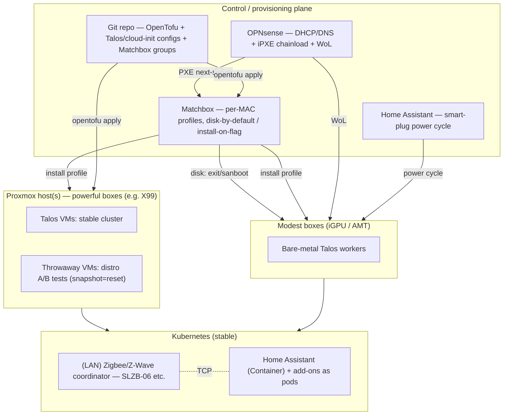

# Homelab roadmap — bare-metal k8s, the hybrid way

_Planning record, first written 2026-05-24 — and the plan **happened**: as of 2026-07 the Talos
cluster (VMs + bare-metal), Cilium+BGP, Longhorn, Home Assistant, monitoring + logging, UniFi,
Garage S3, the GitOps/secrets stack (ArgoCD/CNPG/Infisical/ESO/Crossplane), self-hosted CI and
Cloudflare remote access are all live. **Current state:** [`SERVICES.md`](SERVICES.md) +
[`README.md`](README.md). **Why each choice was made:** [`docs/adr.md`](docs/adr.md) (the research
that used to live here is condensed into the ADRs). **Operational loose ends:** `FU-NNN` items in
[`docs/follow-ups.md`](docs/follow-ups.md). What remains below: the original goal + decisions (kept
for history), the phase ledger, and the still-live forward plans._

## The goal (in one sentence)

Plug a headless machine into the LAN and have it **netboot into a working k8s node**
— bare-metal Talos for modest boxes, Proxmox (then Talos VMs) for powerful ones,
decided by a **central per-MAC table** — running a **stable cluster for real services
(incl. Home Assistant) plus a snapshot-reset sandbox**, all from one IaC repo, with
the ability to **centrally force any machine to wipe and reinstall**.

## Decisions made (2026-05-24)

| Decision | Choice | Why |
|---|---|---|
| Optimize for | **Stable base + sandbox** | Dependable platform *and* room to experiment |
| Topology | **Hybrid** — Talos VMs on Proxmox **and** bare-metal Talos on cheap boxes | VMs = instant-reset experiments; metal = the real target |
| Provisioning | **Lightweight DIY**, **per-MAC table** | Central inventory keyed by MAC picks each box's role |
| Boot policy | **Boot local disk by default; PXE-install only when flagged** | Avoids reinstall loops; central reinstall = flip a flag + power-cycle |
| Home Assistant | **Greenfield on k8s** | No migration baggage; design for k8s from the start |
| HA radio | **Network-attached Zigbee/Z-Wave coordinator** | Frees the HA pod from being pinned to the node with the USB stick |
| Service tiers | **Public (Cloudflare + Civo failover) vs internal (LAN-only)** | Different exposure, redundancy, and uptime needs |
| HA target | **3-node Proxmox HA + OPNsense CARP pair** (future) | Compute + router failover; rolling updates without downtime |
| Service exposure | **Cilium BGP ↔ OPNsense FRR** (replaces MetalLB) | LAN/VPN-native service IPs, declarative both ends |

The per-decision rationale + alternatives considered live in [`docs/adr.md`](docs/adr.md)
(ADR-010/011/012/020/021/040/041 and onward).

## Target architecture (as planned — since built)

```mermaid
graph TB
    subgraph control["Control / provisioning plane"]
        GIT["Git repo — OpenTofu + Talos/cloud-init configs + Matchbox groups"]
        MB["Matchbox — per-MAC profiles, disk-by-default / install-on-flag"]
        OPN["OPNsense — DHCP/DNS + iPXE chainload + WoL"]
        HAP["Home Assistant — smart-plug power cycle"]
    end

    subgraph proxmox["Proxmox host(s) — powerful boxes (e.g. X99)"]
        STABLE["Talos VMs: stable cluster"]
        SANDBOX["Throwaway VMs: distro A/B tests (snapshot=reset)"]
    end

    subgraph metal["Modest boxes (iGPU / AMT)"]
        BM["Bare-metal Talos workers"]
    end

    subgraph cluster["Kubernetes (stable)"]
        HA["Home Assistant (Container) + add-ons as pods"]
        ZC["(LAN) Zigbee/Z-Wave coordinator — SLZB-06 etc."]
    end

    OPN -->|PXE next-server| MB
    MB -->|disk: exit/sanboot| metal
    MB -->|install profile| metal
    MB -->|install profile| proxmox
    GIT -->|opentofu apply| MB
    GIT -->|opentofu apply| proxmox
    OPN -->|WoL| metal
    HAP -->|power cycle| metal
    proxmox --> cluster
    metal --> cluster
    ZC -. TCP .- HA
```

## Phase ledger

| Phase | Status |
|---|---|
| 0 — Foundations (tofu scaffold, Proxmox token, storage decision) | ✅ done |
| 1 — Stable base cluster (Talos VMs on Proxmox, Cilium + BGP) | ✅ done (`tofu/README.md`) |
| 2 — Home Assistant on the cluster | ✅ done — recorder = SQLite-on-Longhorn; network Zigbee coordinator still to buy (FU-034) |
| 3 — MAC-table provisioning pipeline (Matchbox, no IPMI) | ✅ done (`docs/provisioning.md`) |
| 4 — Promote to a real bare-metal cluster | ✅ 6 metal nodes joined (thinkcentre, hp-01, wk-metal-01..04) |
| 5 — Day-2 operations | 🟡 monitoring ✅ (ADR-042) · GitOps ✅ (ADR-005) · logs ✅ (ADR-083) · CI ✅ (`docs/ci.md`) · **backups/off-cluster DR ⬜ (FU-013)** |
| 6 — Agent platform | 🟡 see *Agent platform* below — the loop runs unattended per-stack; the open work is programs, not phases |

## Service tiers (standing design)

**Public (internet-facing) — fronted by Cloudflare.** Live for Home Assistant (Tunnel + mTLS,
ADR-050/051). The planned **cloud-redundancy half** — a Civo k8s failover origin, normally scaled
to zero, behind Cloudflare Load Balancing origin pools, same workloads deployed to both via GitOps —
is **not built**; revisit when a public service beyond Home Assistant exists. _Principle note:_
Cloudflare + Civo are SaaS dependencies — the conscious exception to "self-host everything",
acceptable at the public edge and replaceable.

**Internal (LAN-only) — everything else.** **MUST keep working when the WAN is down** (the
"offline" principle): local DNS (Unbound), on-prem Home Assistant + local MQTT/ESPHome, local-API
integrations over cloud ones. Live today; the remaining WAN-down gap is ArgoCD's git source
(GitHub → Forgejo cutover, FU-007).

## HA model (target end-state — not built)

Three independent failure layers — keep them distinct:

1. **Compute HA — 3-node Proxmox cluster** (Proxmox HA + replicated storage, e.g. Ceph).
   A node dies → its VMs restart/migrate to a survivor.
2. **Router HA — OPNsense CARP pair** across two nodes (anti-affinity, never co-located).
   `pfsync` = stateful failover; `hasync` = config sync; bonus = rolling firewall updates.
3. **Public-service HA — Cloudflare LB** → home primary, Civo (scale-to-zero) failover.

Covers a box dying / host reboots. ⚠️ Single ISP uplink stays a SPOF for inbound-public + egress
(multi-WAN is a separate add-on), but LAN keeps routing so local control stays up. WAN-side CARP is
limited by having one public IP → LAN-side CARP is the main win.

## Hardware strategy

- **X99 Xeon E5-2680 v4 → Proxmox host.** Great core count; ⚠️ no iGPU (needs a GPU to POST) and a
  2016 120W chip — keep it a dedicated hypervisor, not part of the zero-touch fleet.
- **Zero-touch fleet = business mini/SFF PCs with Intel vPro/AMT** (OptiPlex Micro, EliteDesk Mini,
  ThinkCentre Tiny): remote KVM + power without IPMI, iGPU, reliable Intel NICs, low idle.
- Standardize where possible — identical boxes make MAC-table profiles and schematics trivial.
- Power/perf ground truth: [`docs/power-measurements.md`](docs/power-measurements.md) +
  [`machines/`](machines/README.md) (laptops ≈64% better perf/W → the ephemeral tier, ADR-044).

## Agent platform

_Added 2026-06-25. A program distinct from the original 2026-05-24 cluster plan: turn a
natural-language bug report into a tested, auto-merged fix. What it became — an interactive
meta-coordinator in the jail plus an autonomous per-stack loop in the cluster — with the roles,
trust boundaries and the sub-doc index: [`docs/agents/`](docs/agents/README.md)._

**The original P0–P3 phases are done or superseded** (kept here as history — the plan happened, and
then moved past itself):

- **P0 — read-only triage MCP.** ✅ superseded in shape: triage arrived as the **responder** role
  (alert-triggered, ADR-093 Sensor edge) rather than a standing MCP server; the read-only MCP tool
  surface is now a retro/prober-side want, not a prerequisite.
- **P1 — fixer sandbox + full-stack gate.** ✅ live. Worker launcher, budgets, reviewer gate,
  per-repo `.agents/` recipes, k3d/kind system-test gates on Tofu'd runners (ADR-082).
- **P2 — bump-PR + deploy verify.** ✅ the bump/deploy half is live per repo shape (see *Deploy
  paths*, below); the **verify** half is the open piece — deterministic rollback shipped, deep
  post-deploy acceptance is still the prober (FU-044, FU-102).
- **P3 — local/cheap tier + shared memory.** 🟡 the cheap tier is live and far past "a model knob":
  chains, strikes, a live registry, a scout and the ADR-096 **router/budgeter**
  ([`docs/agents/model-routing.md`](docs/agents/model-routing.md)). Shared memory-as-MCP is
  untouched. Local-LLM *serving* (vLLM/prefix-cache) remains unbuilt and unscheduled.

**Where it actually got to.** The loop runs **per-stack and unattended**: each graduated stack owns
its `coordinate-<stack>` / `review-<stack>` CronWorkflows in its own namespace with zero
cross-boundary secrets (AgentStack claim, ADR-085); dispatch is **item-scoped** — a deterministic
scan emits work units and the LLM judges one item (ADR-094); Argo Workflows + Events is the
orchestration engine (ADR-093); model and budget decisions are moving into the egress proxy as a
router (ADR-096). Roles beyond fixer now exist or are specified: coordinator, reviewer, retro,
scout, responder, researcher, infra-fixer, prober
([`docs/agents/roles.md`](docs/agents/roles.md)).

**Identity/secrets** reuse existing primitives (Infisical+ESO, Cilium FQDN policy, the
`homelab-agents` GitHub App minting 1h scoped tokens) — no new secret platform. **CI runners are
Tofu-defined Proxmox VMs** running ephemeral k3d, not privileged in-cluster ARC (ADR-082).

## Programs in flight

Multi-phase work with several deliverables each — too big to be a follow-up, too committed to be
backlog. Each names the `FU-NNN` that carries its *next* concrete deliverable; the FU is not the
program.

### Platform self-service via Crossplane — "homelab as AWS/Civo" (FU-039)

A project can already IaC its S3 buckets/keys (ADR-076 Workspaces), OpenRouter keys
(`OpenRouterKey` CR) and Postgres (CNPG `Cluster` CR). It still **cannot** self-serve its git repos
(`tofu/github/`, admin PAT deliberately outside the jail), or its own ArgoCD AppProject/namespace.
Decide per resource: a Crossplane provider vs a thin homelab PR seam.

**Delivered:** the HTTPS-names leg (ADR-092, 2026-07-15) — per-stack subdomain delegation; the
public-ingress leg (PublicRoute XRD, ADR-101) BUILT + ARMED 2026-08-08 — zero consumers, open
legs in FU-039. homelab
wires `*.<stack>.teststuff.net` **once** (wildcard cert + one `3.0/24` VIP + a dumb HAProxy TLS
terminator → the stack's in-cluster Cilium Gateway; `stack_gateways` in `group_vars/opnsense.yml`,
opt-in), then the stack adds hostnames as HTTPRoutes in its own `-iac` repo with zero homelab
change. Opt-in is still a thin homelab PR once per stack; making *that* an XRD claim (ADR-085) is
the residual. Labels moved the same way (FU-068, the Issues-tier split).

**Open:** the git-repos and AppProject/namespace legs, both still operator PRs against
`tofu/github` + `argocd/platform`. Prereq for the per-stack IaC-repo model.

### Deploy paths — every merged change must reach prod (FU-051, FU-097)

Each project owns its own test+CI+deploy; auto-merging a bump that never deploys is a footgun. All
shapes use the same readable **`2026.<m>.<d>-g<sha>`** version and a first-party **deploy-pin PR**
— CI-opened, never Renovate (Renovate is for external deps only) — that auto-merges on a CI gate.

| Shape | Mechanism | State |
|---|---|---|
| app + chart | the `-iac` bump (sleep-tracking → sleep-iac) | ✅ proven E2E |
| operator / controller | Helm chart to **ghcr OCI** (ADR-084); `deploy.yaml` opens a bump PR in homelab/argocd; the app is multi-source (OCI chart + homelab `$values`), gated by `argocd-validate-pins` | ✅ live |
| image consumed by pods | version-pinned in `agents/images.env` + `agents/coordinator/*-argo.yaml`, off `:latest` — cacheable, traceable; each build's deploy-pin bumps it | ✅ live |
| snore-recorder | ArgoCD **PostSync hook Job** in sleep-iac (in-cluster `ansible-playbook`; failed playbook = failed sync = red app; `syncPolicy.retry` = backoff; nightly CronJob for the offline-Pi gap) | ✅ built 2026-08-02 (sleep-iac#13–16 + snore-recorder#15; FU-051's residue = observing one organic build→pin→Pi-converge run) |
| homelab | a deploy TARGET whose gate is now PATH-based, not CI-only: `require_approval = true` + `require_code_owner_review = true` with a repo-root `CODEOWNERS` (FU-068, 2026-08-04), and `ci` grew past `argocd-validate-pins` to `manifest-lint` (kubeconform) + `tofu fmt` + the model/router/FSM lints. `docs/agents/iac-lane.md` §The platform lane | ✅ |

**The other half (FU-097): the surfaces ArgoCD and tofu do NOT reconcile.** A merged change to
these deploys *nothing* today. Each needs either an automated apply or an explicit human-applied
ruling plus a drift belt:

- **OPNsense** — `ansible/opnsense-*.yml`, applied by hand via `scripts/opnsense-playbook.sh`;
  merged `group_vars` changes just sit. Candidate shape = the snore precedent (in-cluster ansible
  Job, PostSync or CronJob) with creds via ESO; a nightly `--check` diff → alert is the minimum belt.
- **Proxmox host (pve)** — host config beyond what `tofu/provisioning/` owns; pure hands-on SSH.
- **Home Assistant** — `homeassistant/` applied imperatively.
- **Matchbox** — `ansible/matchbox*.yml`, same manual-apply gap as OPNsense.
- **`tofu/` roots** — plan/apply from the jail is the **deliberate human gate** (keep), but nothing
  detects live-vs-state drift between applies. A `tofu plan` cron → alert is the candidate —
  prerequisite FU-012, now **3 of 5 roots done** (cloudflare, provisioning, infisical moved to
  encrypted Garage state 2026-08-04, so the belt can run for those; `main` stays local until it has
  an out-of-cone copy, `github` is host-only — `docs/tofu-state.md`). The roots differ in owner/credential/blast
  radius and need per-root rulings: `docs/dependency-upgrades.md` §"'Tofu' is not one class".

First deliverable is a per-surface ruling table (automate / human-applied + belt), then implement
the automated ones one surface at a time. ADR-093 makes Argo the candidate runner for the ansible
Jobs.

### Onboard every app repo to the agentic loop by default (FU-070; FU-052 archived 2026-08-30 — every repo is on)

Direction 2026-07-06: the full flow — merge-path auto-merge **and** the fixer (NL issue → worker →
PR → review → merge) — should be the **default** for app repos, not bespoke per repo.

A repo needs two layers. **(1) Merge-path**, mostly covered by `new-agent-repo.sh`: a managed
`github_repository` (allow_auto_merge), agent labels, required-check `ci`, the renovate-approve +
update-pr-branch callers, a PR-triggered `ci`. **(2) Fixer flow**: the `homelab-agents` App
installed, an `agent-git-token` ExternalSecret, an `OpenRouterKey` CR, `.agents/` recipes, a worker
namespace, and the repo in `agents/stacks.json`.

Layer 2's k8s infra is now **one `AgentStack` claim per stack** (ADR-085,
[`docs/agents/agentstack.md`](docs/agents/agentstack.md)) rather than a fixer block per repo. Still
per-repo and manual: the `.agents/` recipes, the `stacks.json` entry, and the GitHub side. The
collapse of the last of it is **`new-stack --from <donor>`** (FU-070 — the template-repo idea was
REJECTED 2026-08-03: unexercised templates are stale by construction; the living donor checkout is
copied instead). stack-lint's REPO-03/04/05 already verify the result.

**Onboarded:** sleep-tracking (reference), openrouter-operator, **homelab** (fixer lane
FU-068/FU-142, live since 2026-08), **agent-runtime** (PR#37, 2026-08-07 + the claim's fixer flip
2026-08-08), **sleep-iac** + **oracle-iac** (FU-106), **snore-recorder** (2026-08-02, FU-051 —
recipes + deploy-pin via #15, fixer block sleep-iac#57). **agent-coordinator stays context-only by
ruling** (2026-07-16, kept in the platform claim: its content is tier-3 loop machinery, no
repo-side lane) — so the onboarding program has no repo left; new repos enter via `new-stack`.

### The platform lane sheds the meta crutch (direction, operator 2026-08-08)

The responder was the start, not the exception: machine belts that triage, file, and fix —
extended out to the WHOLE platform stack (homelab, agent-runtime, agent-coordinator,
openrouter-operator). The historical blocker was **context, not capability**: platform repos had
no project shape a fixer could work against. That is turning — agent-runtime's tests + CODEOWNERS
+ `.agents/fix.yaml`, homelab's fixer lane, the extract-from-the-real-thing behaviour-test
pattern (`responder-behaviour-test.sh`) — and the direction is to keep feeding it: every
load-bearing platform contract gets a test/rubric a fixer can run and a reviewer can hold it to.

Two boundaries are DELIBERATE and stay:

- **The whole-repo CODEOWNER gate on platform repos stays human.** "It's just a version bump" is
  an LLM writing its own review rules — self-classification never relaxes the gate, there is no
  "trivial change" fast path, and meta's remaining review+merge duty concentrates here (the
  needs-meta watch bounds its latency). Autonomy grows on the INTAKE and FIX sides, never the
  approval side.
- **Intake is the open front end.** Today platform issues are ~all jail/meta-authored (six sat
  unlabeled for up to a month, 2026-08-08, precisely because filing+triage was a human act).
  Target: issues arrive from BELTS — the responder shape generalized past alerts. Some intake is
  already machine-owned (review-harvest via merged-closeout; alert triage); the pattern to
  extend: **every meta catch leaves behind a detector that files the next instance** (ledger
  anomalies, transcript audits, acceptance-probe failures). End state: meta reads PRs, not the
  world.

Next legs when commissioned (not yet FU'd — the operator shapes the order): per-platform-repo
review rubrics (`.agents/review.md`) + fixer-facing context files; the detector-per-catch
intake doctrine written into the meta skill. Retro/ledger harvest as issue sources DELIVERED
2026-08-11 — retro r3's batch = 7 queued issues across 3 repos (FU-058).

### The platform work map — stints before Goals (2026-08-19)

**The FU tracker is not the roadmap** — by this repo's own doctrine the remaining work lives in a
UNION of homes: FUs (next actions), the FSM gap registers (dispositioned guards), the
[chainless charter](docs/agents/chainless-redesign.md)'s build order + flip acceptance, the
banked ⚖ directions, and the [A5 governance pile](docs/agents/iac-lane.md). This map GROUPS and
POINTS — status and detail stay with each home (one home per fact). It supersedes the transient
Bucket A/B enumeration in `docs/agents/meta-state.md`.

**Two soft rules govern cadence (operator, 2026-08-19):**

- **Issues at the last possible moment, queued as soon as possible after.** An issue is for work
  that gets solved SOON; future work waits here, not on the board (the motivating case: the
  Renovate Goal #502, authored fully-formed 08-18 and then sitting behind five stints — closed
  back into this map, its body preserved as the launch-time draft). A stint parent is authored
  when its session is next; a Goal is authored at launch.
- **Stints before Goals.** The jail-lane containers clear the ground the Goals ride on.

**The stint queue** (jail-lane containers — [chainless §The jail stint](docs/agents/chainless-redesign.md)):

| # | stint | pointers |
|---|---|---|
| S1 | platform retro split — **DONE 2026-08-19 (stint #587)**; the 08-24 fire failed (529 storm + #861, fixed PR#864), the re-fire DELIVERED r1 2026-08-25; residual acceptance = the Mon 08-31 clean unattended fire | FU-058 |
| S2 | replay cleanup completion — **DONE 2026-08-19 (stint #661: batches 2–4 + fold-in landed, the #354 adversarial acceptance PASSED first try)**; residual moves ride FU-167 by fix-density | FU-167, homelab#661 |
| S3 | belts & lint upkeep — sentinel pushgateway blind: DONE 2026-08-19 (FU-176 archived); transport-lint signatures: DONE (homelab#564 closed 2026-08-19); remaining: ratchet `unreplayed` backfill, by fix-density | the FSM `unreplayed` rows |
| S4 | context & vocabulary — **DONE 2026-08-23 (stint #762)**: role×context×source dedup, jail cards, glossary + mission rename (FU-117 + FU-163 both archived) | — |
| S5 | corpus diet — **LAUNCHED 2026-08-26 (stint #979**, originals #981–#984: ADR-116 sweep, ADR-117 §-anchors, heat-cited trims, the deep comb**)**. The 2026-08-23 sequencing ruling (last, after the FU drain + G-A) held: trimming before closure preserves the status scaffolding; doc-heat reads better on goal-era transcripts | FU-164, homelab#979 |
| S6 | epic post-deploy mechanic — **originals 7/7 DONE 2026-08-20 (stint #716, one session; closeout 1 on the parent)**: contract rule 8 + rule-7 lane split, reviewer depth guard (PR#727 — incl. the seat-caught heredoc generation-time corruption class, → #734), responder `Cause:` bind, brief play doors, unbound-sprout belt, seat pastes, retro filing rule. **TREE EMPTY same day** (4 sprouts drained, all harvest-bound at honest depth; + the HEREDOC-FN-DOLLAR lint signature); parent CLOSED after its quiet window; per-repo fix.yaml pastes trail at fix-density | FU-090, homelab#716 |
| S7 | merge-path updater in-cluster — **DONE 2026-08-26 (stint #741, cutover #745)**: exporter edge + */15 Argo cron running `agents/update-pr-branch.sh`, ten callers + the hosted reusable deleted, `MERGE_GH_APP_*` org secrets destroyed, the FU-183 pro-rated burn alert live (PR#756). Acceptance watch: no BEHIND PR >30m; hosted updater runs structurally 0 | ADR-111, homelab#741 |
| S8 | **LAUNCHED 2026-09-05 → homelab#1418** (originals #1419–#1424 + the parser/JOIN pair filed off the inventory; the ADR pair = **ADR-125** (repo, base) + **ADR-126** themes, drafted at the head sitting). **subtract readers — ADR-122 goal-tree dispositions, then (repo, base) serialization + v1.3 themes (re-headed 2026-09-03; was "merge lanes", operator 2026-08-26).** New head = the ADR-122 build, in order: (a) bare-tree-member walk RETIRED — **LANDED 2026-09-05, PR#1400** (one scan block deleted to a tombstone + the goal family's four walk rows converted to three ADR-122 pins; #1249's three misfire shapes collapse into one inert row, and `bare-member-counted-not-queued` pins the positive half — the container COUNTS an undispositioned member in its burn-down while nothing queues it); (b) the machine block + ONE parser (Python, ADR-113) replacing the 13 line-anchored body grammars, `Origin:` included; (c) tree-member disposition `undispositioned | adopted | deferred` written by checkpoint/closeout, read by trigger (b), the completion predicate and goal-lint — an undispositioned member wakes, never blocks; the `post-launch:` title exclusion dissolves into it; (d) `agent-fix` off the dispatch precondition JOIN. Acceptance adds: no reader other than dispatch/finalize/the belts mutates author labels; #1315's shape replayed (undispositioned member → checkpoint wake, not a hold); the consumer card shrinks to three author acts (body block, parent, `agent/queued`). Then the original heads = the ADR pair in one sitting: (repo, base) as the serialization unit (the reflex/updater/scan lanes split per base — the merge→behind→dismiss chain is base-local, TICK-LOG 2026-08-26 + #829's reframe comment) + theme-branch adoption (the banked v1.3 block promotes; version-table row "design accepted, build = S8"). Originals ≈ reflex per-base pick, updater per-base pick, scan per-lane walk + caps (ABSORBS #829), theme mechanics (decompose play ≥2-shared-surface, rule-7 depth-guard re-key, master-refresh hop), FSM/doc currency, per-lane famine gauges. **Dogfood deliberately OUTSIDE the stint**: the first new platform Goal after S8 runs a theme; acceptance = per-lane famine numbers + codeowner-tax-per-theme vs G-A's per-child baseline. After S5. **v1.3.1 (2026-09-01): the #1162 manual pilot ran and the banked block now carries the refined candidate** — S8 gains the membership test (Touches-vs-fix-surface + pin allowance), the `Origin:` line + typed defer/release, and checkpoint theme-FORMATION (nominate→judge→mint→branch→queue) as originals; the park-economics delta (updater skip + cap split) rides #887 + FU-199 independently; adoption gate = wave 2 (dispatch-belts theme at #1162's close sweep) reading ≤5 interventions / 0 summonses / 1 owned read | issue-authoring.md §Theme-branch decomposition for deploy-to-test stacks (v1.3) + §v1.3.1 — the #1162 wave-1 pilot's refinements (ADR-126), #829 (absorbed at authoring), #828 (independent, stays queued), FU-168, FU-199, homelab#887 |

**Goal candidates** (authored AT LAUNCH, in rough order — the Goal dogfood begins here once the
stints clear; the goal lane's pause conditions read met as of 2026-08-19). The NEXT platform
Goal's decomposition runs a theme (ADR-126 — the S8 dogfood, deliberately outside the stint;
[issue-authoring.md](docs/agents/issue-authoring.md) §Theme-branch decomposition; G-A
deliberately finished the old way):

| # | Goal | scope pointers |
|---|---|---|
| G-A | **every role routes** — the chainless completion. **LAUNCHED 2026-08-23 → homelab#775** (status lives there) | charter build items 3–6 + flip acceptance 2–4; #516 family decorrelation; FU-127; FU-095 (a)/(c); FU-179 strike policy; FU-180 relates (accounting half) |
| G-B | **assurance** — SLO error-budget teeth (ex-FU-104), the lens tail (ASVS/e-ITS + the blocking knob, ex-FU-101), the responder remediation dial (ex-FU-103), prober briefs/edges | [roles.md](docs/agents/roles.md) §SLO machinery, §Lenses, §responder, FU-102 |
| G-C | **self-service & catalog** — the FU-039 program + XRDs superseding SERVICES.md | FU-039, FU-049 (§Programs above) |
| G-D | **Renovate live for the platform stack** — charter drafted and preserved in closed #502; re-mint at launch. First class-6 (cluster-substrate, human-applied) ride = the Talos 1.13.2→1.13.8 patch, the #857 consumer (operator, 2026-09-01: parked on this launch, not a separate sitting) | homelab#502 (closed, body = the draft), #857 |
| G-F | **stack MCP attachment + probe classes** — **LAUNCHED 2026-08-30 → homelab#1039** (status lives there). Claim MCP knob + egress leg, launcher `--mcp-config` + env-card nudge/version-skew lines, probe strike isolation, the ⚖ class-2 sanction. Jumped the G-C/G-D queue on operator accept: the only candidate with an external consumer blocked on it (oracle class-2 + the #270 dogfood window's feedback rows; proposal routed via the mono seat 2026-08-30). Oracle-side halves stay stack-owned (homelab#289 un-parked, unqueued) | homelab#1039, homelab#289, FU-102, roles.md §prober |
| G-G | **minutark.ee public edge** — first Cloudflare-live product service (oracle §4a proposal as amended 2026-08-30). **Both unblockers VERIFIED DONE 2026-09-02** (seat ground-truth pass): the two-zone ingress token is applied (token-root state carries the minutark zone id; the cf-api-proxy's live token lists both zones via `/zones`) and the DNSSEC DS is published at the .ee parent (dig DS + `ad` flag validate; the 2026-08-09 "active"-panel illusion resolved by the operator's zone.ee hand-back). Then **two PublicRoute profiles as composition DEFAULTS** — `consumer` (minutark.ee: edge caching + RUM) and `api` (mcp.minutark.ee: rate limits + origin policy + affordable hardening) — secure-by-default per ADR-119 (a capability whose honest consumer answer is always yes ships in the profile, never as a request; plan-tier affordability is a PLATFORM fact; the `api` profile never carries analytics — the zero-client-context pitch stays structurally clean), plus the observability-EXPORT claim field (edge metrics → the stack's Grafana/KPIs/status page) and the LB/failover posture call. **Demand FILED per ADR-119 + consumer contract anchored on it (2026-09-02): oracle-iac#485 (api profile — incl. the ⚖ threshold-as-claim-field ruling) + oracle-iac#486 (observability export)** — the board's DEMAND slice carries them. **LAUNCHED 2026-09-02 → homelab#1302** (operator-ordered, Budget: 30; seat-decomposed same session: #1303 field+fan-out+proxy-table → #1304 api / #1305 consumer / #1306 observability-export → #1307 docs+live-proof, all queued on `goal/1302-public-edge`) | oracle-iac#485/#486 (contract comments), ADR-119, ADR-101, `tofu/cloudflare/minutark.tf` |
| G-E | **cheap-tier reliability economics** (banked 2026-08-23, the #783 ruling's future half — launches AFTER G-A: the routed fleet + the full harness matrix are its substrate, per the operator's own sequencing "claude fully working + opencode with workers, THEN provider attribution pays: 3 harnesses × model × ~2 providers"). Scope: provider attribution in strike/canary evidence (#783 thread legs — served provider into strike records; serving-shaped strikes exclude the (model, provider) pair and re-run the PRICED pick, never a blind same-model retry; model verdicts need ≥2-provider evidence); scout provider-aware cells + OR free-provider reliability tracking (the laguna their-view-vs-ours class, `provider_events` as the substrate); **worker fan-out as a dispatch-time evidence lane on `:free` models ONLY during the trial** (operator refinement 2026-08-23: free-tier-only so cost cannot run away while the SHAPE is learned — deepseek-flash counts as ≈free at its price; no other paid models yet; launcher-owned, ADR-094 — the #778 pilot's findings ledger incl. the arm-quality≠arm-completion datum: nemotron-lightning r3 outproduced flash but died pre-commit, salvage PR#794). **Sequencing: multiple WORKERS first; the projected high-leverage target is multi-model REVIEW** (small outputs — reasoning over N verdicts and discarding is cheap, and review+coordination may be ~99% of true cost per the ADR-107 cost-rethink direction-4 evidence; relates the banked tier thesis + the A5 second-reviewer-App question); per-model/free-tier **capacity-event dispatch** — the #779 doorbell generalized below rail-level, so a cooldown clear launches the deferred worker instead of blind retries | homelab#783 (thread = the design record), #778 (fan-out ledger), model-routing §M1a re-open clause, §M7 leg 5, ADR-104 |

**Deliberately elsewhere, on purpose** (a plan built from FUs alone is blind to these): the ⚖
banked directions (workload-profiles/estimator-into-router — model-routing §M8 feed 4;
probe-vs-e2e — roles.md §prober; the tier thesis), the A5 governance pile (iac-lane.md), the
gap registers' accepted rows, and the §Open revisit-conditions in
[docs/agents/README.md](docs/agents/README.md).

## Caching tier (nix + images LIVE)

The **nix** leg is LIVE — an in-cluster pull-through cache (`argocd/resources/nix-cache/`,
`SERVICES.md`) feeding agent-sandbox `devbox install`s. The **images** leg is LIVE too
(2026-07-14, **ADR-091**): two `registry:3` pull-through mirrors
(`argocd/resources/registry-cache/`, docker.io + ghcr, BGP VIPs `.40.20/.21`) feeding docker-mode
agent rides and the k3d/kind CI gates — Harbor/zot and the out-of-cluster box were rejected for
nginx-grade simplicity. All consumers shipped (FU-073 archived 2026-07-26: Talos node-level
`machine.registries.mirrors`, ci-runner-01, ARC runners). Still open (ADR-070): apt-cacher-ng,
when apt pain is real.

## Risks & gotchas (from the build — still true)

- ⚠️ **Reinstall-loop danger:** if PXE serves an installer unconditionally, a box reinstalls every
  boot. Disk-by-default Matchbox + transient install flags prevent this (`docs/provisioning.md`).
- **No-iGPU POST:** many desktops won't boot headless without a GPU. Fleet boxes need iGPU or BMC video.
- **Proxmox single box = SPOF** for the VM half. Fine for a lab; keep backups off-box (FU-013).
- **HA radio = single point of failure** even networked; the coordinator going down takes Zigbee with it.
- **Talos has no SSH/shell** — all via `talosctl`. Mindset shift from Rocky/Ubuntu.
- **AMT security:** a neglected AMT is a backdoor — strong password, LAN-only, patched.
- **Secrets discipline** — the repo is public: no plaintext secrets in git, ever (ADR-062).

## Backlog / parked features

### Self-hosted supply-chain security (SLSA L3 / "L4") — plan written 2026-06-12
Build **real software** here with verifiable provenance **without GitHub/Chainguard as services**.
Full plan, self-hosted stack, phased steps and the hardware decision live in
[`docs/slsa.md`](docs/slsa.md). Headlines: current setup reaches **Build L2** easily (hosted runner +
cosign + SBOM — FU-016) and a **self-hosted L3** (Tekton Chains + Kata microVMs on bare metal +
self-hosted Fulcio/Rekor) is doable in software; **confidential "L4" is hardware-gated** — SEV-SNP is
**EPYC-only** (Threadripper PRO's BIOS toggles are dead; Strix Halo has none), so it means buying a
**used EPYC Milan quiet tower** when/if it becomes a real project. Hermetic/reproducible via
**melange/apko/Wolfi** + Nix is the early win.

### Bare-metal node suspend/resume — an "autoscaler" without IPMI (parked 2026-06-11)
Power idle ephemeral nodes off and wake them on demand to cut idle draw. **Parked** until there's
enough to scale — more services + the home↔Civo multi-cloud (see *Service tiers*) — so the burst
tier actually flexes. Feature-request synthesis (so it isn't re-researched):

- **No off-the-shelf option.** cluster-autoscaler / metal3-Ironic / CAPI all assume a cloud that
  *creates & destroys* instances gated by a **BMC (IPMI/Redfish)** our consumer gear lacks;
  [siderolabs/kube-scheduler](https://github.com/siderolabs/kube-scheduler) is an IPMI talk-demo.
  Reframe: our node set is **fixed**, so this is **node suspend/resume**, not autoscaling — which
  is why CA's "terminate the instance" model doesn't fit.
- **Targets = the tainted ephemeral laptops** (wk-metal-01/02; ADR-044). NOT the storage desktops
  (hp-01/thinkcentre hold Longhorn).
- **Power model** (extends ADR-013): sleep = `talosctl shutdown` (graceful S5); wake = **WoL**.
  ⚠️ Laptops have **batteries**, so smart-plug power-off doesn't work (they keep running on
  battery) — WoL is the *only* wake path. **Feasibility gate:** verify ThinkPad X240/X250
  WoL-from-AC (drain → `talosctl shutdown` → magic packet → does it boot?). If WoL fails, laptop
  scaling isn't viable as-is.
- **Build:** prefer a small **purpose-built controller** (watch Pending pods → wake a slept node;
  sustained idle → drain + sleep) over cluster-autoscaler's `externalgrpc` provider — CA wants to
  delete/create nodes, ours persist and only change power state (impedance mismatch).
- **Pieces already in place:** HA REST API (plugs), WoL via a hostNetwork pod, `talosctl shutdown`,
  Prometheus power metrics, the `homelab.io/ephemeral` taint. Write an ADR when picked up.

### Edge tier
Moved to the **private business repo** (it's product planning, not homelab infrastructure). The
homelab remains its dev/test ground — same manifests, GitOps-deployed, then shipped to an edge distro.

## Sources (original 2026-05 research)

- [Talos on Proxmox + Terraform (May 2026)](https://www.jonashietala.se/blog/2026/05/22/talos_linux_on_proxmox_with_terraform/) · [Talos+Proxmox+OpenTofu turnkey](https://github.com/max-pfeiffer/proxmox-talos-opentofu) · [erwinkersten/homelab](https://github.com/erwinkersten/homelab)
- [Matchbox getting started](https://matchbox.psdn.io/getting-started/) · [Matchbox concepts (MAC/group matching, disk-first boot)](https://matchbox.psdn.io/matchbox/) · [poseidon/matchbox](https://github.com/poseidon/matchbox)
- [SMLIGHT SLZB-06 network Zigbee coordinator](https://smlight.tech/product/slzb-06) · [HA ZHA integration](https://www.home-assistant.io/integrations/zha/)
- [Harvester requirements](https://docs.harvesterhci.io/v1.7/install/requirements/) · [Harvester vs Proxmox](https://www.xda-developers.com/proxmox-vs-harvester/)
- [Sidero Omni pricing/hobby tier](https://www.siderolabs.com/pricing) · [Sidero Metal deprecation](https://www.sidero.dev/) · [Omni bare-metal PXE](https://docs.siderolabs.com/omni/omni-cluster-setup/registering-machines/register-a-bare-metal-machine-pxe-ipxe)
- [MAAS + Wake-on-LAN](https://stgraber.org/2017/04/02/using-wake-on-lan-with-maas-2-x/) · [OPNsense WoL](https://forum.opnsense.org/index.php?topic=15667.0) · [awesome-baremetal](https://github.com/alexellis/awesome-baremetal)
- Service exposure / BGP: [Calico + OPNsense BGP (tyzbit)](https://tyzbit.blog/configuring-bgp-with-calico-on-k8s-and-opnsense) · [kubernetes-pfsense-controller](https://github.com/travisghansen/kubernetes-pfsense-controller)
- Caching: [Spegel](https://spegel.dev/) · [Talos pull-through cache](https://oneuptime.com/blog/post/2026-03-03-set-up-a-pull-through-cache-registry-mirror-in-talos/view) · [nh2/nix-binary-cache-proxy](https://github.com/nh2/nix-binary-cache-proxy)
