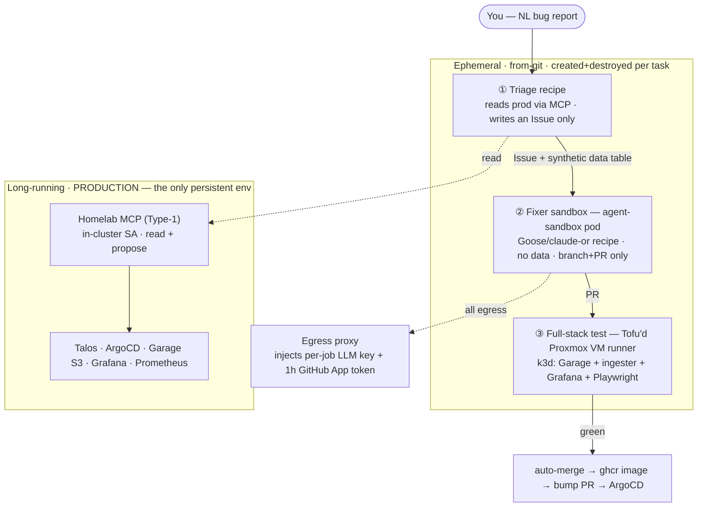

# Agent platform — in-cluster MCP capability + ephemeral sandbox harness

> **Status: substrate LIVE, loop reflex-driven, autonomy switch off (2026-07).** The
> launcher/worker/budget/reviewer pieces run for real (`../../agents/README.md`); the coordinator
> is a scoped brief behind a deterministic scan gate, with the `coordinator-reflex` Argo CronWorkflow
> (ADR-093 — the loop reflexes are Argo CronWorkflows in `agents/coordinator/reflexes-argo.yaml`, no
> longer k8s CronJobs) built and deployed **suspended** (FU-050 — unsuspending it is the autonomy
> switch; durable engine = FU-026); credential injection + the egress proxy are **LIVE default-on** (ADR-087: opaque refs +
> git-cred broker; Cilium lockdown rollout = FU-020). This is the narrative home for the agent
> platform; it's bigger than one ADR. Pivotal choices are recorded as thin ADRs in
> [`../adr.md`](../adr.md) (ADR-077+, see [Decisions](#decisions)); the phased build lives in
> [`../../ROADMAP.md`](../../ROADMAP.md). Where a piece goes LIVE it gets a row in
> [`../../SERVICES.md`](../../SERVICES.md). The **fixer control flow** (worker gates, fresh-vs-hot,
> the coordinator state machine + webhooks) is in [`workflow.md`](workflow.md); the **operational**
> launcher reference + findings/follow-ups is in [`../../agents/README.md`](../../agents/README.md).

## What this is

Two agent shapes that compose into one **stack**, not two separate systems:

- **Type 1 — the homelab MCP agent** (long-lived): an in-cluster MCP server with a scoped
  ServiceAccount that exposes "observe + propose on the homelab" to any agent. It is the
  **capability surface**.
- **Type 2 — the sandbox harness** (ephemeral): per-task agents that run in disposable
  [agent-sandbox](https://github.com/kubernetes-sigs/agent-sandbox) pods and *consume* Type 1's MCP
  plus git. It is the **execution substrate**.

The "intelligence" lives at exactly two nodes — **triage** and **fix** — and everything between
them is plumbing you mostly already run (CI, ArgoCD, Renovate, a verification step). Don't put an
agent where a status check will do.

## Design invariants

These come straight from [`../../CONTEXT.md`](../../CONTEXT.md) ("boot from git") and the
[testing doctrine](#testing-doctrine); every choice below is constrained by them.

- **Only production is long-running.** Every other environment — test clusters, agent sandboxes,
  the data they touch — is **created from a tag and destroyed**. No staging box to drift.
- **Agents propose, GitOps applies.** The agent's "write" verb is *open a PR / push a branch*;
  ArgoCD + Tofu reconcile. No imperative `kubectl apply` / `tofu apply` from an agent, except a
  narrow allow-list of runbook ops that can't be expressed in git.
- **Durable, auditable state is the source of truth; conversation, vectors, and snapshots are
  cache.** Durable state here = git + S3. A dead sandbox is re-dispatched, never resurrected.
- **No blobs; test data must not be hidden.** Fixtures are human-readable data tables (YAML/CSV/
  markdown), not opaque `.sqlite`/base64 — the database is *built from* the table at runtime.

## The stack



## Trust boundaries

The whole design is three zones and the artifacts that cross between them:

| Zone | Can read | Can write | Holds creds? |
|---|---|---|---|
| **Triage** | prod data (Grafana, S3, source) via MCP | a GitHub **Issue** only (`issues:write`) | no raw keys — via proxy |
| **Fixer** | the Issue + the synthetic data table | a **branch + PR** (non-protected only) | **no data creds**; git token injected, never held |
| **CI / verify** | the repo + the ephemeral test stack | status checks | minted per-run |

The one-line rule: **triage reads everything but only writes an Issue; the fixer writes code but
sees no data and can't touch master; the bridge is the synthetic data table.** Master is protected
by branch protection + required checks — the token scope is belt, the protection rule is suspenders.

A corollary: **the Issue must be self-contained.** The fixer has only the app repo + the Issue —
no homelab checkout, no `SERVICES.md`, no cluster access — and app repos deliberately don't mirror
platform docs (they'd go stale). So triage/the coordinator copies the platform facts a task needs
(endpoints, bucket names, service status) into the Issue alongside the synthetic table.

## Identity & secrets

Everything reuses primitives already in the cluster (Infisical + ESO, Cilium, a GitHub App).

- **LLM keys (OpenRouter / Anthropic).** Master/provisioning key lives in **Infisical**
  (bootstrapped from KeePass Tier-0), **never enters a pod**. Each job mints a **budget-capped,
  short-lived runtime key** (OpenRouter provisioning API / LiteLLM virtual key) — the cap *is* the
  "$X spend" guardrail. Local dev keeps `.openrouter.env` (gitignored) via `claude-or`.
- **GitHub.** A dedicated **"agents" GitHub App**; its private key is the only long-lived secret
  (→ Infisical). Every job mints a **~1-hour installation token** narrowed to specific repos +
  permissions (fixer = `contents:write`+`pull_requests:write` on one repo; triage = `issues:write`).
  No hand-made per-repo PATs. (ghcr **push** stays a classic PAT — that's CI's credential, not the
  agent's.)
- **Egress proxy = Cilium + a small injection proxy, NOT a service mesh.** Two jobs, split:
  - *Network boundary:* `CiliumNetworkPolicy` `toFQDNs` + L7 HTTP rules — the sandbox can reach
    **only the proxy**, deny-all else. Native; no Istio.
  - *Credential injection:* a small auth-injecting forward proxy holds the minted LLM key + GitHub
    token and adds the headers; the agent gets `HTTPS_PROXY=<proxy>` and never sees the secrets.
    (This single box is where *all* secrets are injected — the reason it's worth building once.)

## Worked example — the sleep-tracker "25-minute night"

The driving prompt:

> *"24.06 I slept 23:27–07:58 and read a book gadgetbridge tagged as light sleep 13:26–13:50.
> Grafana shows this day as a 25-minute sleep only."*

(25 min ≈ the 24-min nap; the 8h31m overnight block was dropped — a cross-midnight wake-date keying
or session-aggregation bug in `src/sleep_ingester/`.) Through P0+P1:

```mermaid
sequenceDiagram
  participant U as You
  participant T as Triage recipe (P0)
  participant M as Homelab MCP (read)
  participant I as GitHub Issue
  participant F as Fixer sandbox (P1)
  participant C as CI / full-stack test
  U->>T: paste the report
  T->>M: query sleep.sqlite night=2026-06-24 → 25 min
  T->>M: read raw sessions from sleep-band S3 → both present
  T->>M: read parser.py / timezone.py → hypothesis
  T->>I: open Issue + synthetic DATA TABLE (no real PII)
  Note over U,I: P0 ends — zero blast radius. You label it `agent-fix`.
  I->>F: spawn agent-sandbox (no data creds, branch+PR only)
  F->>F: build sqlite from the table → write FAILING row → red
  F->>F: minimal fix in parser.py → devbox run ci → green (cov ≥85%)
  F->>C: gh pr create
  C->>C: devbox run ci + scan-secrets + full-stack test; reviewer session approves (merge-path.md)
  C-->>I: green + approval → auto-merge → ghcr image
```

**Why the dashboard needs the full-stack test:** the recent dashboard fixes (`rawSql`→`queryText`,
`queryType=table`, `night_date`→epoch, `rawQueryText` interpolation) were all **dashboard-JSON /
frser-plugin bugs** — invisible to any Python unit test. Only a real Grafana + frser + a browser
assertion catches them. That's why "CI green" must stand up the whole vertical (next section).

## Testing doctrine

Derived from the [NTD 2024 talk](https://github.com/Test-Government/nordic-testing-days-2024-talk)
best-practices + two additions, applied here:

1. **One prod env; everything else ephemeral-from-git** (see invariants).
2. **Decision tables, not N near-duplicate unit tests.** The Spock `where:`-block style: one
   parametrized test, a visible table of `inputs → expected`, row description in the test id so
   reports self-document. A reviewer reads the **table** and can *see the missing row* — impossible
   with 20 copy-pasted functions. In this repo = `@pytest.mark.parametrize` sourced from a visible
   data file. The "25-min" bug is a **row**:

   ```
   description                 | sessions                    || night_date | expected_min
   "single overnight"          | 23:27→07:58                 || 2026-06-24 | 511
   "overnight + daytime nap"   | 23:27→07:58 ; 13:26→13:50   || 2026-06-24 | 535   ← was 25
   "nap only"                  | 13:26→13:50                 || 2026-06-24 | 24
   ```

3. **≤5 E2E tests.** Decision-table cases live at the fast parser/ingester layer; the **full-stack
   ephemeral test is one of the ≤5 E2E slots.**

### Full-stack ephemeral test (the confidence gate)

`devbox run test-integration` (thin CI seam — identical locally and in CI, per "local == CI"):

```
k3d create → helm install chart/ (test values) → seed Garage with the synthetic data table
   → run sleep-ingester → Grafana (real frser plugin + provisioned dashboard JSON)
   → Playwright asserts the 2026-06-24 panel = ~8h31m, NOT 25 min → teardown
```

- **Real components, synthetic data** — so it has dashboard-level fidelity *without* crossing into
  real prod data; the seam stays intact.
- Installs the real `chart/`, so it also validates **Renovate/Dependabot** image/chart/base bumps —
  green = the bump still ingests + renders. Same harness gates both agents and version bumps.
- **Runs on a Tofu-defined Proxmox VM runner** (decided — see below), which creates+destroys the
  k3d stack per PR. The VM is *infrastructure/cattle*, the *environment-under-test* is ephemeral —
  so an always-on runner does not violate "only prod is long-running."

## Where agent config lives

Config-as-code, co-located with what it operates on (same principle as each app's `infra/`):

```
sleep-tracking/
  .agents/
    fix.yaml        # the fixer recipe — model knob, TDD instructions, allowed tools, guardrails
    review.md       # the reviewer rubric — appended to the reviewer session's system prompt
                    #   (agents/reviewer-session.sh; the reviewer runs decorrelated on the
                    #   operator subscription, not the worker's OpenRouter model)
  claude-or         # already exists — model routing (OpenRouter)
  .openrouter.env   # already exists — the model knob (gitignored)
```

- **Per-app fixer recipe → the app repo** (it knows `parser.py`, `devbox run ci`, the 85% gate).
- **Generic triage recipe → homelab** (leans on the homelab MCP; parameterized with the repo).
- **Hard guardrail in `fix.yaml`:** *new test cases are rows in the decision table — a new
  near-duplicate test function requires justification.* (AI's default failure mode is exactly the
  20-duplicate-tests anti-pattern; forbid it explicitly.)

## Decisions

Recorded as thin ADRs in [`../adr.md`](../adr.md):

| ADR | Decision | Status |
|---|---|---|
| ADR-077 | Agent runtime = **Goose** (in agent-sandbox); meta-harness/egress pattern from Omnigent | proposed (Goose running in practice) |
| ADR-078 | Isolation layer = **agent-sandbox** (k8s-native), not Omnibox/Istio | accepted (plain Pod until it lands — FU-019) |
| ADR-079 | **Strict-PR write policy** — agents propose, GitOps applies | accepted |
| ADR-080 | **Durable git/S3 state is truth; context/vectors/snapshots are cache** (may rise to CONTEXT.md) | accepted |
| ADR-081 | Per-job identity — minted budget-capped LLM keys + 1h GitHub App tokens; Cilium FQDN + injection proxy | accepted (proxy v1 LIVE 2026-07-09; refined by ADR-087) |
| ADR-082 | **CI runners = Tofu'd Proxmox VMs** running ephemeral k3d (not privileged ARC, not off-cluster pop-os) | accepted (ci-runner-01 live) |
| ADR-084 | **Three-layer repo topology + automated deploy** (chart = the deployable unit; `-iac` pins one number) | accepted (live E2E) |
| ADR-085 | **AgentStack + platform-service XRDs** — mechanism=platform, policy=stack | open direction (AgentStack BUILT — [`agentstack.md`](agentstack.md); service XRDs = FU-049) |
| ADR-086 | Coordinator write tier **W1: ⚑ spec gap-flags** on open agent PR branches | accepted (W2+ needs its own ADR — FU-059) |
| ADR-087 | **Opaque-ref creds**: egress proxy resolves LLM refs; git-cred broker mints per-request tokens | accepted (default-on; fallbacks drop with FU-020) |

## Open / deferred

- **Rollback** — *deprioritized.* The full-stack test gates the bump before merge, so a bad deploy
  shouldn't reach prod. If it ever does, the GitOps-correct fix is **`git revert` the bump commit**
  (ArgoCD re-syncs the previous tag) — never `kubectl rollout undo` (drifts from git). Revisit
  Argo Rollouts only if reality proves testing insufficient.
- **Does Omnigent earn its place?** Start with Goose-in-agent-sandbox + the bare egress-proxy
  pattern; add Omnigent's full meta-harness only if governing *multiple* harnesses becomes real.
- **Shared memory-as-MCP** — a third platform-service candidate (durable git-markdown + a
  disposable vector cache, à la Memory-OS Layer 1). Not P0/P1.
- **CI-cluster-with-ARC upgrade** — VMs now; revisit a dedicated CI cluster with autoscaling
  privileged runners only if parallel PR volume outgrows a single VM.

## Roadmap

Phased build in [`../../ROADMAP.md`](../../ROADMAP.md#agent-platform--phased) — P0 read-only triage
MCP → P1 fixer sandbox + full-stack gate → P2 bump-PR + deploy verify → P3 local-LLM/Hermes tier +
shared memory.
