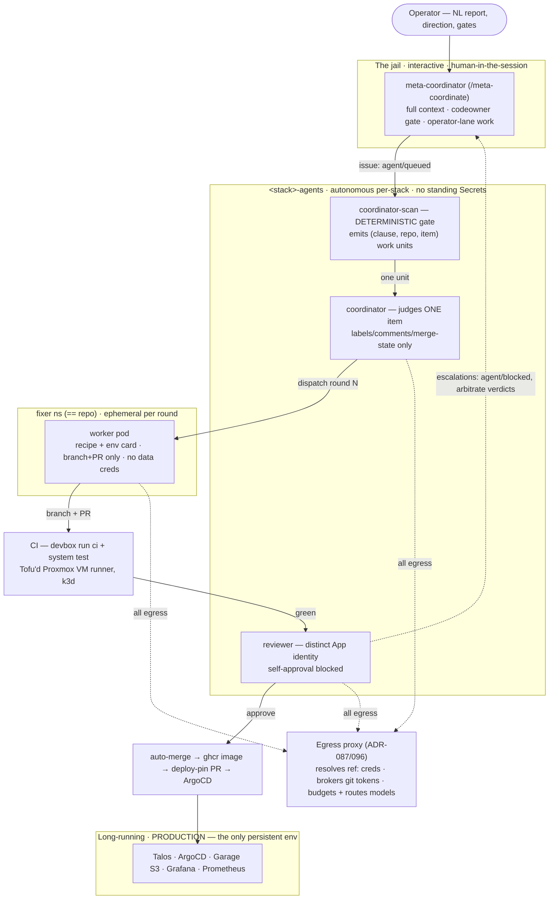
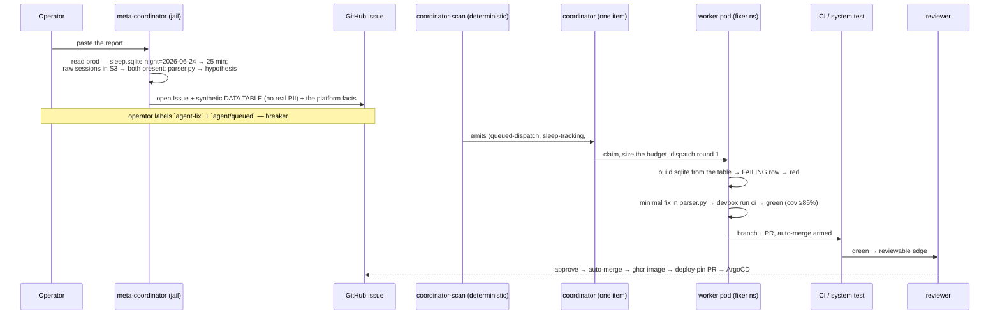

# Agent platform — an interactive meta-coordinator in the jail, an autonomous loop in the cluster

The narrative home for the agent platform: what it is, where the trust boundaries are, and which
doc owns what. It's bigger than one ADR, so pivotal choices are thin ADRs in
[`../adr.md`](../adr.md) and each doc below owns its own mechanism.

**Where status lives — not here.** Whether a piece is live is answered by
[`../../SERVICES.md`](../../SERVICES.md) (consumable services), `kubectl get agentstacks` (which
stacks are graduated), and [`../follow-ups.md`](../follow-ups.md) (what's still open). A
hand-maintained status paragraph in a design doc is a fourth copy that goes stale between edits —
the per-role "state" column below is deliberately coarse for the same reason.

For the launcher — flags, usage, per-session budget mechanics — see
[`../../agents/README.md`](../../agents/README.md).

## What this is

Two places where agents run, with one boundary between them:

- **The jail — the interactive meta-coordinator** (`/meta-coordinate`). The operator's Claude Code
  sessions on the Docker jail, with full context and every credential the operator has. It is
  **human-gated by construction**: a person is in the session. It does what the loop structurally
  cannot — the codeowner gate on `specs/` diffs, issue authoring, `.github/workflows/` and
  platform/XRD changes (worker tokens forbid them), `agent/error` breaker clears, and everything
  the machine belts escalate. Its state is durable and re-read every session, never remembered:
  [`../../agents/coordinator/TICK-LOG.md`](../../agents/coordinator/TICK-LOG.md) (practice) +
  [`meta-state.md`](meta-state.md) (in-flight chains).
- **The cluster — the autonomous loop.** Each graduated stack runs its own `coordinate-<stack>` and
  `review-<stack>` CronWorkflows in a `<stack>-agents` namespace as the `agentstack-loop` SA, which
  dispatches ephemeral worker pods into the per-repo fixer namespaces. **Zero cross-boundary
  Secrets live there** — git tokens are broker-fetched per run from the egress proxy under
  TokenReview, and LLM creds are opaque `ref:` strings resolved at the proxy (ADR-087). All FOUR
  stacks are graduated: oracle (2026-07-18), sleep + platform (2026-07-26), circles (2026-08-03).

The boundary between them is the interesting part: **the jail has the context and the authority;
the cluster has the blast-radius containment.** On the **fixer lane**, work crosses that boundary
as an *issue* and comes back as a *PR* — but that is one lane's edge, not the loop's whole surface:
the other roles enter on their own edges (alerts → responder, schedules → retro/scout, typed
schema deltas → infra-fixer; the roles table below is the inventory).

Inside the cluster, the intelligence sits at a small number of judgment points and everything
between them is deterministic plumbing you mostly already run — a scan, CI, ArgoCD, Renovate,
Sensors. **Don't put an agent where a status check will do:** the `coordinator-scan` gate exists
precisely so an empty world wakes no LLM, and dispatch is item-scoped so the model judges one item
rather than scheduling itself (ADR-094).

### The roles

A **role** = brief + boundary + activation machinery (predicate, edge, backstop, idempotency key,
capacity gate, breakers). The machinery outweighs the brief roughly 10:1, which is why a new role
is a machinery design problem, not a prompt-writing one. Full per-role inventory — every guard,
every key — is [`roles.md`](roles.md); this is the map.

| Role | Runs | Fires on | State |
|---|---|---|---|
| **meta-coordinator** | jail, interactive | the operator | live |
| **fixer** (worker) | fixer ns (== repo) | a scan-emitted work unit | live |
| **coordinator** | `<stack>-agents` | scan clause / `/coordinate` doorbell | live |
| **reviewer** | `<stack>-agents` | reviewable transition (exporter edge) | live |
| **responder** | `agent-coordinator` | an Alertmanager fingerprint | live (v2, triage-first) |
| **scout** (model-scout) | cluster cron | weekly schedule | live |
| **researcher/planner** | fixer ns | a human-queued MISSION issue (not an ADR-102 Goal; operator-dispatched — FU-163) | first mode proven |
| **infra-fixer** | `-iac` lane | a typed `values.schema.json` delta | live (both -iac repos; first rides merged) |
| **retro** | cluster cron | ledger level-trigger | first end-to-end run 2026-08-11 (hand-fired, 5 latent bugs fixed); first unattended 2026-08-17 |
| **prober** | — | post-deploy + schedule | built 2026-08-07, disabled everywhere (no brief yet — FU-102) |

**Lenses** (FU-101) are not roles: a lens is the reviewer's machinery with a different brief
sourced from an externally maintained standard, selected by a deterministic artifact-class
predicate. N briefs over one machinery family — that distinction is what stops the role list
growing without bound.

### The docs

| Doc | What it owns |
|---|---|
| [`roles.md`](roles.md) | The role axis — brief/boundary/machinery per role, lenses, SLO teeth |
| [`workflow.md`](workflow.md) | The fixer control flow — worker gates, the reconciler, triggers, hazards |
| [`merge-path.md`](merge-path.md) + [`merge-path-fsm.md`](merge-path-fsm.md) | How a PR gets from open to merged; the lint-checked state machine |
| [`iac-lane.md`](iac-lane.md) + [`iac-lane-fsm.md`](iac-lane-fsm.md) | The `-iac` deploy lane — no humans in the path, the IAC-G gap register |
| [`agentstack.md`](agentstack.md) | The `AgentStack` claim — what a stack declares, what the Composition renders |
| [`platform-and-stacks.md`](platform-and-stacks.md) | Platform ⟷ stack separation; the composition axes; the credential airlock |
| [`model-routing.md`](model-routing.md) | Chains, strikes, the live registry, the scout, the task-class pilots |
| [`chainless-redesign.md`](chainless-redesign.md) | The ADR-107 charter — a harness matrix, N subscription rails, every role routed; claim-knob ledger, Go-rail evidence, build order |
| [`observability-and-retro.md`](observability-and-retro.md) | Session capture, the ledger, the retro loop |
| [`fixer-context.md`](fixer-context.md) | The three context layers a worker actually receives |
| [`issue-authoring.md`](issue-authoring.md) + [`issue-lifecycle-fsm.md`](issue-lifecycle-fsm.md) | Coordinator-authored issues, harvest, the sprout index; the lint-checked issue/goal state machine |
| [`research-and-specs.md`](research-and-specs.md) | The research→specs process — fan-out arms, judges, downstream proxy, weave, harvest |
| [`spec-gate-tiering.md`](spec-gate-tiering.md) | Proposal only — do not implement before the operator re-opens it |
| [`meta-state.md`](meta-state.md) | Transient: what a fresh meta session must pick up |
| [`../glossary.md`](../glossary.md) | The term→home index ruling this corpus's vocabulary (Goal/mission, canary/contract probe, the platform stack) |

## Design invariants

These come straight from [`../../CONTEXT.md`](../../CONTEXT.md) ("boot from git") and the
[testing doctrine](#testing-doctrine); every choice below is constrained by them.

- **Only production is long-running.** Every other environment — test clusters, agent sandboxes,
  the data they touch — is **created from a tag and destroyed**. No staging box to drift.
- **Agents propose, GitOps applies.** The agent's "write" verb is *open a PR / push a branch*;
  ArgoCD + Tofu reconcile. No imperative `kubectl apply` / `tofu apply` from an agent, except a
  narrow allow-list of runbook ops that can't be expressed in git.
- **Durable, auditable state is the source of truth; conversation, vectors, and snapshots are
  cache.** Durable state here = git + S3. A dead sandbox is re-dispatched, never resurrected.
- **Bash is glue, logic is Python (ADR-113).** Orchestration/exec glue stays shell —
  shellcheck-gated (FU-185) — while any component holding decision logic is Python from birth;
  logic that grew inside glue extracts at touch time, and the replay harness pins both sides.
- **No blobs; test data must not be hidden.** Fixtures are human-readable data tables (YAML/CSV/
  markdown), not opaque `.sqlite`/base64 — the database is *built from* the table at runtime.

## The stack


```mermaid
graph TB
  you(["Operator — NL report, direction, gates"]) --> meta

  subgraph jail["The jail · interactive · human-in-the-session"]
    meta["meta-coordinator (/meta-coordinate)<br/>full context · codeowner gate · operator-lane work"]
  end

  subgraph loop["&lt;stack&gt;-agents · autonomous per-stack · no standing Secrets"]
    scan["coordinator-scan — DETERMINISTIC gate<br/>emits (clause, repo, item) work units"]
    coord["coordinator — judges ONE item<br/>labels/comments/merge-state only"]
    rev["reviewer — distinct App identity<br/>self-approval blocked"]
  end

  subgraph fixns["fixer ns (== repo) · ephemeral per round"]
    worker["worker pod<br/>recipe + env card · branch+PR only · no data creds"]
  end

  subgraph prod["Long-running · PRODUCTION — the only persistent env"]
    plat["Talos · ArgoCD · Garage S3 · Grafana · Prometheus"]
  end

  proxy["Egress proxy (ADR-087/096)<br/>resolves ref: creds · brokers git tokens · budgets + routes models"]

  meta -->|"issue: agent/queued"| scan
  scan -->|one unit| coord
  coord -->|dispatch round N| worker
  worker -->|branch + PR| ci["CI — devbox run ci + system test<br/>Tofu'd Proxmox VM runner, k3d"]
  ci -->|green| rev
  rev -->|approve| merge["auto-merge → ghcr image → deploy-pin PR → ArgoCD"]
  merge --> plat
  rev -. "escalations: agent/blocked, arbitrate verdicts" .-> meta
  worker -. all egress .-> proxy
  coord -. all egress .-> proxy
  rev -. all egress .-> proxy
```

## Trust boundaries

The design is four zones and the artifacts that cross between them:

| Zone | Can read | Can write | Holds creds? |
|---|---|---|---|
| **meta-coordinator** (jail) | everything the operator can | anything — but a human is in the session | yes, the operator's |
| **coordinator / reviewer** (`<stack>-agents`) | the stack's repos, cluster state for its own scheduling | labels, comments, merge-state, approvals (+ W1 ⚑ spec gap-flags on open PR branches, ADR-086) | **no** — broker-fetched per run, `ref:` resolved at the proxy |
| **fixer** (fixer ns) | the app repo + the Issue | a **branch + PR** (non-protected only) | **no data creds**; git token brokered, never standing |
| **CI / verify** | the repo + the ephemeral test stack | status checks | minted per-run |

The one-line rule: **the jail has authority and no containment; the loop has containment and no
authority.** A cluster agent can propose (branch, PR, label) but never merge by hand, never
`kubectl apply`, never touch `.github/workflows/`. Master is protected by branch protection +
required checks — the token scope is belt, the protection rule is suspenders. The reviewer runs
under a *distinct* GitHub App from the worker, so self-approval is structurally impossible.

A corollary that keeps biting: **the Issue must be self-contained.** The worker clones only
`/work/repo` — no homelab checkout, no `SERVICES.md`, no cluster access — and app repos
deliberately don't mirror platform docs (they'd go stale). So the platform facts a task needs
(endpoints, bucket names, existing secret refs) are the **issue author's** job to inject, not
something the worker can go and look up. The worker's *environment* facts arrive separately, via
the launcher-composed env card — the two must not be confused ([`fixer-context.md`](fixer-context.md),
and the role × context map in [`roles.md`](roles.md)).

## Identity & secrets

Everything reuses primitives already in the cluster (Infisical + ESO, Cilium, a GitHub App).

- **LLM keys (OpenRouter / Anthropic).** Master/provisioning key lives in **Infisical**
  (bootstrapped from KeePass Tier-0), **never enters a pod**. Each job mints a **budget-capped,
  short-lived runtime key** (OpenRouter provisioning API / LiteLLM virtual key) — the cap *is* the
  "$X spend" guardrail. Local dev keeps `.openrouter.env` (gitignored) via `claude-or`.
- **GitHub.** A dedicated **"agents" GitHub App**; its private key is the only long-lived secret
  (→ Infisical). Every job mints a **~1-hour installation token** narrowed to specific repos +
  permissions (fixer = `contents:write`+`pull_requests:write` on one repo; triage = `issues:write`).
  No hand-made per-repo PATs. (ghcr **push** stays a classic PAT — that's CI's credential, not the
  agent's.)
- **Egress proxy = Cilium + a small injection proxy, NOT a service mesh.** Two jobs, split:
  - *Network boundary:* `CiliumNetworkPolicy` `toFQDNs` + L7 HTTP rules — the sandbox can reach
    **only the proxy**, deny-all else. Native; no Istio.
  - *Credential injection:* a small auth-injecting forward proxy holds the minted LLM key + GitHub
    token and adds the headers; the agent gets `HTTPS_PROXY=<proxy>` and never sees the secrets.
    (This single box is where *all* secrets are injected — the reason it's worth building once.)

## Worked example — the sleep-tracker "25-minute night"

The driving prompt:

> *"24.06 I slept 23:27–07:58 and read a book gadgetbridge tagged as light sleep 13:26–13:50.
> Grafana shows this day as a 25-minute sleep only."*

(25 min ≈ the 24-min nap; the 8h31m overnight block was dropped — a cross-midnight wake-date keying
or session-aggregation bug in `src/sleep_ingester/`.) End to end today:


```mermaid
sequenceDiagram
  participant U as Operator
  participant MC as meta-coordinator (jail)
  participant I as GitHub Issue
  participant S as coordinator-scan (deterministic)
  participant CO as coordinator (one item)
  participant F as worker pod (fixer ns)
  participant C as CI / system test
  participant R as reviewer
  U->>MC: paste the report
  MC->>MC: read prod — sleep.sqlite night=2026-06-24 → 25 min#59;<br/>raw sessions in S3 → both present#59; parser.py → hypothesis
  MC->>I: open Issue + synthetic DATA TABLE (no real PII) + the platform facts
  Note over U,I: operator labels `agent-fix` + `agent/queued` — breaker #1
  S->>CO: emits (queued-dispatch, sleep-tracking, #N)
  CO->>F: claim, size the budget, dispatch round 1
  F->>F: build sqlite from the table → FAILING row → red
  F->>F: minimal fix in parser.py → devbox run ci → green (cov ≥85%)
  F->>C: branch + PR, auto-merge armed
  C->>R: green → reviewable edge
  R-->>I: approve → auto-merge → ghcr image → deploy-pin PR → ArgoCD
```

**What the operator still does by hand here is the triage**, and that is deliberate: reading prod
data needs credentials the loop is designed not to have. The synthetic data table is the bridge —
it carries the shape of the bug across the boundary without carrying the data.

**Why the dashboard needs the full-stack test:** the recent dashboard fixes (`rawSql`→`queryText`,
`queryType=table`, `night_date`→epoch, `rawQueryText` interpolation) were all **dashboard-JSON /
frser-plugin bugs** — invisible to any Python unit test. Only a real Grafana + frser + a browser
assertion catches them. That's why "CI green" must stand up the whole vertical (next section).

## Testing doctrine

Derived from the [NTD 2024 talk](https://github.com/Test-Government/nordic-testing-days-2024-talk)
best-practices + two additions, applied here:

1. **One prod env; everything else ephemeral-from-git** (see invariants).
2. **Decision tables, not N near-duplicate unit tests.** The Spock `where:`-block style: one
   parametrized test, a visible table of `inputs → expected`, row description in the test id so
   reports self-document. A reviewer reads the **table** and can *see the missing row* — impossible
   with 20 copy-pasted functions. In this repo = `@pytest.mark.parametrize` sourced from a visible
   data file. The "25-min" bug is a **row**:

   ```
   description                 | sessions                    || night_date | expected_min
   "single overnight"          | 23:27→07:58                 || 2026-06-24 | 511
   "overnight + daytime nap"   | 23:27→07:58 ; 13:26→13:50   || 2026-06-24 | 535   ← was 25
   "nap only"                  | 13:26→13:50                 || 2026-06-24 | 24
   ```

3. **≤5 E2E tests.** Decision-table cases live at the fast parser/ingester layer; the **full-stack
   ephemeral test is one of the ≤5 E2E slots.**

### Full-stack ephemeral test (the confidence gate)

`devbox run test-integration` (thin CI seam — identical locally and in CI, per "local == CI"):

```
k3d create → helm install chart/ (test values) → seed Garage with the synthetic data table
   → run sleep-ingester → Grafana (real frser plugin + provisioned dashboard JSON)
   → Playwright asserts the 2026-06-24 panel = ~8h31m, NOT 25 min → teardown
```

- **Real components, synthetic data** — so it has dashboard-level fidelity *without* crossing into
  real prod data; the seam stays intact.
- Installs the real `chart/`, so it also validates **Renovate/Dependabot** image/chart/base bumps —
  green = the bump still ingests + renders. Same harness gates both agents and version bumps.
- **Runs on a Tofu-defined Proxmox VM runner** (decided — see below), which creates+destroys the
  k3d stack per PR. The VM is *infrastructure/cattle*, the *environment-under-test* is ephemeral —
  so an always-on runner does not violate "only prod is long-running."

## Where agent config lives

Config-as-code, co-located with what it operates on (same principle as each app's `infra/`):

```
sleep-tracking/
  .agents/
    fix.yaml        # the fixer recipe — model knob, TDD instructions, allowed tools, guardrails
    review.md       # the reviewer rubric — appended to the reviewer session's system prompt
                    #   (agents/reviewer-session.sh; the reviewer runs decorrelated on the
                    #   operator subscription, not the worker's OpenRouter model)
  claude-or         # already exists — model routing (OpenRouter)
  .openrouter.env   # already exists — the model knob (gitignored)
```

- **Per-app fixer recipe → the app repo** (it knows `parser.py`, `devbox run ci`, the 85% gate).
  Recipes are per task class (`fix.yaml`, `build.yaml`, `research.yaml`) and are selected by the
  launcher from a `task/*` label — never assembled by an LLM (ADR-094, FU-114).
- **Reviewer rubric + lens attachments → the app repo** too; the lens *sources* are platform-owned
  (`agents/lenses/`, FU-101).
- **Hard guardrail in `fix.yaml`:** *new test cases are rows in the decision table — a new
  near-duplicate test function requires justification.* (AI's default failure mode is exactly the
  20-duplicate-tests anti-pattern; forbid it explicitly.)

## Decisions

Recorded as thin ADRs in [`../adr.md`](../adr.md); the agent-platform ones live under its
**Agent platform** heading. **No list here, not even a range** — the mirror *table* was removed
2026-07-27 (FU-107) after drifting for 10 days, and the hand-maintained *range* that replaced it
drifted the same way within days (it still said `..094` after ADR-095 and ADR-096 landed). Any
enumeration of ADRs outside `../adr.md` is a copy that will rot; go read the file.

## Open / deferred

- **Rollback** — *deprioritized.* The full-stack test gates the bump before merge, so a bad deploy
  shouldn't reach prod. If it ever does, the GitOps-correct fix is **`git revert` the bump commit**
  (ArgoCD re-syncs the previous tag) — never `kubectl rollout undo` (drifts from git). Revisit
  Argo Rollouts only if reality proves testing insufficient.
- **Does Omnigent earn its place?** The bare pod + egress-proxy pattern is what runs; add
  Omnigent's meta-harness only if governing *multiple* harnesses becomes real. FU-095(b) —
  the same task classes across `--harness goose|opencode|claude` — is the evidence this awaits
  (the trigger recorded in ADR-077).
- **Shared memory-as-MCP** — a platform-service candidate (durable git-markdown + a disposable
  vector cache, à la Memory-OS Layer 1). Untouched; nothing has been blocked on it yet.
- **A homelab MCP capability surface** — an in-cluster read-only MCP server ("observe + propose on
  the homelab") was the original P0 and was **never built**. Triage arrived instead as the
  **responder** role (alert-triggered, one bounded session per fingerprint) and as the jail-side
  meta-coordinator, both of which needed no new server. Revisit only if a consumer appears that
  can't be served by either — the retro's transcript slices (FU-058) are the nearest candidate.
- **CI-cluster-with-ARC upgrade** — VMs now; revisit a dedicated CI cluster with autoscaling
  privileged runners only if parallel PR volume outgrows a single VM.

## Roadmap

The original P0–P3 phases are done or superseded — the ledger, and what replaced each, is in
[`../../ROADMAP.md`](../../ROADMAP.md#agent-platform). Open work is **programs**, not
phases: see ROADMAP → *Programs in flight* for the deploy paths and the onboard-every-repo
program, and `docs/follow-ups.md` for individual loose ends.
