# -iac lane FSM — transitions, guards, gaps (GENERATED)

> **GENERATED by `devbox run merge-path-lint -- --write` from [`iac-lane-fsm.yaml`](iac-lane-fsm.yaml) — edit the YAML, never this file.**
> The lint greps every guard's code anchor on each run: a moved/deleted guard fails CI
> instead of silently un-guarding a transition. Design narrative: [`iac-lane.md`](iac-lane.md).

## The machine

```mermaid
stateDiagram-v2
    [*] --> Open: pr_opened — the LANE decides the gate (IAC-T01/T03)
    Open --> Green: ci success (FORM only — render/schema/policy)
    Open --> Red: ci failure
    Red --> Enriched: RED deploy bump → infra-enrich unit (IAC-T02)
    Enriched --> Green: fulfillment commit into the SAME PR (pin+claim atomic)
    Green --> Merged: CI-only auto-merge (IAC-T01/T03) — ⚠ IAC-G01/G04 fixer-issue lane unpoliced
    Merged --> Syncing: ArgoCD selfHeal (IAC-T04)
    Syncing --> Healthy: synced + health — IAC-G05 rung 0 smoke (sleep); window rungs future
    Syncing --> Degraded: health/probe fails
    Degraded --> Reverted: deterministic revert PR (IAC-T05)
    Healthy --> [*]: closeout (IAC-T06) — cluster-verifying since 2026-08-02
    note right of Merged
        merge is the MIDPOINT here — evidence
        arrives post-merge (inverted vs the app lane)
    end note
```

## Transitions

| id | transition | owner | status | guards (anchored) | belts | incidents |
|---|---|---|---|---|---|---|
| **IAC-T01** | deploy bump auto-merges on CI (ADR-084) | app-repo deploy.yaml (bump PR, auto-merge armed) + required-checks ruleset | guarded | ✅ -iac repos opt OUT of required-approval BY DESIGN (CI gates the bump) (`homelab:tofu/github/variables.tf`) ✅ strict required ci check on the default branch (`homelab:tofu/github/repo_rulesets.tf`) | — | — |
| **IAC-T02** | RED bump → infra-enrich (typed delta, same-PR fulfillment) | scan ci-red-stale probe → infra-enrich class → coordinator item unit | guarded | ✅ scan routes RED -iac bump PRs to the distinct infra-enrich class (`homelab:agents/coordinator-scan.sh`) ✅ typed schema-delta detector (enrichment_needed bit) (`homelab:agents/infra-schema-diff.sh`) | — | — |
| **IAC-T03** | fixer-issue dispatch (the FU-106 re-opened lane) | scan queued-dispatch (fixerRepos predicate) → worker → PR | guarded | ✅ dispatchability is a claim predicate (fixer block present), never implicit (`homelab:agents/coordinator-scan.sh`) | — | 2026-07-27 sleep-iac#28 (first live dispatch: PR open→self-merge in 38s, zero review, .github/workflows edited — IAC-G01's origin) |
| **IAC-T04** | merged master syncs to the cluster | ArgoCD (selfHeal, app-of-apps) | platform-native | — | — | — |
| **IAC-T05** | Degraded after a deploy bump → deterministic revert PR | argocd-notifications → /deploy-degraded → auto-revert PR (FU-044 chain) | guarded | ✅ the revert chain (notification → sensor → revert PR) (`homelab:agents/coordinator/deploy-revert-argo.yaml`) | — | — |
| **IAC-T06** | merged closeout (C6) | scan merged-closeout clause → coordinator item unit | guarded | ✅ scan emits merged-closeout units (`homelab:agents/coordinator-scan.sh`) | — | 2026-07-27 sleep-iac#22 closeout verified deliverables+CI on GitHub while Gateway/Workspace reconciled unobserved (IAC-G03's origin — the outcome happened to be good) |
| **IAC-T07** | stack alert → the -iac repo is the ops surface | responder v2 (deterministic namespace→claim ownership lookup) | guarded | ✅ responder routes a stack alert to its -iac repo (ownership is a lookup) (`homelab:agents/coordinator/responder-argo.yaml`) | — | — |

## Gap register — known-missing guards

| id | gap | detail | disposition |
|---|---|---|---|
| **IAC-G01** | fixer-issue merge gate | Nothing stands between a worker's push and master on the fixer-issue lane (38s self-merge, sleep-iac#28) — and the fixer token carries workflows:write (composition, fleet#134 grant), so a worker can edit CI itself. Ruling 2026-07-27: the fix is NOT a human and NOT a blocking LLM review — it is IAC-G04's deterministic policy sentinel + IAC-G06's advisory lens; this gap closes when G04 ENFORCES (v1 shadow built 2026-08-03 — iac-lane.md §L0b). | FU: FU-106 |
| **IAC-G04** | no tamper-proof policy check | In-repo CI runs the PR's own workflow code — a required check the PR can rewrite (the #28 workflows-edit made this concrete). The platform contract (ip-plan ranges, ADR-076 bucket ownership, tenancy boundaries, secret references-never-values, workflow-path rules, deletionPolicy guards) must be enforced by a CLUSTER-SIDE sentinel the PR cannot touch. V1 SHADOW BUILT 2026-08-03 (policy/iac/ Kyverno + scripts/iac-sentinel.sh + the iac-sentinel CronWorkflow — logs/metrics only); the gap closes at the ENFORCEMENT flip: reviewer-App statuses:write + required check + the workflow-path push ruleset (iac-lane.md §L0b). | FU: FU-106 |
| **IAC-G05** | no observation window / progressive rung | Healthy is instantaneous — sync-succeeded is treated as done with zero traffic evidence. Rung 0 BUILT 2026-08-03 (sleep-tracking#113: PostSync smoke — real ingest run + freshness-free read asserts; cron-shaped doctrine iac-lane.md §IAC-G05). Rung 1 (in-cluster): Gateway API weighted backendRefs (Cilium) stable/canary split. Rung 2 (edge): Cloudflare in front of all services — key-tier routing, weighted LB, shadow mirroring. Design: iac-lane.md §Progressive delivery. | FU: FU-106 |
| **IAC-G08** | platform lane has no path gate | homelab is BOTH the platform's -iac (ArgoCD syncs argocd/, agents/coordinator, agents/fixer/* on merge) and the home of the loop's own machinery, so the lane taxonomy must key on PATH, not repo — and today nothing does. No CODEOWNERS file exists (oracle-fleet already runs the shape), and the ruleset is the permissive one (require_approval=false, deliberate for deploy-pin bumps, comment says 'not a fixer-target'). Until both land, a fixer authoring here would merge with no human in the path AND could edit its own governor (agents/** launcher+scan+review-reflex, tofu/github/** rulesets). Path tiers + the deny row: iac-lane.md §The platform lane. | FU: FU-068 |
| **IAC-G09** | no revert path for platform apps — and a blanket one is REJECTED | FU-044's chain reverts the newest deploy/* bump merged <=120m; homelab's ArgoCD apps are outside it. Operator ruling 2026-08-04: do NOT generalize. The platform barely has the trigger (only first-party image pins move as deploy/* — garage, kube-prometheus-stack, loki, forgejo move by chart bumps and hand edits), and revert is not free for stateful services (CRD/schema downgrade, PVC expectations, data-layer skew) with no second net if the revert also fails. Extension is scoped to the REVERSIBLE class: a first-party image pin, no CRD/schema migration, no data-layer coupling; everything else Degraded goes to the responder report-only. SCOPED HALF WIRED 2026-08-04 (deploy-revert-argo.yaml: homelab passes the source guard, then every content line of the candidate diff must be a ghcr.io/teststuffstash pin — same regex shape as pin-only-lint.sh, unreadable diff fail-closed; unit-exercised on 5 diffs, never fired by a real Degraded homelab app). Ruling: iac-lane.md §Auto-revert does NOT generalize. | FU: FU-044 |
| **IAC-G10** | alert lane vs observation window — ownership undefined | Two entry points reach the same post-merge machinery: change-triggered (merge opens a window, IAC-T04/T05) and symptom-triggered (responder, IAC-T07) — and they already overlap, since the responder's quick-fix outcome lands on this lane's revert path. Nothing says who owns a symptom that fires INSIDE an open window, so a deterministic revert can race an LLM fix at the same symptom. Rule to encode: inside a window the -iac lane owns it (alert lane attaches evidence, dispatches nothing); outside, the alert lane owns it. Correlation half (one issue per root cause via a subject: key) is FU-133. | FU: FU-133 |
| **IAC-G06** | advisory review lens absent | With no blocking review, nothing reads -iac diffs at all: an async post-merge lens (cheap grounding-tier model, FU-095 evidence class) reviewing merged -iac changes and filing findings as INERT issues — evidence generation, never a gate. | FU: FU-106 |

_States/axes: lane, ci, merge, sync, window, policy · events: 9 · transitions: 7 · open gaps: 7 (+0 accepted)_
