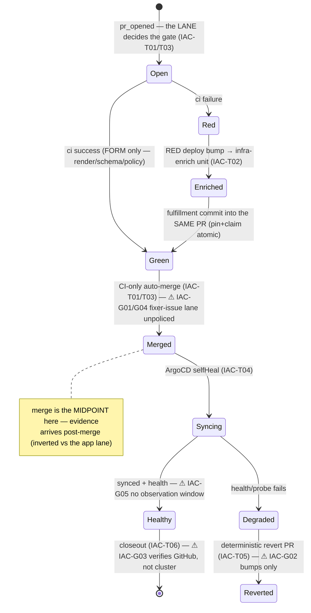

# -iac lane FSM — transitions, guards, gaps (GENERATED)

> **GENERATED by `devbox run merge-path-lint -- --write` from [`iac-lane-fsm.yaml`](iac-lane-fsm.yaml) — edit the YAML, never this file.**
> The lint greps every guard's code anchor on each run: a moved/deleted guard fails CI
> instead of silently un-guarding a transition. Design narrative: [`iac-lane.md`](iac-lane.md).

## The machine

## Transitions

| id | transition | owner | status | guards (anchored) | belts | incidents |
|---|---|---|---|---|---|---|
| **IAC-T01** | deploy bump auto-merges on CI (ADR-084) | app-repo deploy.yaml (bump PR, auto-merge armed) + required-checks ruleset | guarded | ✅ -iac repos opt OUT of required-approval BY DESIGN (CI gates the bump) (`homelab:tofu/github/variables.tf`) ✅ strict required ci check on the default branch (`homelab:tofu/github/repo_rulesets.tf`) | — | — |
| **IAC-T02** | RED bump → infra-enrich (typed delta, same-PR fulfillment) | scan ci-red-stale probe → infra-enrich class → coordinator item unit | guarded | ✅ scan routes RED -iac bump PRs to the distinct infra-enrich class (`homelab:agents/coordinator-scan.sh`) ✅ typed schema-delta detector (enrichment_needed bit) (`homelab:agents/infra-schema-diff.sh`) | — | — |
| **IAC-T03** | fixer-issue dispatch (the FU-106 re-opened lane) | scan queued-dispatch (fixerRepos predicate) → worker → PR | guarded | ✅ dispatchability is a claim predicate (fixer block present), never implicit (`homelab:agents/coordinator-scan.sh`) | — | 2026-07-27 sleep-iac#28 (first live dispatch: PR open→self-merge in 38s, zero review, .github/workflows edited — IAC-G01's origin) |
| **IAC-T04** | merged master syncs to the cluster | ArgoCD (selfHeal, app-of-apps) | platform-native | — | — | — |
| **IAC-T05** | Degraded after a deploy bump → deterministic revert PR | argocd-notifications → /deploy-degraded → auto-revert PR (FU-044 chain) | guarded | ✅ the revert chain (notification → sensor → revert PR) (`homelab:agents/coordinator/deploy-revert-argo.yaml`) | — | — |
| **IAC-T06** | merged closeout (C6) | scan merged-closeout clause → coordinator item unit | guarded | ✅ scan emits merged-closeout units (`homelab:agents/coordinator-scan.sh`) | — | 2026-07-27 sleep-iac#22 closeout verified deliverables+CI on GitHub while Gateway/Workspace reconciled unobserved (IAC-G03's origin — the outcome happened to be good) |
| **IAC-T07** | stack alert → the -iac repo is the ops surface | responder v2 (deterministic namespace→claim ownership lookup) | guarded | ✅ responder routes a stack alert to its -iac repo (ownership is a lookup) (`homelab:agents/coordinator/responder-argo.yaml`) | — | — |

## Gap register — known-missing guards

| id | gap | detail | disposition |
|---|---|---|---|
| **IAC-G01** | fixer-issue merge gate | Nothing stands between a worker's push and master on the fixer-issue lane (38s self-merge, sleep-iac#28) — and the fixer token carries workflows:write (composition, fleet#134 grant), so a worker can edit CI itself. Ruling 2026-07-27: the fix is NOT a human and NOT a blocking LLM review — it is IAC-G04's deterministic policy sentinel + IAC-G06's advisory lens; this gap closes when G04 does. | FU: FU-106 |
| **IAC-G02** | revert trigger scoped to deploy/* bumps | CLOSED 2026-08-02: the revert candidate is now ANY -iac merge (revert-* branches excluded — never revert a revert) within the window touching the app path (deploy-revert-argo.yaml); was deploy/* only. | FU: FU-106 |
| **IAC-G03** | C6 closeout verifies GitHub, not the cluster | CLOSED 2026-08-02: the merged-closeout play's -iac variant checks app Synced at/past the merge revision + Healthy + touched Workspace claims Ready before flipping (coordinator README step 1; loop SA granted read-only applications/workspaces). SLO-burn check rides FU-104's rules, not this play. | FU: FU-106 |
| **IAC-G04** | no tamper-proof policy check | In-repo CI runs the PR's own workflow code — a required check the PR can rewrite (the #28 workflows-edit made this concrete). The platform contract (ip-plan ranges, ADR-076 bucket ownership, tenancy boundaries, secret references-never-values, workflow-path rules, deletionPolicy guards) must be enforced by a CLUSTER-SIDE sentinel evaluating rendered manifests and posting a commit status the PR cannot touch (exporter/Argo Events shape, homelab-owned rules). | FU: FU-106 |
| **IAC-G05** | no observation window / progressive rung | Healthy is instantaneous — sync-succeeded is treated as done with zero traffic evidence. Rung 0 (sleep, now): ArgoCD PostSync smoke Job (curl healthz + one real read) so a bad deploy fails the sync loudly into the existing degraded path. Rung 1 (in-cluster): Gateway API weighted backendRefs (Cilium) stable/canary split. Rung 2 (edge): Cloudflare in front of all services — key-tier routing, weighted LB, shadow mirroring. Design: iac-lane.md §Progressive delivery. | FU: FU-106 |
| **IAC-G06** | advisory review lens absent | With no blocking review, nothing reads -iac diffs at all: an async post-merge lens (cheap grounding-tier model, FU-095 evidence class) reviewing merged -iac changes and filing findings as INERT issues — evidence generation, never a gate. | FU: FU-106 |

_States/axes: lane, ci, merge, sync, window, policy · events: 9 · transitions: 7 · open gaps: 6 (+0 accepted)_
