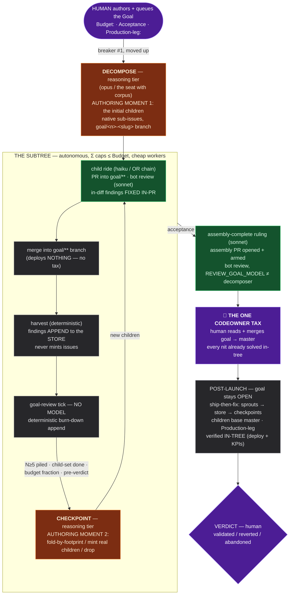

# Coordinator-authored issues — harvest, authoring, and the sprout index

**Tracked by:** FU-090. **Gate:** TICK-LOG §Loop-safety breaker #1.
**Relates:** FU-086/FU-087 (dispatch + dependencies), FU-044 (revert machinery), ADR-094.

Issue *authoring* has been a jail-LLM practice ([workflow.md](workflow.md) §Triggers emitter
table); the coordinator only filed issues inside meta-4 arbitration. That left a real hole: an
approved PR's `Follow-ups:` section — which the review rubric **requires** to contain issue-ready
bullets — had no owner and died in the review comment.

This document is the design for closing it, plus the accounting substrate the harvest turned out
to need.

## Breaker #1 is the gate for all of it

Every surface below produces **bot-authored, therefore INERT** issues: no `agent-fix`, no
`agent/queued`. A human labels, or nothing runs. That is loop-safety breaker #1 and none of these
legs retire it — leg (c) moves the breaker *up* to the goal issue rather than away.

⚠ **Read this together with §"Gate the merge, not the launch" below** (operator, 2026-08-05):
breaker #1 is a blast-radius control, **not** the security boundary. The boundary is CODEOWNERS at
merge time. Anything here that looks like an authorisation check is defence in depth and must not
be relied on as more.

The graduation knob for the HARVEST surfaces (**still not built**, verified 2026-08-05 — it exists
in NO XRD or Composition field, only in this paragraph): claim `issueAuthoring.selfQueue`, default
off, letting the coordinator self-label harvested issues, bounded by the existing breakers plus a
per-day rate cap. Flipping it is the operator's per-stack trust call, and it *does* retire
breaker #1 for that stack.

**Two surfaces queue without that knob, and both are deliberate — know which is which:**

- The **alert lane** (below): the responder's shell applies `agent-fix` (a diagnosis, inert);
  `agent/queued` is granted by the set-judged fix-debounce (2026-08-07 —
  [iac-lane.md](iac-lane.md) §"one root cause, N alert issues").
- **Leg (c)**: a goal's children are queued by the coordinator, authorised by the fact that a
  HUMAN queued the GOAL — breaker #1 moved UP, not away. That was PROSE until 2026-08-05 (the
  operator asked why circles queues issues with no knob enabled); the scan now **checks it,
  fail-closed**, refusing to emit `goal-decompose` when the goal's `agent/queued` was applied by a
  Bot, or when the actor cannot be read at all.
  ⚠ What the actor test can see: the loop writes as `homelab-agents-1234[bot]` (type `Bot`); the
  operator AND the jail session both write as the operator (type `User`), because the jail holds
  the operator's PAT. **That is correct, not a limitation — jail == human for this process**
  (operator, 2026-08-05). The test blocks THE LOOP from authorising its own goal, which is the
  risk worth blocking.

⚠ **The ALERT lane crossed this line differently** (superseded 2026-08-07 — the 2026-08-04
shell-selfQueue was replaced by the verdict/queue split): the responder's shell applies only
`agent-fix` (inert diagnosis); `agent/queued` is granted by the set-judged **fix-debounce**
(deterministic gates + a set-pass at ≥2 pending; pending set excludes every human-waiting label
since PR#243/#244). Mechanism: [iac-lane.md](iac-lane.md) §"one root cause, N alert issues". So
"bot-authored ⇒ inert" holds for the surfaces below; the alert lane queues through the debounce,
never the session.

## Gate the merge, not the launch — operator ruling, 2026-08-05

The doctrine that supersedes how the rest of this page reads. Written after the operator was asked
why circles queues issues with no `selfQueue` knob enabled:

> *"instead of not launching the issues I would rather gate the merges. The selfQueue knob is a
> good thing to have but it is pretty much worthless — if a GitHub App has `issues:write` for other
> reasons already then doing author==human type checks in some places of the process makes no
> sense; I'm sure the coordinator could tell an -iac worker to change the rule. CODEOWNERS is the
> better defense in the end."*

**Why launch-gating is weak.** Every author/labeller check sits *inside* the loop's own reach. The
App holds `issues:write` because it needs it for ordinary work, so "who applied this label" is a
question the loop can answer about itself, and any rule expressed as code in a repo the loop can
open a PR against is a rule the loop can propose changing. Defence that lives on the same side of
the boundary as the thing being defended is not defence; it is friction that reads like defence,
which is worse than none because it invites reliance.

**Why merge-gating is the real thing.** `CODEOWNERS` + branch protection decide **what lands**, and
that decision is made by GitHub, not by anything the loop runs. It is also the honest unit of risk:
the operator's stated risk model is that *"workers doing extra or bad WORK is fine; merges to master
are the only thing that matters."* A wasted ride costs pennies. A bad merge costs the platform.

**What follows for this page:**

- Breaker #1 and the `selfQueue` knob are **convenience and blast-radius controls**, not security
  boundaries. Keep them cheap. Do not add new author==human checks, and do not let existing ones
  grow into things that get relied upon.
- The one in `coordinator-scan.sh` (a Bot-queued goal may not decompose) **stays as defence in
  depth** — one API call, fails closed — with a comment at the site saying exactly this, so nobody
  mistakes it for the boundary. Retire it the day it costs more than it buys.
- **The target is a fully automatic chain**: `alert → issue → coordinate → fix → review → merge`,
  with no human in the middle, **and the merge gated by what the change actually touches**. Tier 1
  paths land on CI + review alone; an owned path stops and waits for a person. The path decides,
  not the provenance of the issue that started it.

That target is already partly real: the alert lane self-queues from the responder's shell
(§below), the fixer and reviewer are automatic, and the CODEOWNERS path tiers
([iac-lane.md](iac-lane.md) §The platform lane) are what decide whether the last step needs a human.
The remaining work is on the merge side — tier 1 dropping back to unowned once the IAC-G04 sentinel
covers homelab — **not** on adding more checks before the launch.

## The lineage contract — what being an EPIC means (operator ruling, 2026-08-19)

An **epic** is an issue whose native sub-issue tree bounds a body of work through its lifecycle.
Two KINDS exist — the **Goal** (ADR-102/106, cluster-autonomous, budget-gated) and the **stint**
([chainless-redesign §The jail stint](chainless-redesign.md), jail-seat, session-sized) — and
this section is the ONE home of the rules they share, so a lifecycle correction lands once
instead of twice in parallel (both 2026-08-19 pilot catches were corrected in stint prose while
ADR-102 already carried the Goal half). **Scope: issue LINEAGE and LIFECYCLE only.** Merge
mechanics (goal/** branches, the assembly PR, the codeowner tax, per-PR-to-master), budget/
sizing enforcement (`Budget:` gates vs the advisory `Size:` line), dispatch machinery
(checkpoints, the findings store) and verdict terminals are KIND rules and stay in their kind's
docs.

The epic rules:

1. **The tree is the bound.** Work and its defect tail live as native sub-issues of the parent;
   nothing from epic work outlives the parent unlinked.
2. **Originals vs sprouts.** The initial child set is distinguished from later arrivals;
   originals-done is the epic's MIDPOINT, never its close (the Goal calls the phase post-launch,
   the stint post-originals — one state, two names).
3. **Bind at filing, regardless of door.** A defect in the epic's deliverables parents into the
   epic when it is filed — whether it arrives via harvest, a design conversation, or an alert
   (the #600/#420 catch: it was filed standalone because it came through the design door).
4. **Defects never release.** Release-to-backlog is for work that merely fell OUT of the epic; a
   defect IN its deliverables binds and holds the parent open (the #540 catch).
5. **Single-parent absorption.** An existing issue absorbed by an epic keeps its origin parent
   (GitHub single-parent); the absorbing child carries the `Fixes` link, and the burn-down
   counts the child, not the absorbed issue (the #292 rule).
6. **Close = tree-empty**, at a final closeout/terminal — and the close IS the bound.
7. **The depth guard is an epic rule already**: the reviewer walks the native parent chain of
   any issue its PR closes and emits no `Follow-ups:` at depth ≥2 — implemented lineage-generic
   in `reviewer-session.sh`, so it fires for stint children exactly as for Goal children.

⚠ **`task/goal`-keyed machinery is GOAL-kind machinery by definition** (operator caution,
2026-08-19): the scan's goal clauses, budget walks and terminals key on that label, and a rule
implemented behind it is NOT automatically an epic rule — deciding whether one generalizes
requires the corpus read, never a relabel. The inverse guard already stands: a stint parent
NEVER wears `task/goal` (it would summon the Goal machinery at a container that has none of its
gates).

## Author at the last moment, queue at once (soft rule — operator, 2026-08-19)

An issue is for work that gets solved SOON: **create it at the last possible moment, and queue
it as soon as possible after creating it.** Future work — stint candidates, unlaunched Goals,
program tails — lives in the [ROADMAP work map](../../ROADMAP.md) (§The platform work map), not
on the board; a stint parent is authored when its session is next, a Goal at launch. Soft rule,
not a gate: the cost it prevents is board sediment (the motivating case: the Renovate Goal
homelab#502, authored fully-formed and then sitting behind five stints — closed back into the
map with its body preserved as the launch draft). Companion ordering rule, same ruling: **stints
before Goals**.

## Label semantics — `agent-fix` is SUITABILITY (ADR-109, 2026-08-17)

The label's one meaning, ratified after four readers had drifted to four
(the opt-in table / "adoption ends triage" / the responder's diagnosis / ¬agent-fix as the
jail-lane marker — no doc owned it): **`agent-fix` = "machine-doable; the loop MAY be given
this."** One bit. It says nothing about *when*, nothing about *whose*, and applying it promises
nothing. `agent/queued` is the only release valve; dispatch requires both (unchanged).
Consequences of reading it any other way, now retired:

- `agent-fix` without an `agent/*` state is **ordinary backlog** — a normal, legal, possibly
  long-lived state (oracle-fleet's `agent-fix + track/*` set is its designed use). Report
  surfaces render it as an **aggregate** (count + oldest age per repo), never per-issue nags.
  What #405 actually established is that the state had NO reader; the reader it needed is an
  inventory, not an anomaly line.
- The chainless charter's corpus-batch filter stops keying "jail-lane" on ¬agent-fix — a
  flagged-but-unreleased issue is also the operator's until queued.
- **Operator intent is never machinery state**: "no new Goals on stack X until Y" gates only
  operator actions (Goal launch is structurally human-only), so it lives as a meta-state row
  with an explicit un-park trigger — never a claim knob flip, never a label.
  `agent/blocked` stays strictly *technically blocked — a human must SOLVE something*.

**Who authors, who auto-applies, who guarantees queueing** (the full inventory — every
auto-apply surface carries a named queue-decider; the human surface deliberately has none):

| Author surface | Applies `agent-fix`? | Queue-decider |
|---|---|---|
| human / jail session (specs, triage, direction) | by hand (a suitability judgment) | none — backlog until the human queues (the inventory ages it) |
| responder (alert lane, IL-T03) | ✅ auto, by the SHELL, as diagnosis | ✅ fix-debounce set-pass (IL-T23–25) |
| goal checkpoint (mints, funded open goals) | ✅ auto | ✅ budget-gated mint queues in the same act; the right dies with the goal |
| harvest / janitor (master lane) | ❌ never (breaker #1) | n/a — 🌱-surfaced for human triage |
| retro | ❌ (files inert) | n/a |

The operator's who-acts view over all of this is **`devbox run board [-- <stack>]`**
(`agents/board.sh`, platform pilot): review queue · parks/latches · triage · verdicts due ·
the backlog aggregate. Deterministic `gh` reads only — a retrieval tool, not a corpus sitting.

## Leg (a) — follow-up harvest — BUILT 2026-07-27

The C6 / merged item session files each `Follow-ups:` bullet as an issue, with provenance links,
dependencies (FU-087 — **native `blockedBy` edges** since FU-111 retired the body line, §Dependencies
below) and the track label inherited.

Mechanism: the scan emits **`merged-closeout`** units for issues closed by a merged PR but still
`agent/in-progress` (21-day window, cap 3/repo/scan, `agent/error` excluded). The item session's
play (coordinator README §merged-closeout) is: verify the outcome on master → flip `agent/done` →
file each review `Follow-ups:` bullet as an inert issue → one closing comment. Verified empty-safe
on all three stacks.

**Visibility slice shipped 2026-07-18:** the scan reports 🌱 bot-authored issues lacking
`agent-fix` per repo, so harvested drafts surface for human triage instead of rotting. Since
2026-08-09 an issue whose blockers have all closed is PROMOTED out of that list into its own
🔓 UNBLOCKED-UNLABELED class — §Dependencies below.

**Consumers registered 2026-07-27:** the harvest is the birth path for the infra-fixer's
expand/contract debt tasks ([iac-lane.md](iac-lane.md) §rollout matrix, row d), and the goal-issue
shape of leg (c) is the FU-105 researcher's dispatch trigger.

## Leg (b) — spec-driven authoring

The ADR-094 janitor tick MAY draft issues from `specs/`/TRACKS gaps, under the same inert gate.

## Leg (c) — goal-budget decomposition — BUILT 2026-08-05

A human-authored **and human-queued** `goal` issue carries `budgetUSD` + acceptance criteria. Its
item session MAY author and queue child issues citing the parent, with **Σ(child estimator budgets)
≤ parent budget enforced in the LAUNCHER pre-flight** — deterministic, beside WIP=1, *never*
LLM-honored. The child-issue set is then the reviewable decomposition artifact: "review the result"
applied to planning. The scan surfaces children-of-closed-parents as orphans (the goal-drift belt).
Existing containment carries over unchanged (lane WIP, capacity gates, pod-name keys, FSM,
`agent/error`).

> **Operator 2026-07-24: not yet.** Rollout continues the old-fashioned way — human goal
> decomposition — until the current arc settles. Revisit when a real goal candidate appears.
> A prototype ran 3 days live during meta-9.

> **Operator 2026-08-05: un-deferred.** The revisit condition was met by circles#17 — a
> human-authored, human-queued goal (P0 MVP: bake + page, against a 15-page/91-requirement
> contract, with acceptance criteria and a suggested cap tier). Handed to a *builder*, because
> nothing in the machinery distinguishes a goal from a task, it produced an honest "analysed
> everything, built nothing" twice — and banked nothing between rounds. **No configured cap was
> near binding** (25 turns of 200, $0.06, 41k tokens into a 262k window): the lane was wrong, not
> the budget. That is the case for the clause below.

### Where it lives

| what | where | why there |
|---|---|---|
| trigger | `coordinator-scan.sh` — a new `goal-decompose` clause emitted **instead of** `queued-dispatch` | must branch BEFORE recipe selection, or the launcher FATALs on a missing `.agents/goal.yaml`. Priority slot in the clause list (~L729) |
| instructions | `agents/coordinator/README.md` — a new `## The goal-decompose clause` section | the item session already reads that file per `clause=`; a new play costs a README section, **not** a new role, image or recipe |
| discriminator | `task/goal` label **+** a `Budget: <USD>` body line | the platform's existing split: **labels route, body lines parameterise** (`Touches:`/`Depends-on:`/`Base:` grammar) |
| enforcement | `Σ(child estimator budgets) ≤ parent` in the **launcher pre-flight** | deterministic, beside WIP=1, never LLM-honored |

### Keeping the goal in view — the forest/trees rule (operator, 2026-08-05)

The failure this must not have: *decompose once, then wake only for sub-issues, and the goal is
forgotten.* Until 2026-08-05 that was **guaranteed** rather than likely: the harvest had been
**writing** sub-issue links (`POST …/sub_issues`) since 2026-08-02 and **neither
`coordinator-scan.sh` nor `agent-session.sh` read them back** — the lineage was write-only,
rendering in the GitHub UI and consumed by nothing. Rung 1 shipped the write, not the read. All
three legs below are now built; keep them that way, because each one silently degrades to the old
behaviour if its read is removed:

1. **The coordinator holds the goal, on every child unit.** The scan carries the parent id in the
   unit (a 5th field — FU-114 L3 widened it to 4 for the task class, same move). Any child's unit
   arrives as *"child of goal #N"* and the item brief re-reads the goal before acting.
2. **The worker gets a BOUNDED slice.** The launcher injects a `GOAL CONTEXT` block into the
   environment card from the goal — **Goal + Acceptance sections only**. ⚠ Injecting the
   whole parent re-imports the context cost decomposition exists to remove; that is precisely how
   circles#17 r1 died. Never the spec tree — children carry their own narrowed `Touches:` and cite
   their own spec rows. ⚠ **The goal is an ANCESTOR, not necessarily the parent** (homelab#367):
   this read was one hop until 2026-08-12, so every ADR-102 post-launch sprout — whose parent is
   the *bucket* — got the bucket's (nonexistent) Goal/Acceptance and dispatched goal-blind, the
   exact forgetting this leg exists to end. Same one-hop line fed the gate below; see leg (c).
3. **The goal is re-evaluated, not merely survived.** A `goal-review` clause fires when a child
   closes (not only when the last one does): re-read the goal's acceptance against what actually
   shipped, then close, author more children, or stop at the **retro checkpoint** (rung 3 — a
   human retro, never a reflex revert).

The division of labour follows the model-tiering rule: the **coordinator** holds the goal (strong
subscription model, full re-read); the **worker** gets a slice (cheap, budget-capped, bounded
context). Rung 4's sprout-RATE gauge is the health signal — *rate > 1 per run = diverging*.

**Operator rulings 2026-08-05:** (a) **both** discriminators — the `task/goal` label routes,
the `Budget:` line funds; (b) the parent goes to a **non-dispatchable tracking state** initially,
revisit later. Plus: *"there should be some kind of backstop on the goal also"* — nothing wakes a
goal on child traffic alone, so `goal-review` fires on EVERY child closure, and the residual
backstop (a goal whose children are all quiet) is the **meta-coordinator's** for now; the guard
gets designed from observed behaviour rather than guessed at.

### As built

| leg | where |
|---|---|
| `goal-decompose` trigger | `coordinator-scan.sh` — emitted instead of `queued-dispatch`, before recipe selection |
| both plays | `agents/coordinator/README.md` §`goal-decompose`, §`goal-review` |
| `task/goal` label | the claim taxonomy (Composition). ⚠ GitHub caps label descriptions at **100 chars** and `IssueLabels` is authoritative — one over-long description freezes the taxonomy for every claim-owned repo |
| bounded goal context | `agent-session.sh` reads the goal, injects **Goal + Acceptance only** |
| which ancestor IS the goal | `goal_resolve_ancestor` in `agents/goal-budget.sh` — ONE walk, both callers (launcher pre-flight + scan harvest), bound 6, stopping at a `task/goal` label **or** a machine-readable `Budget:` line. Added by homelab#367, which found the launcher reading one hop: a post-launch sprout resolved to its ADR-102 bucket, so the gate below read `no-budget` (off) while the goal sat `exhausted`, and the card came from an issue with no Goal/Acceptance in it |
| parent on child units | `coordinator-scan.sh` 5th unit field → `parent=<n>` in the item brief |
| Σ(child caps) ≤ `Budget:` | `agent-session.sh` pre-flight, over open AND closed children, summing `cap_usd` (what the key ALLOWS, not what it forecasts) |
| `goal-review` | `coordinator-scan.sh`, stateless: a child closed after the loop's newest comment on the goal |

Two traps found while building, both of the fail-open kind: `gh issue list` has **no `--argjson`**
(a jq flag) — behind a `|| echo '[]'` that made the budget gate pass everything; and `[ a \> b ]`
is a bashism that can invert the goal-review predicate under another shell. Both are now
sort-based / piped-to-real-jq, and a zero-children result says so aloud instead of failing open.

## The sprout index — the accounting substrate leg (c) was missing

Operator synthesis 2026-07-31, from the sleep harvest run. This is arguably the "real goal
candidate" leg (c) was waiting for.

**The insight:** the harvest tree already *is* an unbudgeted goal decomposition. What goal-budget
lacked was a **sprout index** — the lineage DAG (issue → PR → harvested child) carrying **depth and
breadth**.

The 2026-07-31 run showed the gap live, in both directions at once:

- With no depth-awareness the reviewer **harvests indiscriminately** — 3 of 5 sprouts were
  self-acknowledged noise (#93/#101/#102, closed).
- And it **defers a same-class-as-the-fix defect it should have completed in-PR** — #96, the 14th
  band column the #57 COALESCE fix missed.

Both failures are the same missing signal.

The 2026-08-08 oracle goal run added the goal-lane cost of the same gap: with harvests
auto-queued (`Base: goal/**` exception), a style-only reviewer comment became sprout #211 at
depth 3 (#177→#185→#208→#211), and **each cosmetic sprout merge moved the goal branch head and
DISMISSED the assembly PR's approval — three times** — so the churn was gating the goal's own
terminus. Meanwhile two real crash bugs (#193/#194) sat queued behind six cosmetics until the
operator's survey flagged them for a hand-pin. The depth-aware gate needs BOTH signals: depth
(≥2 = don't auto-queue) and the reviewer's own severity language (a comment the reviewer calls
style-only must not become queued work unasked). And the assembly merge left a THIRD residue:
auto-merge deleted the goal branch, so every still-queued sprout's inherited `Base: goal/**`
line pointed at a dead ref — seven bodies hand-stripped to the master default before the pinned
crash-bug rides struck on a failed fork. The assembly closeout should retarget (or drop) the
surviving sprouts' `Base:` lines as part of closing the goal.

### The rungs

1. **Structure the lineage as GitHub sub-issues.** Native parent/child gives the tree UI and the
   graph API for free. Today provenance is unparseable prose: *"Harvested from PR #X (issue #Y)"*.
2. **The harvest/reviewer gate reads depth + remaining budget.** Shallow + budget available →
   harvest a real deferral. Deep, or budget low → **fix-in-PR** and collapse the tail.
   Budget blown, or N levels without converging → the **terminal**.
   **The depth half SHIPPED 2026-08-05, in the REVIEWER** (`reviewer-session.sh`): it walks the
   native parent chain of the issue its PR closes and, at depth ≥2, is instructed to emit **no
   `Follow-ups:` section at all** — every finding either blocks (fixed in THIS PR) or is dropped.
   ⚠ It had to move there: the flag was previously applied at HARVEST time, which is too late by
   construction — the PR has merged, so "fix-in-PR" no longer exists and deferral is the only
   option left. The existing HARVEST BAR filters by QUALITY; this filters by POSITION, and they are
   independent. Validated on the chain that prompted it: openrouter-operator #21→#17→#14→#10 walks
   to 3/2/1/0, and #17 (depth 2) is the review that sprouted #21 — under this rule it emits nothing
   to harvest. The BUDGET half is separate and lives in the launcher (Σ child caps ≤ `Budget:`).
3. **The terminal is a RETRO CHECKPOINT, not a reflex revert** (operator ruling). It means "a good
   place to STOP and rethink": the goal was probably sound but unexpected complexity arose, so a
   **human retro** decides how to proceed — re-scope, collapse-in-PR, or, only in the extreme, a
   lineage-scoped revert via the FU-044 machinery.
4. **Surface it.** The sprout index plus a **sprout-RATE gauge** via the github-exporter (one
   poller) → Grafana node-graph + convergence trend. **Rate > 1 per run = diverging**; that is the
   health KPI.

### Down-payment shipped 2026-07-31

Prompt-only, no index yet — proving the #96/#92 mis-sorts are fixable from the diff alone:
`agents/reviewer-session.sh` gained a **complete-the-fix** narrow-blocking case and a **HARVEST
BAR** (inert / not-a-gap / won't-fix / style stay comments, never `Follow-ups:`).

**The structured sub-issue lineage SHIPPED 2026-08-02** (rung 1): the merged-closeout play
links each harvested issue as a native sub-issue of the ORIGINATING issue (PR provenance stays
in the body; failed link non-fatal + noted) with a ⚠ deep-sprout flag at depth ≥2 — API
round-tripped live before adoption. **Next rungs:** the exporter sprout-RATE gauge (walk
`parent`/sub_issues on the existing GraphQL walk) + the depth-aware harvest gate reading it.

## Touches: the declared footprint (ADR-097, 2026-08-03)

Every authored agent issue carries a **`Touches:`** body line — the expected write surface as
comma-separated paths/globs (`Touches: chassis/**, pyproject.toml`), same unbulleted body-line
grammar as `Depends-on:`. This is where lane knowledge lives now: the authoring LLM judges the
footprint ONCE, reviewably, at creation (sprouts inherit the parent's line and narrow it);
the scan enforces overlap deterministically at dispatch
([workflow.md](workflow.md) §Footprint hold — intersection rules, ceilings and the
escaped-diff belt live THERE). Authoring-side semantics: **omitting the line is safe and means
exclusive** (classic WIP=1); a worker discovering mid-ride that it needs paths outside its
declaration files a new issue for the owning concern (TRACKS rule 2).

⚠ RETIRED 2026-08-18 (ADR-097 addendum): **a `Touches:` never declares `agents/replay/**` at
all** — the replay tree is exempt from footprint semantics (stripped from the intersection,
never an escape; `agents/footprint.sh` `fp_replay_exempt`). The rule this paragraph used to
carry — a ratchet clause file in the footprint forces an unsatisfiable declaration without the
replay tree (homelab#270/PR#275; PR#547 was the same class as a governance block) — is
dissolved rather than enforced: the ADR-103 ratchet still compels the replay TOUCH in the PR
(`.github/workflows/ci.yaml`, the `clause=` grep); only the declaration ceremony is gone. A
replay path in a `Touches:` line is harmless dead weight, not an error.

⚠ **A `Touches:` landing on a `pin-only-lint` GUARDED file is undeliverable by a PR at all** — those
files take only a pin line, so the scan reports the issue instead of dispatching it
([workflow.md](workflow.md) §Footprint hold, the static intersection). Author around it: keep the
guarded edit out of the issue and hand that part to the operator (a push to master, CODEOWNERS
§Carve-outs), or split it into its own issue that says so. #299 is what it costs otherwise — a full
round to discover it, and the deliverable still needed a human.

## Base: the declared base branch (2026-08-05)

An issue whose work must be built on an **unmerged branch** carries a `Base:` body line, same
unbulleted grammar as `Touches:` and `Depends-on:`:

```
Base: research/issue-1-weave
```

**Absent means master**, so every issue filed before this reads exactly as it did. Present, the
LAUNCHER (not the dispatcher — dispatch params are launcher-owned, ADR-094) clones and forks from
that branch and tells the agent in the env card to `gh pr create --base <branch>`. `--ref` still
overrides an explicit operator dispatch.

### The `goal/**` convention (operator ruling, 2026-08-05)

A stacked base is named **`goal/<issue>-<slug>`** — it is the integration branch of the GOAL whose
children merge into it (`goal/17-p0-mvp`). Three prefixes, deliberately disjoint:

| prefix | what it is | protected? |
|---|---|---|
| `fix/**` | an ordinary ride's head branch | no |
| `research/**` | researcher arm outputs, pushed to DIRECTLY, human-gated by being un-armed | **no — a ruleset here would gate the arms' own pushes** |
| `goal/**` | a goal's integration base; children merge INTO it | **yes** |

**`goal/**` is protected, and that is what makes feature→goal automatic.** The original rule was
"a declared `Base:` never arms auto-merge", which coupled two different things: *don't let stacked
work reach master by itself* (right) and *don't let a child merge into its own goal branch* (over-broad
— it also cost the reviewer's verdict, since `review-reflex.sh` only reviews ARMED PRs). Operator
ruling: **feature → goal is fine to automate; goal → master stays human.**

⚠ **The protection is a PRECONDITION, not a nicety.** GitHub's auto-merge waits on
branch-protection conditions; with none, arming a PR merges it **on open** — no CI, no review.
Verified before the flip: circles' three rulesets all targeted `~DEFAULT_BRANCH` only, so the
stacked base had no rules at all. `tofu/github/repo_rulesets.tf` now includes
`refs/heads/goal/**` in both `required-checks` and `required-approval`, so a child PR waits for
`ci` + one approving review exactly as a master PR does. **Applied and verified 2026-08-05**:
`GET /repos/…/rules/branches/goal%2F17-p0-mvp` returns `pull_request` + `required_status_checks`.

**Arming is keyed on the `goal/` PREFIX, not on "is this master".** Both the launcher
(`agent-session.sh`) and the re-arm belt (`review-reflex.sh` C9) arm a PR whose base is the repo
default **or** matches `goal/*`; every other non-default base still refuses. That is deliberate and
should not be relaxed to "any stacked base": the prefix is the only thing that carries the ruleset,
so widening the match without widening the protection re-creates merge-on-open.

⚠ **Renaming a base branch closes the PR whose HEAD it is.** Learned the hard way migrating
`research/issue-1-weave` → `goal/17-p0-mvp`: GitHub retargets PRs where the branch is the BASE
(#21, #24 moved cleanly) but CLOSES the one where it is the HEAD — circles#16, the weave PR itself,
reopened as #25 with identical content. `Base:` body lines are text and do not follow a rename
either; they need editing (#17/#18/#19/#22/#23).

Who writes the line: the issue author, at authoring time, like every other body line — and since
authored issues are inert until a human labels them (breaker #1 above), a wrong `Base:` is caught
in the same read that adopts the issue.

Why a body line and not a label: the value is DATA (which branch), and labels cannot carry it —
the same argument as `Touches:`. First use: circles#17/#18/#19 against the woven spec tree in
circles#16.

### ⚠ A child cannot close itself — FU-143

GitHub honours closing keywords (`Fixes #N`) **only when the PR merges into the DEFAULT branch**. A
goal's child merges into `goal/**`, so the keyword is inert and the issue stays OPEN and
`agent/in-progress` with no open PR. Three things break at once, and they are not obvious:

1. **C4/C5 re-dispatches** a ride onto already-merged work (in-progress + no open PR = abandoned).
2. **`goal-review` never fires** — it triggers on a child CLOSING.
3. **Siblings gated by `Depends-on:` never unblock.**

`merged-closeout` (C6) cannot rescue it: C6's own input is `gh issue list --state closed`, so an
issue that never closes is invisible to it. Until FU-143 lands, **the meta-coordinator closes a
merged child by hand** (`agent/done` + close), which is what unstalled circles#22 on 2026-08-05.

⚠ This is the MIRROR IMAGE of agent-runtime#32, where the hazard is a stacked PR closing its issue
too EARLY. Same GitHub rule, opposite handling — do not resolve one by reverting the other. The
reconciling invariant: **an issue closes when its work lands on the branch its `Base:` line
declares as its definition of done** — master for an ordinary stack (#32: don't close early),
`goal/**` for a goal child (here: close on the goal-branch merge). One rule, two instantiations.

**The implementation contract** (the tracker points here; assembled 2026-08-06, walked against the
live clauses — ship 1–6 as ONE unit, before circles#29's first child merges. **Points 1–6 shipped
2026-08-06, `e66b421`** — scan + play, fixture-proven, live-scan clean; the same commit revived
the changes-requested clause, dead since `671a053` scoped it on an unfetched `author` field.
Point 7, the merge doorbell, remains):

1. **C6 widened AND `Base:`-keyed**: also match an OPEN issue with a non-terminal `agent/*` label
   whose referencing PR MERGED into the base its own `Base:` line declares — `goal/**` only,
   NEVER "any non-default base" (that recreates #32's early close on ordinary stacked PRs, and it
   is the same doctrine as arming: the `goal/` prefix is what carries the ruleset).
2. **C4/C5 excludes the same set in the same commit.** Its abandoned-probe reads OPEN PRs only, so
   a merged-into-goal PR looks abandoned; `c4c5-redispatch` OUTRANKS `merged-closeout` in the
   dispatch priority, so without the exclusion the widened C6 unit is starved every scan while
   merged work gets re-ridden.
3. **The play verifies against the GOAL branch** (not master CI, not ArgoCD) and runs the FULL
   closeout: flip, close, harvest. The interim hand-close (`agent/done` + close) suppresses C6
   entirely (`agent/done` is excluded from its predicate) — #22/#23's review `Follow-ups:` were
   never harvested; that silent loss is part of what the fix removes.
4. **Harvest copies `Base:` from the originating child** — a goal-lane sprout's code exists only
   on the goal branch. On the goal's close/merge, retarget surviving sprouts to master (branch
   auto-delete kills their base).
5. **Goal-lane sprouts are QUEUED at harvest**, not inert — next section.
6. **`goal-review` reads DESCENDANTS, not direct children** — the same bug-shape the budget gate
   already fixed in `agent-session.sh` (direct children [14,15] vs actual descendants
   [14,15,17,18,21]): a sprout at depth 2 closing must re-fire the predicate, and "goal met" must
   see open sprouts in the subtree.
7. **Only after 1–6**: the `pull_request: closed && merged` workflow POSTing `/coordinate`
   (`383f5bb`) — before C6 is widened, a merge notification has nothing to trigger.

#### ⛔ The soak FAILED on its first child (2026-08-06) — the input, not the logic

circles#36 merged into `goal/29-p0-complete` at 09:27:44 **citing only its sibling `#31`, never its
own issue `#30`**. Point 1 matches a merged PR into the declared base **whose body cites the
issue**, so `ghit=0`, #30 never entered `c6g`, and point 2's exclusion — which keys on that same set
— had nothing to exclude. C4/C5 then read `agent/in-progress` + no open PR as abandoned and
dispatched a ride onto already-merged work. The point-7 doorbell fired correctly throughout.

**Points 1–7 are implemented correctly. The assumption they rest on is that a PR names its issue,
and nothing enforced it.** On a `goal/**` base the closing keyword is inert, so nothing even
motivates the model to write one. That is `agent-runtime#32`, open since before this run and
correctly predicting the cost — *"duplicate dispatch on a goal issue costs a whole ride"*. FU-143's
goal lane had an **undeclared dependency** on it.

⚠ **Nothing can recover the link after the fact.** GitHub holds no relation between #30 and #36 —
no closing keyword, no bare mention, therefore no cross-reference event either. Do not try to
reconstruct it from branch names (`fix/p0-bake-config-model` carries no number) or from timing
(two children can merge in one window).

**So the scan stopped guessing** (`12e7fcf`): a goal-based `agent/in-progress` issue with no open PR
and no citing merged PR is **held out of C4/C5 and reported** under ⛔, never re-dispatched. The
asymmetry is what decides it — holding costs one manual close; guessing costs a duplicate ARMED PR
onto a protected goal branch that auto-merges. Ordinary issues are untouched.

**That is containment, not the fix.** The fix is `agent-runtime#34` (finalize prepends
`Implements #<n>` when the body does not already match) and it only takes effect once the
`agent-base` image is rebuilt and `AGENT_BASE_IMAGE` re-pinned in homelab. Re-soak after that.

#### ⛔ The SAME citation then fired C6 the other way (2026-08-06, ~10:57Z) — `e704c36`

One bad citation did **both halves of the damage**, and the second half is the dangerous one.
Because #36's body says *"that's the sibling issue (#31)"*, the moment **#31** was un-parked and
re-queued, C6's goal-child leg evaluated `ghit>0` (a merged PR into `goal/29-p0-complete` "citing"
#31) and `gref=0` (its ride had not opened a PR yet) — and dispatched **`merged-closeout` for #31
while #31's own ride was Running**. Had it completed, it would have flipped `agent/done`, CLOSED
the issue, fired `goal-review`, and unblocked `#32` → `#18`/`#19` on **work that does not exist**,
while the live ride's PR arrived orphaned against a closed issue.

**Root cause: a bare `#<n>` cannot distinguish "the PR that IMPLEMENTS this issue" from "a PR that
NAMES it as a sibling seam" — and #29's decomposition RULES REQUIRE seams pinned naming the
producing/consuming sibling.** So this is systematic for every goal child, not a fluke of one
model's phrasing. The hazard was predicted in `meta-state.md` for the `gref` (open-PR) side, where
the cost is a starved closeout; nobody looked at the `ghit` (merged-PR) side, where the cost is a
false completion. **When a probe can err in two directions, price both — the asymmetry decides the
predicate.**

Fixed by requiring a **strong link** — `implements|closes|fixes|resolves` + `#<n>` — exactly the
line `agent-runtime#34` makes `finalize` guarantee, so the predicate MEETS that fix rather than
racing it. Until that image ships nothing matches here and children are hand-closed (unchanged from
the containment above), and every held child is now REPORTED under ⛔ rather than silently dropped.

⚠ **The `gref` side is deliberately still a bare mention.** Its failure direction is *hold*, which
is the safe one. Narrowing both at once during a live soak would change two variables under test.

⚠ **The item session's own live-state re-read caught the stale dispatch** (*"Exiting clean, no
writes made"* — the FU-121 belt), on both the 10:57Z and 11:00Z ticks. That belt is an LLM
judgement, not a guarantee, and it burns a session per firing. **A belt is not a guard**: it is
evidence the guard was missing, never a reason to skip building it.

### The goal lane owns its sprouts — no selfQueue (operator ruling 2026-08-06)

The 🌱 inert-until-human-triage gate (loop-safety breaker #1) protects the **master lane**, where
a queued issue becomes a bot-approved auto-merge landing straight on master — per-issue triage is
the only human gate that lane has. The goal lane's human gates sit at the **boundary** instead: a
human queues the goal (fail-closed actor check at decompose) and a human merges the assembly PR
(codeowner gate on `/specs/` + OrgAdmin merge — the operator: *"I don't want to be involved in a
goal's development until the final PR is ready"*). Inside that boundary the subtree is autonomous
and BOUNDED: Σ descendant caps ≤ `Budget:` (launcher pre-flight, over descendants), the reviewer
emits no `Follow-ups:` at depth ≥2, and nothing reaches master except through the assembly PR.

So a sprout harvested from a goal child's review is **queued at harvest** (`agent-fix` +
`agent/queued`, `Base:` inherited, sub-issue lineage as before) — ordinary subtree work.
Per-issue triage inside a goal would put the operator back in the loop the lane exists to remove.
The claim's `selfQueue` knob is NOT the mechanism and gains no reader here — it exists only in the
responder lane (alert→fixer, `responder-argo.yaml`); for goal sprouts there is nothing for it to
protect, since the decomposer already queues children under the same authorization.
⚠ Master-lane harvests STAY inert — do not generalize this ruling; the two lanes differ exactly
at the merge boundary.

### Who updates what when a branch moves — the two-hop cascade

⚠ The original note here said *"the updater needed no change — a stacked PR is excluded twice over,
neither based on master nor armed."* **Half of that is now false**: since 2026-08-05 a `goal/**`
child IS armed. Corrected:

```
master
 └── goal/<issue>-<slug>        PR: goal → master      draft, NEVER armed
       ├── fix/<slug>           PR: fix  → goal        armed
       └── fix/<slug>           PR: fix  → goal        armed
```

**A commit on master does not reach the children.** It makes only the *goal → master* PR BEHIND;
the children's base has not moved. The children go BEHIND only when the GOAL BRANCH itself moves —
which happens when a sibling merges into it, or when someone updates it from master.

| hop | which PR | scheduled `update-pr-branch.yml` | the scan's FU-124 nudge |
|---|---|---|---|
| master → goal | `goal → master` | ✗ requires `require_auto_merge_enabled`; this PR is never armed | ✗ same armed requirement |
| goal → fix | `fix → goal` | ✗ hardcoded `base: master` (the action takes a literal branch, not a pattern) | ✅ **no base filter — covers any armed BEHIND PR** |

So **the top hop is manual and the bottom hop is automatic.** Updating the goal branch from master
is a human act (`gh api -X PUT repos/…/pulls/<goal-pr>/update-branch`), which is defensible — master
churn should not continuously rebase an integration branch under review — but it is a real step, and
forgetting it is how a base-side fix fails to reach the children. It bit exactly once: the CI-trigger
fix landed on master and the children could not see it until the goal branch was refreshed, because
`pull_request` evaluates the workflow from the merge of head into BASE.

⚠ The bottom hop only works because the FU-124 nudge was REPAIRED on 2026-08-05: it selected on
`mergeStateStatus`, which was never in its `--json` field list, so jq read null and it had never
fired since it was written. Do not remove it assuming the scheduled workflow covers this — the
scheduled one cannot, and its cadence differs anyway (`*/15` for master vs `*/30` for the scan).

**The coupling to remember:** a required check on a branch pattern is only real if the workflow
producing it TRIGGERS on that pattern. Requiring `ci` on `goal/**` while the workflow said
`branches: [master]` left an APPROVED, armed PR permanently BLOCKED on a check that could never
report. The ruleset and the trigger have to move together — and the trigger has to reach the goal
branch, not just master.

## Dependencies: native `blockedBy` is the only reader (FU-111 — retired the body line 2026-08-07)

Authoring a dependency = **create the native edge** (verified live: create, cross-repo, list-ride
all work — `gh api -X POST repos/<owner>/<repo>/issues/<n>/dependencies/blocked_by -F
issue_id=<the BLOCKER's numeric id>`). **The `Depends-on:` body-line reader is RETIRED
(2026-08-07)** — the migration completed once native edges were observed flowing under the App
token in real scans (circles #30→#31→#32: App-authored edges, full blocked→unblocked→closed
lifecycle in dependency order; the FU-108 probe-that-looks bar). The one open body-line holdout,
oracle-fleet#84, was migrated to a native edge before the reader was removed. Only the native
edge gates now; a body line is inert prose. Cycle detection also reads native `blockedBy`
(the dep's nodes pointing back), no longer the dep's body.

**Authoring a sequenced issue — the two lines that must both be true** (homelab#226, after the
2026-08-09 miss below):

1. The dependency is a **native edge**, created with the `gh api` call above. Not a body line, not
   a sentence in the description, not "filed behind #215" in the filing session's head.
2. The issue carries a **label** — even `agent-fix` alone, unqueued. An unlabelled issue is
   invisible to every dispatch clause by design (breaker #1), and until 2026-08-09 it stayed
   invisible after its blockers closed too.

Both are now CHECKED rather than asked for, in `agents/coordinator-scan.sh` (report-only, replayed
by `agents/replay/fixtures/depends-on-retired-format` and `…/unblocked-unlabeled-*`):

| Clause | Fires on | Says |
|---|---|---|
| ⚠ **RETIRED FORMAT** | any open issue whose body carries a line-anchored `Depends-on:` (bulleted form included) | the line gates nothing — re-author it as a native edge, then delete it |
| 🔓 **UNBLOCKED-UNLABELED** | an issue >24h old, no `agent*` label, ≥1 blocked-by edge, **all** of them closed | the gate you were waiting on is gone and nobody has triaged this |

**The miss they were built from, 2026-08-09.** oracle-fleet#225 + oracle-iac#322 (the delta-job
deployment) were filed on 2026-08-08 deliberately unlabelled, sequenced behind oracle-fleet#215 —
with a `Depends-on:` body line written the day *after* FU-111 retired its reader. #215 closed at
04:23Z; nothing fired for 12h, until the operator asked. Two failures, one of each kind: a
dependency written in a dead format (so it could never fire on blocker close), and a resolved gate
that no clause was watching (the needs-meta `unlabeled >24h` clause covers PLATFORM repos only, and
the 🌱 slice reports a stack issue identically before and after its blockers close).

🔓 is **report-only**, and that is not a gap to close later: the FU-090 human gate is the point.
What was missing is visibility of a resolved gate, never permission to walk through it. It is also
**not author-filtered** — the 🌱 slice is bot-only, which is exactly why a jail-authored chain was
invisible to it, and an author allowlist would re-narrow the same way one ring out. The blocked-by
requirement is what keeps it quiet instead: an issue that never had a blocker never appears.

## Why sub-issues here and not elsewhere

The scheduler consumes **semantics, not decorations** (recorded during the FU-110 mechanism
review): blocking = native GitHub dependencies (FU-111); operator preference = the pin; grouping
and reporting = milestones and **sub-issues** — which is exactly what lineage is. Sub-issues were
parked "until board scale pays"; the sprout index is what makes them pay.

## The goal container — lifecycle v3 (ADR-102, 2026-08-09)

Supersedes the goal-half of this doc's earlier close semantics (harvest-time queueing after
close, IL-G04's unbuilt gauge, the retarget-to-master drift). Validated retroactively against
circles #17→#29 (the machine ruled #17 "goal met" 100 minutes before the operator refuted it and
rebuilt from the contract — the exact gap this closes) and oracle-fleet goal-174 (19 sprouts,
3 generations, still growing 34h post-close with nothing owning the tree).

**The invariant: every dispatchable issue belongs to a goal; every goal has ONE machine-parsed
`Budget:` line.** (One line only — #29 carried `€12` in prose and `$16` in the footer; the
machine line is the truth, prose references it.) Two new template lines: `Verdict-authority:
human | kpi` and `Production-leg:` (what "done means deployed" means for THIS goal — a deploy
surface, an operator live-probe, or an explicit evidence-in-lieu statement; a goal with no
production leg cannot claim a terminal verdict, only assembly-complete).

**Merge is a midpoint.** At assembly merge the goal enters POST-LAUNCH: a post-launch sub-issue
is created under the goal and becomes the harvest target for every sprout from the goal's
descendant PR reviews (never master-limbo). Post-launch children base master (the goal branch
dies at the squash — goal identity is the issue + budget + KPI watch, not the branch). The goal
keeps shipping at its own pace: bunch sprouts into a fix wave or ship singles, drawing the SAME
budget via the existing launcher pre-flight (Σ child caps ≤ budget, counting closed children,
now spanning post-launch work).

**The four machine-read lines** (built homelab#208 — `agents/coordinator-scan.sh` §goal lane, and
each is read by a predicate, so a typo is a transition that silently never fires):

| Line | Where | Read by |
|---|---|---|
| `Budget: <n>` | the goal body | launcher pre-flight + the harvest gate (`agents/goal-budget.sh`) |
| `Verdict-authority: human \| kpi` | the goal body | the terminal gate — only `human` is implemented; `kpi` is refused and reported |
| `Revert: <pin rollback \| revert commit>` | the goal body, added when you roll back | the `goal/reverted` terminal's audit comment — **never guessed**; an absent line is stated plainly instead of invented |
| `Assembly-for: #<goal>` | the ASSEMBLY PR body, line-anchored | the post-launch transition. **Not `Fixes`** — a closing keyword would close the goal at the midpoint, which is the #17 bug |

The transition also keys on the assembly PR having a `goal/**` **HEAD**. Children have a `goal/**`
BASE; the direction is the whole difference, and keying on a bare `#<n>` mention instead would
announce a launch on the merge of the goal's first child (the circles#36 sibling-citation shape,
one lane over). A merged `goal/**` PR that only mentions the goal is HELD and reported.

**Terminals** (the only ways a goal closes): `VALIDATED` — the production KPI window (or the
human verdict-in-lieu) confirms the idea; `REVERTED` — production refutes it; the goal rolls
back its own changes (pin-rollback first, `git revert` of the assembly squash when master must
be clean — the squash boundary IS the revert unit) and closes successfully-refuted; **its
descendant tree dies with it**; `ABANDONED` — budget exhausted pre-verdict, operator decides
refill-or-close. The goal-review clause verdict is renamed **assembly-complete** — it measures
"built as specified", never "idea validated" (the #17 lesson).

The three verdict LABELS are applied by the goal's verdict authority and the loop only reacts to
them: it refuses a Bot-applied verdict, and refuses one it cannot attribute at all (fail-closed —
this transition closes a goal and, on revert, its whole tree, and the App holds `issues:write`).
Machine authority is deliberately unbuilt here: `Verdict-authority: kpi` is refused with a report
line until the KPI unit lands as its own gateway-gated oracle-side issue.

**Self-queue**: harvest may self-apply `agent-fix`+`agent/queued` ONLY for sprouts parented
into an OPEN goal with budget remaining; the right dies with the goal. Bot-authored issues
outside any goal stay inert behind breaker #1 / FU-090 as before.

**Cross-goal movement**: mid-flight is PULL-only. A goal (or its sessions) may label an issue
`goal/donatable` — the flag transfers NOTHING (the issue stays in the donor's burn-down and
budget accounting, so flagging buys the flagger no relief). Transfer happens when the RECIPIENT
goal's coordination pulls it into its own sub-issue list, citing the recipient charter line that
makes it in-scope; the pull re-estimates against the recipient's budget. One pull per issue
between human reviews — a second hop needs the close sweep or a human. Batch re-homing is legal
only at the close sweep (the accountable moment). Between goals, the durable transfer medium
remains specs/evidence, not issue-moves (#17→#29 moved zero issues and everything of value).

**Convergence is a number** (supersedes IL-G04): per-goal panel — budget spent/remaining, open
descendants, sprout inflow vs fix rate, verdict state. A goal whose tree grows while its budget
drains is visibly diverging; the panel doubles as the goal registry ("what goals ran, with what
verdicts, at what cost" — a query, not archaeology). **Built (homelab#209)**: the `goal_*` series,
the `goal_spent_usd` join and the Grafana `agent-goals` panel — series list, spend accounting and
the two read-honesty signals live in
[observability-and-retro.md](observability-and-retro.md) §Part A‴.

Implementation: the harvest/closeout clause changes ship WITH executed replays (ADR-103 —
they are exactly the clause class that produced homelab#198/#204).

## The v1.2 lifecycle (ADR-106) — the big picture

One mode (feature goals), phase-keyed models, two authoring moments, one codeowner tax. The
per-closure tick costs zero tokens; the reasoning tier runs only where work is CREATED. This
diagram is the design view — the lint-checked FSM follows when the v1.2 machinery builds
(Bucket A4).



## Goal lane versions — which design had which problems

The lane redesigns wholesale (the scout's §M7 v1/v2/v3 pattern), so its history is versioned:
a **major.minor bump per design generation**, each row naming the era's exemplar goals, its
defining decisions, and the *measured* problems that killed it — so a recurring symptom can be
dated to the design that produced it instead of being rediscovered. Convention: bump the minor
for machinery redesigns inside one lifecycle model, the major if the lifecycle itself changes.
Add the row in the same commit as the superseding decision.

| version | era / exemplars | defining design | measured problems (evidence) | superseded by |
|---|---|---|---|---|
| **v1** | 2026-08-05..08 — circles#17→#29, oracle-fleet goal-174 | FU-090 leg (c) + `Base: goal/**` branches; close = "goal met" ruling | machine-ruled "met" 100 min before operator refutation (#17); 19-sprout tree growing 3 generations 34h post-close (goal-174); `Base:` rot + self-queue outliving the goal (the 2026-08-09 census) | ADR-102 |
| **v1.1** | 2026-08-11..12 — homelab#278 (the FU-165 pilot) | ADR-102: budget-funded container, post-launch bucket, midpoint merge, human verdict terminals | bucket flattens the derivation DAG (2 vs 5 generations); worker-findings inflow ungated (52 edges, all worker/ride-authored); per-event cadence (21 rulings, 46 singleton mints); `Touches:` fence ~7× against small folds; dispatcher-bound throughput (queue 3,550 min vs pod 605, 361 min starvation); no consumer for goal-thread operator directives — all in [`../spikes/goal-lane-v1.1-fu165-pilot.md`](../spikes/goal-lane-v1.1-fu165-pilot.md) | ADR-106 |
| **v1.2** | design ACCEPTED 2026-08-12 (ADR-106); build = Bucket A4/A2 + the next platform Goal | FU-168 (ADR-094 concurrency + ADR-097 fence, numbers decide) · #295 bucket semantics · typed findings disposition · §M10 checkpoints · FU-166(b) · **stack-scoped goals** (operator, 2026-08-12: the tree spans the claim's repos incl. `-iac` — a Goal belongs to a STACK; v1.1 proved cross-repo lineage/budget/ride on ONE agent-runtime child, but sibling repos have no merge doorbell and `-iac` descendants were never exercised, so "done means deployed" stops at the app-repo merge everywhere homelab isn't its own -iac) | — | — |
