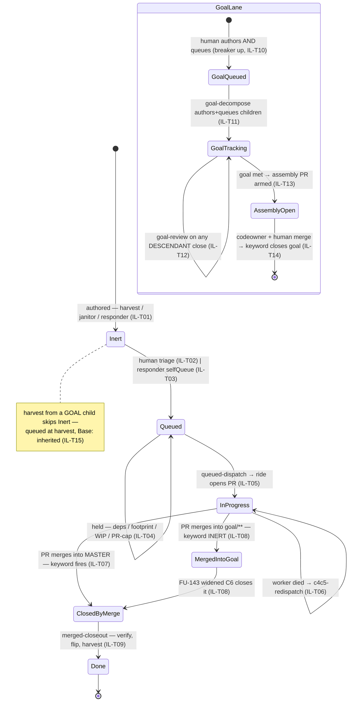

# Issue lifecycle & goal lane — transitions, guards, gaps (GENERATED)

> **GENERATED by `devbox run merge-path-lint -- --write` from [`issue-lifecycle-fsm.yaml`](issue-lifecycle-fsm.yaml) — edit the YAML, never this file.**
> The lint greps every guard's code anchor on each run: a moved/deleted guard fails CI
> instead of silently un-guarding a transition. Design narrative: [`issue-authoring.md`](issue-authoring.md).

## The machine

## Transitions

| id | transition | owner | status | guards (anchored) | belts | incidents |
|---|---|---|---|---|---|---|
| **IL-T01** | authored inert (master lane) | merged-closeout play (harvest) / janitor tick (spec-gap drafts) | guarded | ✅ the play forbids self-labeling (loop-safety breaker #1) (`homelab:agents/coordinator/README.md`) ✅ the scan surfaces untriaged bot-authored issues every pass (`homelab:agents/coordinator-scan.sh`) | — | 2026-07-31 sleep harvest: 3 of 5 sprouts were noise — the triage gate is where they died |
| **IL-T02** | human adoption | the operator | report-only | — | — | — |
| **IL-T03** | responder selfQueue (alert lane) | responder-argo shell (not the session) | guarded | ✅ the three deterministic gates label from the SHELL (`homelab:agents/coordinator/responder-argo.yaml`) | — | — |
| **IL-T04** | queued but held | coordinator-scan queued clause | guarded | ✅ dependency gate (FU-087) — blocked issues report, never dispatch (`homelab:agents/coordinator-scan.sh`) ✅ ADR-097 footprint hold — declared Touches: intersect ⇒ held (`homelab:agents/coordinator-scan.sh`) ✅ repo WIP ceiling (ADR-097 hard max) (`homelab:agents/coordinator-scan.sh`) | — | — |
| **IL-T05** | queued-dispatch | scan (schedules ONE unit) → coordinator item session (judges) → launcher (opens the ride) | guarded | ✅ the queued-dispatch unit rides the priority list (in-flight recovery first) (`homelab:agents/coordinator-scan.sh`) ✅ launcher dispatch idempotency — the pod name IS the (task, round) key (`homelab:agents/agent-session.sh`) ✅ a task/goal issue routes to goal-decompose, NEVER to a worker recipe (`homelab:agents/coordinator-scan.sh`) | — | — |
| **IL-T06** | abandoned in-progress → c4c5 re-dispatch | scan C4/C5 clause | guarded | ✅ the FU-143 exclusion — merged-into-goal is finished work, not abandonment (`homelab:agents/coordinator-scan.sh`) ✅ agent/error invisible to the clause (FU-069 breaker) (`homelab:agents/coordinator-scan.sh`) | — | 2026-08-05 circles#22: pre-FU-143, C4/C5 re-rode a merged child — breakage #1 of three |
| **IL-T07** | close by master merge | GitHub (closing keyword) | github-native | ✅ the goal-review play writes Fixes #<goal> into the assembly PR body (`homelab:agents/coordinator/README.md`) | — | — |
| **IL-T08** | close by goal merge — FU-143 widened C6 | scan detection (Base:-keyed) → merged-closeout play closes the issue | guarded | ✅ Base:-keyed detection — goal/** only, never any non-default base (the #32 mirror) (`homelab:agents/coordinator-scan.sh`) ✅ the play CLOSES the still-open issue (re-fires goal-review, unblocks siblings) (`homelab:agents/coordinator/README.md`) 🔗 merge doorbell: a merged circles PR rings /coordinate (was: wait for the */10 cron) (`circles:.github/workflows/coordinate-doorbell.yaml`) | — | 2026-08-05 circles#22/#23: closed BY HAND (agent/done+close) — which also silently skipped the harvest (C6 excludes agent/done) |
| **IL-T09** | merged-closeout — verify, flip, harvest | scan merged-closeout clause → coordinator item session | guarded | ✅ scan emits merged-closeout units (goal children first, shared cap 3/repo/scan) (`homelab:agents/coordinator-scan.sh`) ✅ goal children verify against the GOAL branch, not master/ArgoCD (`homelab:agents/coordinator/README.md`) ✅ goal closeout retargets surviving sprouts to master (their base dies with the branch) (`homelab:agents/coordinator/README.md`) | — | — |
| **IL-T10** | goal queued by a human | the operator (breaker | guarded | ✅ the scan refuses a Bot-queued goal, fail-closed (defence in depth; the boundary is CODEOWNERS) (`homelab:agents/coordinator-scan.sh`) | — | — |
| **IL-T11** | goal-decompose | coordinator item session (reasoning tier — GOAL_MODEL, default opus) | guarded | ✅ the play (coverage map, seams pinned, Σ budgets fit) (`homelab:agents/coordinator/README.md`) ✅ launcher enforces Σ(DESCENDANT caps) ≤ Budget: — sprouts spend the goal's money (`homelab:agents/agent-session.sh`) ✅ the worker's slice is BOUNDED — Goal+Acceptance card only, never the spec tree (`homelab:agents/agent-session.sh`) ✅ the reasoning-tier model map (launcher-owned, ADR-094) (`homelab:agents/coordinator-scan.sh`) | — | — |
| **IL-T12** | goal-review on every descendant close | scan goal-review clause → coordinator item session | guarded | ✅ descendant fixpoint walk (the budget-gate bug-shape, fixed here too) (`homelab:agents/coordinator-scan.sh`) ✅ the play: met / children cover / author the missing child / retro checkpoint (`homelab:agents/coordinator/README.md`) | — | — |
| **IL-T13** | goal met → assembly PR opened ARMED | goal-review session (App-authored, at goal-met time — never at decompose) | guarded | ✅ the play opens+arms at goal-met; human changes-requested routes as a NEW child (`homelab:agents/coordinator/README.md`) ✅ the reflex reviews it on the assembly rubric, model = claim reviewer.goalModel (`homelab:agents/review-reflex.sh`) ✅ the scan never dispatches a fix round at a goal/** HEAD (protected base — push would be refused) (`homelab:agents/coordinator-scan.sh`) | — | — |
| **IL-T14** | assembly merge — the goal lane's exit gate | GitHub (codeowner rule) + the operator (OrgAdmin merge) | github-native | ✅ master ruleset carries the codeowner flag; goal/** twin deliberately does not (`homelab:tofu/github/repo_rulesets.tf`) 🔗 CODEOWNERS: /specs/ + /.agents/ on the operator (`circles:CODEOWNERS`) | — | — |
| **IL-T15** | goal-lane sprouts queue at harvest | merged-closeout play (harvest step, goal-lane exception) | guarded | ✅ the goal-lane exception in the harvest play (master-lane harvests stay inert) (`homelab:agents/coordinator/README.md`) ✅ the reviewer emits NO Follow-ups at depth ≥2 — the tree is capped at sprouts-of-children (`homelab:agents/reviewer-session.sh`) | — | — |

## Gap register — known-missing guards

| id | gap | detail | disposition |
|---|---|---|---|
| **IL-G01** | first live closeout unproven | FU-143 points 1–7 are fixture-proven and live-scan clean, but no goal child has merged through the widened C6 yet — the first child of circles#29 is the proof. | FU: FU-143 |
| **IL-G02** | goal branch creation is manual | Nothing creates goal/<n>-<slug> from master; circles#29's ⛔ section assigns it to the operator as a precondition. The decompose play could create it (one API call) if this recurs as friction. | accepted: deliberate operator step per #29 (2026-08-06); revisit on the second goal that trips on it |
| **IL-G03** | assembly-only extra checks (audit, perf) unbuilt | Operator wish 2026-08-06: the assembly PR could carry checks a normal PR does not. Constraint: a REQUIRED check must report on every PR or it blocks them all — needs a workflow that runs on all PRs and trivially greens itself unless the head is goal/**. | accepted: design when a goal actually demands one; the codeowner review is the gate meanwhile |
| **IL-G04** | sprout-RATE gauge + depth-aware harvest gate | The exporter does not yet walk the sub-issue lineage into a convergence metric (rate > 1/run = diverging), and the harvest gate does not read remaining budget. | FU: FU-090 |
| **IL-G05** | master-lane harvest graduation knob unbuilt | issueAuthoring.selfQueue exists in prose only (no XRD field, no reader). Per the gate-the-merge doctrine it may never need building — CODEOWNERS is the boundary. | accepted: gate-the-merge ruling 2026-08-05; build only if per-issue triage becomes the bottleneck |

_States/axes: labels, lane, base, lineage_depth, budget · events: 9 · transitions: 15 · open gaps: 2 (+3 accepted)_
