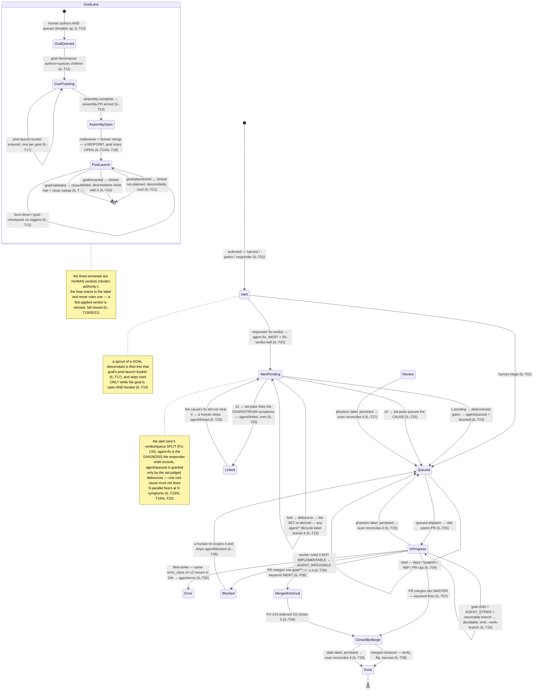

# Issue lifecycle & goal lane — transitions, guards, gaps (GENERATED)

> **GENERATED by `devbox run merge-path-lint -- --write` from [`issue-lifecycle-fsm.yaml`](issue-lifecycle-fsm.yaml) — edit the YAML, never this file.**
> The lint greps every guard's code anchor on each run: a moved/deleted guard fails CI
> instead of silently un-guarding a transition. Design narrative: [`issue-authoring.md`](issue-authoring.md).

## The machine

## Transitions

| id | transition | owner | status | guards (anchored) | belts | incidents |
|---|---|---|---|---|---|---|
| **IL-T01** | authored inert (master lane) | merged-closeout play (harvest) / janitor tick (spec-gap drafts) | guarded · replay: surfaces, blocker-open | ✅ the play forbids self-labeling (loop-safety breaker #1) (`homelab:agents/coordinator/README.md`) ✅ the scan surfaces untriaged bot-authored issues every pass (`homelab:agents/coordinator-scan.sh`) | — | 2026-07-31 sleep harvest: 3 of 5 sprouts were noise — the triage gate is where they died |
| **IL-T02** | human adoption | the operator | report-only | — | — | — |
| **IL-T03** | responder fix-verdict → agent-fix, INERT (alert lane) | responder-argo shell (not the session — breaker #1) | guarded · replay: responder-behaviour-test.sh, fix-verdict, report-only | ✅ the label is applied by the SHELL and is a DIAGNOSIS, not a dispatch — queueing is the debouncer's (`homelab:agents/coordinator/responder-argo.yaml`) ✅ the bell hands the verdict to the set-judged debouncer; a lost bell is re-derived by ITS backstop, never re-rung here (`homelab:agents/coordinator/responder-argo.yaml`) ✅ the per-issue `selfQueue` knob is RETIRED (cb4ae5a) — it labelled agent-fix+agent/queued one issue at a time and so dispatched same-cause issues in parallel (`homelab:agents/coordinator/responder-argo.yaml`) ✅ a REOPENED thread is stripped back to a record — only a fresh verdict may re-earn the labels (replay: responder-reopen-fix-verdict / -report-only) (`homelab:agents/coordinator/responder-argo.yaml`) | — | — |
| **IL-T23** | fix-verdict bell → debounce → the pending SET (state is GitHub labels, nowhere else) | fix-debounce Sensor + WorkflowTemplate — shell only, no LLM in this leg | guarded · replay: fix-debounce | ✅ ALERT-LANE ONLY (`alert-fp:` in the body) — a stack loop's own agent-fix-without-queued hold is not this lane's to queue (the 2026-08-07 dry run swept circles#42, an issue meta-state recorded as held) (`homelab:agents/coordinator/fix-debounce-argo.yaml`) ✅ a lifecycle label EXCLUDES: each one is applied by REMOVING `agent/queued`, so the label meaning somebody already has this issue is exactly what would re-admit it (homelab#238 enumerated the human-waiting pair; homelab#244 widens the same test to the whole `agent/*` namespace — this anchor accepts either form, and neither's deletion) (`homelab:agents/coordinator/fix-debounce-argo.yaml`) ✅ the scan holds the same rule on its side — a human-waiting state never wakes the LLM (`homelab:agents/coordinator/fix-debounce-argo.yaml`) ✅ `self-referential: true` bodies are skipped at wake and named for a human — dispatch onto broken substrate is not the debouncer's call (both fixtures use the SELFREF line as their WITNESS that the list read was served at all) (`homelab:agents/coordinator/fix-debounce-argo.yaml`) ✅ derived LIVE from per-repo REST — the search index lags a just-filed issue, and GraphQL is the pool the reflex drained (FU-084) (`homelab:agents/coordinator/fix-debounce-argo.yaml`) ✅ decides serialize on one mutex, and the set is re-derived rather than carried — a killed workflow loses nothing (`homelab:agents/coordinator/fix-debounce-argo.yaml`) ✅ level-triggered backstop re-derives the set a lost bell left behind (search lag, webhook drop, responder crash post-label) (`homelab:agents/coordinator/fix-debounce-argo.yaml`) | — | 2026-08-11 homelab#237: a coordinator BLOCK at 01:53Z re-admitted the issue to the pending set (blocking removes `agent/queued`) and the debouncer re-queued it at 02:17Z — one ride per debounce period, the human gate erased each turn, until the FU-069 breaker latched `agent/error`, which the predicate of the day did not exclude either. homelab#238 |
| **IL-T24** | 1 pending → deterministic gates → agent/queued + the /coordinate doorbell | fix-debounce `decide` shell (ADR-094 — dispatch acts are launcher-owned) | guarded · replay: fix-debounce | ✅ queue-time deny is the ❌ table ONLY — authoring is not effect, CODEOWNERS gates the merge (operator correction 2026-08-07) (`homelab:agents/coordinator/fix-debounce-argo.yaml`) ✅ an UNDECLARED footprint is exclusive and waits for a human — never queued wide on a guess (`homelab:agents/coordinator/fix-debounce-argo.yaml`) ✅ the doorbell carries {stack, loop_ns} for a GRADUATED stack — a bare {repo} POST fires only the global trigger, whose scan skips graduated stacks (FU-144) (`homelab:agents/coordinator/fix-debounce-argo.yaml`) ✅ fail-closed on the write: a refused label leaves the issue inert for the backstop, never a queued-but-unrung half state (`homelab:agents/coordinator/fix-debounce-argo.yaml`) ✅ ADR-100 binds it: queue-time denial anywhere may use ONLY the ❌ table — the deny line is does-it-take-effect-pre-merge, never is-it-governance (`homelab:docs/adr.md`) | — | — |
| **IL-T25** | ≥2 pending → ONE set-pass: queue the CAUSE, link the downstream, leave the unsure | sonnet set-pass session (judges) → the same `decide` shell (acts — ADR-094) | guarded · ⚠ unreplayed: no fixture records a ≥2 world — the apply legs are the ones IL-T24 pins, and the JUDGEMENT is an LLM play with one dry run and one live datapoint (homelab#68 vs #118 judged INDEPENDENT, TICK-LOG 2026-08-07); record from the next live set-pass rather than inventing a set | ✅ the LLM judges and the SHELL acts — the session may not label, comment, file, close or reopen anything (ADR-094, breaker #1's shape) (`homelab:agents/coordinator/fix-debounce-argo.yaml`) ✅ fail-safe is NOT to label: unparseable output queues nobody, and `unsure` waits — an un-queued issue waits safely, three fixers on one cause spend budget and produce conflicting PRs (`homelab:agents/coordinator/fix-debounce-argo.yaml`) ✅ latch-gated like every spawn, and the shared claude semaphore is held only across `decide` — a suspended debounce never parks a subscription slot (`homelab:agents/coordinator/fix-debounce-argo.yaml`) ✅ a linked issue is TOLD what it was judged downstream of and how to re-enter the pending set — the judgement is legible and reversible (`homelab:agents/coordinator/fix-debounce-argo.yaml`) | — | 2026-08-04 corpus audit (FU-133): ~19 of 27 alert issues were 5 root causes, one PVC producing 8 across 8 days — the SET, not the next issue, is the unit of triage |
| **IL-T04** | queued but held | coordinator-scan queued clause | guarded · replay: depends-on-retired-format | ✅ dependency gate (FU-087) — blocked issues report, never dispatch (`homelab:agents/coordinator-scan.sh`) ✅ ADR-097 footprint hold — declared Touches: intersect ⇒ held (`homelab:agents/coordinator-scan.sh`) ✅ repo WIP ceiling (ADR-097 hard max) (`homelab:agents/coordinator-scan.sh`) | — | — |
| **IL-T05** | queued-dispatch | scan (schedules ONE unit PER LANE) → coordinator item session (judges) → launcher (opens the ride) | guarded · replay: scan-lane-walk | ✅ the queued-dispatch unit rides the priority list, PER LANE (repo, base) — in-flight recovery first WITHIN a lane, never across (ADR-125) (`homelab:agents/coordinator-scan.sh`) ✅ the lane is (repo, base): the walk groups units by it and dispatches at most one per lane per pass (`homelab:agents/coordinator-scan.sh`) ✅ within-lane aging (#829) — a new-work unit that lost SCAN_AGING_N lane dispatches goes to the front, derived from GitHub state, never held in-process (`homelab:agents/coordinator-scan.sh`) ✅ launcher dispatch idempotency — the pod name IS the (task, round) key (`homelab:agents/agent-session.sh`) ✅ a task/goal issue routes to goal-decompose, NEVER to a worker recipe (`homelab:agents/coordinator-scan.sh`) | — | — |
| **IL-T06** | abandoned in-progress → c4c5 re-dispatch | scan C4/C5 clause | guarded · replay: c4c5-infeasible | ✅ the FU-143 exclusion — merged-into-goal is finished work, not abandonment (`homelab:agents/coordinator-scan.sh`) ✅ agent/error invisible to the clause (FU-069 breaker) (`homelab:agents/coordinator-scan.sh`) ✅ agent/blocked invisible to the clause — a human gate is never re-dispatched (homelab#257; was an ASSUMPTION in a comment before) (`homelab:agents/coordinator-scan.sh`) ✅ ONE selector for the abandoned predicate — the unit, the report, the IL-T16 belt and the IL-T26 terminal cannot drift apart (`homelab:agents/coordinator-scan.sh`) | — | 2026-08-05 circles#22: pre-FU-143, C4/C5 re-rode a merged child — breakage #1 of three |
| **IL-T16** | phantom in-progress reconciled → queued (the belt) | coordinator-scan, deterministically — no LLM tick in the path | guarded · ⚠ unreplayed: belt built pre-harness (homelab#155) — convert on its next touch | ✅ persistence guard — never actuate on the same instant of state the scan first saw (dispatch + finalize races) (`homelab:agents/coordinator-scan.sh`) ✅ merged-PR hold — a non-closing reference on a merged PR leaves this exact state; holding beats re-riding finished work (`homelab:agents/coordinator-scan.sh`) ✅ add agent/queued FIRST, remove agent/in-progress SECOND, then re-read and prove the end state (the edit is not atomic) (`homelab:agents/coordinator-scan.sh`) ✅ probe failure holds every candidate and writes nothing (rule #6 — never fail INTO a write) (`homelab:agents/coordinator-scan.sh`) | — | 2026-08-08 oracle#193 + circles#42/#46/#49: six phantom labels, zero worker pods — ~3h of two stacks idle. WIP caps counted ghosts and ADR-097 footprint holds refused SIBLING issues against dead work; found only because the operator asked why nothing was running, cleared by hand; 2026-08-08 oracle#193 again: the hand-clear removed agent/in-progress and FORGOT agent/queued — the issue went invisible a second time. That is why the belt writes queued first and verifies the end state |
| **IL-T26** | infeasible scope → parked agent/blocked (the terminal) | coordinator-scan, deterministically — no LLM tick in the path | guarded · replay: c4c5-infeasible | ✅ the marker is ANCHORED at the start of a COMMENT — talking about the terminal is not the terminal (`homelab:agents/coordinator-scan.sh`) ✅ add agent/blocked FIRST, remove agent/in-progress SECOND, then re-read and prove the end state (the edit is not atomic — IL-T16's lesson) (`homelab:agents/coordinator-scan.sh`) ✅ the MARKER suppresses the redispatch, not the label write — a failed/half-applied write reports loudly and the issue still leaves the unit list (`homelab:agents/coordinator-scan.sh`) ✅ an unreadable comments probe keeps today's behaviour, belt and unit included (rule #6 — never fail INTO a write) (`homelab:agents/coordinator-scan.sh`) ✅ PRODUCER HALF — each repo's `.agents/fix.yaml` must tell a worker to emit the marker; until it does, this transition is unreachable in that repo (`homelab:agents/coordinator/README.md`) | — | 2026-08-11 oracle-fleet#66: the whole deliverable was .github/workflows/ci.yaml, banned by .agents/fix.yaml. The worker correctly self-reported 'not implementable as written' — with no terminal for it, that landed as AGENT_STRIKE error_class=unknown, and the coordinator had to override the mechanical c4c5-redispatch clause BY HAND (retro r3 F4); 2026-08-11 oracle-fleet#225: 'none of that is executable by a fix-class worker (no cluster/infra access, no live-API credentials, no oracle-iac checkout)' — the worker RESCOPED itself instead, and its PR's `Fixes #225` then wrongly auto-closed the issue (reopened 19:03:31Z). Self-rescoping is what an agent does when the honest answer has no exit |
| **IL-T27** | phantom review reconciled → queued (the belt) | coordinator-scan, deterministically — no LLM tick in the path | guarded · replay: review-phantom-belt | ✅ persistence guard — never actuate on the same instant of state the scan first saw (dispatch + finalize races) (`homelab:agents/coordinator-scan.sh`) ✅ merged-PR hold — a non-closing reference on a merged PR leaves this exact state; holding beats re-riding finished work (`homelab:agents/coordinator-scan.sh`) ✅ add agent/queued FIRST, remove agent/review SECOND, then re-read and prove the end state (the edit is not atomic) (`homelab:agents/coordinator-scan.sh`) ✅ probe failure holds every candidate and writes nothing (rule #6 — never fail INTO a write) (`homelab:agents/coordinator-scan.sh`) ✅ human-gate exclusion — agent/blocked and agent/error are never re-queued by the belt (mirrors C4C5_SEL); a re-queue would hand a human-held issue back to dispatch (`homelab:agents/coordinator-scan.sh`) | — | 2026-08-09 homelab#778: PR#790 closed unmerged at the fan-out pilot's close — 18h56m stall, invisible to every scan class until a goal checkpoint hand-corrected it, holding a flip criterion |
| **IL-T28** | phantom done reconciled — closed issue + merged PR + stale label → agent/done (the belt) | coordinator-scan, deterministically — no LLM tick in the path | guarded · replay: done-phantom-belt | ✅ persistence guard — never actuate on the same instant of state the scan first saw (`homelab:agents/coordinator-scan.sh`) ✅ merged-PR requirement — without a merged PR mentioning the issue, the close may be unrelated to agent work; holding beats guessing (`homelab:agents/coordinator-scan.sh`) ✅ add agent/done FIRST, remove the stale label SECOND, then re-read and prove the end state (the edit is not atomic — IL-T16's lesson) (`homelab:agents/coordinator-scan.sh`) ✅ probe failure holds every candidate and writes nothing (rule #6 — never fail INTO a write) (`homelab:agents/coordinator-scan.sh`) ✅ human-gate exclusion — agent/error is never auto-relabeled by the belt (`homelab:agents/coordinator-scan.sh`) | — | retro r2 F5: four closed issues wearing agent/blocked or agent/review — #913 (PR#915 merged, 14 reviews ending in two APPROVED), #625 (PR#631), #270 (PR#275), #148 (PR#150). The ledger derived terminal_label from the label, so #913 and #625 entered r2's deep-dive set at ranks 1 and 5 AS FAILURES while both are merged work — 2 of 8 deep-dive slots burned on label debt. |
| **IL-T29** | goal child + AGENT_STRIKE + resumable branch → decidable, emit --work-branch (the narrowed hold) | coordinator-scan, deterministically — no LLM tick in the path | guarded · replay: c4c5-ambig-decidable | ✅ the AGENT_STRIKE: marker is ANCHORED at the start of a COMMENT — same discipline as AGENT_INFEASIBLE: (homelab#257) (`homelab:agents/coordinator-scan.sh`) ✅ the Resumable branch pushed: line is read from the anchored strike comment — the branch is extracted and carried into the dispatch unit (`homelab:agents/coordinator-scan.sh`) ✅ no strike / no resumable branch / unreadable probe keeps today's behaviour (rule #6 — never fail INTO a write) (`homelab:agents/coordinator-scan.sh`) ✅ loop guard — a resumed round that strikes again with the same (model, error_class) pair follows the existing second-strike rule (`homelab:agents/coordinator-scan.sh`) | — | 2026-09-01 oracle-fleet#329: the third C4/C5 ambig sighting in ~24h froze the whole oracle lane ~4h — 0 WIP, 0 PRs, every scan tick green, homelab#1149 was the identical shape the day before. The AGENT_STRIKE: + Resumable branch pushed: evidence was machine-anchored one comment up; the hold just didn't look. |
| **IL-T30** | fleet-strike reader — same error_class on ≥2 issues in 24h ⇒ agent/error + comment + filing | coordinator-scan, deterministically — no LLM tick in the path | guarded · replay: fleet-strike-reader | ✅ the AGENT_STRIKE: marker is ANCHORED at the start of a COMMENT — same discipline as AGENT_INFEASIBLE: (homelab#257) and AGENT_STRIKE: (FU-199) (`homelab:agents/coordinator-scan.sh`) ✅ match on the structured `error_class=` field only, never log excerpts (`homelab:agents/coordinator-scan.sh`) ✅ dedup — before filing, check for an existing OPEN issue titled fleet-strike: error_class=<ec>; extend it instead of creating a new one (`homelab:agents/coordinator-scan.sh`) ✅ key-class exclusion (FU-202 belt) — budget-exhausted-key and budget-403-key are MINT defects, not worker strikes; explicitly excluded even when they appear as AGENT_STRIKE: (historical rows pre-#1233 merge) (`homelab:agents/coordinator-scan.sh`) ✅ probe failure holds every candidate and writes nothing (rule #6 — never fail INTO a write) (`homelab:agents/coordinator-scan.sh`) ✅ live-window anchor — the NEWEST strike in the group must fall inside 24h of now; without this, a group that once clustered stays 'detected' on every future tick forever (homelab#1235 round-2 fix) (`homelab:agents/coordinator-scan.sh`) ✅ marker-based idempotency on both posting paths — the first line of the fleet-strike comment is a machine marker carrying the group identity; a repeat tick against an already-actioned fleet strike finds the identical marker and skips the post (homelab#1235 round-2 fix) (`homelab:agents/coordinator-scan.sh`) | — | 2026-09-01: FOUR goal-#326 r1 strikes with identical error_class=unknown were never correlated; the operator + seat did it by hand. Prose-warned classes recur; executable gates hold (ADR-103). |
| **IL-T07** | close by master merge | GitHub (closing keyword) | github-native | ✅ ordinary master-lane PRs close their issue by keyword; the ASSEMBLY PR deliberately does not (ADR-102 — it writes a non-closing Assembly-for: trailer instead) (`homelab:agents/coordinator/README.md`) | — | — |
| **IL-T08** | close by goal merge — FU-143 widened C6 | scan detection (Base:-keyed) → merged-closeout play closes the issue | guarded · ⚠ unreplayed: Base:-keyed detection — fixture on next touch; the merge doorbell is foreign | ✅ Base:-keyed detection — goal/** only, never any non-default base (the #32 mirror) (`homelab:agents/coordinator-scan.sh`) ✅ the play CLOSES the still-open issue (moves the burn-down, unblocks siblings — a checkpoint session only at thresholds, ADR-106 (3)) (`homelab:agents/coordinator/README.md`) 🔗 merge doorbell: a merged circles PR rings /coordinate (was: wait for the */10 cron) (`circles:.github/workflows/coordinate-doorbell.yaml`) | — | 2026-08-05 circles#22/#23: closed BY HAND (agent/done+close) — which also silently skipped the harvest (C6 excludes agent/done) |
| **IL-T09** | merged-closeout — verify, flip, harvest | scan merged-closeout clause → coordinator item session | guarded · replay: merged-closeout-default-branch | ✅ scan emits merged-closeout units (goal children first, shared cap 3/repo/scan) (`homelab:agents/coordinator-scan.sh`) ✅ goal children verify against the GOAL branch, not master/ArgoCD (`homelab:agents/coordinator/README.md`) ✅ goal closeout retargets surviving sprouts to master (their base dies with the branch) (`homelab:agents/coordinator/README.md`) | — | — |
| **IL-T10** | goal queued by a human | the operator (breaker | guarded · ⚠ unreplayed: defence-in-depth actor check (the boundary is CODEOWNERS) — fixture with the next goal-lane touch | ✅ the scan refuses a Bot-queued goal, fail-closed (defence in depth; the boundary is CODEOWNERS) (`homelab:agents/coordinator-scan.sh`) | — | — |
| **IL-T11** | goal-decompose | coordinator item session (reasoning tier — GOAL_MODEL, default opus) | guarded · ⚠ unreplayed: decompose is an LLM play; its deterministic legs are replayed elsewhere — the budget sum through goal-budget.sh by the harvest fixtures, the goal RESOLUTION the sum is asked about by goal-ancestor-* (homelab#367) | ✅ the play (coverage map, seams pinned, Σ budgets fit) (`homelab:agents/coordinator/README.md`) ✅ launcher enforces Σ(DESCENDANT spend + reservations) ≤ Budget: — sprouts spend the goal's money (`homelab:agents/agent-session.sh`) ✅ …over the shared read (extracted for #207's harvest gate; one sum, two callers, one enforcer) (`homelab:agents/goal-budget.sh`) ✅ …asked about the goal ANCESTOR, walked transitively and by the SAME walk the scan uses — a post-launch sprout's parent is the bucket, and the one-hop read left that whole lane ungated and goal-blind (replay: goal-ancestor-bucket-child, -direct-child, -none-fallback, -unlabelled-budget) (`homelab:agents/goal-budget.sh`) ✅ the worker's slice is BOUNDED — Goal+Acceptance card only, never the spec tree (`homelab:agents/agent-session.sh`) ✅ the reasoning tier is CLASS POLICY, not a launcher case map (G-A 8, #781) — the session derives class=goal-decompose from the clause and /route resolves it; ADR-094 holds (the launcher consumes the routed verdict, the LLM never picks) (`homelab:agents/coordinator-session.sh`) | — | — |
| **IL-T12** | goal burn-down (deterministic) + goal-checkpoint on triggers (ADR-106 (3), was per-closure goal-review) | scan goal lane (burn-down, zero tokens) → coordinator goal-checkpoint session (reasoning tier) | guarded · replay: goal | ✅ descendant fixpoint walk (the budget-gate bug-shape, fixed here too) (`homelab:agents/coordinator-scan.sh`) ✅ the play: dispose the store (fold/mint-to-origin/drop + advance), then assembly-complete / children cover / author the missing child / retro checkpoint (`homelab:agents/coordinator/README.md`) ✅ a goal the lifecycle legs just moved does not ALSO draw a review unit this pass (replay: goal-assembly-complete) (`homelab:agents/coordinator-scan.sh`) ✅ the post-launch leg of the play: burn-down report, retarget stranded Base: children, recommend a verdict — never apply one (`homelab:agents/coordinator/README.md`) | — | — |
| **IL-T13** | assembly-complete → assembly PR opened ARMED | goal-checkpoint session (App-authored, at assembly-complete time — never at decompose) | guarded · ⚠ unreplayed: LLM play (assembly PR open) — anchor-gated | ✅ the play opens+arms at assembly-complete; human changes-requested routes as a NEW child (`homelab:agents/coordinator/README.md`) ✅ the verdict is named assembly-complete — 'built as specified', never 'idea validated' (the #17 lesson) (`homelab:agents/coordinator/README.md`) ✅ the reflex reviews it on the assembly rubric, model = claim reviewer.goalModel (`homelab:agents/review-reflex.sh`) ✅ the scan never dispatches a fix round at a goal/** HEAD (protected base — push would be refused) (`homelab:agents/coordinator-scan.sh`) | — | — |
| **IL-T14** | assembly merge — the goal lane's human gate (NO LONGER its exit) | GitHub (codeowner rule) + the operator (OrgAdmin merge) | github-native | ✅ master ruleset carries the codeowner flag; goal/** twin deliberately does not (`homelab:tofu/github/repo_rulesets.tf`) 🔗 CODEOWNERS: /specs/ + /.agents/ on the operator (`circles:CODEOWNERS`) | — | — |
| **IL-T18** | assembly-complete → POST-LAUNCH (merge is a midpoint, the goal stays OPEN) | coordinator-scan goal lane (deterministic; no LLM in the path) | guarded · replay: goal | ✅ the goal is never closed here — assembly-complete measures 'built as specified', and only production knows the rest (replay: goal-assembly-complete asserts the ABSENCE of a close call) (`homelab:agents/coordinator-scan.sh`) ✅ keyed on a goal/** HEAD + the line-anchored Assembly-for: trailer — a goal CHILD has a goal/** BASE and would otherwise announce a launch on its own merge (replay: goal-nonassembly-merge-inert) (`homelab:agents/coordinator-scan.sh`) ✅ a merged goal/** PR that only MENTIONS the goal is HELD and reported, never assumed (the circles#36 sibling-citation shape, one lane over) (`homelab:agents/coordinator-scan.sh`) ✅ label FIRST, comment SECOND, comment only on a label that stuck — the write is not atomic and the leg is level-triggered, so the reverse order re-comments every tick (`homelab:agents/coordinator-scan.sh`) ✅ the play must not open a second assembly PR or self-apply the label in post-launch (`homelab:agents/coordinator/README.md`) | — | 2026-08-05 circles#17: machine-ruled 'goal met' and closed 100 minutes before the operator refuted it — nothing at merge time can know whether production agrees, which is why this transition closes nothing |
| **IL-T19** | terminal — goal/validated: closed met + the close sweep | coordinator-scan goal lane, reacting to a HUMAN-applied label | guarded · replay: goal | ✅ the sweep is REPORT-first — batch disposition becomes legal here and stays operator-confirmed until the goal registry panel exists (replay: goal row validated pins zero descendant writes) (`homelab:agents/coordinator-scan.sh`) ✅ the panel already reads the verdict labels — it needed no code change the day they landed (`homelab:argocd/resources/github-exporter/github-exporter.py`) | — | — |
| **IL-T20** | terminal — goal/reverted: closed successfully-refuted, the tree dies with it | coordinator-scan goal lane, reacting to a HUMAN-applied label | guarded · replay: goal | ✅ descendants FIRST, the goal LAST — a closed goal leaves `openall` and the leg never fires again, so a partial pass must leave the goal open to be resumed (replay: goal row reverted pins the call order) (`homelab:agents/coordinator-scan.sh`) ✅ descendants are CLOSED, never deleted — the tree stays readable history (⚖ pre-decided, homelab#208) (`homelab:agents/coordinator-scan.sh`) ✅ the revert pointer is DECLARED on the goal, never guessed; an absent one is said plainly in the audit comment (`homelab:agents/coordinator-scan.sh`) | — | oracle-fleet goal-174: 19 sprouts, 3 generations, still growing 34h post-close because nothing owned the tree — this leg is what now owns it |
| **IL-T21** | terminal — goal/abandoned: closed not-planned, descendants inert | coordinator-scan goal lane, reacting to a HUMAN-applied label | guarded · replay: goal | ✅ de-queued, not closed — a queued descendant of a dead goal burns a ride per tick to be refused by the launcher pre-flight (replay: goal-abandoned, same tree as goal-reverted, opposite disposition) (`homelab:agents/coordinator-scan.sh`) | — | — |
| **IL-T22** | the verdict authority gate — the loop may not rule its own goal | coordinator-scan goal lane (fail-closed, before ANY terminal write) | guarded · replay: goal | ✅ the breaker-#1 actor shape, with more at stake: this transition closes a goal and, on revert, its whole tree — and the App holds issues:write (`homelab:agents/coordinator-scan.sh`) ✅ an unreadable authorisation is not an authorisation (rule #6 — never fail INTO a write) (`homelab:agents/coordinator-scan.sh`) ✅ the labels are provisioned as code — IssueLabels is AUTHORITATIVE, so a runtime `gh label create` self-destructs on the next sync (`homelab:argocd/resources/agentstack/composition.yaml`) | — | — |
| **IL-T15** | goal-lane findings APPEND to the store at harvest — minting is the checkpoint's (ADR-106 (3); was the selfqueue grant) | scan harvest-disposition block (decides) → merged-closeout play (obeys) | guarded · replay: harvest | ✅ the verdict is DETERMINISTIC and rides --item; the play is ordered, never asked (replay: harvest-goal-open-funded / -exhausted / -closed) (`homelab:agents/coordinator-scan.sh`) ✅ the play obeys harvest=; the pre-ADR-102 `Base: goal/**` exception stays retired (`homelab:agents/coordinator/README.md`) ✅ the store format has ONE home (append/counts/advance/burndown + the scan's sourced fns) (`homelab:agents/goal-findings.sh`) ✅ …and ONE ancestor walk under it, the same one the launcher pre-flight resolves with: until homelab#367 this block answered goal #278 for rides the launcher was gating against bucket #295 (`homelab:agents/coordinator-scan.sh`) ✅ the reviewer emits NO Follow-ups at depth ≥2 — the tree is capped at sprouts-of-children (`homelab:agents/reviewer-session.sh`) | — | 2026-08-09 census: #195/#211-shaped sprouts self-queued after their goal had closed and its budget was spent — the `Base: goal/**` body line outlives the goal that authorised it; oracle-fleet goal-174: 19 sprouts, 3 generations, still growing 34h post-close because nothing owned the tree (ADR-102's motivating case) |
| **IL-T17** | post-launch bucket — merge is a midpoint, the container is a sub-issue | scan harvest-disposition block (deterministic; no LLM in the path) | guarded · replay: harvest, sprout-report-skips-buckets | ✅ one container per goal — found by title in the goal's own sub-issue list before any create (replay: harvest-goal-open-exhausted) (`homelab:agents/coordinator-scan.sh`) ✅ a bucket that cannot be LINKED is discarded — its children would sit outside the goal's descendant walk and spend budget the gate cannot see (`homelab:agents/coordinator-scan.sh`) ✅ the bucket is a goal descendant, so its children already charge the goal's Budget: (no second accounting) (`homelab:agents/goal-budget.sh`) ✅ the play never creates it — it is handed the number and files into it (`homelab:agents/coordinator/README.md`) ✅ a bucket is a CONTAINER, not a sprout — excluded from the 🌱 triage slice, whose printed instruction would otherwise dispatch a worker at it (replay: sprout-report-skips-buckets) (`homelab:agents/coordinator-scan.sh`) | — | — |

## Gap register — known-missing guards

| id | gap | detail | disposition |
|---|---|---|---|
| **IL-G02** | goal branch creation is manual | Nothing creates goal/<n>-<slug> from master; circles#29's ⛔ section assigns it to the operator as a precondition. The decompose play could create it (one API call) if this recurs as friction. | accepted: deliberate operator step per #29 (2026-08-06); revisit on the second goal that trips on it |
| **IL-G03** | assembly-only extra checks (audit, perf) unbuilt | Operator wish 2026-08-06: the assembly PR could carry checks a normal PR does not. Constraint: a REQUIRED check must report on every PR or it blocks them all — needs a workflow that runs on all PRs and trivially greens itself unless the head is goal/**. | accepted: design when a goal actually demands one; the codeowner review is the gate meanwhile |
| **IL-G04** | sprout-RATE gauge (the harvest-gate half is closed) | The harvest gate DOES read remaining budget now — IL-T15/IL-T17 (ADR-102, homelab#207) close that half. What remains is the metric: the exporter does not yet walk the sub-issue lineage into a convergence number (inflow rate > fix rate = diverging), which is homelab#209's per-goal panel. ADR-102 supersedes this gap once that lands. | FU: FU-090 |
| **IL-G06** | merged-but-unlinked on MASTER only HELD, never resolved | IL-T16 refuses to reconcile an issue any merged PR merely MENTIONS, because a PR that merged with a non-closing reference leaves a state identical to abandonment (the FU-143 hazard, one lane over). It reports and falls through to IL-T06, so a human/LLM still decides — the belt just never guesses. Resolvable the same way the goal lane resolved it: once agent-runtime#34's finalize guarantees a strong `Implements #N` link, the mention test can be tightened into an ownership test. | accepted: GUARDED by homelab#1149 (2026-09-01): the C6 merged-closeout clause structure for detecting OPEN issues on the default branch whose merged PR carries a strong link (`implements|closes|fixes|resolves #N` or the `Issue:` trailer) is in place, and the `--arg default_branch` and variable-hoist fixes ensure the detection code parses and runs without error. Bare mentions still hold (the circles#36 asymmetry stands). The positive-path detection semantics (regex match, strong-link vs bare-mention split, dref exclusion) are guarded but unreplayed due to stub limitations in differentiating `--state merged` vs `--state open` — see IL-T09. |
| **IL-G07** | the belt treats the symptom; the missing finalize is the cause | agent-runtime#36 owns making finalize run on every exit path. Until it lands, phantom labels keep being CREATED and IL-T16 keeps clearing them ≤1 scan interval later — visible as a stream of RECONCILED report lines, which is itself the signal for how often the cause fires. | accepted: belt-and-cause are separate items by design (homelab#155 vs agent-runtime#36); the report lines are the meter |
| **IL-G08** | the ASSEMBLY PR's own review Follow-ups have no harvester | IL-T09 harvests `Follow-ups:` bullets when a merged PR's ISSUE reaches merged-closeout. The assembly PR's issue is the GOAL, and since IL-T18 the goal does not close at assembly merge — so nothing schedules a closeout for it and the assembly review's bullets have no owner. The gap predates ADR-102 (a goal carries `agent/blocked`, which C6's selector never matched either), but #208 removes the one path that could have covered it by accident. The post-launch bucket is the obvious target and IL-T18 already resolves its number; what is missing is a clause that fires on the assembly merge itself rather than on an issue close. | accepted: the goal-checkpoint post-launch leg reads the merged assembly PR and can raise the bullets at its next threshold-fired session meanwhile; build the clause when a real assembly review actually emits Follow-ups (none has yet), so the fixture can be recorded from a live payload rather than invented |
| **IL-G05** | master-lane harvest graduation knob unbuilt | issueAuthoring.selfQueue exists in prose only (no XRD field, no reader). Per the gate-the-merge doctrine it may never need building — CODEOWNERS is the boundary. | accepted: gate-the-merge ruling 2026-08-05; build only if per-issue triage becomes the bottleneck |

_States/axes: labels, lane, base, lineage_depth, budget · events: 13 · transitions: 30 · open gaps: 1 (+6 accepted)_
