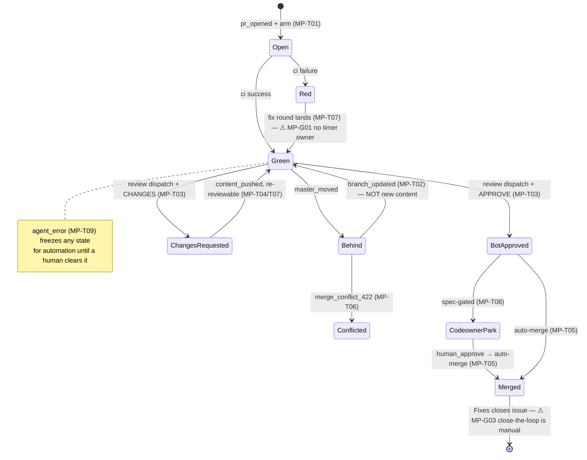

# Merge-path FSM — transitions, guards, gaps (GENERATED)

> **GENERATED by `devbox run merge-path-lint -- --write` from [`merge-path-fsm.yaml`](merge-path-fsm.yaml) — edit the YAML, never this file.**
> The lint greps every guard's code anchor on each run: a moved/deleted guard fails CI
> instead of silently un-guarding a transition. Design narrative: [`merge-path.md`](merge-path.md).

## The machine

## Transitions

| id | transition | owner | status | guards (anchored) | belts | incidents |
|---|---|---|---|---|---|---|
| **MP-T01** | arm at open | agent-finalize (in-pod) | guarded | ⚠ pr_url derived from the checked-out branch (goose-only self-report gap closed) (`agent-runtime:agent-base/agent-finalize`) | ✅ reflex C9 re-arm for worker-authored un-armed PRs (`homelab:agents/review-reflex.sh`) ✅ scan orphan report (any un-armed unowned PR, report-only per FU-079) (`homelab:agents/coordinator-scan.sh`) | 2026-07-16 oracle-fleet#16 (stacked PR born un-armed); 2026-07-17 meta-7(a) claude-tier 3/3 un-armed; FU-079 (archived) |
| **MP-T02** | updater brings a behind PR current | update-pr-branch reusable workflow (adRise action, homelab-merge App) | guarded | ✅ FIFO + one-per-run + armed-only (`homelab:.github/workflows/update-pr-branch.reusable.yml`) | — | 2026-07-09 oracle-fleet#6 (changes-requested refusal deadlock → MP-T04's BEHIND exception) |
| **MP-T03** | review dispatch | exporter edge (POST → Sensor → review WorkflowTemplate) + */15 CronWorkflow backstop | guarded | ✅ bot-approval-at-head over NON-MERGE commits (branch_updated ≠ content_pushed) (`homelab:agents/review-reflex.sh`) ✅ bot login normalized (REST 'x[bot]' vs GraphQL 'x') (`homelab:agents/review-reflex.sh`) ✅ never reviewDecision (codeowner repos hold it REVIEW_REQUIRED forever) (`homelab:agents/review-reflex.sh`) ✅ capacity gate (429 latch / 80% utilization / session semaphore) (`homelab:agents/review-reflex.sh`) ✅ per-stack reviewer.enabled knob (`homelab:agents/review-reflex.sh`) | ✅ reviewer STEP-0 self-guard (own verdict at head → AGENT_ERROR, no duplicate) (`homelab:agents/reviewer-session.sh`) ✅ in-band breaker: impossible verdict counts trip agent/error (`homelab:agents/review-reflex.sh`) ✅ out-of-band: AgentReviewLoop / AgentErrorFlagged alerts (different code+token) (`homelab:argocd/resources/github-exporter/prometheusrule.yaml`) | 2026-07-12 oracle-fleet#13 (reviewDecision aliasing, 12 approvals); 2026-07-21 oracle-fleet#57 (merge-commit staleness, 9 reviews, 88% window burn) |
| **MP-T04** | re-review after changes-requested + new content | review reflex (reviewable_again arm) + exporter edge (same arm since 2026-07-21) | guarded | ✅ new CONTENT since verdict (non-merge commits only, via newest_commit_at) (`homelab:agents/review-reflex.sh`) ✅ the exporter edge carries the SAME arm — delegating it to the STEP-0 belt makes every benign re-POST an agent/error latch that freezes the PR's own MP-T07 fix round (private repos null commit dates → edge stays off, CronWorkflow owns re-reviews) (`homelab:argocd/resources/github-exporter/github-exporter.py`) | — | 2026-07-09 oracle-fleet#6 (the BEHIND-re-review exception's origin); 2026-07-21 oracle-fleet#60 (exporter re-POST one poll after the verdict — restart-emptied dedup; STEP-0 tripped, breaker froze the fix round 5h) |
| **MP-T05** | auto-merge completes | GitHub (native auto-merge) | github-native · accepted: approval→merge window: master moving in those seconds costs one update + one re-review — rare, self-healing, counted in scenario L | — | — | — |
| **MP-T06** | conflict routes to judgment | updater labels merge-conflict → coordinator item unit | guarded | ✅ scan emits the merge-conflict clause as a work unit (`homelab:agents/coordinator-scan.sh`) | — | — |
| **MP-T07** | fix round on the PR's own branch | coordinator item session → agent-session --work-branch --recipe | guarded | ✅ dispatch idempotency: the pod name IS the (task, round) key — atomic create (`homelab:agents/agent-session.sh`) ✅ recipe fix-round exception (being ON the PR branch is not the FU-069 anomaly) (`oracle-fleet:.agents/fix.yaml`) ✅ launcher-owned claude run command (--recipe, never LLM-assembled) (`homelab:agents/agent-session.sh`) | — | 2026-07-21 #55 ($B64 template shipped raw); 2026-07-21 #47 (breaker misfire on the fix-round path); 2026-07-21 #55 (double-dispatch ×3 → pod-name key) |
| **MP-T08** | codeowner park | GitHub (require_code_owner_review) — bot approved, human pending | github-native | ✅ reflex does NOT re-dispatch while parked (bot_approved_head, not reviewDecision) (`homelab:agents/review-reflex.sh`) | — | 2026-07-12 oracle-fleet#13 |
| **MP-T09** | breaker trip and clear | any layer (reflex counts / reviewer STEP-0 / worker recipe / exporter alerts / human) | guarded | ✅ agent/error excluded from EVERY actionable clause (queued, c4c5, review pick, C9) (`homelab:agents/coordinator-scan.sh`) | — | 2026-07-21 ×3 (two correct fires, one misfire → MP-T07 recipe exception) |

## Gap register — known-missing guards

| id | gap | detail | disposition |
|---|---|---|---|
| **MP-G01** | red-beyond-T has no owner | A red armed PR with no review sits invisible: updater skips it, reflex skips it, the scan emits no ci-red unit (needs checks:read at scan level — 'v3 territory'). Live: #58's red e2e needed a MANUAL meta round dispatch (2026-07-21). Design says 'reflex labels → coordinator decides' — nothing implements the timer. | FU: FU-050 v3 note in coordinator-scan.sh header; promote when the next red PR stalls |
| **MP-G02** | reviewer dispatch lacks the deterministic-name key | workflow.md/merge-path.md design says review-<repo>-<pr>-<headsha8> as the atomic test-and-set; implemented today: label idempotency + STEP-0 only (probabilistic, and STEP-0 costs a burned session). Workers got their key 2026-07-21; reviewers didn't. | FU: FU-092 |
| **MP-G03** | merged → close-the-loop has no mechanical owner | C6 (verify outcome, agent/done flip, follow-up harvest) was manual meta every time this session (#52, #55, #47 labels by hand). ADR-094 lists no merged-clause unit. | FU: FU-090 (harvest design; the label flip rides the same unit) |
| **MP-G04** | arbitrate (flip-flop / rounds-exhausted) is breaker-only | The escalation table's tie-break rows exist as ROUNDS_MAX breaker counts, not as a scan-emitted arbitrate unit — the coordinator never gets the structured tie-break dispatch ADR-094 specifies. | FU: FU-086 (remaining: the arbitrate clause) |
| **MP-G05** | belt-3 cannot compute since-head | The exporter PAT can't read commit objects, so AgentReviewLoop uses a trailing-1h window, not verdicts-since-head — a slow loop (<3 verdicts/h) is invisible to layer 3. | accepted: documented degradation; layers 1+2 carry since-head precision (2026-07-12 decision) |

_States/axes: ci, currency, arming, bot_review_at_head, codeowner_gate, breaker, lane · events: 10 · transitions: 9 · open gaps: 4 (+1 accepted)_
