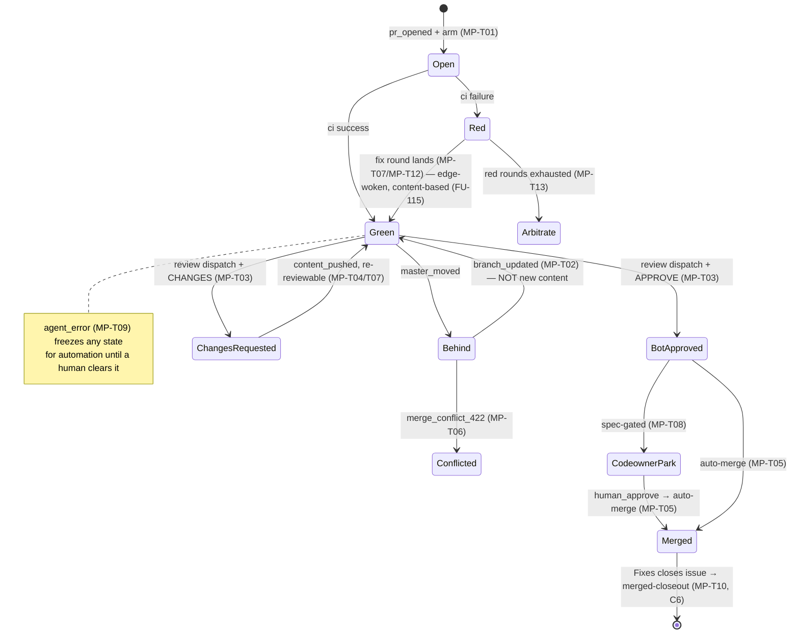

# Merge-path FSM — transitions, guards, gaps (GENERATED)

> **GENERATED by `devbox run merge-path-lint -- --write` from [`merge-path-fsm.yaml`](merge-path-fsm.yaml) — edit the YAML, never this file.**
> The lint greps every guard's code anchor on each run: a moved/deleted guard fails CI
> instead of silently un-guarding a transition. Design narrative: [`merge-path.md`](merge-path.md).

## The machine

```mermaid
stateDiagram-v2
    [*] --> Open: pr_opened + arm (MP-T01)
    Open --> Green: ci success
    Open --> Red: ci failure
    Red --> Green: fix round lands (MP-T07/MP-T12) — edge-woken, content-based (FU-115)
    Red --> Arbitrate: red rounds exhausted (MP-T13)
    Green --> Behind: master_moved
    Behind --> Green: branch_updated (MP-T02) — NOT new content
    Behind --> Conflicted: merge_conflict_422 (MP-T06)
    Green --> BotApproved: review dispatch + APPROVE (MP-T03)
    Green --> ChangesRequested: review dispatch + CHANGES (MP-T03)
    ChangesRequested --> Green: content_pushed, re-reviewable (MP-T04/T07)
    BotApproved --> CodeownerPark: spec-gated (MP-T08)
    CodeownerPark --> Merged: human_approve → auto-merge (MP-T05)
    BotApproved --> Merged: auto-merge (MP-T05)
    Merged --> [*]: Fixes closes issue → merged-closeout (MP-T10, C6)
    note right of Green
        agent_error (MP-T09) freezes any state
        for automation until a human clears it
    end note
```

## Transitions

| id | transition | owner | status | guards (anchored) | belts | incidents |
|---|---|---|---|---|---|---|
| **MP-T01** | arm at open | agent-finalize (in-pod) | guarded · ⚠ unreplayed: arm guard is foreign (agent-runtime finalize); the C9/orphan belts backfill by fix-density | 🔗 pr_url derived from the checked-out branch (goose-only self-report gap closed) (`agent-runtime:agent-base/agent-finalize`) | ✅ reflex C9 re-arm for worker-authored un-armed PRs (`homelab:agents/review-reflex.sh`) ✅ scan orphan report (any un-armed unowned PR, report-only per FU-079) (`homelab:agents/coordinator-scan.sh`) | 2026-07-16 oracle-fleet#16 (stacked PR born un-armed); 2026-07-17 meta-7(a) claude-tier 3/3 un-armed; FU-079 (archived) |
| **MP-T02** | updater brings a behind PR current | in-cluster updater (ADR-111 — exporter edge + */15 Argo CronWorkflow → agents/update-pr-branch.sh, homelab-merge App via ESO; hosted reusable retired 2026-08-26, homelab#745) | guarded · replay: updater | ✅ FIFO + one-per-run + armed-only (`homelab:agents/update-pr-branch.sh`) ✅ burst serialization: ONE mutex across edge + cron submissions (Cron Forbid cannot see Sensor submissions), so push bursts serialize instead of racing (the cancel-in-progress: false rationale of the hosted era, carried by the mutex now). ⚠ This used to also claim it preserved a 422→merge-conflict labeling MP-T06 depends on; since homelab#986 (PR#1005) the update-branch call carries expected_head_sha and a 422 — conflict OR concurrent-push race — SKIPS without labeling. MP-T06 is fed by leg 3's armed∧DIRTY labeler alone, one pass later (`homelab:agents/coordinator/update-pr-argo.yaml`) ✅ the CR∧BEHIND unstrand belt fires ONLY on new content since the newest reviewer verdict (non-merge commits — the reflex's reviewable_again shape; updater merges are not content or the belt feeds itself) and never on agent/error / agent/arbitrate PRs. Measured 2026-08-17: the unconditional belt spent 34 branch updates + ~35 CI runs keeping unmergeable PRs current in one busy-master day (#473 ×16 parked, #475 ×18 breaker-latched); unreadable probe data HOLDS, never updates (`homelab:agents/update-pr-branch.sh`) | — | 2026-07-09 oracle-fleet#6 (changes-requested refusal deadlock → MP-T04's BEHIND exception) |
| **MP-T03** | review dispatch | exporter edge (POST → Sensor → review WorkflowTemplate) + */15 CronWorkflow backstop | guarded · replay: reviewer-optout-replay.sh, reviewer-exit-contract | ✅ bot-approval-at-head over NON-MERGE commits (branch_updated ≠ content_pushed) (`homelab:agents/review-reflex.sh`) ✅ bot login normalized (REST 'x[bot]' vs GraphQL 'x') (`homelab:agents/review-reflex.sh`) ✅ never reviewDecision (codeowner repos hold it REVIEW_REQUIRED forever) (`homelab:agents/review-reflex.sh`) ✅ capacity gate (429 latch / 80% utilization / session semaphore) (`homelab:agents/review-reflex.sh`) ✅ deterministic-name key: reviewer pod = (repo, pr, head-sha8), atomic create — was gap MP-G02 (FU-092, 2026-07-27) (`homelab:agents/reviewer-session.sh`) ✅ per-stack reviewer.enabled knob, honored by ALL THREE dispatch sites from ONE shared read — was a silent gap until homelab#204 (2026-08-09): the knob lived as an inline jq in the review-reflex tick, so the `review-perstack` Sensor trigger reviewed, APPROVED and auto-merged agent-runtime#57 on a stack whose claim said `reviewer.enabled: false`, in the same minute the tick logged the correct skip. The three sites converge on reviewer-session.sh, which runs the shared read as a SHELL guard before the head-sha probe, the latch and the pod create — the prompt's STEP-0 cannot serve as this backstop, since it runs inside a pod that should never have been created (`homelab:agents/reviewer-optout.sh`) ✅ …and FAIL-CLOSED: an unreadable claims read skips dispatch on every path rather than reviewing the world, reversing the old WARN-and-continue branch. For a DISABLE knob the failures are asymmetric — a skipped tick costs minutes on a level-triggered path, an un-skippable disabled review costs the gate itself. NB `kubectl get -o json` on a Forbidden prints a VALID empty List to stdout and exits 1, so the status is checked as well as the payload; trusting stdout alone reads as 'no stack opted out' (`homelab:agents/reviewer-optout.sh`) ✅ the gate is pinned by an executed replay (42 assertions, sentinel-extracted from the shipped scripts, no cluster): with reviewer.enabled=false NEITHER the tick NOR the perstack path dispatches, and a PROBE-FAILed claims read skips rather than proceeds (`homelab:agents/reviewer-optout-replay.sh`) | ✅ reviewer STEP-0 self-guard, PRECONDITION arm (homelab#122 / PR #123, master 11c2045, 2026-08-08): a premise true when the reviewer was QUEUED and false when it EXECUTED — mergeStateStatus DIRTY/UNKNOWN, checks not concluded at head, or one LIVE (non-DISMISSED) verdict of its own identity already at this exact commit — is ordinary semaphore contention, NOT an anomaly: one standing-aside comment, NO label, NO verdict, and the level-triggered path re-dispatches when the state settles. homelab#556 (2026-08-18): the at-head count filters on review state APPROVED/CHANGES_REQUESTED exactly as the reflex's breaker count does — a DISMISSED verdict is an ended round, not a verdict, so the arbitration-dismissal play (homelab#141) no longer leaves STEP-0 refusing the re-dispatch (`homelab:agents/reviewer-session.sh`) ✅ the aside dedup is keyed by (content commit, precondition) on a MACHINE MARKER (`<!-- standing-aside head=<sha8> pre=<slug> -->`, ADR-103 channel-separation precedent), not by pass and not by prose — the reviewer reads the comments it already fetched and posts nothing if one of its own asides carries the marker for this newest non-merge commit and this precondition. homelab#556 (2026-08-18): the old prose key (head sha) never matched across sessions because the branch tip moved on update-branch merge no-ops, so PR#547 piled two near-identical asides 7 minutes apart and risked the anomaly latch (`homelab:agents/reviewer-session.sh`) ✅ reviewer STEP-0 self-guard, ANOMALY arm — only a state re-dispatch CANNOT resolve trips the breaker (agent/error + one AGENT_ERROR: comment): MORE THAN ONE LIVE (non-DISMISSED) verdict at head, a pile of near-identical bot reviews or comments, a review history irreconcilable with the commit history, contradictory labels; an agent/error already present still means touch nothing and stop silently (`homelab:agents/reviewer-session.sh`) ✅ in-band breaker: impossible verdict counts trip agent/error (`homelab:agents/review-reflex.sh`) ✅ out-of-band: AgentReviewLoop / AgentErrorFlagged alerts (different code+token) (`homelab:argocd/resources/github-exporter/prometheusrule.yaml`) ✅ in-band EXIT CONTRACT (homelab#560, 2026-08-18): a review session that ends with NO verdict, NO standing-aside comment, and NO agent/error label is a FAILURE — the 2026-08-18 outage was a pod that died on a PREP syntax error (the #547 apostrophe), uploaded its transcript via the trap, and still reported Succeeded because the launcher never propagated the pod's exit. The pod re-reads its own review state after claude and asserts one of the three terminals exists at this head (FINAL=0); no terminal + claude crash → claude's RC; no terminal + claude 'green' → FINAL=10 (the silent-green kill); unreadable state → 10, fail-closed. The trap preserves the pre-trap exit; the launcher propagates the pod's terminated exitCode so a dead/terminal-less session reds the Argo workflow. The three legitimate quiet exits (standing-aside posted / agent/error already present / opt-out skip before pod creation) stay 0. Pinned by an executed replay (agents/replay/fixtures/ reviewer-exit-contract, six rows) (`homelab:agents/reviewer-session.sh`) | 2026-07-12 oracle-fleet#13 (reviewDecision aliasing, 12 approvals); 2026-07-21 oracle-fleet#57 (merge-commit staleness, 9 reviews, 88% window burn) |
| **MP-T04** | re-review after changes-requested + new content | review reflex (reviewable_again arm) + exporter edge (same arm since 2026-07-21) | guarded · ⚠ unreplayed: reviewable_again arm — replayable; fixture on its next touch (fix-density, ADR-103) | ✅ new CONTENT since verdict (non-merge commits only, via newest_commit_at) (`homelab:agents/review-reflex.sh`) ✅ the exporter edge carries the SAME arm — the edge must not re-POST a just-verdicted head at all. Until homelab#122 / PR #123 (master 11c2045, 2026-08-08) delegating the check to the STEP-0 belt made every benign re-POST an agent/error latch that froze the PR's own MP-T07 fix round; since #123 that re-POST lands in STEP-0's PRECONDITION arm instead — one standing-aside comment, no label — so the residual cost is a burned reviewer session, not a frozen PR. The arm stays because a burned session is still waste (private repos null commit dates → edge stays off, CronWorkflow owns re-reviews) (`homelab:argocd/resources/github-exporter/github-exporter.py`) | — | 2026-07-09 oracle-fleet#6 (the BEHIND-re-review exception's origin); 2026-07-21 oracle-fleet#60 (exporter re-POST one poll after the verdict — restart-emptied dedup; STEP-0 tripped, breaker froze the fix round 5h) |
| **MP-T05** | auto-merge completes | GitHub (native auto-merge) | github-native · accepted: approval→merge window: master moving in those seconds costs one update + one re-review — rare, self-healing, counted in scenario L | — | — | — |
| **MP-T06** | conflict routes to judgment | updater labels merge-conflict → coordinator item unit | guarded · replay: clause, debounced, null-author | ✅ scan emits the merge-conflict clause as a work unit (`homelab:agents/coordinator-scan.sh`) ✅ WORKER_AUTHOR-scoped like changes-requested (homelab#595): a seat-authored conflict PR emits a report line, never a unit — the seat's own push is the next mover (`homelab:agents/coordinator-scan.sh`) ✅ unchanged-state debounce on the worker-authored leg (the #198 fingerprint pair) (`homelab:agents/coordinator-scan.sh`) ✅ null-author catch-all (homelab#602): a conflict PR whose `.author` is null (deleted/suspended account) matches neither the seat nor the worker predicate and emits a report line, never a unit — it cannot vanish from both surfaces (`homelab:agents/coordinator-scan.sh`) | — | — |
| **MP-T07** | fix round on the PR's own branch | coordinator item session → agent-session --work-branch --recipe | guarded · ⚠ unreplayed: launcher dispatch assembly — rail-degrade-replay covers the capacity legs; the rest backfills by fix-density | ✅ dispatch idempotency: the pod name IS the (task, round) key — atomic create (`homelab:agents/agent-session.sh`) 🔗 recipe fix-round exception (being ON the PR branch is not the FU-069 anomaly) (`oracle-fleet:.agents/fix.yaml`) ✅ launcher-owned claude run command (--recipe, never LLM-assembled) (`homelab:agents/agent-session.sh`) | — | 2026-07-21 #55 ($B64 template shipped raw); 2026-07-21 #47 (breaker misfire on the fix-round path); 2026-07-21 #55 (double-dispatch ×3 → pod-name key) |
| **MP-T08** | codeowner park | GitHub (require_code_owner_review) — bot approved, human pending | github-native | ✅ reflex does NOT re-dispatch while parked (bot_approved_head, not reviewDecision) (`homelab:agents/review-reflex.sh`) ✅ exporter edge carries the SAME arm (a parked PR reads REVIEW_REQUIRED — without this the edge re-POSTs the approved head of a PR merely waiting for a human; that refusal latched agent/error until homelab#122 / PR #123 (master 11c2045, 2026-08-08) and now stands aside instead, so the arm is what keeps a parked PR from collecting a reviewer session plus an aside comment on every poll; commit dates via REST fallback, fail-closed when unknown) (`homelab:argocd/resources/github-exporter/github-exporter.py`) | — | 2026-07-12 oracle-fleet#13; 2026-07-21 oracle-fleet#60 (edge re-POSTed the approved head 2 min after the verdict — second breaker latch of the day, same class both arms) |
| **MP-T10** | merged close-out (C6) | scan merged-closeout clause → coordinator item session | guarded · ⚠ unreplayed: scan emit + LLM play — the play layer is outside the harness by design | ✅ scan emits merged-closeout units (cap 3/repo/scan, agent/error excluded) (`homelab:agents/coordinator-scan.sh`) ✅ the play: verify outcome → agent/done flip → Follow-ups harvest as INERT issues (breaker #1) (`homelab:agents/coordinator/README.md`) | — | MP-G03 origin: #52/#55/#47 label flips + harvest all manual through meta-9..11 |
| **MP-T11** | arbitrate — rounds-exhausted escalation | review reflex labels agent/arbitrate → scan arbitrate unit → coordinator item session | guarded · replay: first-tick, probe-unreadable, landing-sequence, fu147-refire-blocked, state-fp, blocked-held, dispatched, reviewable-again-held | ✅ reflex splits rounds-exhausted (escalation → agent/arbitrate) from impossible-state (anomaly → agent/error) (`homelab:agents/review-reflex.sh`) ✅ reflex pick excludes agent/arbitrate (no re-trip loop) (`homelab:agents/review-reflex.sh`) ✅ scan emits arbitrate units; sibling clauses exclude the label (`homelab:agents/coordinator-scan.sh`) ✅ the exclusion set is the PR's OWN terminal labels, and agent/blocked is one of them — the coordinator's own arbitrate/ci-red escalate terminal writes it on the PR, and the BLOCKED-SOURCE hold at :2160 answers a different question (is the SOURCE ISSUE gated), so it cannot cover a PR with no Fixes link (homelab#1097; PR #1094 re-dispatched every tick) (`homelab:agents/coordinator-scan.sh`) ✅ arbitrate unit emission excludes APPROVED+armed PRs (landing-sequence exclusion — a past-arbitration state needs no escalation) (`homelab:agents/coordinator-scan.sh`) ✅ unchanged-state debounce: the unit is emitted only when the PR's state fingerprint (head|reviewDecision|checks|newest verdict) differs from the recorded state-fp marker — PR#234 drew 5 identical dispatches in 30m before this (homelab#198) (`homelab:agents/coordinator-scan.sh`) ✅ the play, exactly one of four: re-dispatch-with-clarification / rule-follow-up-class (terminal = dismiss the superseded reviewer verdict, homelab#141) / close-not-mergeable / escalate (meta-4 doctrine) (`homelab:agents/coordinator/README.md`) ✅ changes-requested clause holds when newest non-merge commit post-dates the newest review — the pushed fix round is already in flight and the next bot verdict retires the clause (homelab#975) (`homelab:agents/coordinator-scan.sh`) | — | MP-G04 origin: tie-break rows existed only as breaker counts — the coordinator never got the structured dispatch |
| **MP-T12** | red detection → fix round (content-based, edge-woken) | exporter red edge (/coordinate doorbell) + */10 poll → scan ci-red clause → coordinator item session | guarded · replay: ci-red-rounds-two-channels, ci-red-rounds-sibling-mention | ✅ content-based: attempts = durable run-stats-comment count (not the old 4h updatedAt timer a no-op comment reset), dispatch cap 2/repo/scan (`homelab:agents/coordinator-scan.sh`) ✅ unchanged-state debounce on the dispatch leg (before the per-repo cap, so a frozen PR never spends a slot a live red PR could use) — homelab#198 (`homelab:agents/coordinator-scan.sh`) ✅ exporter red edge-trigger: POST /coordinate on an armed agent PR going CI-red, deduped per head_sha (a no-op pushes no commit → no re-wake) (`homelab:argocd/resources/github-exporter/github-exporter.py`) ✅ the play: fix round with the failing log in context / park / close; red-master = platform incident, not a fix round (`homelab:agents/coordinator/README.md`) | — | MP-G01 origin: #58's red e2e needed a MANUAL meta round dispatch (2026-07-21); 2026-07-28 meta-14 #48: no-op rounds reset the 4h timer → livelock; the red loop had no exhaustion→escalation (FU-115) |
| **MP-T13** | red rounds exhausted → arbitrate | scan ci-red clause (attempt cap) → agent/arbitrate → MP-T11 tie-break | guarded · ⚠ unreplayed: the RED_ROUNDS_MAX cap leg — extend the ci-red fixtures on next touch | ✅ scan labels agent/arbitrate + comments when red attempts hit the cap; the existing arbitrate clause + coordinator tie-break take over (re-dispatch stronger / close / escalate) (`homelab:agents/coordinator-scan.sh`) | — | FU-115: the red loop livelocked forever (no exhaustion edge); this is MP-T11 ported to the CI-red side |
| **MP-T14** | issue → review at PR-open, footprint releases | scan review-flip belt (deterministic) + agent-finalize finalize edge (cause) | guarded · replay: review-flip-belt, probe-fail | ✅ STRONG link only, same grammar as C6's goal-child closeout — a sibling-seam bare mention must NOT flip (the circles#36 lesson) (`homelab:agents/coordinator-scan.sh`) ✅ write discipline IL-T16 — add agent/review FIRST, remove agent/in-progress SECOND, then re-read and prove the end state (the edit is not atomic; neither-label = invisible to every clause) (`homelab:agents/coordinator-scan.sh`) ✅ HUMAN-OWNED states excluded — agent/error (breaker) and agent/blocked (human gate) are never flip candidates (`homelab:agents/coordinator-scan.sh`) ✅ probe failure HOLDS and writes nothing (rule #6 — never fail INTO a write) (`homelab:agents/coordinator-scan.sh`) ✅ busy_fps stays level-triggered (reads agent/in-progress only) — the flip releases the footprint by construction on the next tick; no second gate to re-derive (`homelab:agents/coordinator-scan.sh`) 🔗 the CAUSE — finalize flips the labels at PR-open beside MP-T01 arming (foreign, agent-runtime); this scan belt is the belt over finalize's failures (MP-T01 arm-guard precedent) (`agent-runtime:agent-base/agent-finalize`) | — | homelab#501 origin: #477/#450 PRs sat 9-10h with issues never flipped to agent/review — footprints held, #478/#479 blocked by an UNUSED half of a Touches declaration while every PR codeowner-parked |
| **MP-T09** | breaker trip and clear | any layer (reflex counts / reviewer STEP-0 ANOMALY arm / worker recipe / exporter alerts / human) | guarded · ⚠ unreplayed: the exclusion is anchor-grepped per clause; a dedicated breaker-trip fixture awaits its next touch | ✅ agent/error excluded from EVERY actionable clause (queued, c4c5, review pick, C9) (`homelab:agents/coordinator-scan.sh`) | — | 2026-07-21 ×3 (two correct fires, one misfire → MP-T07 recipe exception) |

## Gap register — known-missing guards

| id | gap | detail | disposition |
|---|---|---|---|
| **MP-G05** | belt-3 cannot compute since-head | The exporter PAT can't read commit objects, so AgentReviewLoop uses a trailing-1h window, not verdicts-since-head — a slow loop (<3 verdicts/h) is invisible to layer 3. | accepted: documented degradation; layers 1+2 carry since-head precision (2026-07-12 decision) |

_States/axes: ci, currency, arming, bot_review_at_head, codeowner_gate, breaker, lane · events: 10 · transitions: 14 · open gaps: 0 (+1 accepted)_
