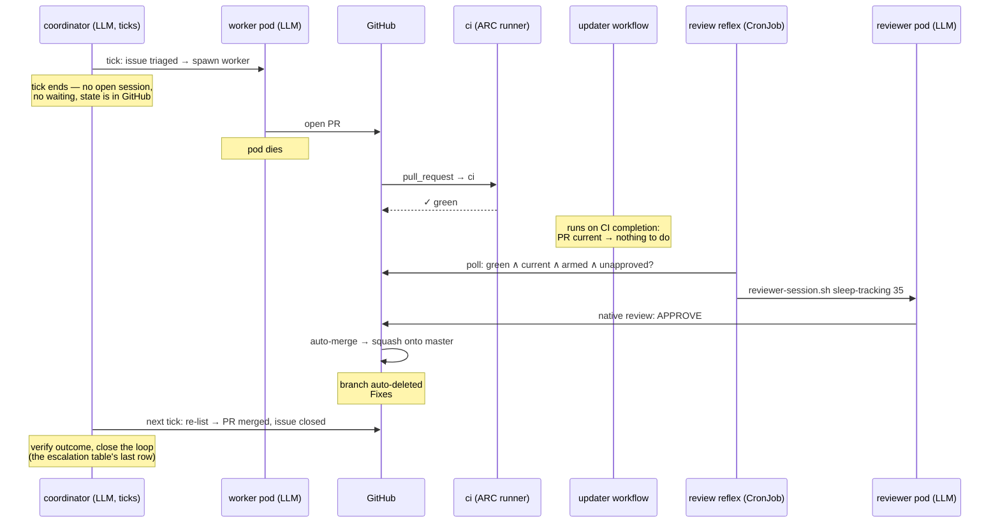
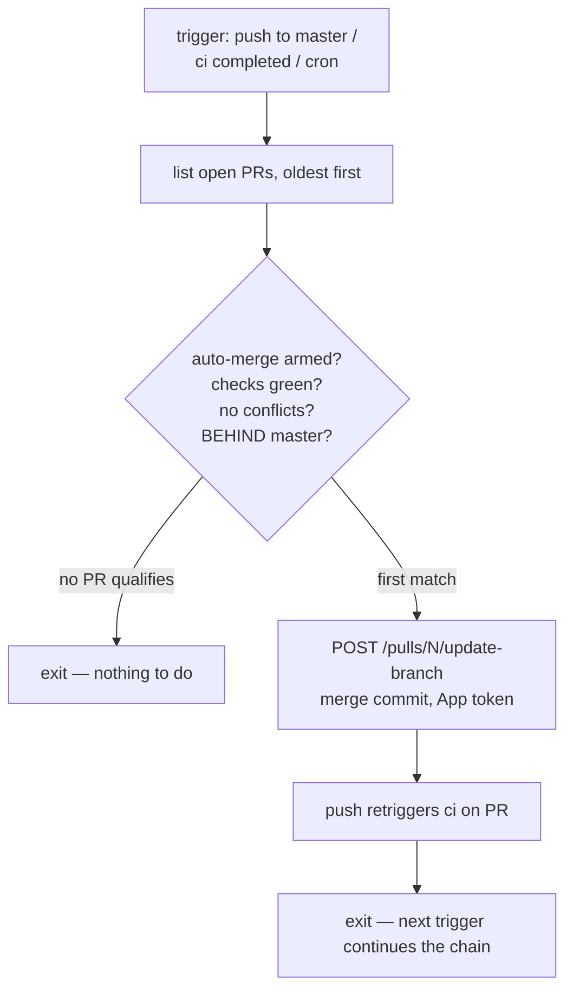
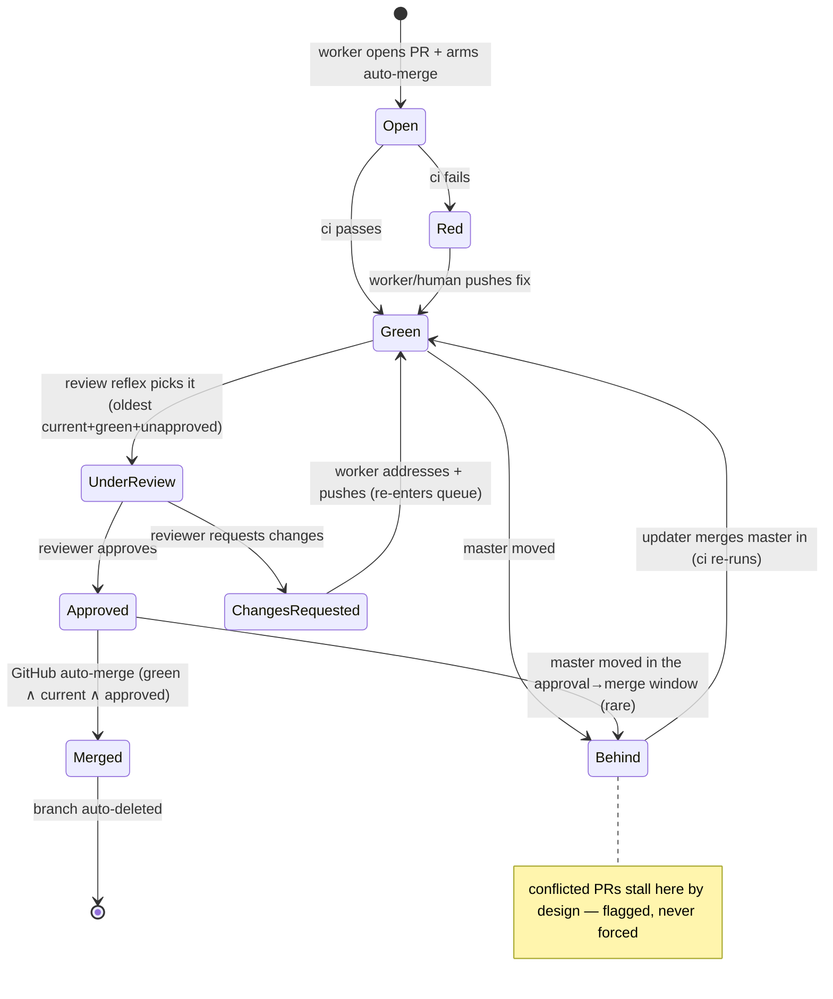

# Deterministic merge path — serialized auto-update + auto-merge (FU-041)

**Status: built (2026-07-03), phases 1–3 committed, pending operator wiring.** Tracked as FU-041 in
[`../follow-ups.md`](../follow-ups.md). The pieces below are landed as code; what remains is one-time
operator setup (org secrets, `tofu -chdir=tofu/github apply`, `kubectl apply` the CronJob) — see
[`../follow-ups.md`](../follow-ups.md) FU-041 for the exact checklist. Artifacts:
`{sleep-tracking,snore-recorder}/.github/workflows/update-pr-branch.yml` (updater),
[`../../agents/review-reflex.sh`](../../agents/review-reflex.sh) +
[`../../agents/coordinator/review-reflex.yaml`](../../agents/coordinator/review-reflex.yaml) (review reflex),
and the `gh pr merge --auto --squash` arming step in [`../../agents/agent-session.sh`](../../agents/agent-session.sh).

The last leg of the NL→auto-merged pipeline ([`workflow.md`](workflow.md)): how an approved, green
agent PR actually lands on master — **without an LLM making any merge decision**. LLMs author code
(worker) and author the review verdict (reviewer); everything that *sequences* — when to update a
branch, when to dispatch the reviewer, when to merge — is GitHub events plus boolean conditions.

## The problem

The rulesets ([`tofu/github/repo_rulesets.tf`](../../tofu/github/repo_rulesets.tf)) require an
**up-to-date branch** (`strict_required_status_checks_policy = true`) before merge, but nothing
updates PR branches (`allow_update_branch = false` — and that flag only controls the UI
*suggestion*; the REST update-branch endpoint works regardless). A PR that falls behind master
stalls silently: auto-merge is armed, approval given, CI green — and nothing happens, forever.

Two interacting rules shape every option below:

- `strict_required_status_checks_policy = true` — the branch must contain master's tip to merge.
  This is what guarantees **tested tree == landed tree** (no semantic-conflict skew). We keep it.
- `dismiss_stale_reviews_on_push = true` — *any* push to the PR branch (including an update-branch
  merge commit that doesn't change the diff) dismisses the reviewer's approval. Each dismissed
  approval costs a reviewer re-run. We keep it (it's the "new commits re-open the gate" security
  property) and design the ordering so it never fires on a live approval.

## Constraints

1. **Deterministic** — no LLM in the merge mechanics. (The reviewer's *verdict* stays an LLM by
   design — that's Gate B in `workflow.md`. Its *scheduling* must not be.)
2. **Private repos on GitHub Team** — both agent-target repos are private
   (`tofu/github/repos.tf`); GitHub's native merge queue needs Enterprise Cloud for private repos.
3. **Unified** — one process that behaves identically if a repo later goes public (or a future
   private repo joins). No public/private split.
4. **Sized for the platform, not for today.** Today's traffic (2 repos, mostly one fixer PR at a
   time) makes every option look cheap — that's not the design target. The target is **multiple
   IDP-sized stacks** (see `/workspace/idp`: a TARA-Login fork, Ory Hydra, an identity-store
   service, a passkey component + an `idp-iac` repo per the FU-025 per-stack model — ≈4–5 repos
   with the ADR-082 full-stack gate in CI), each generating agent PRs and Renovate PRs. The scarce
   units at that scale: **reviewer runs** (one operator subscription, shared globally with the
   coordinator) and **ARC runner pool time** (self-hosted wall clock — gates merge latency, and
   the full-stack gate is ~20 min, not ~8). See §Scaling model.

## Options considered

| | Blanket auto-update (action on every master push) | **Head-of-line serializer (chosen)** | No-strict + auto-revert | Native merge queue | Coordinator-LLM merges |
|---|---|---|---|---|---|
| Works on private/Team | ✓ | ✓ | ✓ | ✗ (Enterprise Cloud) | ✓ |
| Deterministic | ✓ | ✓ | ✓ | ✓ | ✗ |
| Tested tree == landed tree | ✓ | ✓ | ✗ (red-master windows) | ✓ | ✓ |
| CI cycles for N concurrent PRs | ~N + N(N−1)/2 | **~2N−1** | ~N (+revert churn) | ~2N | ~2N−1 |
| Reviewer runs for N PRs | up to N(N+1)/2 | **N** | N | N | N |
| Post-incident forensics | ok | ok (landed SHA has its check run) | poor (breakage lands first) | best | ok |
| Notes | The O(N²) storm; also the surveyed action (`allonsy-studio/actions-pr-auto-update`) hard-skips bot PRs → useless for `homelab-agents[bot]` | | Philosophically fits breaker/fixer, but agents branch from red master | Rejected also for the split process (constraint 3) | Rejected by constraint 1 |

## Chosen design

Four deterministic pieces around the existing gates:

1. **Worker arms auto-merge** at PR creation: `gh pr merge <N> --auto --squash` (already documented
   in `agents/reviewer-session.sh`'s header; becomes a mandatory step in `agent-session.sh`).
2. **Updater** — a GitHub Actions workflow per repo running
   [`adRise/update-pr-branch`](https://github.com/adRise/update-pr-branch) (source-audited
   2026-07-03: no bot-PR filter, unlike the `allonsy-studio` action). Config:
   `required_approval_count: 0` (update *before* review — see ordering, below), `sort: created` +
   `direction: asc` (FIFO; the action's default is newest-first), `require_auto_merge_enabled:
   true`. It updates **exactly one PR per run** — the oldest open PR that is green, auto-merge-armed,
   conflict-free, and behind — via the update-branch API (merge commit; the endpoint cannot rebase,
   which is what we want — no history rewrite, no force-push, a stale worker clone can still
   `git pull`). Triggers: `push` to master, CI-workflow completion, and a cron sweeper
   (catches a PR that goes green while master is quiet).
3. **Review reflex** — the *coordinator subsystem's* deterministic half: a CronJob in ns
   `agent-coordinator` (it holds both reviewer secrets), pure bash + `gh`, every ~5 min: across
   the agent repos, list open PRs; filter **green AND up-to-date AND auto-merge-armed AND
   unapproved AND no changes-requested**; pick the oldest **one per repo** (within a repo, reviews
   must serialize — see below); run `agents/reviewer-session.sh <repo> <pr>` for each, **capped at
   K concurrent reviewer pods globally** (start K=2). Cross-repo reviews can't invalidate each
   other (masters move independently), so the per-repo serialization that protects review
   economics costs nothing across repos; K exists only to protect the shared subscription quota.
   Anything it *can't* mechanically progress (conflict, round limit, flip-flop — see the
   escalation table) it **labels for the coordinator** rather than acting on. Polling-first per
   the trigger doctrine in [`workflow.md`](workflow.md) §Triggers; a webhook edge-trigger can
   lower latency later.
4. **GitHub auto-merge** completes the PR the moment approval lands (the PR is already green and
   current — the reflex only reviews PRs in that state). Nobody — human or LLM — clicks merge.

### Reflexes vs judgment — where the coordinator sits

These reflexes are **not a second controller beside the coordinator** — they are the mechanical
transitions of the same level-triggered reconciler described in [`workflow.md`](workflow.md),
extracted so they never cost an LLM turn. [`README.md`](README.md) already states the rule:
*"don't put an agent where a status check will do."*

The coordinator **keeps start-to-finish ownership of every issue** as an overseer:

- **It reads freely** — discovery is not mutation: `gh pr view`, `kubectl get`, Grafana/MCP,
  transcripts, whatever it needs to judge a situation.
- **It writes only coordination state** — labels, comments, issue/PR lifecycle. Code, branches,
  approvals, and merges are never its verbs; those go through delegated worker/reviewer sessions
  and the deterministic gates (ADR-079: agents propose, GitOps applies).
- **It is never woken for a decision-free transition** — those run as the reflexes below.
- **It is the tie-breaker** — when worker and reviewer disagree (approve↔changes flip-flop, or a
  fix round that argues the review is wrong), the coordinator reads both sides and rules.

| event | who acts | what happens |
|---|---|---|
| PR green + behind | reflex (updater workflow) | update-branch API call |
| PR green + current + unapproved | reflex (review CronJob) | dispatch reviewer session |
| approval lands | reflex (GitHub auto-merge) | merge, delete branch |
| update-branch returns 422 (conflict) | reflex labels → **coordinator decides** | usually: close the PR and re-dispatch the original worker fresh from new master (workers are pure functions — re-running one is cheaper and cleaner than a rebase-surgeon session); a dedicated conflict-resolution session only when the diff is expensive to regenerate |
| reviewer requests changes, rounds left | reflex (the reconciler's `changes-requested → round N+1` transition, `workflow.md`) | spawn a fresh worker with PR + review thread; PR re-enters the queue mechanically |
| rounds exhausted (`workflow.md` §Hazards: bounded rounds) or worker↔reviewer flip-flop | reflex labels → **coordinator tie-breaks** | reads the diff + review thread (discovery), rules: re-dispatch with clarified instructions, close as not-mergeable, or escalate to the human |
| CI red beyond T hours | reflex labels → **coordinator decides** | re-dispatch, park, or escalate |
| PR merged (issue auto-closed via `Fixes #N`) | **coordinator closes the loop** | next tick: verify the outcome actually holds; comment; reopen + re-dispatch if it doesn't |

Two properties fall out. First, the merge path stays fully deterministic (constraint 1): every
box on the mechanical rows is a workflow or a CronJob. Second, nothing ever leaves the
coordinator's authority: the reflexes are *its* machinery (they live in its namespace, they report
into its label vocabulary), so from the issue's point of view there is one owner from triage to
close — the coordinator just isn't billed an LLM turn for the trivial 90 %. Its brief loses the
*mechanical* "trigger the reviewer" step and gains the exception plays in the table.

### Why update-before-review, and why reviews serialize per repo

Two orderings were on the table:

- *Review first, then update* (the adRise default, `required_approval_count ≥ 1`): approval lands →
  PR is behind → updater pushes → **`dismiss_stale_reviews_on_push` eats the approval** → re-review.
  Every behind-PR costs 2+ reviewer runs.
- *Update first, review last* (`required_approval_count: 0`): the PR is brought current and green
  **before** the reviewer ever runs; approval is the final event and auto-merge fires immediately.
  One reviewer run per PR.

But update-before-review only holds if reviews are **serialized within a repo**: if the reflex
eagerly dispatched reviews for *all* current+green PRs in one repo (say 3 PRs opened against the same master tip
— none is "behind"), the first merge makes the other two stale, their updates dismiss their fresh
approvals, and we're back to double reviews. Hence: the review reflex dispatches **one review at a time per
repo**, exactly like the updater updates one at a time per repo. Reviews in *different* repos
parallelize freely (a merge in repo X can't stale a PR in repo Y). The cost is within-repo review
latency (they queue); at ~4–8 min per review on an autonomous pipeline, that's irrelevant.

The only remaining double-review window: master moves in the seconds between "approval submitted"
and "auto-merge executes" (e.g. an operator direct-push, which bypasses the gates as OrgAdmin).
Then that PR is updated and re-reviewed once. Rare, self-healing, counted in scenario L below.

### Sequence — one PR, quiet master (scenario S)

Totals: **1 CI cycle, 1 reviewer run, 0 updates.** Identical to today's happy path — the machinery
only wakes when PRs stack up or master moves.

**Timing: nobody waits on anybody.** Between its ticks the coordinator isn't running at all — it
holds *state, never a call stack* (`workflow.md`). It learns "issue fixed" the same way it learns
every other fact: by re-listing on the next tick and finding the merged PR + auto-closed issue.
It does not need to have *spawned* the review to know the outcome, any more than it needs to spawn
CI to read CI results — the verdict is a native PR review, durable state. (If the LLM-coordinator
were the review spawner, it would have to be awake at the right moment — i.e. LLM-polling a
boolean every few minutes, a billed turn per poll for a decision with zero content.) The reflex
cron adds ≤5 min latency against a 8–20 min CI cycle; when that ever matters, the CI workflow's
final step can ping the reflex directly (the edge-trigger-on-top-of-polling pattern from
`workflow.md` §Triggers) and the cron delay drops to zero. For tasks predicted small, the
coordinator may also stay hot through the whole cycle and verify in-session — the "hot tick"
micro-opt in `workflow.md` §Worker = a pure function (watch and nudge, never dispatch).

### Updater decision logic

One update per invocation, oldest first. A red or conflicted PR is *skipped, not blocking*: the
next qualifying PR gets the slot, and the skipped PR just sits (red → worker/human fixes it;
conflicted → can't be auto-updated, needs a coordinator decision — the review reflex never
reviews it because it can never become "current").

### PR lifecycle

## Worked examples

Assumptions (today's numbers): `ci` ≈ **8 min** on ARC (~5 min cold start, improves with FU-015);
reviewer session ≈ **4 min**; reflex tick 5 min; updates are API calls (free) that each induce
one CI cycle.

### S — one agent PR, quiet master

Covered by the sequence diagram above. **1 CI, 1 review, 0 updates**, merged ~15 min after open.
This is ~90 % of real traffic (the coordinator mostly runs one fixer at a time today).

### M — three concurrent fixer PRs (a coordinator batch)

PRs **A, B, C** open within minutes of each other, all branched from the same master tip, all go
green. None is "behind" yet, so the updater is idle; the review reflex serializes the reviews.

```mermaid
gantt
    dateFormat  HH:mm
    axisFormat  %H:%M
    title 3 concurrent PRs, serialized (times illustrative)
    section PR A
    ci (initial)            :a1, 00:00, 8m
    review → approve → MERGE :a2, 00:10, 5m
    section PR B
    ci (initial)            :b1, 00:00, 8m
    updater: merge master in :b2, 00:15, 2m
    ci (after update)       :b3, 00:17, 8m
    review → approve → MERGE :b4, 00:25, 5m
    section PR C
    ci (initial)            :c1, 00:00, 8m
    updater: merge master in :c2, 00:30, 2m
    ci (after update)       :c3, 00:32, 8m
    review → approve → MERGE :c4, 00:40, 5m
```

| step | event | CI cycles | reviewer runs |
|---|---|---|---|
| 1 | A, B, C open; initial CI ×3 (parallel) | 3 | |
| 2 | reflex dispatches review of **A** (oldest) → approve → auto-merge | | 1 |
| 3 | master moved → updater updates **B** (oldest behind) → CI | 1 | |
| 4 | reflex dispatches review of **B** → approve → auto-merge | | 1 |
| 5 | updater updates **C** → CI | 1 | |
| 6 | reflex dispatches review of **C** → approve → auto-merge | | 1 |
| | **totals** | **5** | **3** |

Elapsed ≈ 45 min, fully unattended. Compare blanket-update + eager review for the same batch:
6 CI cycles and up to 6 reviewer runs (every merge dismisses every sibling's approval) — the gap is
modest at N=3 and quadratic from there.

### L — Renovate Monday: 10 dep PRs + 1 agent PR + one operator direct-push

08:00 Renovate opens 10 dep-bump PRs (ungrouped worst case). 09:00 the coordinator's worker opens
an agent PR (position 11). 09:30 the operator direct-pushes a hotfix to master (OrgAdmin bypass) —
it lands in the seconds between PR-6's approval and its auto-merge, forcing one re-cycle.

| | CI cycles | reviewer runs |
|---|---|---|
| 11 initial runs | 11 | |
| 10 head-of-line updates (every PR after the first) | 10 | |
| 11 serialized reviews | | 11 |
| hotfix hits the approval→merge window of PR-6: +1 update, +1 re-review | 1 | 1 |
| **totals** | **22** | **12** |

Elapsed: each post-merge cycle is update→CI→review ≈ 13 min → **~2.5–3 h** to drain, unattended.
Blanket-update for the same morning: 11 + 55 = **66 CI cycles** and a comparable review count —
roughly a full day of runner wall time and 5× the subscription quota, for the same 11 merges.

Levers that shrink L before it ever hurts (FU-014, decide at Renovate setup):

- **Grouping** — Renovate group presets (e.g. all non-major weekly) collapse 10 PRs into 1–2.
  The single biggest lever; turns L into M.
- `rebaseWhen: conflicted` — Renovate must NOT self-rebase for freshness (its default `auto`
  detects strict mode and would race our updater; two writers, one branch). The updater owns
  freshness for *all* PRs, Renovate only rebases its own conflicts.
- **Policy question (open):** do dep bumps need the LLM reviewer, or is green CI + the lockfile
  diff enough? Skipping the reviewer for `renovate[bot]` PRs (label-gated in the review reflex)
  removes 10 of the 12 reviewer runs — but weakens Gate B for supply-chain-shaped changes. Decide
  when FU-014 lands; default to reviewing everything.

## Scaling model — from today to multiple IDP-sized stacks

### Per-repo invariant

Per merged PR in steady state: `CI cycles = 1 initial + 1 update` (the update is skipped when
master hasn't moved) and `reviewer runs = 1`, plus one extra of each per master-interruption that
lands in an approval→merge window. For a batch of N concurrent PRs *in one repo*:

| N concurrent (one repo) | serializer CI / reviews | blanket CI / reviews |
|---|---|---|
| 1 | 1 / 1 | 1 / 1 |
| 3 | 5 / 3 | 6 / up to 6 |
| 10 | 19 / 10 | 55 / up to 55 |

This O(N) vs O(N²) difference is *within-repo*; across repos everything composes linearly because
each repo has its own master, its own updater chain, and its own review queue.

### Platform extrapolation

Reference stack ≈ **IDP** (`/workspace/idp`): TARA-Login fork (Java/Spring), identity-store
service, passkey component, `idp-iac` → **~4–5 repos**, of which the service repos carry the
ADR-082 **full-stack ephemeral gate** in CI (k3d bring-up + decision-table suite): call it
**~20 min/cycle**, vs ~8 min for a lint-and-unit repo. Platform target for sizing: **sleep stack +
IDP + one more IDP-sized stack ≈ 12–15 agent-target repos.**

Weekly load assumptions (deliberately round; the point is which resource saturates first):

| source | volume/week | reviews | CI cycles |
|---|---|---|---|
| agent PRs, ~2 per repo × 14 repos | 28 | 28 | ~50 (initial + update) |
| Renovate, grouped weekly, ~1.5 PRs per repo | 21 | 21 (if reviewed — see below) | ~40 |
| re-cycles (interruptions, flakes, ~10 %) | — | ~5 | ~9 |
| **total** | **~50 merges** | **~54** | **~100** |

Against the three shared resources:

- **Reviewer throughput (the binding constraint).** ~54 reviews × ~4–8 min ≈ **4–7 h of reviewer
  wall time per week**, all drawn from ONE operator subscription that also feeds the coordinator.
  Weekly average: fine. The failure mode is the **burst**: Renovate Monday across 14 repos =
  ~21 reviews in one morning ≈ 1.5–3 h at K=2, and subscription rate-limit windows (5-hour
  blocks) mean a big enough burst starves the coordinator for the rest of the window. Levers, in
  order: Renovate **grouping + per-stack schedule staggering** (Mon=sleep, Tue=IDP, …) — flattens
  the burst for free; **CI-only merges for dep-bump PRs** (the review reflex skips `renovate[bot]`,
  approval waived per-class — requires making the approval gate label- or author-conditional,
  i.e. a ruleset bypass for a "deps" App or dropping required-approval on dep PRs; policy decision,
  weakens Gate B for supply-chain changes); a **second subscription** or paid-API reviewer for
  overflow (decorrelation doctrine says the reviewer model must stay ≥ author model — an
  OpenRouter cheap-model reviewer is NOT an acceptable overflow). The serializer already pins
  reviews to the theoretical floor (1/PR); past that floor, only policy and scheduling help —
  **no merge-path mechanism can reduce it further**, which is exactly why the O(N²) options are
  disqualified at this scale (Monday would cost ~200+ reviews instead of ~21).
- **ARC runner pool.** ~100 CI cycles/week, dominated by the ~20-min full-stack gates ≈ **~25 h
  of runner wall time**, burstable across the ephemeral compute tier (the tainted ThinkPads) —
  capacity is fine, but **queueing latency** compounds with serialization: within one busy repo,
  drain rate ≈ 1 merge per (CI + review) ≈ 25–30 min for a full-stack repo. A 10-PR backlog in
  ONE such repo takes a working day to drain. Mitigations: FU-015 (warm image, halves the
  constant), splitting the full-stack gate to run only on the update-cycle (not the initial push)
  — NOT recommended, it reintroduces skew — or simply accepting that autonomous throughput of
  ~15–20 merges/day/repo is far above any realistic single-repo demand.
- **Updater / API.** Free at any plausible scale (one API call per merge). The per-repo workflow
  file is identical everywhere → extract to a **reusable org workflow** at the 3rd repo, so 15
  repos = 15 three-line callers, one implementation.

### What breaks first, and what to watch

1. **Reviewer quota on burst days** → stagger Renovate; decide the dep-bump review policy
   *before* onboarding the second stack.
2. **Single-repo drain latency** in full-stack-gate repos → FU-015; keep batches small (the
   coordinator already runs few workers concurrently).
3. Nothing in the merge mechanics itself — per-repo chains are independent, the reflexes are
   stateless (level-triggered re-list every tick), and adding a repo = adding a workflow caller +
   a `protected_repos` entry in `tofu/github/`.

**Out of scope here:** cross-repo *coordinated* changes (e.g. an IDP schema change + the
sleep-tracking "Others" page consuming it). The serializer lands PRs per-repo; ordering across
repos is a coordinator/human concern (land provider first, consumer after — standard
contract-versioning discipline), not a merge-path mechanism.

## Failure modes & edge cases

- **Red PR** — skipped by updater and review reflex; blocks nothing until the reflex's staleness
  timer (red beyond T hours) labels it for the coordinator, which decides: re-dispatch, park, or
  escalate.
- **Conflicted PR** — update-branch API returns 422; the action skips it. It can never become
  current → never reviewed → never merged. Needs a worker re-run or human rebase. The updater
  workflow should label it (`merge-conflict`) so triage sees it.
- **Reviewer requests changes** — auto-merge stays blocked (changes-requested is a hard block
  independent of approvals). Worker pushes a fix → that push dismisses nothing (there's no
  approval) but re-triggers CI → PR re-enters the queue. The *request-changes review itself*
  survives new pushes; the reviewer must re-review and approve — the reflex must treat
  "changes-requested by reviewer-bot + new commits since" as reviewable again.
- **Flaky CI** — a flaky red steals the PR's queue slot (next PR gets updated first). Acceptable:
  FIFO is a fairness preference, not a correctness requirement.
- **Concurrent triggers / locking** — cron tick + wake-up ping firing together must never
  double-dispatch. Two layers:
  1. *Serialize the reconciler (best-effort, throughput):* the CronJob runs with
     `concurrencyPolicy: Forbid`; the wake path creates its Job under a **fixed name**
     (`review-reflex-manual`) — `kubectl create` is atomic, `AlreadyExists` = someone's already
     reconciling, exit 0. A "missed" wake loses nothing: the wake carries urgency, never
     information — the next cron tick re-lists (level-triggered backstop).
  2. *Deterministic child names (correctness):* the reviewer Job is named
     `review-<repo>-<pr>-<headsha8>`, the worker Job `fix-<repo>-<issue>-r<round>` (mechanizing
     `workflow.md`'s idempotency key). Create-with-deterministic-name **is** an atomic
     test-and-set at the API server — two racing reflex instances can't both spawn it, and a new
     push (new head SHA) legitimately mints a new name while event re-delivery doesn't.
  The updater needs neither: Actions `concurrency` groups serialize its runs natively, and
  update-branch is idempotent at GitHub (422 "already up to date"). Worst residual race anywhere
  is a duplicate review — wasted tokens, never a bad merge (the merge gate is GitHub's, evaluated
  once).
- **Updater token** — must be an App token, not `GITHUB_TOKEN` (its pushes wouldn't re-trigger
  CI). Minted from a **dedicated, minimal `homelab-merge` App** (`actions/create-github-app-token`,
  App id + private key as the `MERGE_GH_APP_*` org Actions secrets). Grant:
  contents:write (update-branch) + pull_requests:read + checks:read + statuses:read
  (`require_passed_checks`) + metadata:read — **no Issues, no PR write**. Chosen over reusing
  `homelab-agents` (which the design first proposed) because reuse would copy the *agents* key —
  which also mints the coordinator token (issues:write, multi-repo, merge) — into a GitHub org
  Actions secret readable by the **semi-trusted CI plane** (an in-repo agent PR branch can add a
  workflow that reads org secrets). The dedicated App keeps that CI-exposed key least-privilege: a
  leak grants only branch-updates. No self-approval conflict (the updater only pushes + reads, never
  approves; `require_last_push_approval = false`) — so the distinct identity is for blast-radius +
  audit legibility, not a hard GitHub constraint. Bootstrap: `scripts/github-merge-app-bootstrap.sh`;
  published to Actions by `tofu/github/actions_secrets.tf` via `devbox run github-tofu apply`.
- **Review reflex dies** — PRs accumulate approved=0; nothing merges; nothing breaks. It's a CronJob:
  next tick resumes. Same level-triggered posture as the coordinator doctrine.
- **Worker still pushing while updater updates** — prevented by ordering, not locking: the updater
  only touches PRs that are green + auto-merge-armed, and arming happens at the *end* of the worker
  session. A worker addressing review feedback re-pushes to its own branch — but at that moment the
  PR has no approval and isn't behind-and-armed-and-green in a way that attracts the updater
  mid-push; worst case a merge-commit lands under it and `git pull` resolves (merge, never rebase —
  no rewritten history, no force-push confusion).

## Rollout

Each phase is independently shippable and reversible (delete the workflow / suspend the CronJob →
you're back to today's coordinator-driven flow).

1. **Phase 1 — updater.** Add `.github/workflows/update-pr-branch.yml` to both agent repos
   (identical file; extract to a reusable org workflow if a third repo appears). Org secrets for
   the App token mint. *Observable win: behind-PRs stop stalling, even with the coordinator still
   triggering reviews.*
2. **Phase 2 — review reflex.** CronJob manifest in `agents/coordinator/` (ns `agent-coordinator`,
   reuses `coordinator-claude` + `reviewer-git` Secrets + `reviewer-session.sh`) — explicitly part
   of the coordinator subsystem, not a peer controller. Coordinator brief: replace the mechanical
   "trigger the reviewer" step with the exception plays from the escalation table (conflict →
   close + re-dispatch fresh; round limit / flip-flop / stale-red → decide or escalate).
3. **Phase 3 — hygiene.** `agent-session.sh`: make `gh pr merge --auto --squash` a mandatory
   post-PR step. Updater labels conflicted PRs. `tofu/github/repos.tf`: leave
   `allow_update_branch = false` (irrelevant to the API; the UI suggestion stays off).
4. **Phase 4 — later.** Edge-triggers for the review reflex, in escalating order of effort —
   every *automated* actor already runs in-cluster (worker pod, reviewer pod, ARC runner incl.
   the updater workflow's job), so each can wake the reflex with a one-line curl / `kubectl create
   job --from=cronjob/review-reflex` as its last step: **no public webhook receiver needed**. A
   real GitHub webhook (HMAC-verified receiver behind a `cloudflared` tunnel, à la
   `ha.teststuff.net` but signature-gated since GitHub can't mTLS) is only ever needed to react
   fast to *human* actions at github.com — latency-tolerant, covered by the poll; build it last
   if at all. Either way the receiver is a **stateless doorbell**: verify, wake the reflex,
   which re-lists from GitHub — never act on payload content (deliveries are at-least-once and
   missable; `workflow.md` §Triggers). Plus: Renovate config per the L-scenario levers (FU-014),
   FU-015 runner image (halves cycle time).

## Open questions

- Review dep-bump PRs with the LLM reviewer, or CI-only? (See scenario L. Default: review.)
- Squash vs merge for auto-merge: squash keeps master linear and is what the worker arms today —
  any reason for merge commits on agent PRs? (Default: squash.)
- Review reflex as in-cluster CronJob vs a GitHub Actions cron: CronJob chosen because the reviewer
  secrets live in ns `agent-coordinator` and must not become GitHub org secrets — and because the
  reflex is coordinator machinery, so it belongs in the coordinator's namespace and label
  vocabulary. Revisit only if the cluster/GitHub trust boundary changes.
- The staleness timer T (escalation table): start 24 h, tune from transcripts. The fix-round
  bound already lives in [`workflow.md`](workflow.md) §Hazards ("max review rounds, e.g. 3") —
  that stays the single knob; this doc doesn't define its own.
