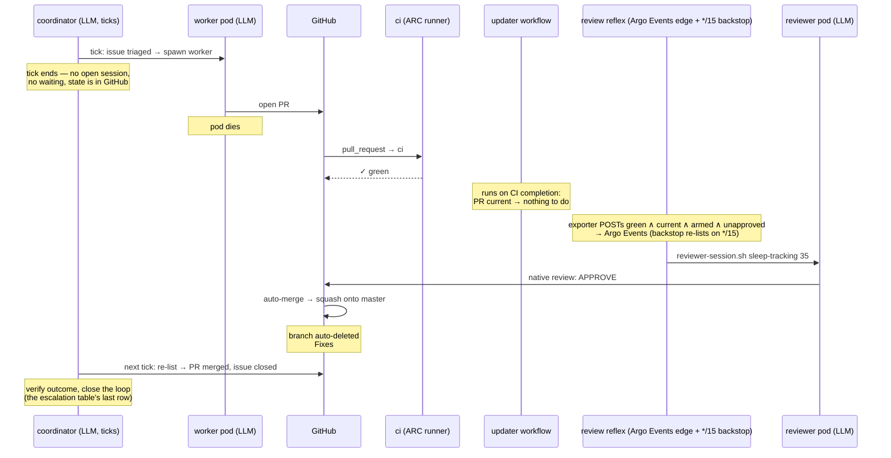
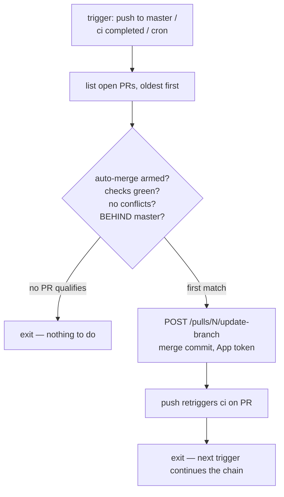

# Deterministic merge path — serialized auto-update + auto-merge (FU-041)

**This doc owns how a PR gets from open to merged** — the deterministic reflexes, who owns which
transition, and the worked scenarios. The lint-checked state machine is
[`merge-path-fsm.md`](merge-path-fsm.md) / `merge-path-fsm.yaml`; the `-iac` variant is
[`iac-lane.md`](iac-lane.md).

**Where the machinery lives:** the updater is **in-cluster** (ADR-111, cutover executed
2026-08-26/homelab#745) — the exporter's `maybe_dispatch_behind` edge + a `*/15` Argo CronWorkflow
([`../../agents/coordinator/update-pr-argo.yaml`](../../agents/coordinator/update-pr-argo.yaml))
running [`../../agents/update-pr-branch.sh`](../../agents/update-pr-branch.sh) as the
`homelab-merge` App via ESO ([`updater-git.yaml`](../../agents/coordinator/updater-git.yaml));
renovate-approve remains a **reusable org workflow**
([`renovate-approve.reusable.yml`](../../.github/workflows/renovate-approve.reusable.yml)) with
~3-line callers; auto-merge arming (`gh pr merge --auto --squash`) is in
[`../../agents/agent-session.sh`](../../agents/agent-session.sh); Renovate's shared classification
is [`../../.github/renovate-global.json`](../../.github/renovate-global.json).

> **Update (2026-07-17, ADR-093 — Argo Workflows + Events as the platform orchestration engine):** the
> review path is now **event-driven** and the reflexes run as **Argo CronWorkflows**, not k8s CronJobs.
> The github-exporter (the ONE poller) POSTs each reviewable PR (green ∧ unapproved ∧ armed — the same
> predicate `review-reflex.sh` uses, incl. `changes_requested` re-review rounds **with the full
> `reviewable_again` arm since 2026-07-21**: newest NON-MERGE commit must post-date the newest verdict.
> The first cut delegated that check to the reviewer's STEP-0 guard — and an exporter restart during
> #60's changes-requested window re-POSTed a just-verdicted head, whose "correct" STEP-0 refusal
> latched `agent/error` and froze the PR's own fix round for 5 h. MP-T04 in the FSM carries the
> guard; private repos null commit dates → the edge stays off there, the backstop owns re-reviews) to an Argo Events
> **webhook EventSource** → a **Sensor** submits a `review` **WorkflowTemplate** → `reviewer-session.sh
> <repo> <pr>` for that exact PR (near-instant, no GraphQL poll; generalizes the ADR-084 `sync.yaml`
> webhook). The old `*/5` review-reflex survives only as a **`*/15` CronWorkflow BACKSTOP** for anything
> the edge-trigger missed. Manifests: [`../../agents/coordinator/review-argo.yaml`](../../agents/coordinator/review-argo.yaml)
> + [`../../agents/coordinator/reflexes-argo.yaml`](../../agents/coordinator/reflexes-argo.yaml) (proven
> E2E on oracle-fleet#37, merged). The `CronJob`/polling framing throughout the rest of this doc is the
> original design; the mechanics below now read as: **edge-trigger primary, `*/15` backstop.**

> **Update (ADR-111 — the updater is IN-CLUSTER; build = [stint](chainless-redesign.md) S7,
> homelab#741; CUTOVER EXECUTED 2026-08-26, homelab#745):** the reusable workflow, its per-repo
> callers and their GitHub cron are RETIRED for the ADR-093 shape the review path already uses,
> and the `MERGE_GH_APP_*` org Actions secrets went with them. The evidence (91–96 % of updater
> runs were the GitHub cron backstop; ~4,800 hosted min/mo at the 1-min billing floor, #698) is
> in ADR-111; the current anchors are the FSM's **MP-T02** (update) and **MP-T06** (conflict).
> Where prose below still says *action* or *reusable workflow*, read it as design-era narrative.

> **The machine itself is MODELED, not just described:** [`merge-path-fsm.yaml`](merge-path-fsm.yaml)
> is the machine-readable state/event/guard model — every guard anchored to code (grep-checked by
> `devbox run merge-path-lint`, drift fails CI), every known-missing guard a dispositioned entry in
> the gap register. The generated view: [`merge-path-fsm.md`](merge-path-fsm.md). THIS doc is the
> design narrative (why); the FSM files are the current-state truth (what/where).

The last leg of the NL→auto-merged pipeline ([`workflow.md`](workflow.md)): how an approved, green
agent PR actually lands on master — **without an LLM making any merge decision**. LLMs author code
(worker) and author the review verdict (reviewer); everything that *sequences* — when to update a
branch, when to dispatch the reviewer, when to merge — is GitHub events plus boolean conditions.

## The problem

The rulesets ([`tofu/github/repo_rulesets.tf`](../../tofu/github/repo_rulesets.tf)) require an
**up-to-date branch** (`strict_required_status_checks_policy = true`) before merge, but nothing
updates PR branches (`allow_update_branch = false` — and that flag only controls the UI
*suggestion*; the REST update-branch endpoint works regardless). A PR that falls behind master
stalls silently: auto-merge is armed, approval given, CI green — and nothing happens, forever.

Two interacting rules shape every option below:

- `strict_required_status_checks_policy = true` — the branch must contain master's tip to merge.
  This is what guarantees **tested tree == landed tree** (no semantic-conflict skew). We keep it.
- `dismiss_stale_reviews_on_push = true` — *any* push to the PR branch (including an update-branch
  merge commit that doesn't change the diff) dismisses the reviewer's approval. Each dismissed
  approval costs a reviewer re-run. We keep it (it's the "new commits re-open the gate" security
  property) and design the ordering so it never fires on a live approval.

## Constraints

1. **Deterministic** — no LLM in the merge mechanics. (The reviewer's *verdict* stays an LLM by
   design — that's Gate B in `workflow.md`. Its *scheduling* must not be.)
2. **Private repos on GitHub Team** — both agent-target repos are private
   (`tofu/github/repos.tf`); GitHub's native merge queue needs Enterprise Cloud for private repos.
3. **Unified** — one process that behaves identically if a repo later goes public (or a future
   private repo joins). No public/private split.
4. **Sized for the platform, not for today.** Today's traffic (2 repos, mostly one fixer PR at a
   time) makes every option look cheap — that's not the design target. The target is **multiple
   IDP-sized stacks** (see `/workspace/idp`: a TARA-Login fork, Ory Hydra, an identity-store
   service, a passkey component + an `idp-iac` repo per the FU-025 per-stack model — ≈4–5 repos
   with the ADR-082 full-stack gate in CI), each generating agent PRs and Renovate PRs. The scarce
   units at that scale: **reviewer runs** (one operator subscription, shared globally with the
   coordinator) and **ARC runner pool time** (self-hosted wall clock — gates merge latency, and
   the full-stack gate is ~20 min, not ~8). See §Scaling model.

## Options considered

| | Blanket auto-update (action on every master push) | **Head-of-line serializer (chosen)** | No-strict + auto-revert | Native merge queue | Coordinator-LLM merges |
|---|---|---|---|---|---|
| Works on private/Team | ✓ | ✓ | ✓ | ✗ (Enterprise Cloud) | ✓ |
| Deterministic | ✓ | ✓ | ✓ | ✓ | ✗ |
| Tested tree == landed tree | ✓ | ✓ | ✗ (red-master windows) | ✓ | ✓ |
| CI cycles for N concurrent PRs | ~N + N(N−1)/2 | **~2N−1** | ~N (+revert churn) | ~2N | ~2N−1 |
| Reviewer runs for N PRs | up to N(N+1)/2 | **N** | N | N | N |
| Post-incident forensics | ok | ok (landed SHA has its check run) | poor (breakage lands first) | best | ok |
| Notes | The O(N²) storm; also the surveyed action (`allonsy-studio/actions-pr-auto-update`) hard-skips bot PRs → useless for `homelab-agents[bot]` | | Philosophically fits breaker/fixer, but agents branch from red master | Rejected also for the split process (constraint 3) | Rejected by constraint 1 |

## Chosen design

Four deterministic pieces around the existing gates:

1. **Worker arms auto-merge** at PR creation: `gh pr merge <N> --auto --squash` (already documented
   in `agents/reviewer-session.sh`'s header; becomes a mandatory step in `agent-session.sh`).
2. **Updater** — in-cluster since the ADR-111 cutover (2026-08-26, homelab#745):
   [`agents/update-pr-branch.sh`](../../agents/update-pr-branch.sh), dispatched by the exporter's
   `maybe_dispatch_behind` edge (repo-scoped, near-instant) with a `*/15` Argo CronWorkflow
   sweeping the whole stacks.json universe
   ([`update-pr-argo.yaml`](../../agents/coordinator/update-pr-argo.yaml)). Semantics carried over
   from the adRise-action era unchanged: update *before* review (see ordering, below), FIFO
   (oldest first), armed-only, and **exactly one PR per pass** — the oldest open PR that is green,
   auto-merge-armed, conflict-free, and behind — via the update-branch API (merge commit; the
   endpoint cannot rebase, which is what we want — no history rewrite, no force-push, a stale
   worker clone can still `git pull`).
   **Stacked PRs are excluded by arming** (2026-08-05, the `Base:` line): a PR based on an
   unmerged branch is never armed, and the pick is armed-only — the action-era `base: master`
   configuration did the same job by a second route. The conflict labeler (leg 3) is armed-only
   too, so it stays quiet on them.
3. **Review reflex** — the *coordinator subsystem's* deterministic half, in ns `agent-coordinator`
   (it holds both reviewer secrets), pure bash + `gh`. **Now edge-triggered (ADR-093):** the
   github-exporter POSTs a reviewable PR to an Argo Events webhook EventSource → Sensor → `review`
   WorkflowTemplate → `reviewer-session.sh <repo> <pr>` for that exact PR, near-instant. A `*/15`
   **CronWorkflow backstop** (the old `*/5` reflex, generalized) re-lists as a level-triggered
   catch-all for anything the edge missed: across the agent repos, list open PRs; filter
   **green AND up-to-date AND auto-merge-armed AND
   unapproved AND no changes-requested** (*unapproved* = the reviewer bot has no approval at the
   current head — NOT GitHub's `reviewDecision`, which on code-owner-gated repos stays
   `REVIEW_REQUIRED` until the human owner approves; see the edge case below); pick the oldest
   **one per repo** (within a repo, reviews
   must serialize — see below); run `agents/reviewer-session.sh <repo> <pr>` for each, **capped at
   K concurrent reviewer pods globally** (start K=2). Cross-repo reviews can't invalidate each
   other (masters move independently), so the per-repo serialization that protects review
   economics costs nothing across repos; K exists only to protect the shared subscription quota.
   Anything it *can't* mechanically progress (conflict, round limit, flip-flop — see the
   escalation table) it **labels for the coordinator** rather than acting on. Edge-triggered by the
   exporter POST with the `*/15` backstop (ADR-093) — the edge+level pattern from
   [`workflow.md`](workflow.md) §Triggers, now live; double-dispatch is safe (see §Concurrent
   triggers). This collapsed the reflex's separate PR-list GraphQL poll (a rate-limit burn).
4. **GitHub auto-merge** completes the PR the moment approval lands (the PR is already green and
   current — the reflex only reviews PRs in that state). Nobody — human or LLM — clicks merge.

### Reflexes vs judgment — where the coordinator sits

These reflexes are **not a second controller beside the coordinator** — they are the mechanical
transitions of the same level-triggered reconciler described in [`workflow.md`](workflow.md),
extracted so they never cost an LLM turn. [`README.md`](README.md) already states the rule:
*"don't put an agent where a status check will do."*

The coordinator **keeps start-to-finish ownership of every issue** as an overseer:

- **It reads freely** — discovery is not mutation: `gh pr view`, `kubectl get`, Grafana/MCP,
  transcripts, whatever it needs to judge a situation.
- **It writes only coordination state** — labels, comments, issue/PR lifecycle. Code, branches,
  approvals, and merges are never its verbs; those go through delegated worker/reviewer sessions
  and the deterministic gates (ADR-079: agents propose, GitOps applies).
- **It is never woken for a decision-free transition** — those run as the reflexes below.
- **It is the tie-breaker** — when worker and reviewer disagree (approve↔changes flip-flop, or a
  fix round that argues the review is wrong), the coordinator reads both sides and rules.

| event | who acts | what happens |
|---|---|---|
| PR green + behind | reflex (updater workflow) | update-branch API call |
| PR green + current + unapproved | reflex (exporter POST → Argo Events → review WorkflowTemplate; `*/15` CronWorkflow backstop) | dispatch reviewer session |
| approval lands | reflex (GitHub auto-merge) | merge, delete branch |
| update-branch returns 422 (conflict) | reflex labels → **coordinator decides** | usually: close the PR and re-dispatch the original worker fresh from new master (workers are pure functions — re-running one is cheaper and cleaner than a rebase-surgeon session); a dedicated conflict-resolution session only when the diff is expensive to regenerate |
| reviewer requests changes, rounds left | reflex (the reconciler's `changes-requested → round N+1` transition, `workflow.md`) | spawn a fresh worker with PR + review thread; PR re-enters the queue mechanically |
| rounds exhausted (`workflow.md` §Hazards: bounded rounds) or worker↔reviewer flip-flop | reflex labels → **coordinator tie-breaks** | reads the diff + review thread (discovery), rules: re-dispatch with clarified instructions, close as not-mergeable, or escalate to the human |
| CI red beyond T hours | reflex labels → **coordinator decides** | re-dispatch, park, or escalate |
| PR merged (issue auto-closed via `Fixes #N`) | **coordinator closes the loop** | next tick: verify the outcome actually holds; comment; reopen + re-dispatch if it doesn't |
| un-armed `major` devbox bump PR opens (FU-022 gate) | **coordinator owns end-to-end** (never the reflex — it's un-armed) | investigate (dispatch reviewer *even while red* — the review explains the break) → worker fixes breakage if within budget → green + approved → relabel `major/awaiting-human`; a **human** merges. See `agents/coordinator/README.md` §"Dependency major bumps". |

Two properties fall out. First, the merge path stays fully deterministic (constraint 1): every
box on the mechanical rows is a GitHub workflow, an Argo Events Sensor, or an Argo CronWorkflow.
Second, nothing ever leaves the
coordinator's authority: the reflexes are *its* machinery (they live in its namespace, they report
into its label vocabulary), so from the issue's point of view there is one owner from triage to
close — the coordinator just isn't billed an LLM turn for the trivial 90 %. Its brief loses the
*mechanical* "trigger the reviewer" step and gains the exception plays in the table.

**Arming is the boundary between the two.** The review reflex only ever selects auto-merge-**armed**
PRs; everything un-armed is outside its world. The FU-022 major-devbox gate leans on exactly this: a
**`major`** bump is deliberately left **un-armed** (a human merges a major crossing, not the bot), so it
is invisible to the reflex and falls to the **coordinator**, which owns it end-to-end (investigate →
fix-if-in-budget → `major/awaiting-human` → human merge — the new escalation-table row). This keeps the
split collision-free *by construction*: no PR is ever both armed and `major`, so the reflex and the
coordinator can never contend for the same PR. Crucially the coordinator dispatches the major's
investigation review **directly, while the PR is still red** — the review's job there is to *explain* the
break — which is precisely why a major can't ride the reflex (green-only, decision-free) path. Non-major
devbox bumps stay armed and ride the reflex like any other PR. **Proven E2E (2026-07-05):** an opus
coordinator drove sleep-tracking#18 (helm 3→4) through this exact lane — investigate-while-red → worker
applied `--verify=false` → green → `major/awaiting-human` → human merged (2026-07-05).

The corollary is **arm-at-open discipline (FU-079)**: any PR opened by an operator or a stacked
workflow must either be armed immediately (`gh pr merge <N> --auto --squash`) or carry an owning
lane label — an un-armed, unlabeled PR is invisible to the updater, the reflex, AND auto-merge, and
stalls silently (live: oracle-fleet#16 stuck at ci "Expected" after a stacked-base retarget, then
BEHIND). `coordinator-scan` reports every such PR as a report-only orphan.

### Why update-before-review, and why reviews serialize per repo

Two orderings were on the table:

- *Review first, then update* (the adRise default, `required_approval_count ≥ 1`): approval lands →
  PR is behind → updater pushes → **`dismiss_stale_reviews_on_push` eats the approval** → re-review.
  Every behind-PR costs 2+ reviewer runs.
- *Update first, review last* (`required_approval_count: 0`): the PR is brought current and green
  **before** the reviewer ever runs; approval is the final event and auto-merge fires immediately.
  One reviewer run per PR.

But update-before-review only holds if reviews are **serialized within a repo**: if the reflex
eagerly dispatched reviews for *all* current+green PRs in one repo (say 3 PRs opened against the same master tip
— none is "behind"), the first merge makes the other two stale, their updates dismiss their fresh
approvals, and we're back to double reviews. Hence: the review reflex dispatches **one review at a time per
repo**, exactly like the updater updates one at a time per repo. Reviews in *different* repos
parallelize freely (a merge in repo X can't stale a PR in repo Y). The cost is within-repo review
latency (they queue); at ~4–8 min per review on an autonomous pipeline, that's irrelevant.

The only remaining double-review window: master moves in the seconds between "approval submitted"
and "auto-merge executes" (e.g. an operator direct-push, which bypasses the gates as OrgAdmin).
Then that PR is updated and re-reviewed once. Rare, self-healing, counted in scenario L below.

### Sequence — one PR, quiet master (scenario S)

```mermaid
sequenceDiagram
    participant K as coordinator (LLM, ticks)
    participant W as worker pod (LLM)
    participant GH as GitHub
    participant CI as ci (ARC runner)
    participant U as updater workflow
    participant D as review reflex (Argo Events edge + */15 backstop)
    participant R as reviewer pod (LLM)

    K->>W: tick: issue triaged → spawn worker
    Note over K: tick ends — no open session,<br/>no waiting, state is in GitHub
    W->>GH: open PR #35 (Fixes #12) + gh pr merge --auto --squash
    Note over W: pod dies
    GH->>CI: pull_request → ci
    CI-->>GH: ✓ green
    Note over U: runs on CI completion:<br/>PR current → nothing to do
    Note over D: exporter POSTs green ∧ current ∧ armed ∧ unapproved<br/>→ Argo Events (backstop re-lists on */15)
    D->>R: reviewer-session.sh sleep-tracking 35
    R->>GH: native review: APPROVE
    GH->>GH: auto-merge → squash onto master
    Note over GH: branch auto-deleted<br/>Fixes #12 auto-closes the issue
    K->>GH: next tick: re-list → PR merged, issue closed
    Note over K: verify outcome, close the loop<br/>(the escalation table's last row)
```

Totals: **1 CI cycle, 1 reviewer run, 0 updates.** Identical to today's happy path — the machinery
only wakes when PRs stack up or master moves.

**Timing: nobody waits on anybody.** Between its ticks the coordinator isn't running at all — it
holds *state, never a call stack* (`workflow.md`). It learns "issue fixed" the same way it learns
every other fact: by re-listing on the next tick and finding the merged PR + auto-closed issue.
It does not need to have *spawned* the review to know the outcome, any more than it needs to spawn
CI to read CI results — the verdict is a native PR review, durable state. (If the LLM-coordinator
were the review spawner, it would have to be awake at the right moment — i.e. LLM-polling a
boolean every few minutes, a billed turn per poll for a decision with zero content.) The review is
now edge-triggered (ADR-093): the github-exporter POSTs the reviewable PR to Argo Events the moment
it goes green ∧ armed ∧ unapproved, so dispatch is near-instant against the 8–20 min CI cycle; the
`*/15` CronWorkflow backstop only covers a missed event. For tasks predicted small, the
coordinator may also stay hot through the whole cycle and verify in-session — the "hot tick"
micro-opt in `workflow.md` §Worker = a pure function (watch and nudge, never dispatch).

### Updater decision logic

```mermaid
flowchart TD
    T[trigger: push to master /<br/>ci completed / cron] --> L[list open PRs, oldest first]
    L --> F{auto-merge armed?<br/>checks green?<br/>no conflicts?<br/>BEHIND master?}
    F -- no PR qualifies --> X[exit — nothing to do]
    F -- first match --> U[POST /pulls/N/update-branch<br/>merge commit, App token]
    U --> C[push retriggers ci on PR]
    C --> X2[exit — next trigger continues the chain]
```

One update per invocation, oldest first. A red or conflicted PR is *skipped, not blocking*: the
next qualifying PR gets the slot, and the skipped PR just sits (red → worker/human fixes it;
conflicted → can't be auto-updated, needs a coordinator decision — the review reflex never
reviews it because it can never become "current").

### PR lifecycle

The state machine lives in ONE maintained place: **[`merge-path-fsm.md`](merge-path-fsm.md)**
(generated from `merge-path-fsm.yaml`, guard-anchored, lint-checked — the hand-drawn copy that
used to sit here drifted against it and was removed 2026-07-27, FU-107). Design-narrative
reading of it: conflicted PRs stall at Behind by design (flagged, never forced), and the
approval→merge window can bounce a PR back to Behind (rare, self-healing — scenario L).

## Worked examples

Assumptions (today's numbers): `ci` ≈ **8 min** on ARC (~5 min cold start, improves with FU-015);
reviewer session ≈ **4 min**; review dispatch now edge-triggered (near-instant, `*/15` backstop);
updates are API calls (free) that each induce
one CI cycle.

### S — one agent PR, quiet master

Covered by the sequence diagram above. **1 CI, 1 review, 0 updates**, merged ~15 min after open.
This is ~90 % of real traffic (the coordinator mostly runs one fixer at a time today).

### M — three concurrent fixer PRs (a coordinator batch)

PRs **A, B, C** open within minutes of each other, all branched from the same master tip, all go
green. None is "behind" yet, so the updater is idle; the review reflex serializes the reviews —
review A → merge → updater brings B current → CI → review B → merge → same for C.

| | CI cycles | reviewer runs |
|---|---|---|
| 3 initial runs + 2 head-of-line updates | 5 | |
| 3 serialized reviews | | 3 |

Elapsed ≈ 45 min, fully unattended. Blanket-update + eager review for the same batch: 6 CI cycles
and up to 6 reviewer runs (every merge dismisses every sibling's approval) — modest at N=3 and
quadratic from there.

### L — Renovate Monday: 10 dep PRs + 1 agent PR + one operator direct-push

08:00 Renovate opens 10 dep-bump PRs (ungrouped worst case). 09:00 the coordinator's worker opens
an agent PR (position 11). 09:30 the operator direct-pushes a hotfix to master (OrgAdmin bypass) —
it lands in the seconds between PR-6's approval and its auto-merge, forcing one re-cycle.

| | CI cycles | reviewer runs |
|---|---|---|
| 11 initial runs | 11 | |
| 10 head-of-line updates (every PR after the first) | 10 | |
| 11 serialized reviews | | 11 |
| hotfix hits the approval→merge window of PR-6: +1 update, +1 re-review | 1 | 1 |
| **totals** | **22** | **12** |

Elapsed: each post-merge cycle is update→CI→review ≈ 13 min → **~2.5–3 h** to drain, unattended.
Blanket-update for the same morning: 11 + 55 = **66 CI cycles** and a comparable review count —
roughly a full day of runner wall time and 5× the subscription quota, for the same 11 merges.

Levers that shrink L before it ever hurts (see [`../renovate.md`](../renovate.md)):

- **Grouping** — Renovate group presets (e.g. all non-major weekly) collapse 10 PRs into 1–2.
  The single biggest lever; turns L into M.
- `rebaseWhen: conflicted` — Renovate must NOT self-rebase for freshness (its default `auto`
  detects strict mode and would race our updater; two writers, one branch). The updater owns
  freshness for *all* PRs, Renovate only rebases its own conflicts.
- **Dep-bump review** — decided: split by class (FU-046), see §Decisions below.

## Scaling model

Stack economics (per-repo O(N) invariant, IDP-sized platform extrapolation, what saturates
first) MOVED to [`platform-and-stacks.md`](platform-and-stacks.md) §Stack economics
(2026-07-27, FU-107) — it is stack-axis sizing, not merge mechanics. The merge-path-relevant
conclusion stays here: the serializer pins reviews to the theoretical floor (1/PR); past that
floor only policy and scheduling help, which is why the O(N²) options above are disqualified.

## Failure modes & edge cases

- **Red PR** — skipped by updater and review reflex; blocks nothing until the reflex's staleness
  timer (red beyond T hours) labels it for the coordinator, which decides: re-dispatch, park, or
  escalate.
- **Conflicted PR** — update-branch API returns 422; the action skips it. It can never become
  current → never reviewed → never merged. Needs a worker re-run or human rebase. The updater
  workflow should label it (`merge-conflict`) so triage sees it.
- **Renovate PR — `close` is NOT terminal.** The escalation table's "close the PR" plays assume an
  *agent* PR; for a `renovate[bot]` PR, Renovate owns whether the update exists — a bare close is at best
  a one-version skip that churns on the next version, and vulnerability PRs are recreated even when closed.
  Abandon an upgrade via a **Renovate config change** (`ignoreDeps` / pin), and handle changes-requested by
  dispatching a **worker to fix on the `renovate/*` branch**, never a close. See [`../renovate.md`](../renovate.md)
  §"Coordinator × Renovate PRs" (FU-046).
- **Orphaned dep PR — owned by nobody.** A dep PR that ends up **un-armed AND unclassified** (no
  `automerge`/`deps-review`/`major` label) matches no owner: not the `renovate-approve` reflex (needs
  `automerge`), not the review reflex (needs armed), not the coordinator (needs `major`). Causes: a
  disabled Renovate manager's leftover PRs (disabling a manager doesn't close them), or a PR created before
  a classification rule existed (Renovate arms via `platformAutomerge` at *creation* and won't retroactively
  arm). Both seen live (sleep-tracking#15 = a devbox-manager gitleaks *downgrade*; #14 = stale digest never
  re-armed). **`coordinator-scan` surfaces these** (report-only ⚠). Remediation: classify+arm (→ the
  mechanical/review track picks it up) or close if bogus. Discipline: **close a manager's open PRs when you
  disable it.**
- **Reviewer requests changes** — auto-merge stays blocked (changes-requested is a hard block
  independent of approvals). Worker pushes a fix → that push dismisses nothing (there's no
  approval) but re-triggers CI → PR re-enters the queue. The *request-changes review itself*
  survives new pushes; the reviewer must re-review and approve — the reflex must treat
  "changes-requested by reviewer-bot + new commits since" as reviewable again.
- **Code-owner-gated repo — bot approval never flips `reviewDecision`** (found live:
  oracle-fleet#13, 2026-07-12). With `require_code_owner_review` (oracle-fleet gates `/specs/` +
  `/.agents/` on Rasmus), `reviewDecision` stays `REVIEW_REQUIRED` after the reviewer approves —
  it waits for the human. Reading `reviewDecision != APPROVED` as "unreviewed" re-dispatched a
  reviewer every tick: 12 duplicate approvals in 90 min until the subscription session limit cut
  it off. The reflex therefore tests "reviewer-bot approval newer than the newest commit"
  directly: the bot approves once, then the PR parks awaiting the code owner (auto-merge fires on
  their approval). Dismissing the bot's review forces a re-review; a new push does too.
  ⚠ MP-T08 carve-out (2026-07-24, fleet#104): when the PR **author is the sole codeowner**,
  GitHub waives the required codeowner review — such PRs never park, so on meta-authored
  spec-touching PRs the delegated gate read must land BEFORE the bot verdict.
- **Runaway dispatch — the layered breakers** (hardening after the oracle-fleet#13 loop;
  propagation to workers/coordinator = FU-069). A stateless, level-triggered reflex turns ANY
  predicate bug into an infinite dispatcher, and nothing was watching for that — so **no single
  check is trusted**: three independent layers, in escalating distance from the bug. (1) an
  in-band circuit breaker in the reflex (`agent/error` / `agent/arbitrate` filtered before the
  pick, so a trip fires once and cannot re-trip on itself); (2) the reviewer's own **STEP-0
  self-guard**, which re-checks its dispatch premise at EXECUTION time and picks its terminal by
  whether re-dispatching would resolve the state — a precondition failure is ordinary semaphore
  contention (one standing-aside comment, no label, the level-triggered path re-dispatches),
  only a genuine anomaly trips the breaker; (3) out-of-band exporter metrics feeding the
  **AgentReviewLoop** / **AgentErrorFlagged** alerts — different code and different token than
  the reflex, so they fire even when layer 1 is the buggy layer. **The guards, arm by arm, live
  in the FSM** ([`merge-path-fsm.md`](merge-path-fsm.md) **MP-T03**, with MP-T11 for the
  arbitrate escalation); three design rules stand here:
  - **The counting UNIT is part of the predicate.** The two at-head signatures (a bot approval at
    head; ≥2 bot verdicts at head) are counted **per PR** — the state they catch is a
    worker↔reviewer flip-flop on one head, which has no meaning summed across PRs. The rounds
    ceiling (≥`REVIEW_ROUNDS_MAX`) is counted **per ISSUE** (homelab#156, FU-154), summing verdict
    evidence across every PR referencing that issue, so close-and-re-PR — a *designed* play on the
    conflict/supersede lanes — cannot launder a fresh budget. That sum **fails open** on a bad read
    (loud WARN, per-PR count stands): availability of the gate < the gate, so it can only
    under-count.
  - **Rounds-exhausted escalates; the at-head signatures error.** Rounds-exhausted means the
    *work* did not converge → `agent/arbitrate` + a coordinator tie-break; the at-head signatures
    mean the *machinery* misbehaved and are human-first.
  - **Recompute from raw fields, never the pick predicate's definitions** — shared code is a
    shared bug. Orthogonal to the counting unit, and the pairing is deliberate.
  `agent/error` is also the HUMAN kill switch: anyone can add it to halt agent automation on that
  PR; removing it resumes. Budget framing: workers are cost-capped by their per-round OpenRouter
  keys, but reviewer/coordinator sessions ride the flat-rate subscription where no $-cap exists —
  there the budget IS a dispatch bound, which is what the breakers enforce.
- **Subscription/OpenRouter capacity — the FU-088 dispatch gates.** Orthogonal to the breakers
  above: those bound *how often* a buggy predicate can dispatch, these bound dispatch against
  the *shared account's headroom*. Every subscription launcher probes the latch pre-spawn and
  defers report-only. The ONE home of the full story (latch, thresholds, semaphore layering,
  credit floor, alerts) is [`workflow.md`](workflow.md) §Capacity gates.
- **Flaky CI** — a flaky red steals the PR's queue slot (next PR gets updated first). Acceptable:
  FIFO is a fairness preference, not a correctness requirement.
- **Concurrent triggers / locking** — cron tick + wake-up ping firing together must never
  double-dispatch. Under ADR-093 the live case is the **edge-trigger (exporter POST) and the `*/15`
  backstop both firing for one PR**; that's safe via three guards: the reviewer **pod-label
  idempotency** (`app=agent-reviewer,project,pr`), the reviewer's **STEP-0 self-guard**, and the
  **review WorkflowTemplate's pre-dispatch pod check**. The shape the CronJob era established and
  the Argo era kept: *serialize the reconciler* for throughput (best-effort — a missed wake loses
  nothing, because a wake carries urgency and never information; the level-triggered backstop
  re-lists), and *deterministic child names* for correctness — the reviewer pod is
  `(repo, pr, head-sha8)`, the worker pod `(task, round)`, and create-with-deterministic-name **is**
  an atomic test-and-set at the API server: two racing dispatchers cannot both spawn it, while a
  new push legitimately mints a new name and an event re-delivery does not (MP-T03/MP-T07).
  The in-cluster updater serializes on **one Argo mutex across both submission paths** (a Cron
  `Forbid` policy cannot see Sensor submissions, so the hosted era's `cancel-in-progress: false`
  is carried by the mutex now — MP-T02), and update-branch carries `expected_head_sha`
  (homelab#986), so a concurrent push causes 422 ("head branch was modified") instead of
  clobbering the commit — the race is safe, the next pass re-lists the new head. Without
  `expected_head_sha` the race could silently overwrite a concurrent author push (seen live on
  PR#963). ⚠ Its sibling `renovate-approve` — still a hosted reusable workflow — DID need the
  Actions-`concurrency` treatment: per-PR group + fail-closed dup-check (homelab#114, 2026-08-11).
- **Updater token** — must be an App token, not a workflow `GITHUB_TOKEN` (a `GITHUB_TOKEN` push
  doesn't re-trigger `ci`, so a strict branch never sees green). The identity is the dedicated,
  minimal **`homelab-merge` App**; the grant is contents:write **+ pull_requests:write**
  (update-branch is a `/pulls/` mutation — an App needs BOTH or it 403s "Resource not accessible
  by integration") + checks:read + statuses:read + metadata:read, and deliberately **no Issues**
  — *a leaked merge key must not grant issue writes*, which is why the merge-conflict LABEL write
  rides `coordinator-git` as `UPDATER_LABEL_TOKEN` in the WorkflowTemplate. A dedicated App rather
  than reusing `homelab-agents` (which also mints the coordinator's issues:write multi-repo token):
  blast-radius + audit legibility, not a hard GitHub constraint — the updater only pushes and
  reads, never approves. **Delivery is ESO since the ADR-111 cutover**
  ([`updater-git.yaml`](../../agents/coordinator/updater-git.yaml), homelab#744) — the org
  Actions secret readable by the semi-trusted CI plane, which is what the dedicated App existed to
  contain, is gone. The App key is already in Infisical, so no operator bootstrap step remains.
- **Review reflex dies** — PRs accumulate approved=0; nothing merges; nothing breaks. The `*/15`
  CronWorkflow backstop re-lists next tick and resumes (and covers a missed exporter POST too).
  Same level-triggered posture as the coordinator doctrine.
- **Worker still pushing while updater updates** — the ordering claim is refuted (homelab#986,
  seen live on PR#963): a fix round pushed at an armed+BEHIND PR can race with the updater's
  update-branch call. The fix is `expected_head_sha` (passed from the picker's `headRefOid` field):
  a concurrent push causes 422 instead of clobbering the commit. The updater skips the 422 and
  the next pass re-lists the new head (level-triggered; the commit is preserved).

## Rollout — COMPLETE

All four phases shipped by 2026-07-17 (ADR-093), per-stack extension FU-080/FU-100 (2026-07-27),
and the updater's hosted→in-cluster cutover 2026-08-26 (ADR-111, homelab#745). The phased plan,
the CronJob-era wake mechanics and the reusable-workflow era: git history + TICK-LOG meta-7.

## Decisions (formerly open questions — all resolved)

- **Dep-bump review = split by class (FU-046):** `automerge`-labelled bumps get mechanical
  CI-only approval (the reflex SKIPS them); `deps-review`/major bumps ride the LLM review path.
  See [`../renovate.md`](../renovate.md).
- **Squash** for auto-merge (linear master; what the worker arms).
- **Reflex runs in-cluster** (reviewer secrets stay in ns `agent-coordinator`, never GitHub org
  secrets; realized as Argo CronWorkflow + Events edge, ADR-093).
- **Staleness timer T**: red-beyond-T is owned by the ci-red clause (content-based attempts +
  arbitrate cap — MP-T12/T13, shipped 2026-07-28/08-02; **MP-G01** closed); the fix-round bound
  stays the single knob in [`workflow.md`](workflow.md) §Hazards.

## Post-merge-push hazard (homelab#1212)

**Auto-merge can land a PR while that PR's own worker pod is still running.** A push the pod makes
afterwards then strands the remainder of the round's directed work on a branch forked off a
pre-round parent, and it lands nowhere.

Nothing in the loop notices. From every angle the outcome reads clean:

- the PR is **merged**, **green**, and **reviewer-approved**;
- the issue closes out through the ordinary merged-closeout path;
- the run stats post normally, and the strike/no-op detectors see nothing (a round that ran and
  pushed is not a no-op round).

Proven live on PR #1206 / issue #1203 (2026-09-01): auto-merge squashed two commits at 18:33:52Z;
the r3 worker force-pushed a third at 18:37:34Z, ~4 minutes later. The cross-repo regression row
directed in round 3 was therefore never on `goal/1162-scan`, and the repo-qualified
`resumable_branches` fix shipped with no replay row pinning it. Only a by-hand diff of merged
files against the round-3 directive found it.

### Guards

Two independent guards, one in each repo:

1. **Launcher-side post-merge-push detector** (`agents/agent-session.sh`, homelab half): after the
   harness exits, if this ride's PR merged during the run and its head branch received commits
   after `mergedAt`, emit ONE loud marker (log line + issue comment) naming the branch so the
   stranded work is salvageable by `--work-branch`. This is the **detection** half — it makes the
   strand visible.

2. **Finalize-side refusal guard** (`agent-finalize`, agent-runtime#66): refuses to push when the
   PR is already merged, and parks loudly instead of pushing into the void. This is the
   **prevention** half — it stops the strand from happening.

Both guards name the branch so the stranded work is recoverable via `--work-branch` without a
by-hand diff (the resume path already works: #1210 resumes `agent/20260901-165514`).
