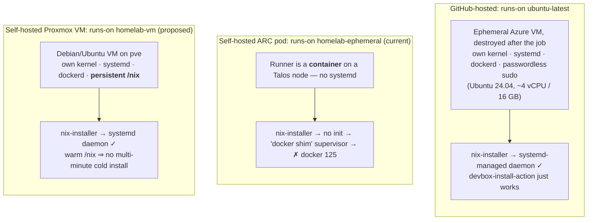
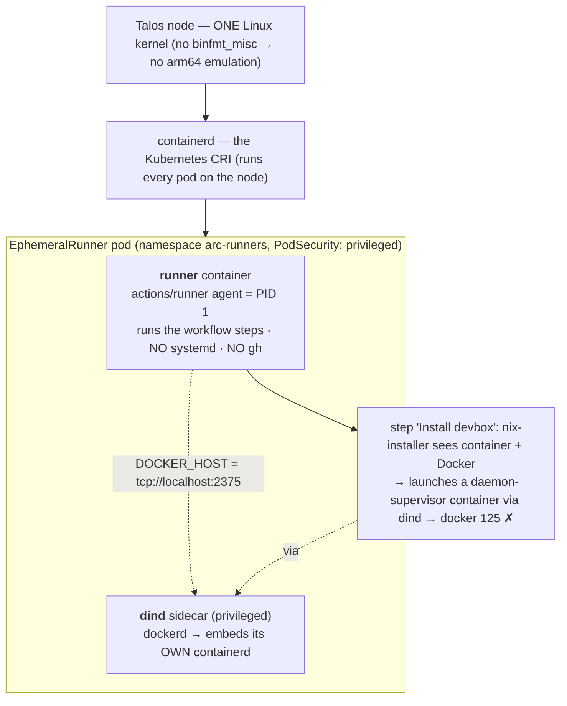

# CI / forges — the two-tier model

_How CI and source hosting are split in this homelab. Decided 2026-06-24 (replaces the earlier
"act_runner is the one CI seam" plan in `slsa.md`/`follow-ups.md`)._

We want **GitHub's reach** (public exposure + SaaS integrations: Renovate, CodeRabbit, Blacksmith,
Chainguard) **and** a **local-first fallback** (own runner, own git copy). Full GitHub↔Forgejo PR/
comment mirroring isn't mature, so instead of forcing one forge we run **two tiers**, picked per
project:

| | **Tier A — GitHub-canonical** | **Tier B — Forgejo-only** |
|---|---|---|
| Source of truth | GitHub (`teststuffstash/*`) | Forgejo (`forgejo.teststuff.net`) |
| CI runner | **ARC** (Actions Runner Controller), `runs-on: homelab-ephemeral` | **act_runner** (`runs-on: docker`) |
| Registry | **ghcr.io** | Forgejo registry |
| Local copy | Forgejo **pull-mirror** (read-only DR) | n/a (already local) |
| For | projects that want exposure / SaaS (sleep-tracking, snore-recorder) | fully-private, self-contained projects |

Both runners are **in-cluster, pinned to the ephemeral laptop tier** (`homelab.io/ephemeral`, DinD,
privileged ns) so CI noise/privilege stays off the service nodes.

## The one rule that makes this cheap: the `devbox run` seam

**Workflows stay thin — they call `devbox run <task>` and nothing else.** All build/test/scan logic
+ tool versions live in the repo's `devbox.json` (+ `scripts/`), not in CI YAML. Consequences:

- The same gate runs **locally and in CI**, identically (`devbox run ci`).
- Tier-A and Tier-B run the *same* logic under different forges — only `runs-on` + the registry differ.
- Swapping the runner later (ARC → **Blacksmith**/**Chainguard**) is a `runs-on`/host change with
  **zero logic change**.

Example (sleep-tracking): `devbox run ci` = ruff + ruff-format-check + pytest-cov; `devbox run
test-chart` = helm-unittest; `devbox run scan-secrets` = gitleaks. The workflow just lists those steps.

## Tier A — ARC (self-hosted GitHub runner)

- ArgoCD apps: `argocd/platform/arc-controller.yaml` (operator, `arc-systems`, stable tier) +
  `arc-runners.yaml` (the `homelab-ephemeral` scale set, `arc-runners` ns, ephemeral tier,
  scale-to-zero, `containerMode: dind`) + `github-runner-secrets.yaml` →
  `argocd/resources/github-runner/` (ns + the `arc-github-app` ESO `ExternalSecret`).
- Auth: a **GitHub App** on the org (permissions: Organization → Self-hosted runners: R/W, +
  Metadata: Read); creds in Infisical (`GHARC_APP_ID`/`GHARC_INSTALL_ID`/`GHARC_PRIVATE_KEY`) → ESO →
  `arc-github-app` secret → chart `githubConfigSecret`. Bootstrap is scripted:
  `scripts/github-runner-bootstrap.sh` (runbook: [`github-runner-bootstrap.md`](github-runner-bootstrap.md)).
- Registry pull: private ghcr packages need a `read:packages` token (`SLEEP_GHCR_PULL_TOKEN` in
  Infisical → ESO dockerconfigjson). CI **push** to ghcr needs no extra secret — the job's
  `GITHUB_TOKEN` with `packages: write` is enough.
- **amd64 only.** It builds the (amd64) sleep-ingester image fine; it **cannot** build
  snore-recorder's **arm64** image — the Talos node kernel has no `binfmt_misc`, so QEMU emulation
  fails. arm64 images build **off-cluster** via `devbox run build-image` on a binfmt-capable host.

Bring-up steps + open items: `docs/follow-ups.md` → "CI — GitHub-canonical tier".

## Tier B — act_runner (Forgejo-only)

`tofu/forgejo-runner.tf` — unchanged. Use it for a project that should never touch GitHub: host the
repo on Forgejo, push images to the Forgejo registry, run `.forgejo/workflows/` (same `devbox run`
seam). This is also where the self-hosted **SLSA** story continues (cosign + SBOM on a hosted,
not-a-laptop builder) — see `slsa.md`.

## Execution environments — VM vs container, and the nix-in-CI problem

The whole `devbox run` seam needs a **working Nix** in the runner. Whether that's easy or painful
comes down to one thing: **is the runner a VM (own kernel + an init system) or a container (shares
the node kernel, no init)?** Nix's multi-user install wants a daemon, and a daemon wants a supervisor
(systemd). A VM has that; a bare container doesn't.



**`ubuntu-latest` is a throwaway VM** (a fresh Azure VM per job, not a container) — that's *why* the
same `devbox-install-action` succeeds there and fails on our ARC pod. A **Proxmox VM runner** is the
self-hosted version of exactly that: a VM, so Nix installs normally, and `/nix` can persist (even
share the host store like the jail does) so there's no cold-install tax.

### Why the ARC pod can't install Nix (and the container layering)

`containerMode: dind` (our `argocd/platform/arc-runners.yaml`) gives each job a runner pod with **two
containers** sharing the node kernel. The workflow steps run in the *runner* container (no systemd);
a privileged *dind* sidecar provides a Docker daemon for steps that need `docker`. The Nix installer,
finding no init but a reachable Docker, tries to run its daemon **as a Docker container via the dind
sidecar** — and that's the step that 125s.



**"How many containerds?"** — for a job, **two container engines, one kernel**:
1. the node's **containerd** (the CRI Kubernetes uses to run *all* pods, including the runner pod), and
2. the **dockerd inside the dind sidecar**, which itself embeds a second containerd — nested one level
   down, only for the job's own `docker` commands.

(Talos also runs a separate system containerd for its own services, but that's below Kubernetes and
irrelevant here.) A **VM runner collapses this** to a single kernel + a single dockerd, no nesting —
which is the other reason the Proxmox-VM option is appealing.

### The fix that works on the ARC pod — single-user Nix

The daemon is the whole problem, so **don't install one.** A *single-user* Nix install (`--no-daemon`)
runs Nix as the runner user with no daemon, no init, no docker-shim — so it works in the container.
We install it ourselves and tell `devbox` to reuse it (the action's own installer is daemon-based and
can't be told otherwise in v0.13.0). Working `ci.yaml` (sleep-tracking, verified green on
`homelab-ephemeral`):

```yaml
# the slim ghcr.io/actions/actions-runner image lacks tools GitHub-hosted runners bundle (xz, gh…)
- run: sudo apt-get update -qq && sudo apt-get install -y -qq xz-utils   # nix installer needs xz
- uses: cachix/install-nix-action@v31
  with: { install_options: --no-daemon }          # single-user → no daemon/systemd/docker-shim
- uses: jetify-com/devbox-install-action@v0.13.0
  with: { skip-nix-installation: "true" }          # reuse the nix above
- run: devbox run ci
```

Two residual costs, both solvable in-cluster (no VM needed):

- **Slim runner image.** `ghcr.io/actions/actions-runner` omits `xz`, `gh`, `udevadm`, … We apt-install
  what's needed per job. The clean fix is a **custom runner image** with `xz`/`gh`/devbox/nix baked in.
- **Cold-start (~5 min).** The Nix store + devbox CLI download from `cache.nixos.org` (WAN) on every
  fresh pod. Fix with **caching**: a LAN Nix substituter (attic/harmonia) + the devbox action's
  `enable-cache` (GitHub Actions cache), and/or bake a warm store into the custom image — then fresh
  pods restore over LAN, never the WAN. (The custom image solves both costs at once.)

### Trade-offs

| | GitHub-hosted `ubuntu-latest` | ARC pod (dind), single-user nix | Proxmox VM runner |
|---|---|---|---|
| Nix/devbox install | ✓ | ✓ (`--no-daemon` + skip) | ✓ |
| Self-hosted | ✗ (Azure) | ✓ | ✓ (pve) |
| Cold-start | slow | slow until cached (LAN substituter / baked store) | **fast** (warm /nix) |
| Isolation per job | full VM, ephemeral | container, ephemeral | VM, usually persistent (pet) |
| Missing base tools | none | apt per job, or bake a custom image | none (full VM) |
| IaC fit | n/a | ArgoCD (built) | tofu Proxmox + cloud-init (like the Talos VMs) |
| arm64 builds | hosted arm runners | ✗ (no binfmt) | ✓ if VM has binfmt |

**Direction:** the ARC pod path **works** with single-user Nix (current state — all four Tier-A gates
green on `homelab-ephemeral`). Next, a **custom runner image** (baked `xz`/`gh`/devbox + warm store)
removes the per-job apt and the cold-start in one move. A **Proxmox VM runner** (`actions/runner` via
tofu + cloud-init, persistent `/nix`) stays the option if you'd rather a full-VM, GitHub-hosted-like
environment; `ubuntu-latest` remains the zero-infra escape hatch for CI that needs nothing on-prem.
