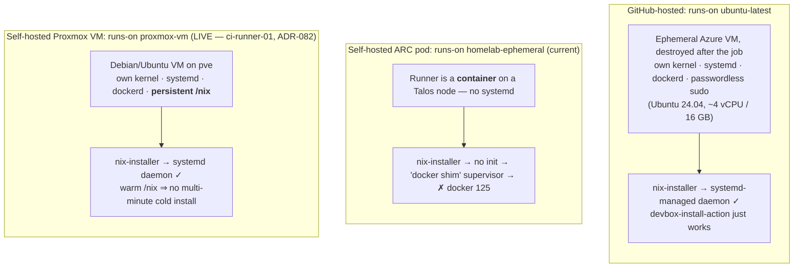
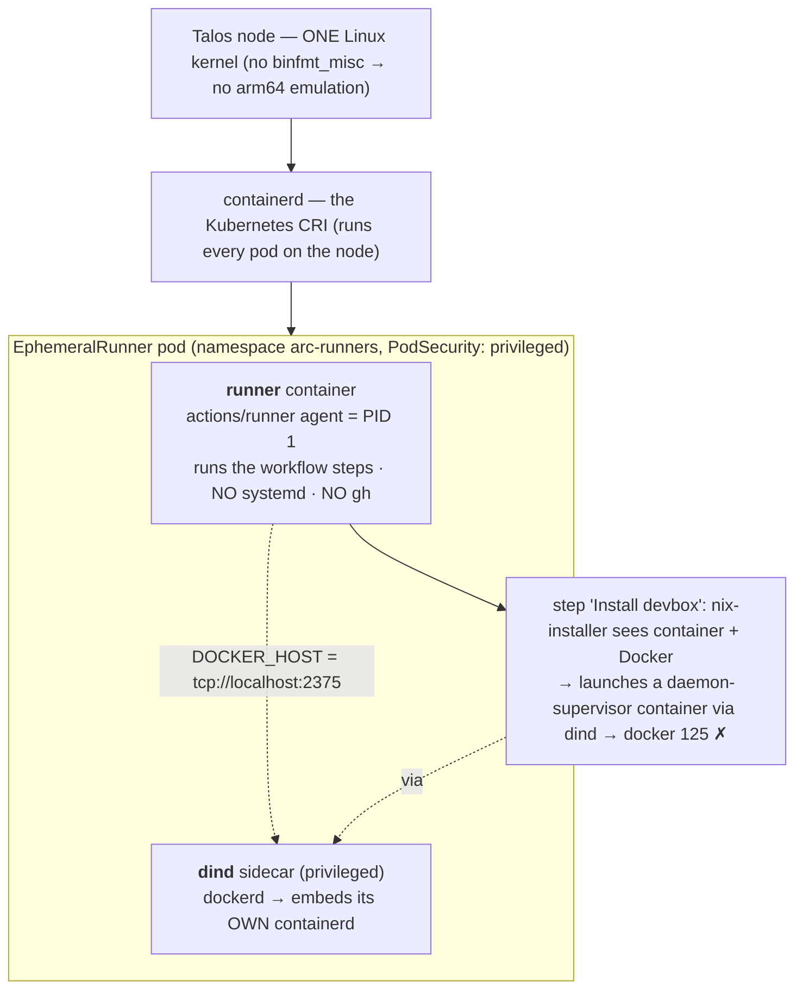

# CI / forges — the two-tier model

_How CI and source hosting are split in this homelab. Decided 2026-06-24 (replaces the earlier
"act_runner is the one CI seam" plan in `slsa.md`/`follow-ups.md`)._

We want **GitHub's reach** (public exposure + SaaS integrations: Renovate, CodeRabbit, Blacksmith,
Chainguard) **and** a **local-first fallback** (own runner, own git copy). Full GitHub↔Forgejo PR/
comment mirroring isn't mature, so instead of forcing one forge we run **two tiers**, picked per
project:

| | **Tier A — GitHub-canonical** | **Tier B — Forgejo-only** |
|---|---|---|
| Source of truth | GitHub (`teststuffstash/*`) | Forgejo (`forgejo.teststuff.net`) |
| CI runner | **ARC** (Actions Runner Controller), `runs-on: homelab-ephemeral` | **act_runner** (`runs-on: docker`) |
| Registry | **ghcr.io** | Forgejo registry |
| Local copy | Forgejo **pull-mirror** (read-only DR) | n/a (already local) |
| For | projects that want exposure / SaaS (sleep-tracking, snore-recorder) | fully-private, self-contained projects |

Both runners are **in-cluster, pinned to the ephemeral laptop tier** (`homelab.io/ephemeral`, DinD,
privileged ns) so CI noise/privilege stays off the service nodes.

## The one rule that makes this cheap: the `devbox run` seam

**Workflows stay thin — they call `devbox run <task>` and nothing else.** All build/test/scan logic
+ tool versions live in the repo's `devbox.json` (+ `scripts/`), not in CI YAML. Consequences:

- The same gate runs **locally and in CI**, identically (`devbox run ci` in the STACK repos —
  homelab itself is the deliberate exception: no aggregate `ci` task, ~28 named `devbox run`
  tasks run by `.github/workflows/ci.yaml`, which also carries inline blocks (the ADR-103
  ratchet, `tofu fmt`, the ghcr pre-warm, the changed-paths skip map) that gate the workflow
  rather than the code. Since 2026-08-31 (#518) the heavy suites (`prometheus-rules-lint`,
  `clause-replay`) and the pin-bump pre-warm run **backgrounded ∥ the serial steps** with
  start/collect step pairs, and the heavies **skip entirely** when the PR's changed paths
  cannot affect them — locally they are ordinary serial `devbox run` tasks.
- Tier-A and Tier-B run the *same* logic under different forges — only `runs-on` + the registry differ.
- Swapping the runner later (ARC → **Blacksmith**/**Chainguard**) is a `runs-on`/host change with
  **zero logic change**.

Example (sleep-tracking): `devbox run ci` = ruff + ruff-format-check + pytest-cov; `devbox run
test-chart` = helm-unittest; `devbox run scan-secrets` = gitleaks. The workflow just lists those steps.

## Concurrency — the org-standard block (every `ci.yaml`, 2026-08-08)

Every validation workflow (`ci.yaml`; other PR-triggered checks may opt in) carries:

```yaml
concurrency:
  group: ci-${{ github.workflow }}-${{ github.event.pull_request.number || github.ref }}
  cancel-in-progress: ${{ github.event_name == 'pull_request' }}
```

One live run per PR: a superseded PR head's run **cancels** instead of queuing; push/master runs
keep their own serial group and **never cancel** — a cancelled push run can leave a publish
(specs site, evidence bundle, image) half-written. Why it exists: `update-pr-branch` retriggers
full CI on every open PR after every master move, and on a single-slot runner (oracle's e2e on
ci-runner-01) one merge cost ~one queued e2e per open PR (~5 min each, measured 2026-08-08;
oracle-fleet#222 → PR#224). ARC repos burn `maxRunners` slots the same way. Safe with the merge
path: branch protection + auto-merge read the LATEST head sha's checks, so a cancelled
superseded-sha run never enters any merge predicate. ⚠ Do NOT put the cancel form on
deploy/publish/bake workflows — queue-only groups there, if any.

⚠ **Known gap the block does NOT close (oracle-fleet#228, 2026-08-08): the same-sha
PR-check/post-merge-push race.** A PR's `pull_request` run (group keyed by PR number) and the
`push` run after its merge (keyed by ref) are different groups — for the same commit they run
CONCURRENTLY. On stateless ARC jobs that's just waste; on a shared-VM heavy job (oracle's e2e)
two concurrent runs starve each other into timeouts — masked while the runner was single-slot,
exposed the day it got two. Repos with such jobs add a JOB-level group keyed by sha
(`jobs.<heavy>.concurrency: { group: <job>-${{ github.sha }}, cancel-in-progress: false }`):
same-sha runs serialize, different PRs still use both slots.

## Tier A — ARC (self-hosted GitHub runner)

- ArgoCD apps: `argocd/platform/arc-controller.yaml` (operator, `arc-systems`, stable tier) +
  `arc-runners.yaml` (the `homelab-ephemeral` scale set, `arc-runners` ns, ephemeral tier,
  scale-to-zero, `containerMode: dind`) + `github-runner-secrets.yaml` →
  `argocd/resources/github-runner/` (ns + the `arc-github-app` ESO `ExternalSecret`).
- Auth: a **GitHub App** on the org (permissions: Organization → Self-hosted runners: R/W, +
  Metadata: Read); creds in Infisical (`GHARC_APP_ID`/`GHARC_INSTALL_ID`/`GHARC_PRIVATE_KEY`) → ESO →
  `arc-github-app` secret → chart `githubConfigSecret`. Bootstrap is scripted:
  `scripts/github-runner-bootstrap.sh` (runbook: [`github-runner-bootstrap.md`](github-runner-bootstrap.md)).
- Registry pull: private ghcr packages need a `read:packages` token (`SLEEP_GHCR_PULL_TOKEN` in
  Infisical → ESO dockerconfigjson). CI **push** to ghcr needs no extra secret — the job's
  `GITHUB_TOKEN` with `packages: write` is enough.
- **amd64 only.** It builds the (amd64) sleep-ingester image fine; it **cannot** build
  snore-recorder's **arm64** image — the Talos node kernel has no `binfmt_misc`, so QEMU emulation
  fails. arm64 images build **off-cluster** via `devbox run build-image` on a binfmt-capable host.

Dependency automation status lives in `docs/dependency-upgrades.md` §Ground truth (FU-125 —
Renovate currently delivering zero PRs).

## Tier B — act_runner (Forgejo-only)

`tofu/forgejo-runner.tf` — unchanged. Use it for a project that should never touch GitHub: host the
repo on Forgejo, push images to the Forgejo registry, run `.forgejo/workflows/` (same `devbox run`
seam). ⚠ **Pull-mirrors of Tier-A repos must have Actions DISABLED** (`PATCH …/repos/<r>
{"has_actions": false}`): Forgejo Actions also reads `.github/workflows/`, so an enabled mirror
shows the GitHub workflows as perpetually-waiting runs (no runner serves them; found on the
sleep-lab mirrors 2026-07-25, both disabled). This is also where the self-hosted **SLSA** story continues (cosign + SBOM on a hosted,
not-a-laptop builder) — see `slsa.md`.

## Execution environments — VM vs container, and the nix-in-CI problem

The whole `devbox run` seam needs a **working Nix** in the runner. Whether that's easy or painful
comes down to one thing: **is the runner a VM (own kernel + an init system) or a container (shares
the node kernel, no init)?** Nix's multi-user install wants a daemon, and a daemon wants a supervisor
(systemd). A VM has that; a bare container doesn't.


```mermaid
flowchart TB
  subgraph hosted["GitHub-hosted: runs-on ubuntu-latest"]
    direction TB
    h["Ephemeral Azure VM, destroyed after the job<br/>own kernel · systemd · dockerd · passwordless sudo<br/>(Ubuntu 24.04, ~4 vCPU / 16 GB)"]
    h --> hn["nix-installer → systemd-managed daemon ✓<br/>devbox-install-action just works"]
  end
  subgraph arc["Self-hosted ARC pod: runs-on homelab-ephemeral (current)"]
    direction TB
    a["Runner is a <b>container</b> on a Talos node — no systemd"]
    a --> an["nix-installer → no init → 'docker shim' supervisor → ✗ docker 125"]
  end
  subgraph pvm["Self-hosted Proxmox VM: runs-on proxmox-vm (LIVE — ci-runner-01, ADR-082)"]
    direction TB
    p["Debian/Ubuntu VM on pve<br/>own kernel · systemd · dockerd · <b>persistent /nix</b>"]
    p --> pn["nix-installer → systemd daemon ✓<br/>warm /nix ⇒ no multi-minute cold install"]
  end
```

**`ubuntu-latest` is a throwaway VM** (a fresh Azure VM per job, not a container) — that's *why* the
same `devbox-install-action` succeeds there and fails on our ARC pod. A **Proxmox VM runner** is the
self-hosted version of exactly that: a VM, so Nix installs normally, and `/nix` can persist (even
share the host store like the jail does) so there's no cold-install tax.

### Why the ARC pod can't install Nix (and the container layering)

`containerMode: dind` (our `argocd/platform/arc-runners.yaml`) gives each job a runner pod with **two
containers** sharing the node kernel. The workflow steps run in the *runner* container (no systemd);
a privileged *dind* sidecar provides a Docker daemon for steps that need `docker`. The Nix installer,
finding no init but a reachable Docker, tries to run its daemon **as a Docker container via the dind
sidecar** — and that's the step that 125s.


```mermaid
flowchart TB
  k["Talos node — ONE Linux kernel (no binfmt_misc → no arm64 emulation)"]
  k --> cd["containerd — the Kubernetes CRI (runs every pod on the node)"]
  cd --> pod
  subgraph pod["EphemeralRunner pod (namespace arc-runners, PodSecurity: privileged)"]
    direction TB
    r["<b>runner</b> container<br/>actions/runner agent = PID 1<br/>runs the workflow steps · NO systemd · NO gh"]
    d["<b>dind</b> sidecar (privileged)<br/>dockerd → embeds its OWN containerd"]
    r -. "DOCKER_HOST = tcp://localhost:2375" .-> d
  end
  r --> step["step 'Install devbox': nix-installer sees container + Docker<br/>→ launches a daemon-supervisor container via dind → docker 125 ✗"]
  step -. via .-> d
```

**"How many containerds?"** — for a job, **two container engines, one kernel**:
1. the node's **containerd** (the CRI Kubernetes uses to run *all* pods, including the runner pod), and
2. the **dockerd inside the dind sidecar**, which itself embeds a second containerd — nested one level
   down, only for the job's own `docker` commands.

(Talos also runs a separate system containerd for its own services, but that's below Kubernetes and
irrelevant here.) A **VM runner collapses this** to a single kernel + a single dockerd, no nesting —
which is the other reason the Proxmox-VM option is appealing.

### The fix that works on the ARC pod — the custom warm runner image (FU-015, LIVE 2026-07-25)

The daemon is the whole problem, so **don't install one** — and since FU-015, don't install
*anything* per job. The scale set runs a **custom runner image** (`docker/arc-runner/`, built by
`.github/workflows/runner-image.yaml` on `ubuntu-latest` — the runner image must never depend on
the scale set it provisions — pushed to `ghcr.io/teststuffstash/homelab/arc-runner`, pinned in
`argocd/platform/arc-runners.yaml`). Baked in:

- `xz`/`gh`/`jq` (the tools the slim upstream image omits),
- **single-user Nix** (`--no-daemon` — the only install that works in the container; the daemon
  installer dies under dind) + `nix.conf` with the **LAN pull-through substituter first**
  (`http://192.168.40.23`, argocd/resources/nix-cache — same upstream signatures, WAN fallback),
- a pinned **devbox** binary,
- a **warm /nix store**: the workflow stages every fleet repo's `devbox.{json,lock}` (App-token
  fetch — the repos are private) and realizes the closures at build time. Deliberately NOT
  lockfile-coupled: a stale warm store degrades to LAN-mirror delta fetches, so rebuilds are
  "when drift gets noticeable" (push to `docker/arc-runner/` or `workflow_dispatch`), not per-lock.

Workflows go straight to `devbox run <task>` — no install steps at all:

```yaml
- uses: actions/checkout@v4
- run: devbox run ci     # nix + devbox + warm store are in the runner image
```

The image build now uses buildx registry layer-cache with one layer per repo closure + a ci-gate
mirror pre-warm on pin PRs (2026-08-03) — mechanism in `.github/workflows/runner-image.yaml` +
`docker/arc-runner/Dockerfile` comments.

`cachix/install-nix-action` is a 0s no-op on the baked image (it detects existing nix), so
unmigrated workflows keep working — slimming is a speedup, never a flag-day.

**Measured** (2026-07-25): homelab `ci` 180-210s → **38s**; oracle-fleet `ci` 610s (454s of it
toolchain install) → **127s**. Decomposition of the warm job (16:33Z run): 94s devbox
`ensure-packages` — nix profile REALIZATION, CPU-bound; the store paths are baked, homelab's
smaller closure realizes in 28s — then ~12s gates+uv, 87s pytest, 87s evidence/specs-site S3
publish. Realization shrank by baking the eval cache into the image too (the Dockerfile keeps
`~/.cache/{nix,devbox}`, 2026-07-25): `ensure-packages` 94s → **5s**. The dind
sidecar is owned in `arc-runners.yaml` too (the chart appends rather than merges initContainers):
pinned `docker:dind` + `--registry-mirror` → the ADR-091 docker.io pull-through VIP
(`argocd/resources/registry-cache/`).

### Trade-offs

| | GitHub-hosted `ubuntu-latest` | ARC pod (dind), single-user nix | Proxmox VM runner |
|---|---|---|---|
| Nix/devbox install | ✓ | ✓ (`--no-daemon` + skip) | ✓ |
| Self-hosted | ✗ (Azure) | ✓ | ✓ (pve) |
| Cold-start | slow | slow until cached (LAN substituter / baked store) | **fast** (warm /nix) |
| Isolation per job | full VM, ephemeral | container, ephemeral | VM, usually persistent (pet) |
| Missing base tools | none | apt per job, or bake a custom image | none (full VM) |
| IaC fit | n/a | ArgoCD (built) | tofu Proxmox + cloud-init (like the Talos VMs) |
| arm64 builds | hosted arm runners | ✗ (no binfmt) | ✓ if VM has binfmt |

**Direction (realized 2026-07-25, FU-015):** the custom warm runner image is the live default —
per-job apt and cold-start are gone (numbers above). The **Proxmox VM runner** (ADR-082,
`tofu/ci-runner.tf`) carries the jobs a container can't (binfmt/arm64, full-VM kind gates; its
dockerd also rides the docker.io mirror via cloud-init `daemon.json`, ADR-091 /
`argocd/resources/registry-cache/`); `ubuntu-latest`
remains the zero-infra escape hatch — and deliberately builds the runner image itself
(bootstrap: the image must not depend on the fleet it provisions).
