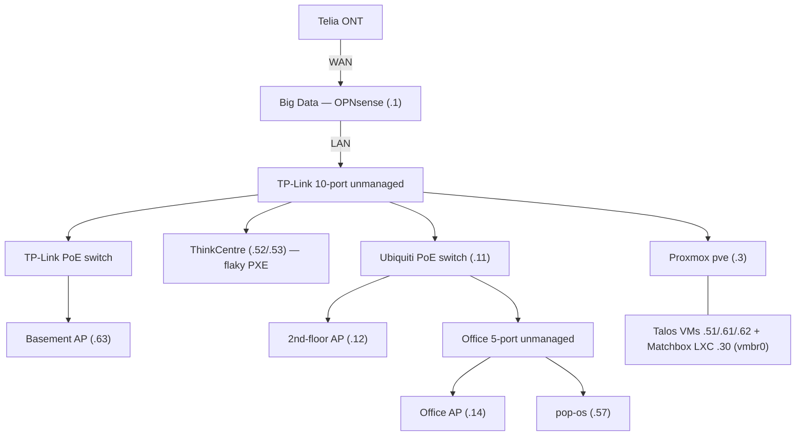

# Physical network topology

_Part of the [homelab docs](README.md). Logical/IP view: [`/README.md`](../README.md) +
[`CLAUDE.md`](../CLAUDE.md); service exposure / BGP rationale: [`adr.md`](adr.md) ADR-021._

Cabling/switch layout (distinct from the logical/IP view). Captured 2026-06-03.

```
                         Internet (fibre)
                              │
                        ┌─────┴─────┐
                        │ Telia ONT │  fibre → ethernet
                        └─────┬─────┘
                              │ WAN  (onboard NIC)
              ┌───────────────┴─────────────────┐
              │  "Big Data"  —  OPNsense router  │
              │  + Intel 4×1GbE PCIe card:       │
              │    LAN (192.168.2.1), OPT1-3     │
              └───────────────┬─────────────────┘
                              │ LAN
                ┌─────────────┴──────────────┐
                │  TP-Link 10-port  (UNMANAGED) │   ← core LAN switch
                └──┬────┬───────────┬─────────┬──┘
                   │    │           │         │
   Proxmox "pve" ◄─┘    │           │         └─► TP-Link PoE switch
   (X99, .3)            │           │               └─► Basement AP (U6Lite, .63)
   └ vmbr0:             │           │
     ├ Talos VMs        │           └─► Ubiquiti PoE switch (.11, USW-Lite)
     │  cp-01 .51       │                ├─► 2nd-floor AP (U6Lite, .12)
     │  wk-01 .61       │                └─► Office: 5-port (UNMANAGED)
     │  wk-02 .62       │                     ├─► Office AP (UAP-AC-Lite, .14)
     └ Matchbox LXC .30 │                     └─► pop-os (.57)
                        │
   ThinkCentre Edge ◄───┘  (.52 / reserved .53)   ← flaky PXE firmware
```

## Notes relevant to PXE / provisioning

- **ThinkCentre and Proxmox share the same unmanaged TP-Link 10-port switch, one hop
  from OPNsense LAN.** Matchbox (LXC on Proxmox, via `vmbr0`) is therefore on the **same
  L2 segment** as the ThinkCentre — DHCP/PXE broadcasts reach it directly. So a PXE
  failure on the ThinkCentre is **not** a network-path problem.
- **Unmanaged switches** (TP-Link 10-port, office 5-port) → no STP forwarding delay to
  blame for a PXE-vs-STP race.
- OPT1–OPT3 on the Intel card: not documented here yet (purpose/!connection TBD).
- The managed UniFi switch (.11) is **downstream** of the core switch and not in the
  ThinkCentre/Proxmox path.

