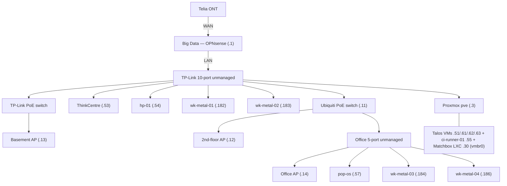

# Physical network topology

_Part of the [homelab docs](README.md). Logical/IP view: [`/README.md`](../README.md) +
[`CLAUDE.md`](../CLAUDE.md); **IP allocation rules: [`ip-plan.md`](ip-plan.md)** (ADR-088);
service exposure / BGP rationale: [`adr.md`](adr.md) ADR-021._

Cabling/switch layout (distinct from the logical/IP view). Captured 2026-06-03; re-captured
2026-08-12 (operator cabling + live guest-agent reads: the wk-metal fleet, hp-01, ci-runner-01).

```
                         Internet (fibre)
                              │
                        ┌─────┴─────┐
                        │ Telia ONT │  fibre → ethernet
                        └─────┬─────┘
                              │ WAN  (onboard NIC)
              ┌───────────────┴─────────────────┐
              │  "Big Data"  —  OPNsense router  │
              │  + Intel 4×1GbE PCIe card:       │
              │    LAN (192.168.2.1), OPT1-3     │
              └───────────────┬─────────────────┘
                              │ LAN
                ┌─────────────┴──────────────┐
                │ TP-Link 10-port (UNMANAGED) │   ← core LAN switch
                └─┬───┬───┬───┬───┬───┬───┬──┘
                  │   │   │   │   │   │   │
   Proxmox "pve" ◄┘   │   │   │   │   │   └─► TP-Link PoE switch
   (X99, .3)          │   │   │   │   │         └─► Basement AP (U6Lite, .13)
   └ vmbr0:           │   │   │   │   │
     ├ Talos VMs      │   │   │   │   └─► Ubiquiti PoE switch (.11, USW-Lite)
     │  cp-01 .51     │   │   │   │        ├─► 2nd-floor AP (U6Lite, .12)
     │  wk-01 .61     │   │   │   │        └─► Office: 5-port (UNMANAGED)
     │  wk-02 .62     │   │   │   │             ├─► Office AP (UAP-AC-Lite, .14)
     │  wk-03 .63     │   │   │   │             ├─► pop-os (.57)
     ├ ci-runner-01   │   │   │   │             ├─► wk-metal-03 (.184)
     │  (VM 9001, .55)│   │   │   │             └─► wk-metal-04 (.186)
     └ Matchbox .30   │   │   │   │
                      │   │   │   └─► hp-01 (.54)
   ThinkCentre Edge ◄─┘   │   └─► wk-metal-02 (.183)
   (.53)                  └─► wk-metal-01 (.182)
```

## Notes relevant to PXE / provisioning

- **Everything above is ONE flat L2 domain** (every switch unmanaged or L2-only; no VLANs), so
  DHCP/PXE broadcasts reach Matchbox (LXC on Proxmox `vmbr0`) from EVERY port — including
  wk-metal-03/-04 two switch hops away in the office. Verified in practice: all four wk-metal
  nodes + hp-01 PXE-provisioned through this layout.
- **ThinkCentre, hp-01, wk-metal-01/-02 and Proxmox share the core TP-Link 10-port switch**, one
  hop from OPNsense LAN. (The ThinkCentre's 2026-06 "flaky PXE" was ultimately a **bad NIC
  cable** — 100Mbps + link flapping — replaced 2026-06-11; PXE has worked since.)
- **Unmanaged switches** (TP-Link 10-port, office 5-port) → no STP forwarding delay to
  blame for a PXE-vs-STP race.
- The managed UniFi switch (.11) is **downstream** of the core switch; wk-metal-03/-04 and
  pop-os (the jail host) sit below it on the office 5-port.


```mermaid
graph TD
  ONT[Telia ONT] -->|WAN| OPN["Big Data — OPNsense (.1)"]
  OPN -->|LAN| SW10[TP-Link 10-port unmanaged]
  SW10 --> PVE["Proxmox pve (.3)"]
  SW10 --> TC["ThinkCentre (.53)"]
  SW10 --> HP["hp-01 (.54)"]
  SW10 --> WM1["wk-metal-01 (.182)"]
  SW10 --> WM2["wk-metal-02 (.183)"]
  SW10 --> POE1[TP-Link PoE switch]
  SW10 --> UBNT["Ubiquiti PoE switch (.11)"]
  POE1 --> APB["Basement AP (.13)"]
  UBNT --> AP2["2nd-floor AP (.12)"]
  UBNT --> SW5[Office 5-port unmanaged]
  SW5 --> APO["Office AP (.14)"]
  SW5 --> POP["pop-os (.57)"]
  SW5 --> WM3["wk-metal-03 (.184)"]
  SW5 --> WM4["wk-metal-04 (.186)"]
  PVE --- VMS["Talos VMs .51/.61/.62/.63 + ci-runner-01 .55 + Matchbox LXC .30 (vmbr0)"]
```
