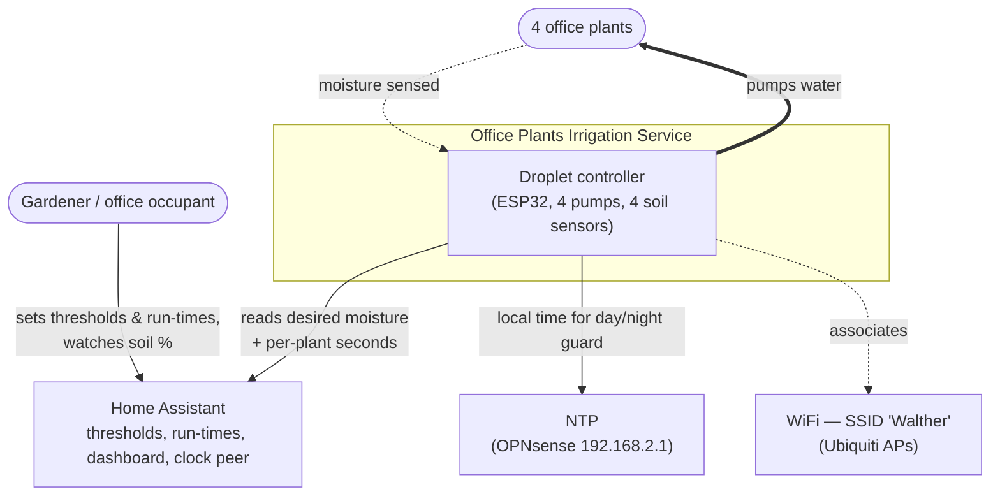
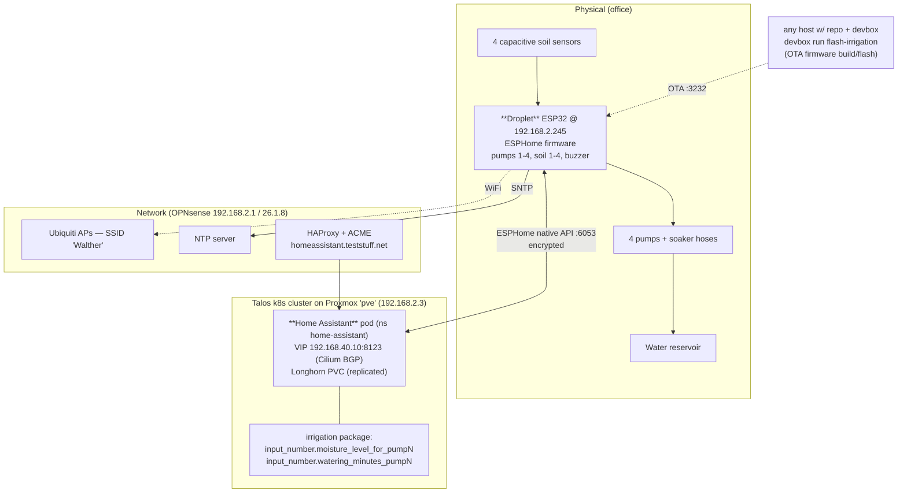
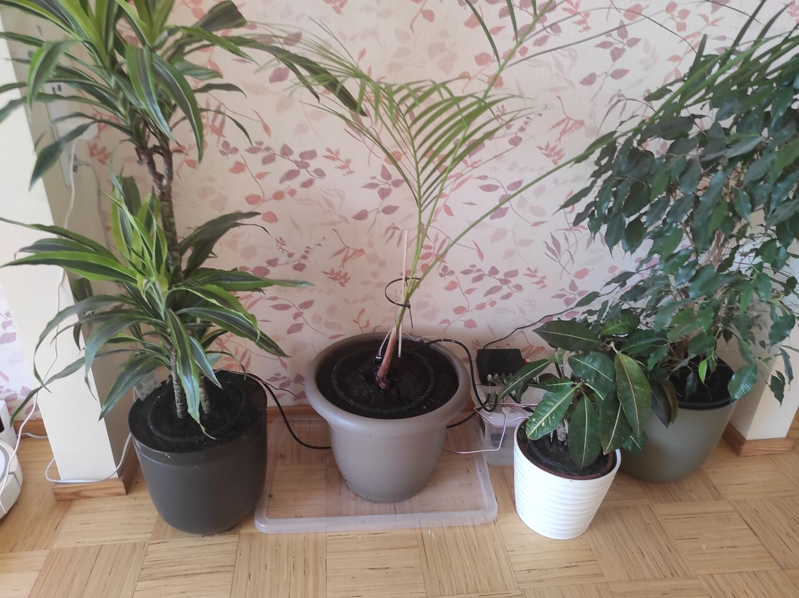
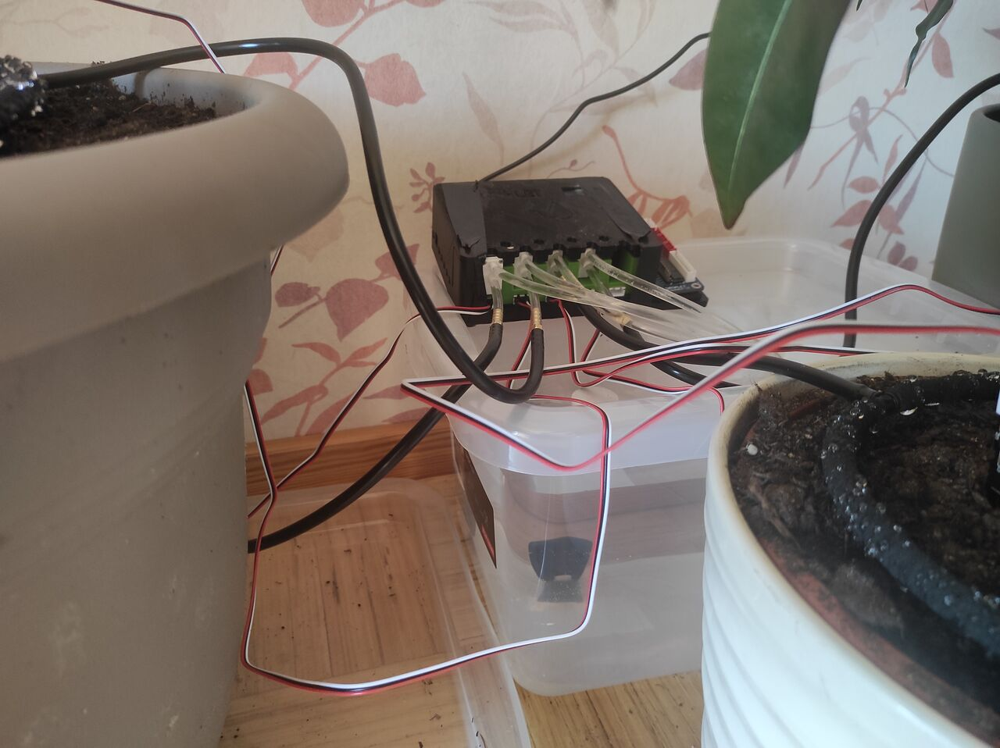
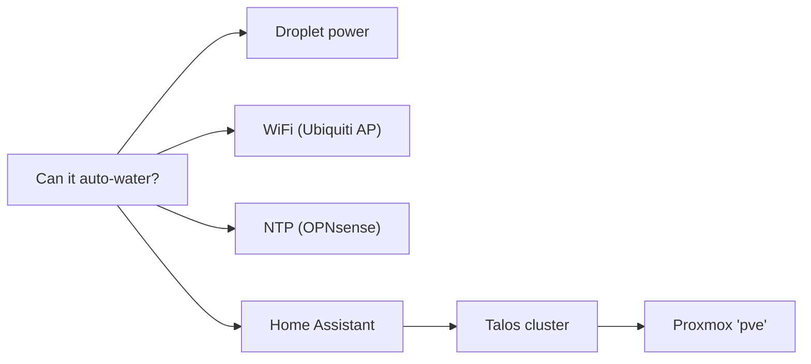
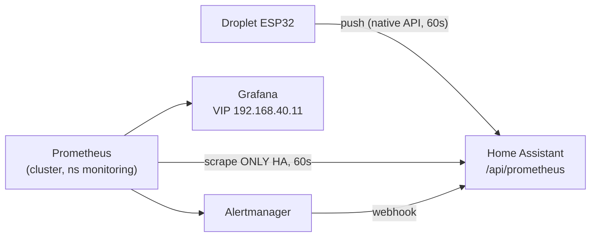

# Office Plants — Automated Irrigation Service

Self-contained service that keeps 4 office plants watered: a **PricelessToolkit "Droplet"**
ESP32 controller measures soil moisture and runs a pump per plant when the soil is too dry,
with thresholds and per-plant run-times configured in **Home Assistant**.

- **Owner:** Rasmus (homelab)
- **Status:** in service (4 plants live)
- **Source of truth:** this repo
  - Firmware/config: [`esphome/config/office-plants-irrigation.yaml`](../../esphome/config/office-plants-irrigation.yaml)
  - HA helpers: [`homeassistant/ha-config/packages/irrigation.yaml`](../../homeassistant/ha-config/packages/irrigation.yaml)
  - HA dashboard: [`homeassistant/ha-config/dashboards/home.yaml`](../../homeassistant/ha-config/dashboards/home.yaml)
  - Monitoring: [`tofu/monitoring.tf`](../../tofu/monitoring.tf), HA export [`packages/prometheus.yaml`](../../homeassistant/ha-config/packages/prometheus.yaml), alert relay [`packages/alerting.yaml`](../../homeassistant/ha-config/packages/alerting.yaml) — see [§9 Monitoring](#9-monitoring-prometheus--grafana)

> **Why this page is the entrypoint:** this irrigation service is the original *reason* the whole
> homelab platform exists (see [`CONTEXT.md`](../../CONTEXT.md) — assistive-tech R&D). Everything
> below it (Talos cluster, Home Assistant, monitoring, remote access) was built to run it reliably.

### Documentation map

| Read this for… | Doc |
|---|---|
| The whole repo at a glance | [`/README.md`](../../README.md) |
| **Why** decisions were made (Ceph vs Longhorn, Tunnel vs VPN, …) | [`docs/adr.md`](../adr.md) |
| **How to operate** things (recipes + gotchas) | [`docs/runbook.md`](../runbook.md) |
| Onboard a bare-metal node (PXE) | [`docs/provisioning.md`](../provisioning.md) |
| Remote access (Cloudflare Tunnel + mTLS) | [`docs/cloudflare.md`](../cloudflare.md) |
| The shape (planes) / the plan (phases) | [`ARCHITECTURE.md`](../../ARCHITECTURE.md) · [`ROADMAP.md`](../../ROADMAP.md) |
| All docs index | [`docs/README.md`](../README.md) |

---

## 1. What it does

**Once a day (08:00 local)**, the Droplet checks each plant: if `soil_moisture% < desired%`
**and** that plant hasn't been watered in the last `min_water_interval_h` hours (default 24),
it runs that plant's pump for its configured number of **minutes**, soaks ~10 s, then moves to
the next plant (one pump at a time). The slow once-a-day cadence + per-plant settle lockout is
deliberate: capacitive soil probes lag watering by hours, so a fast reactive loop re-waters
before the last dose registers and overwaters (it did — see R5 / the 2026-06 plant-4 incident).
"Water one day, measure the next." All four thresholds and run-times are set from Home
Assistant; nothing waters at night, and a master **Auto Watering** switch (plus a manual
**Water Now** button that bypasses the lockout) is exposed in HA.

Decision + timing logic runs **on the device** (ESPHome), so it keeps its last-known
thresholds in RAM and only *needs* Home Assistant to (re)read configuration — see
[Dependencies](#4-dependencies).

---

## 2. Architecture (C4)

### Level 1 — System context



### Level 2 — Containers / deployment



### Physical setup
The reservoir is a **clear plastic storage tub** of water. The Droplet controller sits
**on top of / on the rim of the tub**, slightly elevated, so any pump or hose leak **drains
back into the tub** rather than onto the floor. The 4 pots are arranged around the tub; pumps
draw from it (short lift) and feed a **soaker hose** coiled into each pot. Soil sensors are
capacitive, wired back to the controller with red/white twisted-pair cables; pump water lines
attach to the controller on brass barbed fittings.





### What is deployed where

| Component | Where | Address | Notes |
|---|---|---|---|
| Droplet controller | Office, mains/USB powered | `192.168.2.245` (`office-plants-irrigation`, MAC `30:c6:f7:22:a8:fc`) | ESP32 `esp32dev`, ESPHome; always-on (no deep sleep) |
| Pumps 1–4 | Droplet board outputs | GPIO 13 / 4 / 16 / 17 | one per plant, via soaker hoses |
| Soil sensors 1–4 | Droplet ADC inputs | GPIO 34 / 35 / 32 / 33 | capacitive; calibrated dry 2.30 V→0 %, water 0.89 V→100 % |
| Home Assistant | k8s (Talos) on Proxmox `pve` | VIP `192.168.40.10:8123`, `https://homeassistant.teststuff.net` (LAN), `https://ha.teststuff.net` (remote, Cloudflare Tunnel + mTLS) | thresholds, run-times, dashboard, time peer |
| HA config (package + dashboard) | git → HA `/config` Longhorn PVC | `homeassistant/ha-config/...` | applied via `kubectl cp` + reload/restart |
| WiFi | Ubiquiti APs | SSID `Walther` | UniFi controller now **in-cluster** (`192.168.40.12`, see [runbook](../runbook.md#unifi)); APs adopt via `ubiquiti.teststuff.net` |
| NTP | OPNsense | `192.168.2.1` (+ `pool.ntp.org` fallback) | used for the day/night guard |
| ESPHome flash (devbox) | any host w/ repo + devbox | `devbox run flash-irrigation` | build + OTA-flash firmware |

---

## 3. Configuration

All runtime tuning is in Home Assistant (dashboard card **"Watering time per plant"** and
**"Desired moisture thresholds"**), backed by `irrigation.yaml`:

| Setting | Entity | Range | Meaning |
|---|---|---|---|
| Desired moisture | `input_number.moisture_level_for_pump1..4` | 0–100 % | water while `soil% < this` |
| Run time per plant | `input_number.watering_minutes_pump1..4` | 1–30 min | how long that pump runs each daily pass |
| Master enable | `switch.office_plants_irrigation_auto_watering` | on/off | default off after fresh flash; restores last state on reboot |
| Manual one-shot | `button.office_plants_irrigation_water_now` | press | runs one cycle ignoring auto/daytime/lockout (still only waters below-threshold plants) |

Behaviour constants (less-often changed) live as `substitutions:` at the top of
`office-plants-irrigation.yaml`: daily decision at `day_start` (08:00) via `time.on_time`,
`min_water_interval_h` (24 h per-plant settle lockout), `soak_seconds` (10 s), `day_end` (21),
`watering_minutes` (5 min fallback only).

> **Note:** the HA helpers set **`initial:`** to the proven defaults (**60 % desired, 5 min
> run-time**), so a fresh deploy (boot-from-git) and any HA restart land on sane values. Tune
> live with the dashboard sliders; a restart re-applies these initials — to change the default,
> edit `irrigation.yaml`.

> **Note:** desired moisture and run-times are read from HA over the encrypted ESPHome API.
> If HA is unreachable those values are `NaN` and **no watering happens** (fail-safe).

### Bigger pots / weak pumps / soaker-hose priming
Pumps are underpowered for the larger pots, and soaker hoses absorb the first part of each
run before dripping. Compensate by **raising `watering_minutes_pumpN`** (up to 30 min) for the
thirsty pots — no reflash needed, it's a slider.

---

## 4. Dependencies



| Dependency | Needed for | If it fails |
|---|---|---|
| **Droplet power** | everything | no watering, no monitoring |
| **WiFi (`Walther`, Ubiquiti AP)** | device connectivity | device offline; APs run standalone even if the controller is down |
| **NTP (OPNsense `.1` / pool)** | day/night guard (auto only) | clock invalid → daytime guard fails closed → **no auto watering** (manual Water Now still works) |
| **Home Assistant** | thresholds + run-times | values go `NaN` → **no watering at all** (fail-safe) |
| **Talos k8s + Proxmox `pve`** | hosting Home Assistant | HA down → see above |
| **ESPHome toolchain (devbox)** | firmware changes only | no runtime impact |

Local-first: NTP and the cluster are on-LAN, so watering does **not** depend on the internet
(public NTP is only a fallback).

---

## 5. Operations — routine

| Task | How |
|---|---|
| Change a threshold / run-time | HA dashboard sliders |
| Water immediately | press **Water Now** in HA |
| Stop everything | turn **Auto Watering** off (and/or set thresholds to 0) |
| Check soil readings | HA → Plant 1–4 sensors, or device `soilm_sens_N` |
| Read raw sensor voltage | device diagnostic sensors `soilN_raw` (hidden by default; enable in HA or read via API) |
| View logs | `devbox run irrigation-logs` |
| Update firmware | edit `office-plants-irrigation.yaml` → `devbox run flash-irrigation` (OTA, see below) |

### Firmware update / OTA
From a machine with the repo + devbox (`devbox run flash-irrigation`, which wraps `esphome run`):
```bash
# esphome/config/secrets.yaml (gitignored) must hold wifi_ssid / wifi_password / ota_password / api_encryption_key / ap_password
devbox run flash-irrigation
#   (equivalent to: esphome run esphome/config/office-plants-irrigation.yaml --device 192.168.2.245)
```
- **OTA password** is recorded at `~/.claude/homelab-droplet/ota_password`.
- If OTA auth ever fails: block the device in UniFi → it starts its fallback AP → upload the
  built `.bin` via the captive portal (`http://192.168.4.1`). USB-UART is the last resort.
- The old standalone ESPHome **web dashboard** (it ran on pop-os via docker-compose) is retired —
  flashing is the devbox CLI above. It could return later as a **Home Assistant add-on** if a web UI
  is wanted.

---

## 6. Maintenance — hardware

### Replace a pump
1. **Auto Watering → off** in HA (prevents a cycle starting mid-swap).
2. Empty the line / lift the hose out of the pot to avoid spillage.
3. Disconnect the failed pump from its Droplet output terminal and its tubing.
4. Fit the replacement pump to the **same** terminal + tubing (match polarity/voltage).
5. No config change — the GPIO mapping is unchanged (`pump1=13, pump2=4, pump3=16, pump4=17`).
6. Test: HA → toggle `switch.office_plants_irrigation_pump_N` on for a few seconds (or press
   **Water Now** with that plant below threshold) and confirm flow.
7. Auto Watering → on.

### Replace a moisture sensor
1. Unplug the failed capacitive sensor from its channel header; plug the new one into the
   **same** channel (`Soil1=GPIO34, Soil2=35, Soil3=32, Soil4=33`).
2. **Recalibrate that channel** — sensors vary unit-to-unit (see below). This is required;
   skipping it gives wrong % and bad watering decisions.

### Recalibrate a soil sensor (per channel)
Calibration maps ADC volts → %. Defaults: dry `2.30 V → 0 %`, water `0.89 V → 100 %`.
1. In HA enable the `Soil N raw` diagnostic sensor (or read `soilN_raw` over the API) — it
   reports the **actual voltage**.
2. Put the sensor in **dry** soil/air → note `soilN_raw` (e.g. `2.30 V`).
3. Put the sensor in **plain water** → note `soilN_raw` (e.g. `0.89 V`).
4. Edit that sensor's `calibrate_linear` in `office-plants-irrigation.yaml`:
   ```yaml
   filters:
     - calibrate_linear:
         - <dry_V> -> 0.00
         - <wet_V> -> 100.00
     - clamp: { min_value: 0, max_value: 100 }
   ```
5. OTA flash (see above). Verify dry reads ~0 %, water ~100 %.

> Why this matters: a 2-point linear fit is approximate (capacitive sensors are slightly
> non-linear), so treat mid-range % as a guide. The `soilN_raw` readout makes recalibration
> a "read the voltage" job rather than guesswork.

---

## 7. Risk analysis

| # | Risk | Likelihood | Impact | Mitigation / status |
|---|---|---|---|---|
| R1 | **Home Assistant down** (cluster/Proxmox/storage) → device can't read thresholds → no watering | Medium | High (plants dry out) | Fail-safe (no false watering); HA on cluster; storage now **Longhorn (replicated)** — no longer a single-node-disk SPOF; alerting live ([§9](#9-monitoring-prometheus--grafana)). **Next:** HA replicas across nodes |
| R2 | **Reservoir runs empty / pump runs dry** | High | High | Manual refill checks; **no level sensor yet** → see Next steps |
| R3 | **Pump fails** (weak/dead) — plant silently not watered | Medium | Medium | "soil not rising after watering" is the tell; **next:** auto-detect & alert |
| R4 | **Sensor drift / failure** → over- or under-watering | Medium | Medium | Periodic recalibration; `soilN_raw` diagnostics; clamp 0–100 |
| R5 | **Threshold set higher than soil can reach** → over-water | Medium | Low | **Mitigated 2026-06:** once-a-day decision + per-plant 24 h settle lockout (`min_water_interval_h`) replaced the old 15-min reactive loop that gave plant 4 12×3-min runs in one morning. Still: pick reachable thresholds. |
| R6 | **Leak / hose pops off** while pumping | Low | Low–Med | **Droplet sits elevated on the reservoir box → leaks drain back into it**, limiting water damage; daytime-only, short runs. Still no leak/flow detection → Next steps |
| R7 | **WiFi outage** → device offline | Low | Medium | APs keep serving WiFi without the controller; UniFi controller now runs in-cluster (`192.168.40.12`) |
| R8 | **NTP unreachable** → daytime guard blocks auto watering | Low | Medium | Local OPNsense NTP + public fallback; manual Water Now unaffected |
| R9 | **Power loss to Droplet** | Low | Medium | Auto Watering restores last state on boot; thresholds come from HA (defaults 60 %/180 s via `initial:`) |
| R10 | **Lost OTA / API credentials** → can't manage remotely | Low | Low | OTA pw recorded in `~/.claude/homelab-droplet/`; API key in config; captive-portal/USB fallback |
| R11 | **Device secrets (API key, OTA/AP passwords) in the config** | — | — | ✅ Moved to `!secret` (gitignored `secrets.yaml`); API key + AP password **rotated** (OTA pw pending a USB flash) |

---

## 8. Next steps

- **Reservoir water-level sensor** + low-water alert (biggest gap — R2).
- **Pump-health detection:** flag a plant whose soil doesn't rise after N waterings (R3).
- **Flow/leak detection** or a hardware max-run fuse (R6).
- **Notifications** (HA): watering events, stale/again-NaN sensors, reservoir low.
  *(Started — Prometheus/Alertmanager → HA, see [§9](#9-monitoring-prometheus--grafana). Reservoir-low still needs R2's level sensor.)*
- Make the **daily decision hour / `min_water_interval_h` configurable from HA** (like the per-plant minutes).
- **Per-sensor / multi-point calibration** for better mid-range accuracy.
- **Home Assistant resilience:** ~~real storage provisioner instead of single-node hostPath~~ **done** (Longhorn, replicated); still single-replica → **next:** HA across nodes.
- ~~Move the API encryption key to `secrets.yaml` (R11)~~ **Done** — device secrets are `!secret`; API key + AP password rotated.
- ~~Graph soil %, watering count, and run-time per plant for trend visibility.~~ **Done** — Grafana dashboard ([§9](#9-monitoring-prometheus--grafana)).
- **Per-plant water *volume*** (not just on-seconds): calibrate ml/s per pump, or add flow sensors (deferred — time proxy chosen for now).
- **Presence-gated watering** — only water when **nobody is home** (see the feature request below).
- **Wall-mounted e-ink status display** — glanceable plant health on the wall; also retires the never-used Droplet OLED (see the feature request below).
- **NDVI / SI-NDVI plant-health camera** — near-infrared imaging for early vigour/stress detection, *before* soil moisture or visible wilting shows it (experimental — see the feature request below).

### Feature request: presence-gated watering (privacy-preserving)

**Status:** requested, not designed. **Want:** the Droplet only runs a watering cycle when **no one
is home**; "home" = a known phone is associated to the home WiFi. Likely the **first service that
needs custom code** in this lab.

**Hard constraint — minimal disclosure.** The only fact that may leave the detector is a **single
boolean** (`someone_home` / `nobody_home`). It must **not** be exposed as a queryable endpoint or a
Prometheus metric — it is **pushed (written) to Home Assistant** (and from there read by the Droplet
over the existing encrypted ESPHome API). **No other cluster service may learn presence.** So: no
shared "presence service", no per-device MAC/IP/name data flowing into HA, nothing in the monitoring
stack. (Possibly enforce with a Cilium NetworkPolicy around the detector + HA.)

**Presence source — open question (OPNsense vs UniFi):**
- **UniFi (leaning).** The controller now runs in-cluster (`tofu/unifi.tf`, `192.168.40.12`) and
  tracks real **client association state + last-seen** per AP — the accurate signal. HA even has a
  first-class UniFi `device_tracker`. Caveat: that built-in integration pulls **all** clients
  (names/MACs) into HA — *more* disclosure than we want; the boolean should be reduced **outside** HA.
- **OPNsense.** Could derive from DHCP leases / ARP table, but those are **unreliable for presence**
  (phones keep a lease while asleep; Wi-Fi power-save). More accurate would need the AP's association
  state, which OPNsense doesn't have. → UniFi is the better source unless a scoped, presence-only
  read proves easier on OPNsense.

**Why it probably needs code (the token-granularity question Rasmus raised):** neither UniFi nor
OPNsense can mint a token scoped to *"only a home/away boolean"* — the narrowest is a **read-only
account that can list clients**. So the privacy-preserving shape is a **tiny detector service** that
(a) reads client presence with that least-privilege credential, (b) reduces it to the boolean
(any tracked phone associated → home), (c) **writes only the boolean** to an HA helper
(`input_boolean`/`binary_sensor`, via the HA API or a webhook). If a sufficiently-scoped read token
*can't* be created, that further argues for the detector owning the credential and never re-exposing it.

**Droplet integration:** add a `nobody_home` gate to the on-device `do_water_cycle` (alongside the
day/night + threshold checks) — read like the other HA-provided values. **Decide the fail-safe:** if
presence is **unknown/unreachable**, default to *don't water* (treat as "someone home") so a detector
outage can't water unattended-unexpectedly — or the opposite; pick deliberately (cf. the NaN fail-safe
in [§3](#3-configuration)).

**Caveats:** MAC randomization (stable per-SSID on the home network, so trackable), guest phones,
a dead/absent phone reading as "away". Coarse presence — fine for "don't water while someone's around".

### Feature request: wall-mounted e-ink status display

**Status:** requested, not designed. **Want:** a wall-mounted **4–6" e-paper** display (e.g. the
[Waveshare 5.83" e-Paper (G)](https://www.waveshare.com/5.83inch-e-paper-g.htm)) showing an
at-a-glance **plant-health summary** — mostly the 4 soil-moisture readings + a single "**everything is
working**" line. E-paper suits this: it holds the image with no power and only refreshes on change, so
it can sit on a wall on battery (periodic wake) or USB.

**What to show:** per-plant moisture % (4 bars), a global health line, last-watered, online/offline.
The "everything is working" line maps to the existing alert signals
([§9](#9-monitoring-prometheus--grafana)): Droplet online (`binary_sensor…_status`), no stuck-zero
sensor, (reservoir-low once R2's sensor exists).

**Source — open choice:**
- **ESPHome-native render (leaning, local-first).** A second **ESP32 + e-paper** node running ESPHome
  (it has Waveshare e-paper `display:` components), pulling the moisture/health values from HA and
  drawing them with a `lambda`. No Grafana dependency, matches the existing stack, keeps working on the
  LAN during a WAN outage; ESP32 deep-sleep + periodic wake → battery-friendly.
- **Grafana screenshot to e-ink.** Reuses the existing dashboard panels but needs
  `grafana-image-renderer` (or a kiosk + screenshot service) and the device fetching a rendered PNG —
  heavier, and couples the wall display to Grafana being up. Pick this only if the actual **graph/trend
  panels** are wanted on the wall; for "moisture + OK" the ESPHome render is simpler and more robust.

**Tie-in — retire the Droplet OLED.** ✅ The OLED `display:` + font + its wake-button action have
been **removed from `esphome/config/office-plants-irrigation.yaml`** (the display needed a button press to wake
and was never used; takes effect on the next flash). Still TODO on the hardware side: **3D-print a
new Droplet case without the OLED cutout**. The e-paper wall display becomes the always-on,
glanceable status surface instead.

### Feature request: NDVI / SI-NDVI plant-health camera (experimental)

**Status:** a "crazy idea to try", **no research done yet** — captured here. **Want:** detect plant
vigour/stress from **near-infrared reflectance**, *earlier* than soil moisture or visible wilting
reveal it. Healthy leaves reflect a lot of NIR; stressed/diseased leaves reflect less — so
**NDVI = (NIR − Red) / (NIR + Red)** is a standard vegetation-health index.

**Approach (the suggested cheap path):** a **Pi NoIR camera** (IR-blocking filter removed → it sees
near-IR) + a **blue gel filter** (the "blue thing") gives a **single-camera SI-NDVI** the Public
Lab / Infragram way: the blue channel captures visible, the red channel captures NIR (IR leaks into
the red photosites), then compute a per-pixel pseudo-NDVI → a false-colour health map + an aggregate
index per plant. Refs: [Pi NoIR camera v2](https://www.raspberrypi.com/products/pi-noir-camera-v2/),
background [*"What's that blue thing doing here?"*](https://www.raspberrypi.com/news/whats-that-blue-thing-doing-here/).

**Homelab fit:** a small camera node (e.g. Pi Zero 2 W + NoIR) images the 4 plants on a schedule;
compute the index on-device or in an in-cluster job; push a **per-plant NDVI number** to HA →
Prometheus/Grafana ([§9](#9-monitoring-prometheus--grafana)) next to soil moisture, trend it, alert
on a drop (early stress). Could also surface on the wall e-ink display.

**Caveats / research-needed (this is the experimental part):**
1. ⚠️ **Indoor light has almost no NIR.** NDVI needs NIR *illumination* to reflect off the leaves —
   sunlight is full-spectrum, but **office LED/fluorescent lighting emits little-to-no near-IR**, so
   indoors the signal may be too weak to be meaningful. Likely need a **window/daylight spot** or a
   dedicated **NIR light source** (850/940 nm LEDs). This is the make-or-break unknown for an *office*.
2. **Single-camera SI-NDVI is approximate** — channel crosstalk, white-balance/calibration dependence
   (calibrate against a known reference card under the actual light). Good for *relative trends*, not
   absolute/scientific values.
3. **Compute/hardware:** the NoIR camera wants a Raspberry Pi (cheap Pi Zero 2 W); NDVI math via
   NumPy/OpenCV on the Pi, or ship frames to an in-cluster job. (ESP32-CAM is cheaper but lacks the
   NoIR + processing story.)
4. **Privacy:** a camera in the office images **people**, not just plants — same boundary as the
   presence feature. Keep all imaging + processing **local** (Pi / in-cluster, never cloud); only a
   per-plant *number* leaves the detector, never frames. (cf. presence-gated watering above.)

**First step:** run the Infragram pipeline on a few **daylight** photos of the plants to see if the
index even tracks plant state — and test whether the office lighting yields any usable NIR or whether
daylight / an NIR lamp is mandatory. Cheap to prototype (camera + a blue gel).

---

## 9. Monitoring (Prometheus + Grafana)

### Endpoints (HTTPS, valid Let's Encrypt certs)
| Service | URL | Backend VIP | LAN VIP (HAProxy) |
|---|---|---|---|
| Grafana | **https://grafana.teststuff.net** | `192.168.40.11:80` | `192.168.2.6:443` |
| Prometheus | **https://prometheus.teststuff.net** | `192.168.40.13:9090` | `192.168.2.7:443` |
| Alertmanager | **https://alertmanager.teststuff.net** | `192.168.40.14:9093` | `192.168.2.8:443` |

Same pattern as Home Assistant: OPNsense HAProxy terminates TLS (per-service LAN IP-alias
VIP) and proxies to the in-cluster BGP LoadBalancer VIP; certs via os-acme-client (DNS-01 via
**Cloudflare**, since `teststuff.net` moved off Route 53); local DNS via Unbound host overrides. Managed in `ansible/opnsense-acme.yml` +
`ansible/opnsense-haproxy.yml`; the LoadBalancer VIPs are in `tofu/monitoring.tf`. The raw
`192.168.40.x` VIPs remain reachable directly (no TLS) for in-cluster/debug use.

### Topology — one scrape source, zero added WiFi

Prometheus scrapes **only Home Assistant** — never the ESP devices. Devices already push
their state into HA over the persistent native API, so monitoring adds **no WiFi traffic**
and there's no double-scraping. Every future ESPHome device is picked up for free (it just
needs to be an HA entity); Prometheus still scrapes a single target.

### What "water usage" means here
There is **no flow meter** (R2/R6), so usage is a **time proxy**: each pump accumulates a
monotonic on-seconds counter on-device (`pumpN_seconds_total`, persisted to flash), exposed
as `sensor.office_plants_irrigation_pump_N_water_seconds` (`state_class: total_increasing`).
`increase(...[24h])` = seconds pumped today ≈ relative water used. To convert to millilitres
later, calibrate ml/s per pump (a slider-free constant) — deferred by choice.

### Metrics (HA `prometheus:` export → Prometheus)
| Signal | Entity | Prometheus metric (confirmed from live `/api/prometheus`) |
|---|---|---|
| Soil moisture % | `sensor.office_plants_irrigation_soilm_sens_1..4` | `homeassistant_sensor_voltage_percent{entity=...}` |
| Water used (on-seconds) | `sensor.office_plants_irrigation_pump_1..4_water_seconds` | `homeassistant_sensor_duration_s{entity=...}` |
| WiFi signal | `sensor.office_plants_irrigation_wifi_signal_sensor` | `homeassistant_sensor_signal_strength_dbm{entity=...}` |
| Controller online | `binary_sensor.office_plants_irrigation_status` | `homeassistant_binary_sensor_state{entity=...}` |
| HA reachable | — | `up{job="home-assistant"}` |

> HA names the metric from the entity's **device_class** (then unit): the ESPHome ADC sensors
> carry `device_class: voltage` → `…_voltage_percent`; the pump counters set
> `device_class: duration` → `…_duration_s`; WiFi is `signal_strength` → `…_signal_strength_dbm`.
> Filtering is by the stable `entity` label regardless. (Pump-seconds series only appear once
> the firmware with the counters is flashed.)

### Alerts (Alertmanager → HA)
`PrometheusRule` `office-plants` in `monitoring.tf`: **HomeAssistantScrapeDown** (no plant
metrics 10m → HA down / bad token), **DropletOffline** (controller disconnected 10m),
**SoilSensorSuspectZero** (sensor stuck at 0% for 2h). Alertmanager POSTs to the HA webhook
`prometheus-alerts`; the automation in `packages/alerting.yaml` raises a persistent
notification. Reservoir-low and pump-health alerts still wait on hardware (R2/R3).

### Reporting cadence & WiFi
Soil + WiFi sensors report at **60s** (1-min resolution — ample for plants, and it cuts
airtime vs. the old 10s). The on-device once-a-day control loop is unaffected (it reads the
in-RAM soil state inside `do_water_cycle`).

### Deploy
1. **Firmware** (counters + 60s reporting) — OTA from a machine with the repo + ESPHome:
   ```bash
   esphome run esphome/config/office-plants-irrigation.yaml --device 192.168.2.245
   ```
2. **HA export** — copy the package into the HA `/config` PV and reload, then create the token:
   ```bash
   kubectl -n home-assistant cp homeassistant/ha-config/packages/prometheus.yaml \
     "$(kubectl -n home-assistant get pod -l app=home-assistant -o name | cut -d/ -f2)":/config/packages/prometheus.yaml
   kubectl -n home-assistant cp homeassistant/ha-config/packages/alerting.yaml \
     "$(kubectl -n home-assistant get pod -l app=home-assistant -o name | cut -d/ -f2)":/config/packages/alerting.yaml
   # then: HA → Developer Tools → YAML → Restart (packages load at startup)
   ```
   In HA: **Profile → Security → Long-lived access tokens** → create one named `prometheus`.
3. **Stack** — from `tofu/` (devbox shell):
   ```bash
   export TF_VAR_ha_prometheus_token='<the long-lived token>'
   export TF_VAR_grafana_admin_password='<pick one>'
   tofu apply        # adds ns monitoring, kube-prometheus-stack, Grafana VIP, scrape job, dashboard, alerts
   ```
4. **Verify:** Grafana at `https://grafana.teststuff.net` (admin / your password) → *Office Plants — Irrigation*;
   Prometheus *Targets* shows `home-assistant` UP.

> **Storage:** Prometheus's TSDB is on **Longhorn** (replicated, default StorageClass, 90-day
> retention) — dynamically provisioned via a `volumeClaimTemplate`, no node pinning, so the old
> single-node-disk SPOF is gone (the earlier hostPath PV + its `kubelet.extraMounts` bind and the
> placeholder `manual` StorageClass have been removed). Grafana keeps no state. One Talos quirk
> remains in code: the `monitoring` namespace is labelled
> `pod-security.kubernetes.io/enforce=privileged` (Talos enforces `baseline`; node-exporter needs
> host access). Credentials live outside the repo: HA scrape token at
> `~/.claude/homelab-ha/prometheus_llat`, Grafana admin password at
> `~/.claude/homelab-ha/grafana_admin_password`.

---

## 10. Quick reference

| Item | Value |
|---|---|
| Device IP / host | `192.168.2.245` / `office-plants-irrigation` |
| ESPHome API | `:6053` (encrypted; key in `office-plants-irrigation.yaml`) |
| OTA | `:3232`; password in `~/.claude/homelab-droplet/ota_password` |
| WiFi SSID | `Walther` (secrets in `esphome/config/secrets.yaml`, gitignored) |
| Pumps | `pump1=GPIO13, pump2=GPIO4, pump3=GPIO16, pump4=GPIO17` |
| Soil sensors | `Soil1=GPIO34, Soil2=GPIO35, Soil3=GPIO32, Soil4=GPIO33` |
| Time | SNTP `192.168.2.1` + `pool.ntp.org`, TZ Europe/Tallinn |
| Home Assistant | `https://homeassistant.teststuff.net` (LAN) · `https://ha.teststuff.net` (remote) / `192.168.40.10:8123` |
| Flash / logs | `devbox run flash-irrigation` / `devbox run irrigation-logs` |
| HA package / dashboard | `homeassistant/ha-config/packages/irrigation.yaml`, `.../dashboards/home.yaml` |
