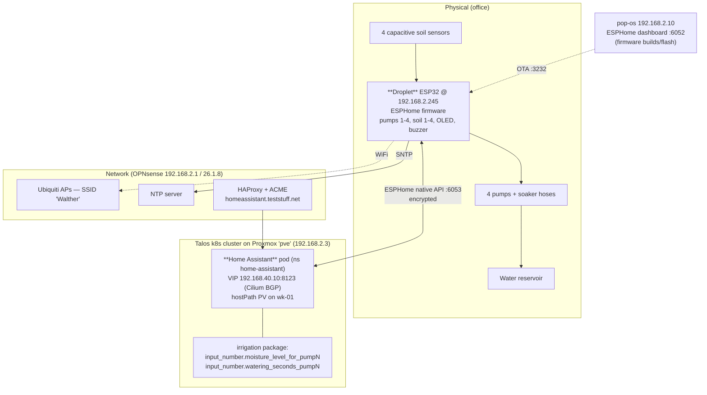
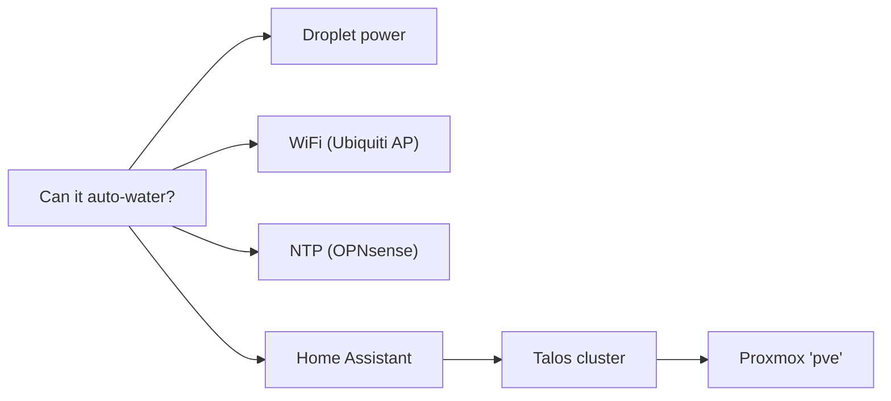
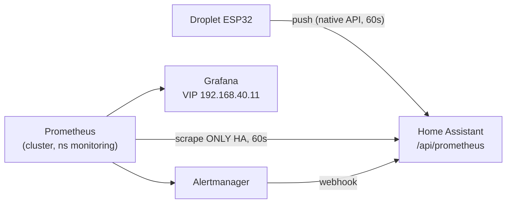

# Office Plants — Automated Irrigation Service

Self-contained service that keeps 4 office plants watered: a **PricelessToolkit "Droplet"**
ESP32 controller measures soil moisture and runs a pump per plant when the soil is too dry,
with thresholds and per-plant run-times configured in **Home Assistant**.

- **Owner:** Rasmus (homelab)
- **Status:** in service (4 plants live)
- **Source of truth:** this repo
  - Firmware/config: [`esphome/config/droplettest.yaml`](../../esphome/config/droplettest.yaml)
  - HA helpers: [`homeassistant/ha-config/packages/irrigation.yaml`](../../homeassistant/ha-config/packages/irrigation.yaml)
  - HA dashboard: [`homeassistant/ha-config/dashboards/home.yaml`](../../homeassistant/ha-config/dashboards/home.yaml)
  - Monitoring: [`tofu/monitoring.tf`](../../tofu/monitoring.tf), HA export [`packages/prometheus.yaml`](../../homeassistant/ha-config/packages/prometheus.yaml), alert relay [`packages/alerting.yaml`](../../homeassistant/ha-config/packages/alerting.yaml) — see [§9 Monitoring](#9-monitoring-prometheus--grafana)

---

## 1. What it does

Every **15 min during the day (08:00–21:00 local)**, the Droplet checks each plant:
if `soil_moisture% < desired%` it runs that plant's pump for its configured number of
seconds, soaks ~10 s, then moves to the next plant (one pump at a time). All four thresholds
and run-times are set from Home Assistant; nothing waters at night, and a master
**Auto Watering** switch (plus a manual **Water Now** button) is exposed in HA.

Decision + timing logic runs **on the device** (ESPHome), so it keeps its last-known
thresholds in RAM and only *needs* Home Assistant to (re)read configuration — see
[Dependencies](#4-dependencies).

---

## 2. Architecture (C4)

### Level 1 — System context


### Level 2 — Containers / deployment



### Physical setup
The reservoir is a **clear plastic storage tub** of water. The Droplet controller sits
**on top of / on the rim of the tub**, slightly elevated, so any pump or hose leak **drains
back into the tub** rather than onto the floor. The 4 pots are arranged around the tub; pumps
draw from it (short lift) and feed a **soaker hose** coiled into each pot. Soil sensors are
capacitive, wired back to the controller with red/white twisted-pair cables; pump water lines
attach to the controller on brass barbed fittings.


### What is deployed where

| Component | Where | Address | Notes |
|---|---|---|---|
| Droplet controller | Office, mains/USB powered | `192.168.2.245` (`droplettest`, MAC `30:c6:f7:22:a8:fc`) | ESP32 `esp32dev`, ESPHome; always-on (no deep sleep) |
| Pumps 1–4 | Droplet board outputs | GPIO 13 / 4 / 16 / 17 | one per plant, via soaker hoses |
| Soil sensors 1–4 | Droplet ADC inputs | GPIO 34 / 35 / 32 / 33 | capacitive; calibrated dry 2.30 V→0 %, water 0.89 V→100 % |
| Home Assistant | k8s (Talos) on Proxmox `pve` | VIP `192.168.40.10:8123`, `https://homeassistant.teststuff.net` | thresholds, run-times, dashboard, time peer |
| HA config (package + dashboard) | git → HA `/config` PV | `homeassistant/ha-config/...` | applied via `kubectl cp` + reload/restart |
| WiFi | Ubiquiti APs | SSID `Walther` | controller on dead T61; APs run standalone (see [Risks](#7-risk-analysis)) |
| NTP | OPNsense | `192.168.2.1` (+ `pool.ntp.org` fallback) | used for the day/night guard |
| ESPHome dashboard | pop-os | `192.168.2.10:6052` | build + flash firmware |

---

## 3. Configuration

All runtime tuning is in Home Assistant (dashboard card **"Watering time per plant"** and
**"Desired moisture thresholds"**), backed by `irrigation.yaml`:

| Setting | Entity | Range | Meaning |
|---|---|---|---|
| Desired moisture | `input_number.moisture_level_for_pump1..4` | 0–100 % | water while `soil% < this` |
| Run time per plant | `input_number.watering_seconds_pump1..4` | 5–600 s | how long that pump runs each pass |
| Master enable | `switch.droplettest_droplet_auto_watering` | on/off | default off after fresh flash; restores last state on reboot |
| Manual one-shot | `button.droplettest_droplet_water_now` | press | runs one cycle ignoring auto/daytime (still only waters below-threshold plants) |

Behaviour constants (less-often changed) live as `substitutions:` at the top of
`droplettest.yaml`: `check_interval` (15 min), `soak_seconds` (10 s), `day_start`/`day_end`
(8/21), `watering_seconds` (60 s fallback only).

> **Note:** the HA helpers intentionally have **no `initial:`** value, so they *persist*
> across HA restarts (a restart with `initial:` set silently resets them).

> **Note:** desired moisture and run-times are read from HA over the encrypted ESPHome API.
> If HA is unreachable those values are `NaN` and **no watering happens** (fail-safe).

### Bigger pots / weak pumps / soaker-hose priming
Pumps are underpowered for the larger pots, and soaker hoses absorb the first part of each
run before dripping. Compensate by **raising `watering_seconds_pumpN`** (up to 600 s) for the
thirsty pots — no reflash needed, it's a slider.

---

## 4. Dependencies



| Dependency | Needed for | If it fails |
|---|---|---|
| **Droplet power** | everything | no watering, no monitoring |
| **WiFi (`Walther`, Ubiquiti AP)** | device connectivity | device offline; APs run standalone even if the controller is down |
| **NTP (OPNsense `.1` / pool)** | day/night guard (auto only) | clock invalid → daytime guard fails closed → **no auto watering** (manual Water Now still works) |
| **Home Assistant** | thresholds + run-times | values go `NaN` → **no watering at all** (fail-safe) |
| **Talos k8s + Proxmox `pve`** | hosting Home Assistant | HA down → see above |
| **ESPHome dashboard (pop-os)** | firmware changes only | no runtime impact |

Local-first: NTP and the cluster are on-LAN, so watering does **not** depend on the internet
(public NTP is only a fallback).

---

## 5. Operations — routine

| Task | How |
|---|---|
| Change a threshold / run-time | HA dashboard sliders |
| Water immediately | press **Water Now** in HA |
| Stop everything | turn **Auto Watering** off (and/or set thresholds to 0) |
| Check soil readings | HA → Plant 1–4 sensors, or device `soilm_sens_N` |
| Read raw sensor voltage | device diagnostic sensors `soilN_raw` (hidden by default; enable in HA or read via API) |
| View logs | ESPHome dashboard (`192.168.2.10:6052`) → Logs, or `esphome logs` |
| Update firmware | edit `droplettest.yaml` → OTA (see below) |

### Firmware update / OTA
From a machine with the repo + ESPHome (or the dashboard at `192.168.2.10:6052`):
```bash
# esphome/config/secrets.yaml (gitignored) must hold wifi_ssid / wifi_password / ota_password
esphome run esphome/config/droplettest.yaml --device 192.168.2.245
```
- **OTA password** is recorded at `~/.claude/homelab-droplet/ota_password`.
- If OTA auth ever fails: block the device in UniFi → it starts its fallback AP → upload the
  built `.bin` via the captive portal (`http://192.168.4.1`). USB-UART is the last resort.

---

## 6. Maintenance — hardware

### Replace a pump
1. **Auto Watering → off** in HA (prevents a cycle starting mid-swap).
2. Empty the line / lift the hose out of the pot to avoid spillage.
3. Disconnect the failed pump from its Droplet output terminal and its tubing.
4. Fit the replacement pump to the **same** terminal + tubing (match polarity/voltage).
5. No config change — the GPIO mapping is unchanged (`pump1=13, pump2=4, pump3=16, pump4=17`).
6. Test: HA → toggle `switch.droplettest_droplet_pump_N` on for a few seconds (or press
   **Water Now** with that plant below threshold) and confirm flow.
7. Auto Watering → on.

### Replace a moisture sensor
1. Unplug the failed capacitive sensor from its channel header; plug the new one into the
   **same** channel (`Soil1=GPIO34, Soil2=35, Soil3=32, Soil4=33`).
2. **Recalibrate that channel** — sensors vary unit-to-unit (see below). This is required;
   skipping it gives wrong % and bad watering decisions.

### Recalibrate a soil sensor (per channel)
Calibration maps ADC volts → %. Defaults: dry `2.30 V → 0 %`, water `0.89 V → 100 %`.
1. In HA enable the `Soil N raw` diagnostic sensor (or read `soilN_raw` over the API) — it
   reports the **actual voltage**.
2. Put the sensor in **dry** soil/air → note `soilN_raw` (e.g. `2.30 V`).
3. Put the sensor in **plain water** → note `soilN_raw` (e.g. `0.89 V`).
4. Edit that sensor's `calibrate_linear` in `droplettest.yaml`:
   ```yaml
   filters:
     - calibrate_linear:
         - <dry_V> -> 0.00
         - <wet_V> -> 100.00
     - clamp: { min_value: 0, max_value: 100 }
   ```
5. OTA flash (see above). Verify dry reads ~0 %, water ~100 %.

> Why this matters: a 2-point linear fit is approximate (capacitive sensors are slightly
> non-linear), so treat mid-range % as a guide. The `soilN_raw` readout makes recalibration
> a "read the voltage" job rather than guesswork.

---

## 7. Risk analysis

| # | Risk | Likelihood | Impact | Mitigation / status |
|---|---|---|---|---|
| R1 | **Home Assistant down** (cluster/Proxmox/storage) → device can't read thresholds → no watering | Medium | High (plants dry out) | Fail-safe (no false watering); HA on cluster; **next:** HA HA / alerting. Single hostPath PV on wk-01 is a SPOF |
| R2 | **Reservoir runs empty / pump runs dry** | High | High | Manual refill checks; **no level sensor yet** → see Next steps |
| R3 | **Pump fails** (weak/dead) — plant silently not watered | Medium | Medium | "soil not rising after watering" is the tell; **next:** auto-detect & alert |
| R4 | **Sensor drift / failure** → over- or under-watering | Medium | Medium | Periodic recalibration; `soilN_raw` diagnostics; clamp 0–100 |
| R5 | **Threshold set higher than soil can reach** → pump runs every cycle (over-water) | Medium | Medium | Pick reachable thresholds; **next:** per-run max + daily cap |
| R6 | **Leak / hose pops off** while pumping | Low | Low–Med | **Droplet sits elevated on the reservoir box → leaks drain back into it**, limiting water damage; daytime-only, short runs. Still no leak/flow detection → Next steps |
| R7 | **WiFi outage** → device offline | Low | Medium | APs run standalone; UniFi controller migration in progress |
| R8 | **NTP unreachable** → daytime guard blocks auto watering | Low | Medium | Local OPNsense NTP + public fallback; manual Water Now unaffected |
| R9 | **Power loss to Droplet** | Low | Medium | Auto Watering restores last state on boot; thresholds persist (no `initial:`) |
| R10 | **Lost OTA / API credentials** → can't manage remotely | Low | Low | OTA pw recorded in `~/.claude/homelab-droplet/`; API key in config; captive-portal/USB fallback |
| R11 | **API encryption key committed in plaintext** in `droplettest.yaml` | Certain | Low (LAN) / High if repo goes public | **Move to `secrets.yaml` before publishing** (see repo PUBLISH-CHECKLIST) |

---

## 8. Next steps

- **Reservoir water-level sensor** + low-water alert (biggest gap — R2).
- **Pump-health detection:** flag a plant whose soil doesn't rise after N waterings (R3).
- **Flow/leak detection** or a hardware max-run fuse (R6).
- **Notifications** (HA): watering events, stale/again-NaN sensors, reservoir low.
  *(Started — Prometheus/Alertmanager → HA, see [§9](#9-monitoring-prometheus--grafana). Reservoir-low still needs R2's level sensor.)*
- Make **`check_interval` configurable from HA** (like the per-plant seconds) for long-run setups.
- **Per-sensor / multi-point calibration** for better mid-range accuracy.
- **Home Assistant resilience:** real storage provisioner instead of single-node hostPath; HA across nodes.
- **Move the API encryption key to `secrets.yaml`** (R11) ahead of making the repo public.
- ~~Graph soil %, watering count, and run-time per plant for trend visibility.~~ **Done** — Grafana dashboard ([§9](#9-monitoring-prometheus--grafana)).
- **Per-plant water *volume*** (not just on-seconds): calibrate ml/s per pump, or add flow sensors (deferred — time proxy chosen for now).

---

## 9. Monitoring (Prometheus + Grafana)

### Endpoints (HTTPS, valid Let's Encrypt certs)
| Service | URL | Backend VIP | LAN VIP (HAProxy) |
|---|---|---|---|
| Grafana | **https://grafana.teststuff.net** | `192.168.40.11:80` | `192.168.2.6:443` |
| Prometheus | **https://prometheus.teststuff.net** | `192.168.40.13:9090` | `192.168.2.7:443` |
| Alertmanager | **https://alertmanager.teststuff.net** | `192.168.40.14:9093` | `192.168.2.8:443` |

Same pattern as Home Assistant: OPNsense HAProxy terminates TLS (per-service LAN IP-alias
VIP) and proxies to the in-cluster BGP LoadBalancer VIP; certs via os-acme-client (DNS-01 /
Route 53); local DNS via Unbound host overrides. Managed in `ansible/opnsense-acme.yml` +
`ansible/opnsense-haproxy.yml`; the LoadBalancer VIPs are in `tofu/monitoring.tf`. The raw
`192.168.40.x` VIPs remain reachable directly (no TLS) for in-cluster/debug use.

### Topology — one scrape source, zero added WiFi

Prometheus scrapes **only Home Assistant** — never the ESP devices. Devices already push
their state into HA over the persistent native API, so monitoring adds **no WiFi traffic**
and there's no double-scraping. Every future ESPHome device is picked up for free (it just
needs to be an HA entity); Prometheus still scrapes a single target.

### What "water usage" means here
There is **no flow meter** (R2/R6), so usage is a **time proxy**: each pump accumulates a
monotonic on-seconds counter on-device (`pumpN_seconds_total`, persisted to flash), exposed
as `sensor.droplettest_droplet_pump_N_water_seconds` (`state_class: total_increasing`).
`increase(...[24h])` = seconds pumped today ≈ relative water used. To convert to millilitres
later, calibrate ml/s per pump (a slider-free constant) — deferred by choice.

### Metrics (HA `prometheus:` export → Prometheus)
| Signal | Entity | Prometheus metric (confirmed from live `/api/prometheus`) |
|---|---|---|
| Soil moisture % | `sensor.droplettest_droplet_soilm_sens_1..4` | `homeassistant_sensor_voltage_percent{entity=...}` |
| Water used (on-seconds) | `sensor.droplettest_droplet_pump_1..4_water_seconds` | `homeassistant_sensor_duration_s{entity=...}` |
| WiFi signal | `sensor.droplettest_droplet_wifi_signal_sensor` | `homeassistant_sensor_signal_strength_dbm{entity=...}` |
| Controller online | `binary_sensor.droplettest_droplet_status` | `homeassistant_binary_sensor_state{entity=...}` |
| HA reachable | — | `up{job="home-assistant"}` |

> HA names the metric from the entity's **device_class** (then unit): the ESPHome ADC sensors
> carry `device_class: voltage` → `…_voltage_percent`; the pump counters set
> `device_class: duration` → `…_duration_s`; WiFi is `signal_strength` → `…_signal_strength_dbm`.
> Filtering is by the stable `entity` label regardless. (Pump-seconds series only appear once
> the firmware with the counters is flashed.)

### Alerts (Alertmanager → HA)
`PrometheusRule` `office-plants` in `monitoring.tf`: **HomeAssistantScrapeDown** (no plant
metrics 10m → HA down / bad token), **DropletOffline** (controller disconnected 10m),
**SoilSensorSuspectZero** (sensor stuck at 0% for 2h). Alertmanager POSTs to the HA webhook
`prometheus-alerts`; the automation in `packages/alerting.yaml` raises a persistent
notification. Reservoir-low and pump-health alerts still wait on hardware (R2/R3).

### Reporting cadence & WiFi
Soil + WiFi sensors report at **60s** (1-min resolution — ample for plants, and it cuts
airtime vs. the old 10s). The on-device 15-min control loop is unaffected (it reads the
in-RAM soil state inside `do_water_cycle`).

### Deploy
1. **Firmware** (counters + 60s reporting) — OTA from a machine with the repo + ESPHome:
   ```bash
   esphome run esphome/config/droplettest.yaml --device 192.168.2.245
   ```
2. **HA export** — copy the package into the HA `/config` PV and reload, then create the token:
   ```bash
   kubectl -n home-assistant cp homeassistant/ha-config/packages/prometheus.yaml \
     "$(kubectl -n home-assistant get pod -l app=home-assistant -o name | cut -d/ -f2)":/config/packages/prometheus.yaml
   kubectl -n home-assistant cp homeassistant/ha-config/packages/alerting.yaml \
     "$(kubectl -n home-assistant get pod -l app=home-assistant -o name | cut -d/ -f2)":/config/packages/alerting.yaml
   # then: HA → Developer Tools → YAML → Restart (packages load at startup)
   ```
   In HA: **Profile → Security → Long-lived access tokens** → create one named `prometheus`.
3. **Stack** — from `tofu/` (devbox shell):
   ```bash
   export TF_VAR_ha_prometheus_token='<the long-lived token>'
   export TF_VAR_grafana_admin_password='<pick one>'
   tofu apply        # adds ns monitoring, kube-prometheus-stack, Grafana VIP, scrape job, dashboard, alerts
   ```
4. **Verify:** Grafana at `https://grafana.teststuff.net` (admin / your password) → *Office Plants — Irrigation*;
   Prometheus *Targets* shows `home-assistant` UP.

> **Storage:** Prometheus uses a node-pinned hostPath PV (`/var/mnt/prometheus` on `wk-02`,
> 90-day retention), mirroring HA's pattern since there's still no dynamic provisioner — the
> same SPOF caveat applies (R1). The "real storage provisioner" roadmap step would replace both.
> Three Talos/cluster prerequisites are baked into the code: a Talos `kubelet.extraMounts`
> bind for `/var/mnt/prometheus` (`talos.tf` — `/var/mnt` is otherwise read-only to the
> kubelet), a no-provisioner `manual` `StorageClass` (the prometheus-operator validates the SC
> exists, unlike core PV binding), and the `monitoring` namespace labelled
> `pod-security.kubernetes.io/enforce=privileged` (Talos enforces `baseline`; node-exporter
> needs host access). Credentials live outside the repo: HA scrape token at
> `~/.claude/homelab-ha/prometheus_llat`, Grafana admin password at
> `~/.claude/homelab-ha/grafana_admin_password`.

---

## 10. Quick reference

| Item | Value |
|---|---|
| Device IP / host | `192.168.2.245` / `droplettest` |
| ESPHome API | `:6053` (encrypted; key in `droplettest.yaml`) |
| OTA | `:3232`; password in `~/.claude/homelab-droplet/ota_password` |
| WiFi SSID | `Walther` (secrets in `esphome/config/secrets.yaml`, gitignored) |
| Pumps | `pump1=GPIO13, pump2=GPIO4, pump3=GPIO16, pump4=GPIO17` |
| Soil sensors | `Soil1=GPIO34, Soil2=GPIO35, Soil3=GPIO32, Soil4=GPIO33` |
| Time | SNTP `192.168.2.1` + `pool.ntp.org`, TZ Europe/Tallinn |
| Home Assistant | `https://homeassistant.teststuff.net` / `192.168.40.10:8123` |
| ESPHome dashboard | `http://192.168.2.10:6052` |
| HA package / dashboard | `homeassistant/ha-config/packages/irrigation.yaml`, `.../dashboards/home.yaml` |
