# Request map — oracle-fleet gateway (EXAMPLE — mirrors the spec rows of 2026-09-03; the oracle repo owns the real map) · `api` profile

> GENERATED by `scripts/request-flow-render.py` — do not edit; regenerate. Pattern + schema:
> [`docs/patterns/public-request-flow.md`](../public-request-flow.md). Platform half:
> `docs/patterns/request-flow/platform.yaml` (sha256 `c2c50d0c68da`); app half: `docs/patterns/request-flow/example-app.yaml`
> (sha256 `a1963ea8bdc0`). Values are POINTERS to where each knob lives — the number's home is authoritative.
> App spec rows: https://github.com/teststuffstash/oracle-fleet/blob/master/specs/server/mcp-conformance.md

```mermaid
flowchart LR
    C([client])
    P10["10 DNS"]
    C --> P10
    P15["15 TLS at the edge"]
    P10 --> P15
    P20["20 HTTP DDoS managed ruleset (ddos_l7)"]
    P15 --> P20
    P30["30 WAF custom rules"]
    P20 --> P30
    P40["40 per-IP rate limit"]
    P30 --> P40
    P50["50 Free managed WAF ruleset"]
    P40 --> P50
    P60["60 cache"]
    P50 --> P60
    P70["70 edge → origin: the claim's tunnel + cloudflared Deployment"]
    P60 --> P70
    P80["80 Service → pod (Cilium, ClusterIP)"]
    P70 --> P80
    A100["100 Content-Length gate"]
    P80 --> A100
    A110["110 single endpoint path"]
    A100 --> A110
    A112["112 /status"]
    A110 --> A112
    A115["115 /healthz exercises the stdio child; /metrics answered before auth"]
    A112 --> A115
    A120["120 Origin check"]
    A115 --> A120
    A130["130 static API keys (v1); none configured → identity 'anonymous'"]
    A120 --> A130
    A135["135 MCP-Protocol-Version"]
    A130 --> A135
    A140["140 shared limiter per identity"]
    A135 --> A140
    A150["150 backend call timeout"]
    A140 --> A150
    A160["160 stdio child respawn budget"]
    A150 --> A160
    L([LAN client])
    L10["10 DNS"]
    L --> L10
    L15["15 TLS at OPNsense HAProxy (ACME cert) → Cilium Gateway"]
    L10 --> L15
    L70["70 HTTPRoute"]
    L15 --> L70
    L70 --> P80
```

## Stages, in request order

| seq | stage | owner | guard | value lives in | rejection looks like | verify | id |
|---|---|---|---|---|---|---|---|
| 10 | DNS — proxied CNAME to the claim's own tunnel | platform | hostname must lie in the claim's zone/subtree (composition template fail-loud) | PublicRoute `.spec.hostname` + `.spec.zone`; zone map = composition constant | NXDOMAIN (no record) / template fail (claim never reconciles) | dig +short <host> @1.1.1.1 → Cloudflare anycast IPs | PRF-DNS |
| 15 | TLS at the edge — min TLS 1.2, always-https | platform | zone settings from the product-zone bootstrap | tofu/cloudflare/minutark.tf (`min_tls_version`, `always_use_https`) | handshake failure / 301 to https | curl -I http://<host>/ → 301; openssl s_client -tls1_1 fails | PRF-TLS |
| 20 | HTTP DDoS managed ruleset (ddos_l7) | cloudflare | always on; actions may be CHALLENGE-shaped — NOT covered by the api never-challenge Skip (seam S4) | Cloudflare-managed; Free-plan action override unverified | block or managed challenge (interstitial) | UNVERIFIED — docs/cloudflare.md §PublicRoute completion table | PRF-DDOS |
| 30 | WAF custom rules — never-challenge Skip · CORS preflight block · operational-path block | platform | ONE http_request_firewall_custom ruleset per claim: Skip products bic/securityLevel/uaBlock + phases sbfm/managed; OPTIONS from an Origin outside the allow-list → 403; /metrics,/healthz → 403 (ADR-123, ☐ FU-206) | PublicRoute `.spec.origins`; composition (argocd/resources/publicroute/composition.yaml) | structured 403 JSON (`{"success":false,"errors":[{"code":10403,…}]}`) | GET /zones/{zone}/rulesets → kind=zone phase=http_request_firewall_custom; curl -X OPTIONS -H 'Origin: https://evil' → 403 | PRF-CUSTOM |
| 40 | per-IP rate limit — ⌈threshold/6⌉ per 10 s window (Free plan's only period) | platform | characteristics cf.colo.id + ip.src; mitigation 10 s; counting is per colo | PublicRoute `.spec.rateLimit.threshold` (per-minute figure; bounds in the XRD) | 429, Cloudflare-envelope JSON (`code 10429`), `Retry-After: 10` (= mitigation timeout; verified live 2026-09-03, homelab#1334 check 1) | homelab#1334 check 1 — >threshold/6 requests in 10 s from one IP → 429 JSON, never an interstitial | PRF-RATELIMIT |
| 50 | Free managed WAF ruleset | cloudflare | SKIPPED for the host by stage 30's Skip (phase http_request_firewall_managed in its list) — seam S5, probably over-broad | composition Skip rule `phases` | none for this host | ruleset read: the Skip's phases list | PRF-WAF |
| 60 | cache | platform | api profile renders no cache rule | — | — | curl -I → cf-cache-status: DYNAMIC | PRF-CACHE |
| 70 | edge → origin: the claim's tunnel + cloudflared Deployment | platform | proxy read timeout 100 s and upload cap 100 MB are FIXED on Free (the app owns tighter bounds — CTR-BODY, CTR-TIMEOUT); tunnel routes ONLY the claim hostname (others → http_status:404) and to ONE backend — no path routing: composing two backends under one site is a cross-host call (`depends_on`). A backend CHANGE reaches cloudflared only when the Workspace reconciles (poll/nudge, ~2 min) — keep the old Service until the tunnel config version bumps (cloudflare.md gotcha 7) | PublicRoute `.spec.backend`, `.spec.replicas`; Cloudflare plan constants | 524 (origin timeout), 413 (upload cap), 1033 (tunnel down), 404 (unlisted hostname) | kubectl -n <ns> get deploy pr-<ns>-<claim>-cloudflared; GET accounts/{a}/cfd_tunnel → healthy | PRF-TUNNEL |
| 80 | Service → pod (Cilium, ClusterIP) | platform | no NetworkPolicy on the backend by default; the LAN path joins here | PublicRoute `.spec.backend.service` (trailing dot — gotcha 1) + `.port` | 502/503 from cloudflared when no endpoints | kubectl -n <ns> get endpoints <svc> | PRF-SERVICE |
| 100 | Content-Length gate, header-first, then actual size | app | 1 MiB default; declared > cap → rejected before rfile.read, connection closed | chart `mcpServer.gateway.maxBodyBytes` | HTTP 200, JSON-RPC error -32600 "Request body too large" | tests/test_gateway.py (oversized declared + actual) | SRV-HTTP-BODY-CAP |
| 110 | single endpoint path, exact match | app | POST → 200 json / 202 notification; GET → 405; other paths → 404 | chart `mcpServer.gateway.endpointPath` | 404 `{"error":"not found"}` | curl https://<host>/nope → 404 | SRV-HTTP-ENDPOINT |
| 112 | /status — corpus freshness document (LOEMIND date, digest, schema, staleness, alert) | app | answered pre-auth like /metrics; PRODUCT surface, never on the ADR-123 block list; sets its own Access-Control-Allow-Origin for the apex (CORS-in-app for one path) | gateway/app.py (`status_path`); ACAO hardcoded to https://minutark.ee | 405 on non-GET; a fourth response grammar on the host (plain JSON document) | curl -H 'Origin: https://minutark.ee' https://mcp.minutark.ee/status → 200 + ACAO | SRV-STATUS |
| 115 | /healthz exercises the stdio child; /metrics answered before auth | app | answered BEFORE origin/auth/rate-limit | gateway/app.py (`health_path`, `metrics_path`) | 503 when the child is latched broken | kubelet readiness; ServiceMonitor scrape | SRV-SERVE-READINESS |
| 120 | Origin check — default-deny allow-list (public mode = accept any) | app | ⚠ `publicOriginMode` is deployment-global (seam S2) | chart `mcpServer.gateway.allowedOrigins` / `publicOriginMode` | 403 `{"error":"origin not allowed"}` | e2e-serve.sh 403→200→403 toggle | SRV-HTTP-ORIGIN |
| 130 | static API keys (v1); none configured → identity "anonymous" | app | Authorization: Bearer | chart `mcpServer.gateway.apiKeysSecret` | 401 + WWW-Authenticate | tests/test_gateway.py | SRV-AUTH |
| 135 | MCP-Protocol-Version | app | unsupported → 400; absent → assumed 2025-03-26 | gateway/app.py constants | 400 | tests/test_gateway.py | SRV-HTTP-PROTOVER |
| 140 | shared limiter per identity, per replica | app | one "anonymous" bucket per replica until keys exist — capacity, not fairness | chart `mcpServer.gateway.rateLimitPerMin` | 429 `{"error":"rate limit exceeded"}` + Retry-After: 60 (⚠ edge window is 10 s — seam S3) | k6 ramp (SRV-PERF-OVERLOAD) | SRV-TOOLS-SECURITY |
| 150 | backend call timeout | app | select()-deadline on the stdio pipe; probe/warm-up untimed | chart `mcpServer.gateway.backendCallTimeoutSecs` | HTTP 200, JSON-RPC error -32603 "backend call failed or timed out" | tests/test_gateway_resilience.py | SRV-HTTP-TIMEOUT |
| 160 | stdio child respawn budget | app | MAX_RESPAWNS in RESPAWN_WINDOW → latched broken → readiness 503 → pod restart | gateway/backend.py constants | 503 on /healthz | tests/test_gateway_resilience.py | SRV-SERVE-READINESS |

## The LAN path (joins the table above at the shared stage)

| seq | stage | owner | guard | value lives in | rejection looks like | verify | id |
|---|---|---|---|---|---|---|---|
| 10 | DNS — Unbound override *.<stack>.teststuff.net → the stack's Cilium Gateway VIP | platform | ADR-092 subdomain delegation | ansible/group_vars (opnsense-unbound); the stack's Gateway | NXDOMAIN off-LAN (by design) | dig <host> @192.168.2.1 | LAN-DNS |
| 15 | TLS at OPNsense HAProxy (ACME cert) → Cilium Gateway | platform | LAN-only; no WAF, no rate limit, no DDoS layer | ansible/opnsense-haproxy.yml; ADR-092 gateway | 503 from HAProxy when the backend is down | curl -I https://<host>/ | LAN-TLS |
| 70 | HTTPRoute — PathPrefix = the app's endpoint path | app | the chart's HTTPRoute; unmatched paths never reach the app | the app chart (oracle: `mcpServer.gateway.endpointPath`) | 404 from the Gateway | kubectl -n <ns> get httproute | LAN-ROUTE |
| 80 | Service → pod (Cilium, ClusterIP) | platform | joins the public path here | the chart's Service | 503 | kubectl get endpoints | PRF-SERVICE |

## Contract — what the platform assumes of a `api`-profile app

| contract row | why the app owns it | fulfilled by |
|---|---|---|
| `CTR-PATH` — one endpoint path; everything else 404 | the tunnel forwards the whole hostname — the app is the only path filter on the public side | `SRV-HTTP-ENDPOINT` |
| `CTR-OPS` — answer readiness (and /metrics where it exists) BEFORE auth for the kubelet and Prometheus | the edge hides operational paths from the public (ADR-123, FU-206); the LAN scrape/probe path must keep working | `SRV-SERVE-READINESS` |
| `CTR-BODY` — bound the request body BEFORE reading it | the edge cap is fixed at 100 MB on Free and `http.request.body.size` is an Enterprise field | `SRV-HTTP-BODY-CAP` |
| `CTR-TIMEOUT` — bound backend/upstream time | the edge's 100 s proxy read timeout is fixed below Enterprise | `SRV-HTTP-TIMEOUT` |
| `CTR-ORIGIN` — default-deny Origin on the LAN path; relax on the public path only to the SAME list the edge enforces | one Deployment serves both paths (seam S2) — a global 'public mode' drops the DNS-rebinding defence on the LAN | `SRV-HTTP-ORIGIN` |
| `CTR-OPTIONS` — answer an ALLOWED CORS preflight (OPTIONS → 204 + headers) | the Ruleset Engine cannot synthesize a 2xx; the edge only rejects disallowed preflights and rewrites response headers (seam S1) | **GAP** |
| `CTR-IDENTITY` — capacity and per-key/per-identity limiting | Free-plan edge characteristics are IP only — fairness is the edge's, metering is the app's | `SRV-TOOLS-SECURITY` |
| `CTR-ERRORS` — document the rejection grammar of every app stage | three grammars already share one URL (edge envelope, app `{error}`, JSON-RPC frames) — seam S3; a client must be able to parse each; a connect doc quotes THIS column | **GAP** |

**2 contract gap(s)**: `CTR-OPTIONS`, `CTR-ERRORS` — each is a seam where a bug will land; fill the row in the app map or decide it away in the spec.
