# Request map — minutark.ee static site (EXAMPLE — the oracle chart's static-site as of oracle-fleet#410; the oracle repo owns the real map) · `consumer` profile

> GENERATED by `scripts/request-flow-render.py` — do not edit; regenerate. Pattern + schema:
> [`docs/patterns/public-request-flow.md`](../public-request-flow.md). Platform half:
> `docs/patterns/request-flow/platform.yaml` (sha256 `dcfc742b8479`); app half: `docs/patterns/request-flow/example-static-site.yaml`
> (sha256 `697d638909d1`). Values are POINTERS to where each knob lives — the number's home is authoritative.
> App spec rows: https://github.com/teststuffstash/oracle-fleet/blob/master/chart/templates/static-site.yaml

```mermaid
flowchart LR
    C([client])
    P10["10 DNS"]
    C --> P10
    P15["15 TLS at the edge"]
    P10 --> P15
    P20["20 HTTP DDoS managed ruleset (ddos_l7)"]
    P15 --> P20
    P30["30 WAF custom rules"]
    P20 --> P30
    P50["50 Free managed WAF ruleset"]
    P30 --> P50
    P60["60 cache"]
    P50 --> P60
    P65["65 RUM / Web Analytics beacon"]
    P60 --> P65
    P70["70 edge → origin: the claim's tunnel + cloudflared"]
    P65 --> P70
    P80["80 Service → pod (Cilium, ClusterIP)"]
    P70 --> P80
    A100["100 nginx `try_files $uri $uri/ =404`"]
    P80 --> A100
    A105["105 readiness = GET / 200"]
    A100 --> A105
    A110["110 response cache headers"]
    A105 --> A110
    A120["120 freshness badge"]
    A110 --> A120
    A130["130 rejection grammar: nginx 404/403 HTML; edge 403 JSON (operational-path block"]
    A120 --> A130
    D0(["mcp.minutark.ee/status"])
    A120 -.->|calls| D0
    L([LAN client])
    L10["10 DNS"]
    L --> L10
    L15["15 TLS at OPNsense HAProxy (ACME cert) → Cilium Gateway"]
    L10 --> L15
    L70["70 HTTPRoute"]
    L15 --> L70
    L70 --> P80
```

## Stages, in request order

| seq | stage | owner | guard | value lives in | rejection looks like | verify | id |
|---|---|---|---|---|---|---|---|
| 10 | DNS — proxied CNAME to the claim's own tunnel | platform | hostname must lie in the claim's zone/subtree (composition template fail-loud) | PublicRoute `.spec.hostname` + `.spec.zone` | NXDOMAIN / template fail | dig +short <host> @1.1.1.1 | PRF-DNS |
| 15 | TLS at the edge — min TLS 1.2, always-https | platform | zone settings from the product-zone bootstrap | tofu/cloudflare/minutark.tf | handshake failure / 301 | curl -I http://<host>/ → 301 | PRF-TLS |
| 20 | HTTP DDoS managed ruleset (ddos_l7) | cloudflare | always on; challenges are LEGAL on this profile | Cloudflare-managed | block or managed challenge | — | PRF-DDOS |
| 30 | WAF custom rules — operational-path block | platform | /metrics,/healthz → 403 (ADR-123, ☐ FU-206); no Skip — challenges legal | composition | structured 403 JSON | GET /zones/{zone}/rulesets | PRF-CUSTOM |
| 50 | Free managed WAF ruleset | cloudflare | runs normally (block-shaped rules) | Cloudflare-managed | 403 block page | — | PRF-WAF |
| 60 | cache — respect origin cache-control, Cloudflare default TTL when absent | platform | http_request_cache_settings ruleset per claim (one per zone!) | composition; the origin's Cache-Control | — | curl -I → cf-cache-status HIT/MISS/REVALIDATED (homelab#1334 check 2) | PRF-CACHE |
| 65 | RUM / Web Analytics beacon | platform | rendered by the composition; ☐ UNDELIVERABLE through the ingress-write token (no RUM write permission group exists) | composition (`cloudflare_web_analytics_site/_rule`) | — | docs/cloudflare.md §Observability | PRF-RUM |
| 70 | edge → origin: the claim's tunnel + cloudflared | platform | 100 s read timeout, 100 MB upload cap (Free constants); tunnel routes only the claim hostname | PublicRoute `.spec.backend`, `.spec.replicas` | 524 / 413 / 1033 / 404 | GET accounts/{a}/cfd_tunnel → healthy | PRF-TUNNEL |
| 80 | Service → pod (Cilium, ClusterIP) | platform | the LAN path joins here | PublicRoute `.spec.backend.service` + `.port` | 502/503 when no endpoints | kubectl get endpoints | PRF-SERVICE |
| 100 | nginx `try_files $uri $uri/ =404` — hand-written HTML/CSS, llms.txt | app | no other location: /status on THIS host is a 404 (index/connect must fetch it absolute, on the api host) | chart `staticSite.*`; chart/static/* | nginx 404 HTML page (cached 3 min at the edge) | curl -I https://minutark.ee/status → 404; /connect.html → 200 | SITE-ROUTE |
| 105 | readiness = GET / 200 | app | no /metrics, no /healthz — the kubelet probes the root | chart static-site Deployment probes | — | kubectl -n oracle-fleet get pods -l app=static-site | SITE-READY |
| 110 | response cache headers | app | nginx default: ETag + Last-Modified, NO Cache-Control → the consumer profile applies Cloudflare's default TTL (120 min on 200) | nginx config in chart/templates/static-site.yaml (no add_header today) | — | curl -I https://minutark.ee/connect.html → cf-cache-status + age; cache-control absent | SITE-CACHE |
| 120 | freshness badge — browser fetch of the api host's /status | app | cross-origin; relies on the api host's own Access-Control-Allow-Origin and on the api claim being LIVE | chart/static/status.html (absolute URL); index.html + connect.html still fetch RELATIVE (bug: hits stage 100's 404) | badge 'unavailable' when the api host is down or CORS fails | browser devtools on https://minutark.ee/status.html; curl the api host with Origin | SITE-STATUS-BADGE |
| 130 | rejection grammar: nginx 404/403 HTML; edge 403 JSON (operational-path block, when FU-206 lands); edge challenge pages are LEGAL on this profile | app | — | nginx defaults | text/html error pages | curl -I https://minutark.ee/nope → 404 text/html | SITE-ERRORS |

## The LAN path (joins the table above at the shared stage)

| seq | stage | owner | guard | value lives in | rejection looks like | verify | id |
|---|---|---|---|---|---|---|---|
| 10 | DNS — Unbound override *.<stack>.teststuff.net → the stack's Cilium Gateway VIP | platform | ADR-092 subdomain delegation | ansible/group_vars (opnsense-unbound); the stack's Gateway | NXDOMAIN off-LAN (by design) | dig <host> @192.168.2.1 | LAN-DNS |
| 15 | TLS at OPNsense HAProxy (ACME cert) → Cilium Gateway | platform | LAN-only; no WAF, no rate limit, no DDoS layer | ansible/opnsense-haproxy.yml; ADR-092 gateway | 503 from HAProxy when the backend is down | curl -I https://<host>/ | LAN-TLS |
| 70 | HTTPRoute — PathPrefix = the app's endpoint path | app | the chart's HTTPRoute; unmatched paths never reach the app | the app chart (oracle: `mcpServer.gateway.endpointPath`) | 404 from the Gateway | kubectl -n <ns> get httproute | LAN-ROUTE |
| 80 | Service → pod (Cilium, ClusterIP) | platform | joins the public path here | the chart's Service | 503 | kubectl get endpoints | PRF-SERVICE |

## Cross-map dependencies (calls to ANOTHER PublicRoute)

| from stage | calls | note |
|---|---|---|
| `SITE-STATUS-BADGE` (seq 120) | `mcp.minutark.ee/status` | that host has its own request map — this picture is only as live as that one |

## Contract — what the platform assumes of a `consumer`-profile app

| contract row | why the app owns it | fulfilled by |
|---|---|---|
| `CTR-OPS` — answer readiness (and /metrics where it exists) BEFORE auth for the kubelet and Prometheus | the edge hides operational paths from the public (ADR-123, FU-206); the LAN scrape/probe path must keep working | `SITE-READY` |
| `CTR-ERRORS` — document the rejection grammar of every app stage | three grammars already share one URL (edge envelope, app `{error}`, JSON-RPC frames) — seam S3; a client must be able to parse each; a connect doc quotes THIS column | `SITE-ERRORS` |
| `CTR-CACHE` — set Cache-Control on EVERY response | the consumer profile respects the origin and falls back to Cloudflare's default TTL on silence (200 → 120 min, 404 → 3 min); no token we hold carries cache purge — a silent origin ships a two-hour-stale launch page (oracle-fleet#410 read, 2026-09-03) | **GAP** |

**1 contract gap(s)**: `CTR-CACHE` — each is a seam where a bug will land; fill the row in the app map or decide it away in the spec.
