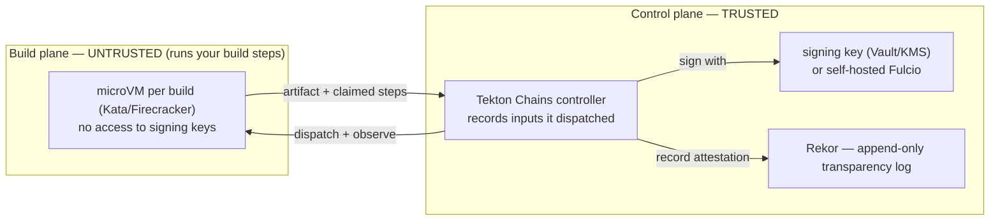

# SLSA in the homelab — a self-hosted L3 (and "L4") plan

_Planning record, 2026-06-12. Goal: build **real software** in this homelab with verifiable
supply-chain integrity, **without depending on GitHub or Chainguard as services** (their tooling is
fine; the SaaS dependency is what we avoid — same principle as `CONTEXT.md`'s "boot from git" /
local-first). This doc captures what level the current setup can reach, the fully self-hosted stack
to get to Build L3, and what must be **built vs bought** for "L4" (confidential compute)._

> **Accuracy note that shapes everything below.** **SLSA v1.0's Build track officially defines only
> up to L3.** There is no current spec'd "L4." When people say L4 they mean one of two things:
> - **(a) retired v0.1 L4** = *hermetic + reproducible builds + two-person review* — mostly a
>   **software** problem; or
> - **(b) "and beyond"** (per Chainguard) = **confidential computing** (memory-encrypted,
>   host-opaque build VMs) — a **hardware** problem.
>
> We treat them separately so we're not chasing a checklist that doesn't exist.

## The crux: it's not about the build, it's about non-falsifiable provenance

A build platform is "remote-code-execution-as-a-service" — it runs untrusted code by design. So the
real threat at the higher levels is **the build forging its own attestation**. That reframes the
requirements:

- **L1** — provenance *exists* (how the artifact was built is recorded).
- **L2** — **hosted** build (not a laptop) + **signed** provenance. Protects against tampering after
  the fact and forging by someone without the key.
- **L3** — **non-falsifiable** provenance: build runs are isolated from each other **and** from the
  control plane, and **the signing key is unreachable by user-defined build steps**. A shared-kernel
  container is *not* this boundary ("a screen door"). This needs a **control-plane / build-plane
  split** + **per-build isolation** (microVM).

There are three SLSA tracks worth tracking, and we already touch all three:

| Track | What it covers | Where it lives for us |
|---|---|---|
| **Source** | how source is controlled (review, retention, signed history) | **Forgejo** branch protection + signed commits + protected file patterns (see `forgejo.tf`; the "git is the real RBAC" discussion) |
| **Build** | build integrity + provenance | the bulk of this doc |
| **(beyond)** | hermetic / reproducible / confidential | melange/apko + Nix; EPYC confidential compute |



## Where the current setup lands

| Level | Reachable now? | Blocker / what it takes |
|---|---|---|
| Source L1–L3 | ✅ now | Forgejo branch protection + signed commits + (later) two-person review |
| Build L1 (provenance exists) | ✅ trivially | generate build metadata |
| Build L2 (hosted + signed) | ✅ now | `act_runner` (hosted, not a laptop) + cosign-signed provenance + SBOM |
| **Build L3 (non-falsifiable)** | ❌ not with vanilla `act_runner` | control-plane/build-plane split + per-build microVM isolation (the real project) |
| "L4" hermetic + reproducible | ⚠️ software-reachable | melange/apko + Nix get most of the way |
| "L4" confidential compute | ❌ **hardware-gated** | no current CPU (X99 Haswell Xeon, desktop chips, ThinkPads) has SEV-SNP/TDX |

**Hard ceiling on current hardware:** a genuine, fully self-hosted **Build L3 + hermetic/reproducible**
is achievable in software we can already run. **Confidential-compute "L4" requires buying a CPU.**

## The fully self-hosted stack (no GitHub, no Chainguard *services*)

Every primitive under GitHub's `slsa-github-generator` and Chainguard's registry is OSS and
self-hostable. The substitution map:

| Need | Their service | Self-hosted equivalent |
|---|---|---|
| Build engine w/ control/build-plane split | GitHub reusable workflow | **Tekton Pipelines + Tekton Chains** — Chains observes TaskRuns from the *controller*, generates + signs provenance with keys the build pods can't reach. The L3 linchpin. |
| Per-build isolation ("VM not container") | GKE nested QEMU | **Kata Containers** (microVM per pod) on **bare-metal KVM** nodes (native KVM — no nested-virt pain; never nested on the Proxmox VMs) |
| Keyless signing identity | Fulcio (public good) + GitHub OIDC | **self-hosted Fulcio + Dex (OIDC)** — your own keyless CA. Or simpler: a cosign key in **Vault/KMS/PKCS#11**, held only by the Chains controller |
| Transparency log (the SCITT idea) | public Rekor | **self-hosted Rekor** — append-only attestation log |
| Hermetic, reproducible package + image builds | Chainguard Images | **melange + apko on Wolfi** — the *tooling* is OSS and free; we avoid only their *registry*, which is the point. Build our own minimal reproducible base. |
| Dependency vetting (the S2C2F / consumer side) | — | **cosign verify / verify-attestation** on everything consumed, incl. verifying upstream SLSA provenance |

melange/apko/Wolfi are exactly the "I can run Chainguard OS / melange / apko" idea — the **tools**
are open, so depending on them is *not* depending on Chainguard-the-vendor.

## Signing strategy — keyless, and what the public-good service buys you

### How keyless actually works (where Fulcio/Rekor enter)

"Keyless" = no long-lived key. Per signature: cosign gets an **OIDC identity token** (a GitHub
workflow token in CI, or a browser login for a human) → generates an **ephemeral keypair** →
**Fulcio** (the CA) verifies the token and issues a **~10-min X.509 cert** binding that key to the
*identity* (email or workflow URI in the SAN, OIDC issuer as an extension) → cosign signs the digest
→ **Rekor** (append-only transparency log) records it and timestamps it (so the signature still
verifies long after the 10-min cert expires) → the private key is discarded. There is **no persistent
public key**: verification is *identity-based*, anchored on Fulcio's root + Rekor's key, which cosign
trusts via the **TUF trust root**. So `cosign verify` needs no `--key`, but **does** need
`--certificate-identity[-regexp]` + `--certificate-oidc-issuer` (and should — otherwise you only
prove "*someone* signed it").

### Hard constraint: public Fulcio only trusts an allowlist of issuers

The public-good Fulcio accepts a **curated set** of OIDC issuers (`token.actions.githubusercontent.com`,
`accounts.google.com`, `gitlab.com`, Buildkite, the human-login Dex at `oauth2.sigstore.dev`, …).
**You cannot add your own** — a self-hosted **Forgejo/`act_runner` OIDC token is rejected** by public
Fulcio. So "sign as `ci@teststuff.net` from my self-hosted CI against public Sigstore" does **not**
work directly. `ci@teststuff.net` is a public-verifiable identity *only* if backed by an allowlisted
IdP (e.g. a real Google Workspace account on the domain), not by our own Dex.

### The dual-sign architecture (self-host the common case, public-good for releases)

cosign attaches signatures as an OCI artifact that holds **multiple** entries, and `cosign verify`
succeeds if **any** signature matches the identity/key asserted. So **dual-sign the same image**:

| When | Identity / trust | Why |
|---|---|---|
| **Everyday Forgejo CI** (frequent) | self-hosted Fulcio later, or a plain keypair now | cheap, private, no public-log email leak |
| **Major releases** (rare) | **public-good Sigstore** — public Rekor CT entry | external, anyone-can-verify trust (the value the SaaS genuinely adds, like CT logs) |

Two ways to get the public-good release signature without making public Fulcio trust Forgejo:

- **Manual / human** — interactive `cosign sign` (browser → Google), identity = `rasmus@gmail.com`:
  ```bash
  cosign verify --certificate-identity 'rasmus@gmail.com' \
    --certificate-oidc-issuer 'https://oauth2.sigstore.dev/auth' <image>
  ```
  Zero infra; ideal for hand-cut infrequent releases. (Confirm the exact issuer/SAN once and pin it.)
- **Automated CI identity** — run **only the release job on GitHub Actions** (an allowlisted issuer;
  everyday builds stay on Forgejo). cosign auto-detects the ambient GitHub OIDC token:
  ```bash
  cosign verify \
    --certificate-identity-regexp '^https://github.com/ORG/REPO/\.github/workflows/release\.yml@.*' \
    --certificate-oidc-issuer 'https://token.actions.githubusercontent.com' <image>
  ```
  (Or `actions/attest-build-provenance` for SLSA provenance signed via public Fulcio/Rekor.) GitHub
  is then a dependency **only at release time**, not for everyday CI.

Net: never fight to get public Fulcio to trust Forgejo (it won't). Self-host the everyday signature;
add a **public-good** signature on releases via your Google email (manual) or a GitHub release
workflow (automated). The two coexist on the same digest, each verifies against its own trust anchor.

## Phased plan

Each phase is independently useful — never blocked on the next; stop at the ROI cliff.

**Phase 0 — Source track (free, do alongside the Forgejo markdown-repo work).**
Branch protection on the tracked branch (PR-only, signed commits required, protected file patterns),
two-person review when a second identity exists. → Source L2→L3.

**Phase 1 — Build L1/L2 (low effort, high ROI — do regardless of the rest).**
A **hosted (not-a-laptop) runner** → generate provenance → **cosign sign** + **syft SBOM** +
**grype/trivy scan**, push image + attestations to a registry. Covers the realistic homelab threat
model. NOTE (2026-06-24): the homelab now has **two** hosted runners (see [`ci.md`](ci.md)) — **ARC**
for GitHub-canonical projects (→ ghcr; GitHub OIDC also unlocks **keyless** cosign + native build
attestations) and **`act_runner`** for Forgejo-only projects (→ Forgejo registry). Either is a valid
L2 base; pick per project's tier. The cosign/SBOM/scan layer is still TODO on both.

**Phase 2 — Hermetic + reproducible (the software "L4" leg, medium effort).**
Move the *actual software* to **melange** (build packages in isolated envs) + **apko** (assemble
reproducible OCI images from those packages, on Wolfi). Nix/devbox already gives toolchain
reproducibility — we're ahead here. Banks the reproducibility leg early; useful at any level.

**Phase 3 — Self-hosted Build L3 (the real project).**
Stand up **Tekton Pipelines + Tekton Chains**; run build steps in **Kata microVMs on the bare-metal
KVM nodes**; hold the signing key only in the Chains controller (Vault/KMS) — or go full
**self-hosted Fulcio + Dex + Rekor** for keyless. Net: a self-hosted equivalent of
`slsa-github-generator` producing non-falsifiable, signed, logged provenance. Do it on KVM-native
metal, **never nested on Proxmox**.

**Phase 4 — Confidential "beyond L3" (build + buy).** The only money-gated part:
- **Buy:** a CPU with confidential VMs — **AMD EPYC (SEV-SNP, Milan/Zen3 7003+)**; used Milan in a
  quiet single-socket tower is the value entry. (Intel **TDX** = Sapphire Rapids / 4th-gen Xeon+ is
  the alternative, pricier.)
- **Build:** the **Confidential Containers (CoCo)** project — Kata pods inside SEV-SNP/TDX VMs with
  **remote attestation** via a Key Broker Service that releases the signing key only to an attested
  build VM. The genuine "host operator can't tamper with or observe the build" property.

## Hardware

### Confidential compute is EPYC-only — confirmed

**SEV / SEV-ES / SEV-SNP are gated to EPYC.** This is deliberate AMD market segmentation, not a
firmware oversight:

- **Threadripper PRO does NOT have working SEV-SNP** — even 9000-series / WRX90. The BIOS *exposes*
  the SEV/SNP toggles (inherited from the EPYC-derived platform), but they've been **non-functional
  for ~a year** (see Sources — Level1Techs thread). **Presence of a BIOS knob is not proof of
  capability.** Verify the SKU datasheet, never the BIOS menu.
- **Strix Halo (Ryzen AI Max+ PRO 395) also has no SEV-SNP.**
- → The **only** path to confidential VMs is **EPYC Milan (Zen3, 7003) or newer** (SEV-SNP
  specifically; SEV/SEV-ES go back to Naples/Rome but we want SNP).

"EPYC = noisy 1U" is also a myth: **single-socket EPYC runs fine in a quiet tower** (ASRock Rack
ROMED8-2T / Supermicro H12·H13 / Gigabyte MZ-series ATX/E-ATX boards + a big air cooler). No
rackmount required. **Used EPYC Milan** is the cheap entry to confidential compute and crushes
parallel builds too — so it's the single box that serves *both* the build-throughput and L4 goals.

**Decision:** don't buy Threadripper PRO for an L4 capability it doesn't have. Defer an **EPYC Milan
quiet tower** until confidential L4 is a real project (prices only improve). Until then, fast builds
come from any EPYC / non-PRO Threadripper / Ryzen 9 tower.

### LLM hardware is a *separate* track (not the SLSA build node)

Local-LLM compute is its own tiered plan, recorded here only so the cross-references are clear — the
SLSA build node (EPYC) is distinct from these:

- **Tier 1 — Edge k8s:** 4-core / 16GB boxes, maybe a mid-range GPU. Small inference at the edge.
- **Tier 2 — Cluster local agents:** 16GB-VRAM GPUs in more powerful desktops; possibly stretch to
  32GB-VRAM cards. **Validate workloads against OpenRouter first** before committing to cards.
- **Tier 3 — Larger planner/verifier models** that manage the cheaper cluster agents: this is where
  **AMD Ryzen AI Max+ 395 (Strix Halo)** — unified 128GB LPDDR5X, big iGPU + NPU, quiet/low-power —
  or **Optane PMem** would fit. Strix Halo's win is **capacity** (fit ~70B-class quantized in a tiny
  silent box), not raw GPU speed (~256 GB/s unified vs ~1 TB/s on a discrete GPU). ROCm/Vulkan there
  is maturing; XDNA NPU Linux support is still early — lean on llama.cpp/Vulkan today. Decide on
  actual market prices when the need is real.

## Framework context (from the SLSA course material)

SLSA isn't the only supply-chain framework, and the others compose:

- **SCITT** (IETF, transparency + auditability) → for us = **self-hosted Rekor** (the append-only log
  in the stack above). SLSA says *what* attestations to generate; SCITT-style logging makes them
  provable to others.
- **S2C2F** (consumer side) → harden what we *ingest*, not just what we produce. **First leg built
  (2026-07-04, [`renovate.md`](renovate.md)):** self-hosted Renovate with a **7-day cooldown**
  (`minimumReleaseAge`), **SHA-pinned GitHub Actions** (defeats tag re-pointing — the Trivy vector),
  and **OSV** alerts (security fixes bypass the cooldown). Still aspirational: **verify** upstream SLSA
  provenance / signatures on consumed artifacts (`cosign verify-attestation`) so a backdoored artifact
  is rejected even inside the cooldown.
- **SSDF / CIS** → policy ("what") + a concrete hardening checklist; SLSA is the "how" for the
  build/provenance slice.

## Where to stop (ROI)

- **Phases 0–2 are unambiguously worth it** and reachable now: signed provenance + SBOMs +
  hermetic/reproducible images. Already better than most production pipelines.
- **Phase 3 (self-hosted L3)** is the fun serious build-out — do it when there's software worth the
  L3 guarantee, on KVM-native bare metal.
- **Phase 4 (confidential L4)** is a hardware-gated research project — pursue only to *learn*
  confidential computing. One used EPYC Milan box is the entry ticket.

## Sources

- Chainguard, "This shit is hard: SLSA L3 and beyond" — microVM-per-build, build/test-plane
  isolation, keys out of the build: <https://www.chainguard.dev/unchained/this-shit-is-hard-slsa-l3-and-beyond>
- SLSA spec (Build track levels, v1.0): <https://slsa.dev/spec/v1.0/levels>
- Tekton Chains (control-plane provenance + signing): <https://tekton.dev/docs/chains/>
- Sigstore self-hosting (Fulcio / Rekor): <https://docs.sigstore.dev/>
- melange / apko / Wolfi: <https://github.com/chainguard-dev/melange> · <https://github.com/chainguard-dev/apko> · <https://github.com/wolfi-dev>
- Confidential Containers (CoCo): <https://github.com/confidential-containers>
- Kata Containers: <https://katacontainers.io/>
- TR PRO SEV-SNP not working (BIOS toggles dead ~1yr): <https://forum.level1techs.com/t/enabling-confidential-computing-features-on-threadripper-pro-9000-series-and-rtx-pro-6000/234586/43>
